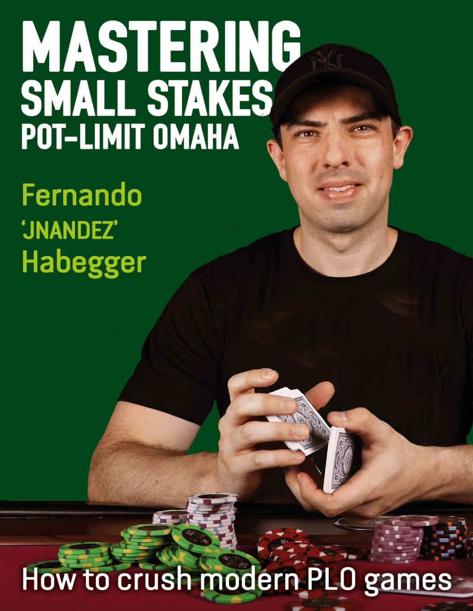
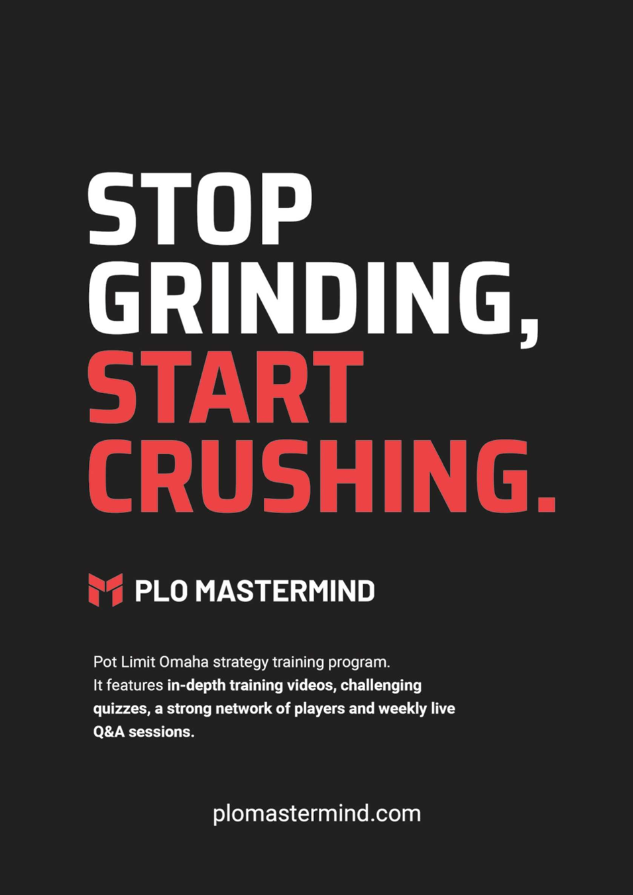
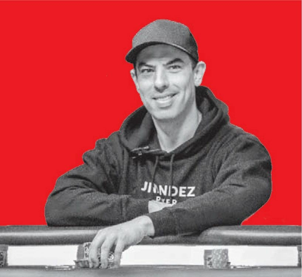
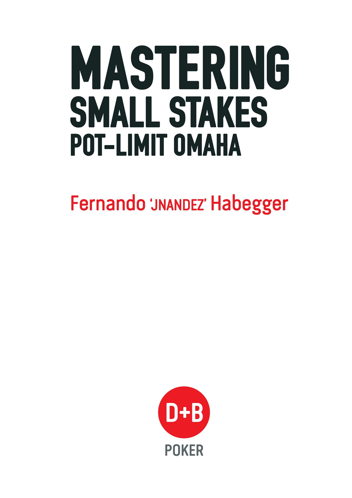
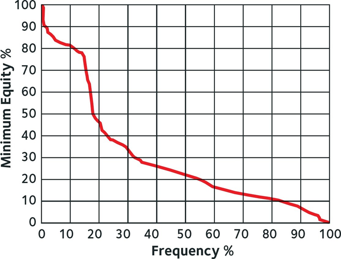
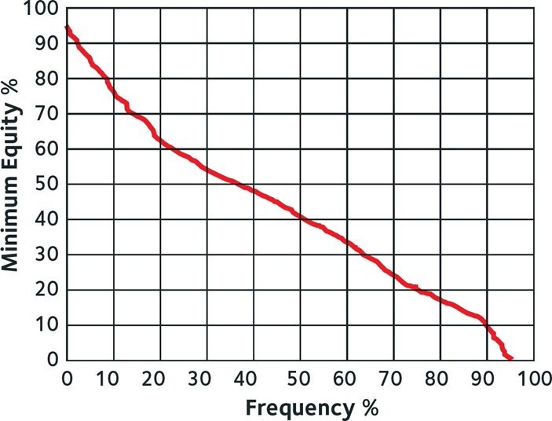

# 《精通小额注底池限注奥马哈》

    学习“翻牌后策略的四大支柱”使我在即使最接近的局面中也能重新调整决策过程。现在，我对识别在翻牌时是否应该明确加注、跟注或弃牌更加自信，并且比以前在后续的街道上陷入边缘局面的情况更少了。
《精通小额注底池限注奥马哈》应当成为任何新接触奥马哈或从无限注德州扑克转型的玩家的必读书。费尔南多比地球上任何人都花更多时间深入研究奥马哈，因此你可以确信他推荐的策略在任何游戏格式中都是+EV，并且在未来很多年内依然适用。
——约翰·博普雷兹，WSOP金手链得主，PLOQuickPro.com创始人

仅通过玩牌并有时回顾自己的手牌就能在扑克中取得成功的时代早已过去。如果你真的想要进步，并将你的游戏提升到一个新的水平，《精通小额注底池限注奥马哈》是你能做出的最佳购买之一。
——Einars，业余扑克玩家

尽管我已经是一名职业扑克玩家和学习者超过十年了，这是我第一次真正感觉自己是一个学生。这要感谢费尔南多和PLO Mastermind团队。
——Arthur，又名pechcore，年度PLO Mastermind成员

通过跟随费尔南多的指导，我能够在极短的时间内从低额到中高额奥马哈游戏中进阶。他教会了我如何像一名强者那样思考，并如何每天努力寻找新方法和新常规，以改进我的游戏和整个生活。”
——迭戈·蒙托内，业余扑克玩家
<ringt>Fernando Habegger</right>

费尔南多“JNandez”哈贝格是一位资深的底池限注奥马哈（PLO）专家和教练。他于2006年开始玩扑克，随后为了更接近这项游戏，找了一份扑克发牌员的工作。

在2010年底，JNandez从无限注德州扑克转型到PLO。他在投资自己15000美元资金的三分之一以获得当时最好的PLO和心理游戏教练后，开始在线上玩0.5/1美元的PLO游戏。

自2011年以来，JNandez每年都通过中高额PLO现金游戏和锦标赛获利，每年利润在15万到40万美元之间。他曾前往大多数主要的现场扑克赛事站点，并确立了自己作为顶级PLO教练的地位。

2018年4月，JNandez在JNandezPoker.com（现为PLOMastermind.com）上推出了PLO Mastermind，这是全球最大的PLO培训平台之一。他的内容帮助了数百名会员和学生将他们的游戏水平和心态提升到了一个新的高度。

JNandez已经记录并分享了成为PLO强者的道路，现在他提供他的路线图，帮助你在《精通小额注底池限注奥马哈》中起步。

### 目录
### 引言
#### 01 现代扑克方法论

### 第一部分：翻牌前游戏
#### 02 翻牌前概念
    翻牌前策略简介
    权益分布
    筹码与底池比率
    坚果牌和校准
    翻牌前下注大小
#### 03 翻牌前范围
    首次加注者
    冷跟的基本原理
    3-bet的基本原理
    面对3-bet
    面对200bb的3-bet
    跛入
    对抗一个对手时的大盲防守
    对抗多个对手时的大盲防守
#### 04 翻牌前类别
    类别一：A牌
    类别二：大牌对子
    类别三：三张大牌配一张非大牌
    类别四：双对子
    类别五：连牌
    类别六：两张大牌配两张中低连牌
    类别七：三张连牌配一张大牌
    类别八：中低对子
    类别九：破烂牌
### 第二部分：翻牌后游戏
#### 05 翻牌后分析的四大支柱
    翻牌后策略简介
    翻牌后分析的四大支柱
    支柱一：权益
    支柱二：两极化
    支柱三：位置
    支柱四：筹码与底池比率（SPR）
#### 06 翻牌后概念
    持续下注的基本原理、阻隔牌与诈唬
#### 07 翻牌后理论：单次加注底池
    翻牌持续下注IP策略（按钮对大盲）
    翻牌持续下注OOP策略（截断位对按钮）
    单次加注底池IP转牌策略
    训练课程回顾
    单次加注底池OOP转牌策略
    单次加注底池IP河牌策略
    综合应用
    单次加注底池OOP河牌策略
#### 08 翻牌后理论：3-bet底池
    简介
    3-bet底池OOP翻牌策略（小盲对按钮）
    3-bet底池转牌/河牌OOP策略
    3-bet底池IP策略
#### 09 翻牌后理论：多方底池
    简介
    多方3-bet底池
    多方单次加注底池
### 第三部分：其他
#### 10 底池限注奥马哈现场
    现场PLO基本原理
    盲注上提
    买入策略
    一次还是两次跑？
    思考在阿丽雅娱乐场的玩家
#### 11 桌外生活
    资金管理
    心理游戏
    学习与游戏的比例
### 引言

在玩了几年现场扑克之后，我于2000年代后期开始在线上玩扑克。线上扑克对于全球的玩家来说更加方便，所有人都可以在家中观摩世界上最大的游戏，几万美元在眨眼间飞过桌面。线上扑克的梦想由此诞生。

在早期的线上扑克中，赢得最多钱的主要是那些最好的现场玩家，他们采用了一种非常剥削性的打法。因为抓住了新的机会，这些玩家中的一些人仍然在全网现金游戏的历史赢家榜上名列前茅。

几年后，新的技术和软件程序开始出现，包括权益计算器和分析范围的工具。崭露头角的玩家开始使用这些新软件，这使他们在制定稳固策略方面拥有了巨大的优势。

自2015年以来，我们见证了更强大的扑克软件，尤其是求解器的发展。这使得一批新的玩家能够登上扑克世界的顶峰。目前的顶级玩家非常了解如何使用这些程序来发现对手策略中的错误，同时也改进自己的策略。

在当今的扑克环境中，求解器和其他类型的软件在创建成功的策略中起着巨大的作用。学习如何使用这些程序可能会耗费大量的时间、精力和金钱。我对此深有体会，因为我花了数百甚至数千小时与各种不同的软件程序合作，以弄清如何击败对手。

在过去的几年里，我致力于研究这项游戏，将我所学的应用于一些最艰难的在线游戏，并将这些策略教授给成千上万想要将他们的PLO游戏提升到新水平的热情扑克玩家。

你将在本书中找到的信息来自于我投入到玩PLO、教PLO和研究PLO的数千小时。我试图创建一个基础蓝图，以提高你对如何执行成功的PLO策略的理解。

除了技术的变化，我们还看到了扑克形式的变化。最初，主流形式从七张牌换到了限注德州扑克，然后在过去的几十年里，无限注德州扑克占据了主导地位。如今，无限注德州扑克（NLHE）锦标赛蓬勃发展。NLHE现金游戏也几乎在各地都在进行。PLO在某些城市以及特定时间（如锦标赛期间）越来越受欢迎。我记得在过去几次参加WSOP时，我很高兴地看到每年都有更多的桌子提供PLO游戏。许多经验丰富的玩家现在正在寻找新的挑战，想重新找回初次接触一款游戏时的那种兴奋感，并探索如何玩这款游戏。

值得一提的是，我经常发现PLO桌是扑克室里最愉快的地方。PLO中的很多决策都是自然而然做出的（尽管可能是错误的），所以紧张感没有那么强烈，大多数玩家觉得自己有机会赢。对于那些想看很多翻牌并且全押的玩家来说，这款游戏提供了更多的行动和刺激，他们认为这款游戏与NLHE相似，基本原理也相通。

无论你在PLO发展的哪个阶段，这本书都将迅速带你了解基础知识，然后深入探讨PLO的细微差别。在接触PLO时，最大的错误之一就是把它当成NLHE来玩。如果你是一个准备在扑克中迎接新挑战的人，那么这本书一定会对你有所帮助。我们将从正确的地方开始，为底池限注奥马哈策略的正确方法奠定基础。

费尔南多·哈贝格
### 现代扑克方法论
#### 现代扑克方法
#### 什么是GTO？
GTO代表“博弈论最优策略”。它描述了一个模型，在这个模型中，两个或多个玩家达到了均衡策略。这是一种所有策略都完美平衡的情况，玩家无法通过改变策略来增加预期价值（EV）。如果你桌上的每个人都在“玩GTO”，意味着他们在玩一种策略，且没有动机去改变这个策略，因为他们无法通过改变策略来增加EV。

在这种模型中，每个玩家都知道对方的策略。这意味着如果一个玩家改变了策略，其他玩家会立即发现并开始利用这个变化。显然，这种模型并不完全代表现实世界的情况，因此目标不是盲目地遵循GTO。

我们的目标是以GTO作为框架，然后通过观察对手如何偏离GTO来找到最高EV的策略。

“GTO”的具体含义在扑克界备受争议，并带有很多负面标签。人们对GTO玩法的有用性持有非常两极分化的观点。一些人认为它是终极解决方案，而另一些人则认为它完全没有帮助，甚至可能具有误导性。

乍一看，GTO解决方案可能显得随机且难以理解。但随着我们更深入地探索它，我们会更好地理解相关模式。最好的扑克玩家非常擅长将这些模式与整体扑克原则联系起来。与GTO解决方案一起工作不是要记住成千上万的模型，而是要理解这些模式背后的原则。

#### GTO框架
GTO作为一个框架帮助我们构建基础策略。学习该玩哪些手牌以及如何玩，无论是跟注还是3-bet，无论是转牌后过牌还是c-bet，我们都需要一个基准策略，为游戏中的每个位置奠定坚实的基础。

有一个概念叫做最大剥削与最小剥削。最大剥削是指将你积累的信息和读牌完全融入你的策略中。根据你对对手的读牌大幅度调整策略是非常危险的，因为如果读牌错误，你将损失惨重。

通过极端地调整对手，你也暴露自己被剥削的风险。例如，如果你总是去诈唬那个你认为在河牌上经常弃牌的人，他可能会发现并通过陷阱和频繁跟注来反击你。与其专注于调整针对个别对手，我更愿意为你提供一个坚实的PLO策略框架。一旦建立了这个基础，我们将讨论何时以及如何偏离这个基准以最大化你的EV。

长期以来，扑克被认为是一种读牌和剥削的游戏。由于这种传统，使用读牌和剥削作为主要决策工具是很有吸引力的。然而，最好的剥削性策略始终建立在一个初始的稳固基础策略之上。

#### 实践中的GTO
不出所料，许多早期的GTO支持者已经登上了扑克界的顶峰。玩家如LLinusLLove、OtB_RedBaron、Sauce123和Ben86都基于GTO策略进行游戏，并被认为是世界上最好的扑克玩家之一。

Ben86，被认为是最好的PLO玩家之一，在Joey Ingram的Poker Life Podcast节目中曾被问到以下问题：“世界前10的PLO玩家与前100的区别是什么，前100与前1000的区别又是什么？”他的回答是三方面的。
-  “前10名玩家对GTO有最强的基础理解，并且理解如何利用实际情况来进行剥削。”
-  “前100名玩家具有相同的基础质量，但执行的绝对技能水平较低。然后还有一部分剥削性‘Victor型’（Isildur1），直觉型玩家。他们非常擅长执行剥削性玩法，并且通常受到波动的巨大影响。要明确谁在走运，谁是真的好玩家并不容易。”
-  “如果每个人都在玩猫捉老鼠的游戏，那么在这个游戏中会有明显更优秀的玩家。但当‘猫捉老鼠玩家’遇到‘GTO玩家’时，他们无法应对。”

Isildur1在无限注德州扑克中通过极其激进的玩法取得了巨大成功。他经常超额下注和诈唬。虽然他没有玩GTO策略，但它起作用了。因为他的许多对手还不足以知道如何反制这种风格。

你会经常在低级别扑克中看到这种情况，一个玩家在特定玩家池中有一套特别有效的玩法。然而，当这个玩家爬升等级时，会遇到更聪明的对手并停滞不前。主要依靠直觉游戏不是长期成功的秘诀。在今天的NLHE游戏中，GTO玩家始终主导着剥削性玩家。

Ben86还提到了波动性。前100名玩家并不总是因为他们对游戏有最强的GTO理解，也因为扑克中有很多波动性。不仅仅是全押和坏节奏，所有从你得到的牌到你在的位置，谁让弱玩家做出了代价高昂的玩法等。作为一个玩家，很难真正知道某人有多好还是他们只是运气好。

前10名玩家对GTO有最强的理解，可以迅速发现你游戏中的不平衡并调整以剥削你。

Ben86说：“如果每个人都在玩猫捉老鼠的游戏，那么在这个游戏中会有明显更优秀的玩家。”他的意思是，当每个人都在玩剥削性策略时，有些人比其他玩家更能理解如何剥削总体趋势。他们对当前的元游戏有更优的理解，并知道如何利用它。

但当这些主要剥削性玩家遇到GTO玩家时，他们无法剥削对方，他们的弱点会暴露出来。GTO玩家能够通过理解什么使对方失衡来“剥削”直觉玩家，同时GTO玩家会限制自己的下行风险。这就是GTO的真正力量。这也是为什么前10名玩家都有最强的GTO基础理解。

#### GTO对弱对手
存在一个巨大的误解：当你对阵弱对手时，你可以专注于读牌并无情地剥削他们，因为他们的策略很差。然而，如果你不知道你的对手在做什么，因为他们不可预测，那么使用GTO策略会非常有帮助。

我们的最终目标不是遵循GTO策略，而是更好地理解对手的游戏。读牌如果来自于对GTO的基本理解，通常会更准确和可操作。如果你能发现对手如何偏离GTO以及这如何使他或她容易被剥削，你将能够为自己创造优势。这将是我们的目标。

你在桌上面对的绝大多数小级别（甚至许多高级别）玩家会犯下巨大的错误。要对他们产生优势，你需要理解这些错误是什么以及如何剥削它们。

确实，对于休闲玩家来说，保持平衡的策略以防被剥削并不像对阵职业玩家时那么重要，因为休闲玩家不会严厉惩罚你。但是当你对对手没有太多信息时，你仍然想要限制你的下行风险。

确定你最佳策略的四个步骤：
- 了解基准（识别GTO）。
- 识别对手如何偏离GTO（找出漏洞）。
- 剥削对手的弱点（剥削）。
- 限制下行风险（限制下行）。

一个简单的例子是这样的。假设你在按钮位置，你需要决定是否加注或弃牌。你知道在GTO术语中，按钮应该加注他组合的50%，大盲（BB）应该在对抗一个满注加注时防守60%的手牌（识别GTO）。

根据对手在BB中的倾向，你可能认为他们只会防守40%而不是60%（找出漏洞）。可能的剥削是将你的按钮开放加注范围从50%增加到65%（剥削）。

你仍然不应该将你的按钮加注范围扩展得多于此，因为你不想被反剥削，也有可能你的读牌是错的（限制下行）。你想要保持下行风险受限，方法是进行有意义但最小的剥削。坚持你的基准，并根据对手的倾向进行轻微调整。如果你这样做，你确保了你的下行风险在对手发现你的调整或你的读牌错误时得到保护。

### 如何学习GTO

我们只能通过扑克求解器的输出来看到GTO结果。例如，一个PLO求解器建议在UTG位置用A-A-5-2开局加注，但用J-8-5-2则弃牌。得益于数十亿次的计算，求解器计算出一手牌是+EV的加注，而另一手牌则不是。这就是我们从求解器输出中获得的全部信息。求解器不会告诉我们为什么某手牌是加注，因此我们不知道原因。这就是我们人类的作用。

我们的任务是通过应用逻辑来理解这些输出。我们识别模式，并将思想和原则附加于它们。我们通过提出假设、运行求解器实验和比较情况来进行测试。然后我们在现实世界中实施和测试这些策略，以更深入地理解所发生的事情。

好消息是你不必担心GTO的概念或处理任何求解器输出，因为我已经完成了这项工作。这是我自2017年第一个PLO求解器问世以来一直在做的事情。我花费了数千小时研究GTO的基本原理，并将在这本书中向你展示易于应用的概念。你将通过构建稳固的基准策略，并开始学习如何在其他玩家偏离“GTO策略”时最大化你的赢率。

#### 主要要点
- 对于未知玩家，使用平衡策略开始，以打出强势游戏，同时最小化你的下行风险。
- 一旦你获得更多关于对手的读牌和信息，你可以开始偏离你的基准策略。
- 确保你不要过度调整，因为这样做会使你面临显著的风险。

创建最优策略的四个步骤：
- 理解基准，并以此建立稳固的原则。
- 识别对手在何种方式上偏离了GTO。
- 剥削对手的弱点。
- 限制你的下行风险。
### 翻译：翻牌前玩法

#### 翻牌前策略简介

在这一部分中，我们将讨论不同的翻牌前分类，解释底池限注奥马哈（PLO）和无限注德州扑克（NLHE）之间的差异，并介绍最重要的翻牌前概念。这个简介的主要目的是让你深入理解基础知识，以便在后续章节中逐步提升你的翻牌前游戏。

#### PLO和NLHE中的翻牌前权益

大多数玩家可能是从NLHE转到PLO的，所以让我们从游戏之间的一些关键差异开始。最明显（也最有趣）的差异是，在PLO中你会得到四张牌。这并不意味着在PLO中有两倍于NLHE的起手牌可能性。事实上，PLO中有270,725种起手牌组合，而在NLHE中只有1,326种可能组合。

好消息是，PLO不像NLHE那样可以通过记住所有开局范围来学习。在PLO中，更重要的是理解情境和原则，而不是记住单独的手牌组合。

在本书的翻牌前部分，我将不同的起手牌分成各种类别，帮助你培养出对于哪些手牌可以翻牌前开局、哪些手牌需要弃牌的良好直觉。我还会与你分享一些新玩家常常陷入的陷阱，以便你能避免这些错误，立即获得对对手的优势。读完这本书后，你将理解翻牌前的模式，并知道在决定是否开局加注或弃牌时需要注意什么。

让我们从了解如何在翻牌前评估和分类你的手牌开始。在PLO中，手牌之间的翻牌前权益更为平滑，与NLHE相比，翻牌前的权益更接近。如果你在NLHE中拿到Aces，你可能会对即将到来的手牌非常兴奋，因为你会有很高的权益，因此你很可能会赢。例如，如果你有Aces，而你的对手持有Q♠-J♠，你的权益大约是81.5%。而在PLO中，即使你有一手极强的牌如A♣-A♠-K♣-K♠，而对手持有J♠-9♥-7♠-6♥，你的权益也只有约63%。这种权益差异可能会令一些玩家感到沮丧。

一个常见的误解是认为由于翻牌前的权益更接近，这意味着在PLO中比NLHE中有更少的优势空间。实际上，情况往往相反，因为很多对手会以此为借口，合理化非常宽松的玩法。这是一个巨大的错误，也是你可以利用的机会，以从这些玩家那里赚取钱。

另一个原因是玩家在PLO中翻牌前往往会玩太多的手牌，因为对手在翻牌前考虑的最坏可能赔率是2比1。许多玩家认为只要他们在翻牌前有33%的权益，他们就应该继续。正如我们将看到的，这并非如此。

顺便提一下，计算最大加注额的一般规则是：
取之前的投注，乘以3，然后加上已经在底池中的金额。

例如，你在一个6人桌的\$5/\$10游戏中位于UTG位置。要计算最大开局加注额，取之前的投注（在这种情况下是\$10的大盲注）。然后，将其乘以3（\$10 x 3 = \$30）。最后，加上已经在底池中的金额，即\$5的小盲注。
因此，在这种情况下，你可以加注到\$35（\$10大盲注 x 3）+ \$5小盲注。这意味着如果游戏进行到大盲注位置，他们将需要在\$50的底池中跟注\$25。

如果位于扣牌位置的玩家想要进行一个底池大小的三注，他们需要取之前的投注，即你的\$35开局加注。将该加注乘以3（\$35 x 3 = \$105）。最后，加上底池中的其余部分，即小盲注（\$5）和大盲注（\$10）。因此，扣牌位置玩家可以使用的最大三注金额是\$120（\$105 + \$5 + \$10 = \$120）。当轮到你时，你将面对一个\$85的跟注在一个\$170的底池中，所以再次赔率是2比1。

通常情况下，你不需要自己计算底池大小。如果你在网上玩，只需点击底池或最大按钮来预览大小。如果你在现场玩，荷官可以根据你的要求计算底池大小。需要记住的是底池赔率以及其他玩家如何考虑它们。他们（或你）在多大程度上将策略基于简单的底池赔率？

#### 权益与期望值（EV）之间的差异

在PLO中，手牌的基础价值与情境价值之间的差距通常比在NLHE中要大得多。
基础价值基于手牌的权益。例如，如果你持有Q♠-Q♥-J♠-10♦而对手持有9♣-8♣-7♠-6♠，你的手牌权益为59.49%。你可以在像propokertools.com这样的网站上计算翻牌前权益。

然而，像这样的权益计算并未考虑权益实现。它们仅表示一手牌在全压时对另一手牌的胜率。当你考虑基础价值时，你不会考虑任何未来的下注。这并不是你手牌价值的真实表现，除非你全压并且知道自己将通过摊牌实现所有手牌权益。

情境价值根据情境调整手牌的价值，这创造了一个更现实的图景，因为它考虑了权益实现性：你是否会低于或超过你的权益。赋予手牌情境价值可以根据具体情境调整翻牌前范围。

在PLO中，情境价值极为重要，甚至比在NLHE中更重要。在这本书中，我将为你提供所有需要的信息和工具，以评估手牌的情境价值。在后面的章节中，我们将深入讨论校准的概念，但目前你应该知道，这涉及根据你所处或将要进入的情境调整你的翻牌前范围，基于多个因素如位置、对手倾向和已经进入底池的玩家数量。

#### 权益分布

##### 什么是（翻牌）权益分布？

许多玩家将翻牌前和翻牌后的策略分开考虑，但实际上它们是相互依赖的。让我们简单触及一下翻牌后策略的基础，并看看它如何帮助我们确定哪些手牌在翻牌前是有利可图的，哪些不是。

翻牌权益分布是特定手牌或范围在后续街道上的权益分布。简单来说，它解释了我们在特定手牌或范围在对抗对手的手牌/范围时在所有可能的后续街道上的翻牌情况。

你可能会问自己，第一个问题是，“我应该在何时考虑翻牌权益分布？”你应该在每一个可能的翻牌前情境中考虑翻牌权益分布。

在手牌的任何时刻，你总是要确定是否值得向底池投资更多的钱。除非你全压或接近全压，否则这个问题的答案将取决于后续街道将如何进行。这个概念可能听起来很技术性，所以让我们通过一个实际例子来解释（图1）。

这个图表表示所有K-K-x-x手牌对抗所有A-A-x-x手牌的翻牌权益分布。换句话说，它展示了Kings对抗Aces在所有可能的翻牌上的权益。

考虑一下，一个紧凑型玩家在100bb堆叠上进行4注，我们知道他只会用Aces进行这个操作。我们应该对他的4注采取什么行动？在这种情况下，就像在任何翻牌前情境中一样，你的手牌对抗对手范围的翻牌权益分布特征应该是决定你决策的主要因素之一。

##### 图1
K-K-x-x对抗A-A-x-x的翻牌权益分布

图表的纵轴表示你的范围在翻牌时所拥有的权益，而横轴则表示我们在翻牌时获得特定权益的牌面的频率百分比。

在牌面上，国王对抗A的权益分布是“崎岖”的。也就是说，大约15%的时间里，国王会翻出至少75%权益的强牌，通常是三条或两对。然后我们会看到权益的急剧下降，当国王没有翻出超过A的牌时，权益通常会低于40%。回到之前的例子，如果你手持国王并且知道对手持有A，你是否应该跟注4bet？根据图表，你觉得应该怎么做？

答案是否定的。如果你确定对手有A，你不应该跟注。直觉上你可能已经明白这个道理。我们在翻牌时翻出比A好的牌的机会不够多，而要看到翻牌我们付出的代价又太高。

其他牌的翻牌权益分布

现在考虑以下这手牌：8♠-7♠-6♥-5♥。如果你知道对手持有A，你是否应该用这手双同花顺接龙牌跟注4bet？这手牌对抗A的翻牌权益分布如下图所示（图表2）。

图表2
8♠-7♠-6♥-5♥对抗A-A-x-x的翻牌权益分布

如你所见，权益没有急剧下降。差异显而易见，像这样的权益分布被称为“平滑”的分布。同样，直觉上你可能已经理解你应该用这手牌跟注。但为什么呢？

- 8♠-7♠-6♥-5♥在20%的时间里翻出60%或更多的权益。
- 8♠-7♠-6♥-5♥在40%的时间里翻出50%或更多的权益。
- 8♠-7♠-6♥-5♥在60%的时间里翻出35%或更多的权益。

我们可以得出结论，在许多不同的牌面上，8♠-7♠-6♥-5♥将翻出足够的权益，继续对抗对手的持续下注，这在决定是否应在翻前跟注或弃牌时是一个非常重要的因素。你将能够更频繁地实现你的手牌权益对抗对手的高对。

国王的权益分布图中有一个大转折点，原因在于我们要么翻出三条，要么没有。而8-7-6-5双同花的翻牌权益分布图没有转折点，这使得图表更加“平滑”。

具有非常崎岖权益分布的手牌通常不值得在翻前投入大量资金。你可以将其与NLHE中的追求三条进行比较，在NLHE中，你不希望用像5-5这样的手牌在翻前投入大量大盲注，因为它只有在翻出三条时表现良好。当你在大底池中持有5-5却没有翻出三条时，你通常会在翻牌后对抗对手的持续进攻时不得不弃牌。

具有平滑权益分布的手牌将在高比例的不同牌面上翻出稳定的权益。我们不需要翻出三条就能对抗一个单纯的高对有大量权益。有许多组合如对子加同花或高翻牌权益的复合同花顺。我们还有更好的可见性，意味着我们比单纯持有国王时更容易知道自己是否领先。在后续的翻后章节中我们将进一步讨论可见性。

这两手牌是PLO中翻牌权益分布的典型例子。虽然你必须学会思考你手牌或范围的权益分布，但不应该仅仅用平滑或崎岖来衡量。许多手牌会落在这两个类别之间。正如前面提到的，在决定是否玩一手牌时还有其他原则，我们将在接下来的章节中讨论。

目前，只需知道翻前策略很大程度上取决于你为自己设定的翻后场景。

#### 主要要点

- 你手牌或范围的翻牌权益分布图可能是决定翻前采取什么行动的重要因素。
- 翻牌权益分布在所有牌面上平均权益缓慢下降的手牌称为平滑手牌。例如：8♠-7♠-6♥-5♥。
- 有时会翻出很好牌但更多时候只是平庸或边缘手牌称为崎岖手牌，例如K♦K♠-9♣-2♥。这些手牌在许多牌面上平均权益会急剧下降。
- 平滑手牌通常比崎岖手牌更值得在翻前投入额外筹码。
  
# 我展示的是一级标题

Here's a simple footnote,[^1] and here's a longer one.[^bignote]

[^1]: This is the first footnote.

[^bignote]: Here's one with multiple paragraphs and code.

    Indent paragraphs to include them in the footnote.

    `{ my code }`

    Add as many paragraphs as you like.
