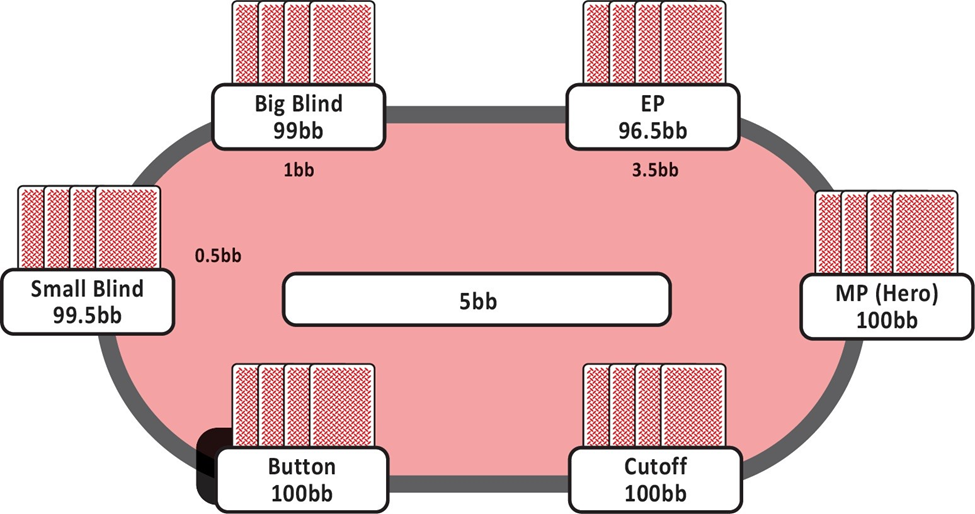
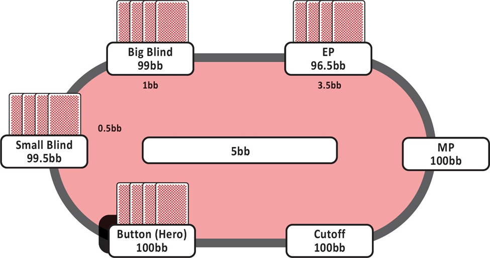
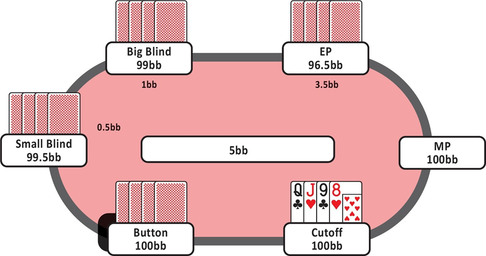
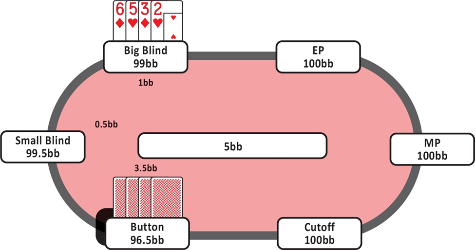
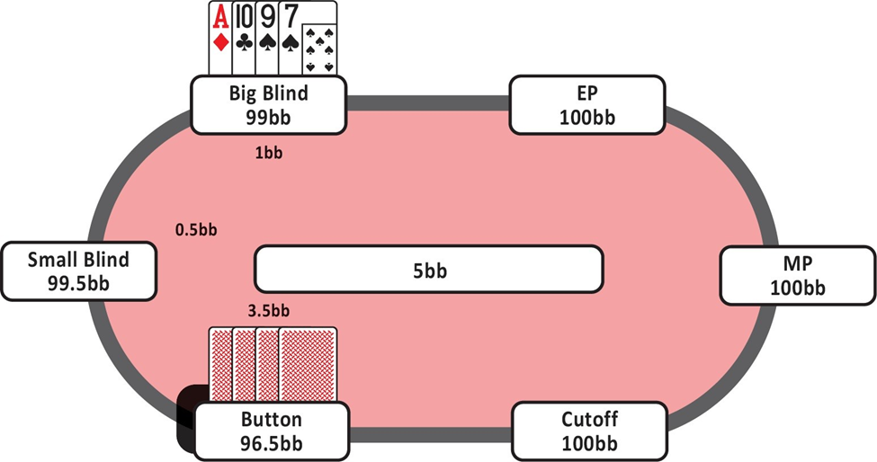
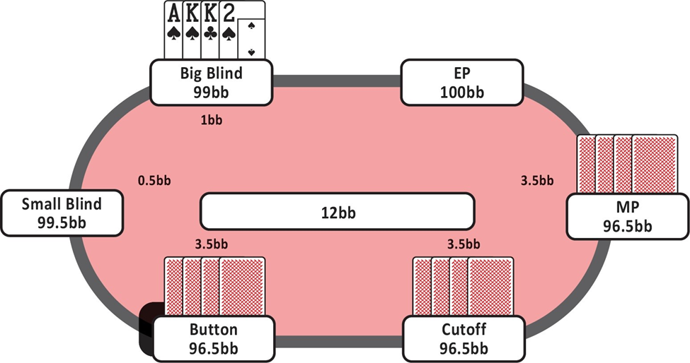
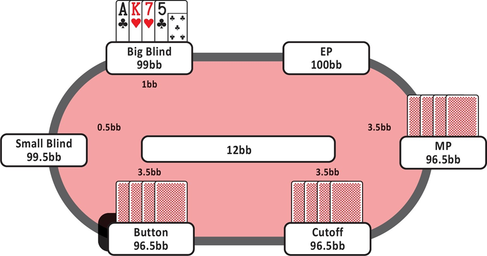

# 
精通小额底池限注奥马哈

***

***

***
学习“翻牌后策略的四大支柱”使我在即使最接近的局面中也能重新调整决策过程。现在，我对识别在翻牌时是否应该明确加注、跟注或弃牌更加自信，并且比以前在后续的街上陷入边缘局面的情况更少了。
《精通小额底池限注奥马哈》应当成为任何新接触奥马哈或从无限注德州扑克转型的玩家的必读书。费尔南多比地球上任何人都花更多时间深入研究奥马哈，因此你可以确信他推荐的策略在任何游戏形式中都是+EV，并且在未来很多年内依然适用。
*—约翰·博普雷兹，WSOP金手链得主，[PLOQuickPro.com](PLOQuickPro.com)创始人*

仅通过玩牌并有时回顾自己的手牌就能在扑克中取得成功的时代早已过去。如果你真的想要进步，并将你的游戏提升到一个新的水平，《精通小额底池限注奥马哈》是你能做出的最佳购买之一。
*—Einars，业余扑克玩家*

尽管我已经是一名职业扑克玩家和学习者超过十年了，这是我第一次真正感觉自己是一个学生。这要感谢费尔南多和PLO Mastermind团队。
*—Arthur，又名pechcore，年度PLO Mastermind成员*

通过跟随费尔南多的指导，我能够在极短的时间内从低额升级到中高额奥马哈游戏。他教会了我如何像一名强者那样思考，并如何每天努力寻找新方法和新常规，以改进我的游戏和整个生活。”
*—迭戈·蒙托内，业余扑克玩家*
***
**Fernando Habegger**

费尔南多“JNandez”哈贝格是一位资深的底池限注奥马哈（PLO）专家和教练。他于2006年开始玩扑克，随后为了更接近这项游戏，找了一份扑克发牌员的工作。

在2010年底，JNandez从无限注德州扑克转型到PLO。他在投资自己15000美元资金的三分之一以获得当时最好的PLO和心理游戏教练后，开始在线上玩0.5/1美元的PLO游戏。

自2011年以来，JNandez每年都通过中高额PLO现金游戏和锦标赛获利，每年利润在15万到40万美元之间。他曾前往大多数主要的现场扑克赛事站点，并确立了自己作为顶级PLO教练的地位。

2018年4月，JNandez在[JNandezPoker.com](JNandezPoker.com)（现为[PLOMastermind.com](PLOMastermind.com)）上推出了PLO Mastermind，这是全球最大的PLO培训平台之一。他的内容帮助了数百名会员和学生将他们的游戏水平和心态提升到了一个新的高度。

JNandez已经记录并分享了成为PLO强者的道路，现在他提供他的路线图，帮助你在《精通小额注底池限注奥马哈》中起步。
***

***
### 目录

#### 引言

#### 01 现代扑克方法论

### 第一部分：翻牌前打法

#### 02 翻牌前概念

>翻牌前策略简介
权益分布
筹码与底池比率（SPR）
坚果牌和校准
翻牌前下注大小

#### 03 翻牌前范围

>首次加注者（RFI）
冷跟的基本原理
3-bet的基本原理
面对3-bet
200BB面对3-bet
跛入（Limp）
大盲防守对抗一个对手
大盲防守对抗多个对手

#### 04 翻牌前类别

>类别一：AA
类别二：大对子（TT-KK）
类别三：三张大牌配一张非大牌
类别四：两队
类别五：顺子牌
类别六：两张大牌配两张中低连牌
类别七：三张顺子牌配一张大牌
类别八：中低对子
类别九：破烂牌

### 第二部分：翻牌后打法

#### 05 翻牌后分析的四大支柱

>翻牌后策略简介
翻牌后分析的四大支柱
支柱一：权益
支柱二：两极化
支柱三：位置
支柱四：筹码与底池比率（SPR）

#### 06 翻牌后概念

>持续下注的基本原理
阻隔牌与诈唬

#### 07 翻牌后理论：单次加注底池

>翻牌C-bet IP策略（BTN对BB）
翻牌C-bet OOP策略（CO对BTN）
单次加注底池IP转牌策略
训练课程回顾
单次加注底池OOP转牌策略
单次加注底池IP河牌策略
综合应用
单次加注底池OOP河牌策略

#### 08 翻牌后理论：3-bet底池

>简介
3-bet底池OOP翻牌策略（SB对BTN）
3-bet底池OOP转牌/河牌策略
3-bet底池IP策略

#### 09 翻牌后理论：多人底池

>简介
多人3-bet底池
多人单次加注底池

### 第三部分：其他

#### 10 底池限注奥马哈现场

>现场PLO基本原理
盲抓（Straddle）
买入策略
发一次还是两次？
对玩家的思考
在阿丽雅（Aria）娱乐场游戏

#### 11 桌外生活

>资金管理
心理游戏
学习与游戏的比例

***

#### 引言

在玩了几年现场扑克之后，我于2000年代后期开始在线上玩扑克。线上扑克对于全球的玩家来说更加方便，所有人都可以在家中观摩世界上最大的游戏，几万美元在眨眼间飞过桌面。线上扑克的梦想由此诞生。

在早期的线上扑克中，赢得最多钱的主要是那些最好的现场玩家，他们采用了一种非常剥削性的打法。因为抓住了新的机会，这些玩家中的一些人仍然在全网现金游戏的历史赢家榜上名列前茅。

几年后，新的技术和软件程序开始出现，包括权益计算器和分析范围的工具。崭露头角的玩家开始使用这些新软件，这使他们在制定稳固策略方面拥有了巨大的优势。

自2015年以来，我们见证了更强大的扑克软件，尤其是求解器的发展。这使得一批新的玩家能够登上扑克世界的顶峰。目前的顶级玩家非常了解如何使用这些程序来发现对手策略中的错误，同时也改进自己的策略。

在当今的扑克环境中，求解器和其他类型的软件在创建成功的策略中起着巨大的作用。学习如何使用这些程序可能会耗费大量的时间、精力和金钱。我对此深有体会，因为我花了数百甚至数千小时与各种不同的软件程序合作，以弄清如何击败对手。

在过去的几年里，我致力于研究这项游戏，将我所学的应用于一些最艰难的在线游戏，并将这些策略教授给成千上万想要将他们的PLO游戏提升到新水平的热情扑克玩家。

你将在本书中找到的信息来自于我投入到玩PLO、教PLO和研究PLO的数千小时。我试图创建一个基础蓝图，以提高你对如何执行成功的PLO策略的理解。

除了技术的变化，我们还看到了扑克形式的变化。最初，主流形式从七张牌换到了限注德州扑克，然后在过去的几十年里，无限注德州扑克占据了主导地位。如今，无限注德州扑克（NLHE）锦标赛蓬勃发展。NLHE现金游戏也几乎在各地都在进行。PLO在某些城市以及特定时间（如锦标赛期间）越来越受欢迎。我记得在过去几次参加WSOP时，我很高兴地看到每年都有更多的桌子提供PLO游戏。许多经验丰富的玩家现在正在寻找新的挑战，想重新找回初次接触一款游戏时的那种兴奋感，并探索如何玩这款游戏。

值得一提的是，我经常发现PLO桌是扑克室里最愉快的地方。PLO中的很多决策都是自然而然做出的（尽管可能是错误的），所以紧张感没有那么强烈，大多数玩家觉得自己有机会赢。对于那些想看很多翻牌并且全押的玩家来说，这款游戏提供了更多的行动和刺激，他们认为这款游戏与NLHE相似，基本原理也相通。

无论你在PLO发展的哪个阶段，这本书都将迅速带你了解基础知识，然后深入探讨PLO的细微差别。在接触PLO时，最大的错误之一就是把它当成NLHE来玩。如果你是一个准备在扑克中迎接新挑战的人，那么这本书一定会对你有所帮助。我们将从正确的地方开始，为底池限注奥马哈策略的正确方法奠定基础。

费尔南多·哈贝格

***

### 01 现代扑克方法论

**现代扑克方法**

**什么是GTO？**

GTO代表“博弈论最优策略”。它描述了一个模型，在这个模型中，两个或多个玩家达到了均衡策略。这是一种所有策略都完美平衡的情况，玩家无法通过改变策略来增加预期价值（EV）。如果你桌上的每个人都在“玩GTO”，意味着他们在玩一种策略，且没有动机去改变这个策略，因为他们无法通过改变策略来增加EV。

在这种模型中，每个玩家都知道对方的策略。这意味着如果一个玩家改变了策略，其他玩家会立即发现并开始利用这个变化。显然，这种模型并不完全代表现实世界的情况，因此目标不是盲目地遵循GTO。

我们的目标是以GTO作为框架，然后通过观察对手如何偏离GTO来找到最高EV的策略。

“GTO”的具体含义在扑克界备受争议，并带有很多负面标签。人们对GTO玩法的有用性持有非常两极分化的观点。一些人认为它是终极解决方案，而另一些人则认为它完全没有帮助，甚至可能具有误导性。

乍一看，GTO解决方案可能显得随机且难以理解。但随着我们更深入地探索它，我们会更好地理解相关模式。最好的扑克玩家非常擅长将这些模式与整体扑克原则联系起来。与GTO解决方案一起工作不是要记住成千上万的模型，而是要理解这些模式背后的原则。

**GTO框架**

GTO作为一个框架帮助我们构建基础策略。学习该玩哪些手牌以及如何玩，无论是跟注还是3-bet，无论是转牌后过牌还是c-bet，我们都需要一个基准策略，为游戏中的每个位置奠定坚实的基础。

有一个概念叫做最大剥削与最小剥削。最大剥削是指将你积累的信息和读牌完全融入你的策略中。根据你对对手的读牌大幅度调整策略是非常危险的，因为如果读牌错误，你将损失惨重。

通过极端地调整对手，你也暴露自己被剥削的风险。例如，如果你总是去诈唬那个你认为在河牌上经常弃牌的人，他可能会发现并通过陷阱和频繁跟注来反击你。与其专注于调整针对个别对手，我更愿意为你提供一个坚实的PLO策略框架。一旦建立了这个基础，我们将讨论何时以及如何偏离这个基准以最大化你的EV。

长期以来，扑克被认为是一种读牌和剥削的游戏。由于这种传统，使用读牌和剥削作为主要决策工具是很有吸引力的。然而，最好的剥削性策略始终建立在一个初始的稳固基础策略之上。

**实践中的GTO**

不出所料，许多早期的GTO支持者已经登上了扑克界的顶峰。玩家如LLinusLLove、OtB_RedBaron、Sauce123和Ben86都基于GTO策略进行游戏，并被认为是世界上最好的扑克玩家之一。

Ben86，被认为是最好的PLO玩家之一，在Joey Ingram的扑克生活播客节目中曾被问到以下问题：“世界前10的PLO玩家与前100的区别是什么，前100与前1000的区别又是什么？”他的回答是三方面的。

- “前10名玩家对GTO有最强的基础理解，并且理解如何利用实际情况来进行剥削。”
- “前100名玩家具有相同的基础质量，但执行的绝对技能水平较低。然后还有一部分剥削性‘Victor型’（Isildur1），直觉型玩家。他们非常擅长执行剥削性玩法，并且通常受到波动的巨大影响。要明确谁在走运，谁是真的好玩家并不容易。”
- “如果每个人都在玩猫捉老鼠的游戏，那么在这个游戏中会有明显更优秀的玩家。但当‘猫捉老鼠玩家’遇到‘GTO玩家’时，他们无法应对。”

Isildur1在无限注德州扑克中通过极其激进的玩法取得了巨大成功。他经常超额下注和诈唬。虽然他没有玩GTO策略，但它起作用了。因为他的许多对手还不足以知道如何反制这种风格。

你会经常在低级别扑克中看到这种情况，一个玩家在特定玩家池中有一套特别有效的玩法。然而，当这个玩家升级时，会遇到更聪明的对手并停滞不前。主要依靠直觉游戏不是长期成功的秘诀。在今天的NLHE游戏中，GTO玩家始终主导着剥削性玩家。

Ben86还提到了波动性。前100名玩家并不总是因为他们对游戏有最强的GTO理解，也因为扑克中有很多波动性。不仅仅是全押和坏节奏，所有从你得到的牌到你在的位置，谁让弱玩家做出了代价高昂的玩法等。作为一个玩家，很难真正知道某人有多好还是他们只是运气好。

前10名玩家对GTO有最强的理解，可以迅速发现你游戏中的不平衡并调整以剥削你。

Ben86说：“如果每个人都在玩猫捉老鼠的游戏，那么在这个游戏中会有明显更优秀的玩家。”他的意思是，当每个人都在玩剥削性策略时，有些人比其他玩家更能理解如何剥削总体趋势。他们对当前的元游戏有更优的理解，并知道如何利用它。

但当这些主要剥削性玩家遇到GTO玩家时，他们无法剥削对方，他们的弱点会暴露出来。GTO玩家能够通过理解什么使对方失衡来“剥削”直觉玩家，同时GTO玩家会限制自己的劣势。这就是GTO的真正力量。这也是为什么前10名玩家都有最强的GTO基础理解。

**GTO对弱对手**

存在一个巨大的误解：当你对阵弱对手时，你可以专注于读牌并无情地剥削他们，因为他们的策略很差。然而，如果你不知道你的对手在做什么，因为他们不可预测，那么使用GTO策略会非常有帮助。

>我们的最终目标不是遵循GTO策略，而是更好地理解对手的游戏。读牌如果来自于对GTO的基本理解，通常会更准确和可操作。如果你能发现对手如何偏离GTO以及这如何使他或她容易被剥削，你将能够为自己创造优势。这将是我们的目标。

你在桌上面对的绝大多数小级别（甚至许多高级别）玩家会犯下巨大的错误。要对他们产生优势，你需要理解这些错误是什么以及如何剥削它们。

确实，对于休闲玩家来说，保持平衡的策略以防被剥削并不像对阵职业玩家时那么重要，因为休闲玩家不会严厉惩罚你。但是当你对对手没有太多信息时，你仍然想要限制你的下行风险。

确定你最佳策略的四个步骤：

- 了解基本线路（识别GTO）。
- 识别对手如何偏离GTO（找出漏洞）。
- 剥削对手的弱点（剥削）。
- 限制下行风险（limit downside）。

一个简单的例子是这样的。假设你在按钮位置，你需要决定是否加注或弃牌。你知道在GTO术语中，按钮应该加注他组合的50%，大盲（BB）应该在对抗一个满注加注时防守60%的手牌（识别GTO）。

根据对手在BB中的倾向，你可能认为他们只会防守40%而不是60%（找出漏洞）。可能的剥削是将你的按钮开放加注范围从50%增加到65%（剥削）。

你仍然不应该将你的按钮加注范围扩展得多于此，因为你不想被反剥削，也有可能你的读牌是错的（限制下行风险）。你想要保持下行风险受限，方法是进行有意义但最小的剥削。坚持你的基准，并根据对手的倾向进行轻微调整。如果你这样做，你确保了你的下行风险在对手发现你的调整或你的读牌错误时得到保护。

**如何学习GTO**

我们只能通过扑克求解器的输出来看到GTO结果。例如，一个PLO求解器建议在UTG位置用A-A-5-2开局加注，但用J-8-5-2则弃牌。得益于数十亿次的计算，求解器计算出一手牌是+EV的加注，而另一手牌则不是。这就是我们从求解器输出中获得的全部信息。求解器不会告诉我们为什么某手牌是加注，因此我们不知道原因。这就是我们人类的作用。

我们的任务是通过应用逻辑来理解这些输出。我们识别模式，并将思想和原则附加于它们。我们通过提出假设、运行求解器实验和比较情况来进行测试。然后我们在现实世界中实施和测试这些策略，以更深入地理解所发生的事情。

好消息是你不必担心GTO的概念或处理任何求解器输出，因为我已经完成了这项工作。这是我自2017年第一个PLO求解器问世以来一直在做的事情。我花费了数千小时研究GTO的基本原理，并将在这本书中向你展示易于应用的概念。你将通过构建稳固的基准策略，并开始学习如何在其他玩家偏离“GTO策略”时最大化你的赢率。

**主要要点**

- 对于未知玩家，使用平衡策略开始，以打出强势游戏，同时最小化你的下行风险。
- 一旦你获得更多关于对手的读牌和信息，你可以开始偏离你的基准策略。
- 确保你不要过度调整，因为这样做会使你面临显著的风险。

创建最优策略的四个步骤：

- 理解基本线路，并以此建立稳固的原则。
- 识别对手在何种方式上偏离了GTO。
- 剥削对手的弱点。
- 限制你的下行风险。

***

### 02 翻牌前打法

#### 翻牌前策略简介

在这一部分中，我们将讨论不同的翻牌前分类，解释底池限注奥马哈（PLO）和无限注德州扑克（NLHE）之间的差异，并介绍最重要的翻牌前概念。这个简介的主要目的是让你深入理解基础知识，以便在后续章节中逐步提升你的翻牌前游戏。

**PLO和NLHE中的翻牌前权益**

大多数玩家可能是从NLHE转到PLO的，所以让我们从游戏之间的一些关键差异开始。最明显（也最有趣）的差异是，在PLO中你会得到四张牌。这并不意味着在PLO中有两倍于NLHE的起手牌可能性。事实上，PLO中有270,725种起手牌组合，而在NLHE中只有1,326种可能组合。

好消息是，PLO不像NLHE那样可以通过记住所有开局范围来学习。在PLO中，更重要的是理解情境和原则，而不是记住单独的手牌组合。

在本书的翻牌前部分，我将不同的起手牌分成各种类别，帮助你培养出对于哪些手牌可以翻牌前开局、哪些手牌需要弃牌的良好直觉。我还会与你分享一些新玩家常常陷入的陷阱，以便你能避免这些错误，立即获得对对手的优势。读完这本书后，你将理解翻牌前的模式，并知道在决定是否开局加注或弃牌时需要注意什么。

让我们从了解如何在翻牌前评估和分类你的手牌开始。在PLO中，手牌之间的翻牌前权益更为平滑，与NLHE相比，翻牌前的权益更接近。如果你在NLHE中拿到AA，你可能会对即将到来的手牌非常兴奋，因为你会有很高的权益，因此你很可能会赢。例如，如果你有AA，而你的对手持有Q♠-J♠，你的权益大约是81.5%。而在PLO中，即使你有一手极强的牌如A♣-A♠-K♣-K♠，而对手持有J♠-9♥-7♠-6♥，你的权益也只有约63%。这种权益差异可能会令一些玩家感到沮丧。

一个常见的误解是认为由于翻牌前的权益更接近，这意味着在PLO中比NLHE中有更少的优势空间。实际上，情况往往相反，因为很多对手会以此为借口，合理化非常宽松的玩法。这是一个巨大的错误，也是你可以利用的机会，以从这些玩家那里赚取钱。

另一个原因是玩家在PLO中翻牌前往往会玩太多的手牌，因为对手在翻牌前考虑的最坏可能赔率是2比1。许多玩家认为只要他们在翻牌前有33%的权益，他们就应该继续。正如我们将看到的，这并非如此。

顺便提一下，计算最大加注额的一般规则是：

>取之前的投注，乘以3，然后加上已经在底池中的金额。

例如，你在一个6人桌的\$5/\$10游戏中位于UTG位置。要计算最大开局加注额，取之前的投注（在这种情况下是\$10的大盲注）。然后，将其乘以3（\$10 x 3 = \$30）。最后，加上已经在底池中的金额，即\$5的小盲注。
因此，在这种情况下，你可以加注到\$35（\$10大盲注 x 3）+ \$5小盲注。这意味着如果游戏进行到大盲注位置，他们将需要在\$50的底池中跟注\$25。

如果位于扣牌位置的玩家想要进行一个底池大小的三注，他们需要取之前的投注，即你的\$35开局加注。将该加注乘以3（\$35 x 3 = \$105）。最后，加上底池中的其余部分，即小盲注（\$5）和大盲注（\$10）。因此，扣牌位置玩家可以使用的最大三注金额是\$120（\$105 + \$5 + \$10 = \$120）。当轮到你时，你将面对一个\$85的跟注在一个\$170的底池中，所以再次赔率是2比1。

通常情况下，你不需要自己计算底池大小。如果你在网上玩，只需点击底池或最大按钮来预览大小。如果你在现场玩，荷官可以根据你的要求计算底池大小。需要记住的是底池赔率以及其他玩家如何考虑它们。他们（或你）在多大程度上将策略基于简单的底池赔率？

**权益与期望值（EV）之间的差异**

在PLO中，手牌的基础价值与情境价值之间的差距通常比在NLHE中要大得多。
基础价值基于手牌的权益。例如，如果你持有Q♠-Q♥-J♠-10♦而对手持有9♣-8♣-7♠-6♠，你的手牌权益为59.49%。你可以在像propokertools.com这样的网站上计算翻牌前权益。

然而，像这样的权益计算并未考虑权益实现。它们仅表示一手牌在全压时对另一手牌的胜率。当你考虑基础价值时，你不会考虑任何未来的下注。这并不是你手牌价值的真实表现，除非你全压并且知道自己将通过摊牌实现所有手牌权益。

情境价值根据情境调整手牌的价值，这创造了一个更现实的图景，因为它考虑了权益实现性：你是否会低于或超过你的权益。赋予手牌情境价值可以根据具体情境调整翻牌前范围。

在PLO中，情境价值极为重要，甚至比在NLHE中更重要。在这本书中，我将为你提供所有需要的信息和工具，以评估手牌的情境价值。在后面的章节中，我们将深入讨论校准的概念，但目前你应该知道，这涉及根据你所处或将要进入的情境调整你的翻牌前范围，基于多个因素如位置、对手倾向和已经进入底池的玩家数量。

#### 权益分布

**什么是（翻牌）权益分布？**

许多玩家将翻牌前和翻牌后的策略分开考虑，但实际上它们是相互依赖的。让我们简单触及一下翻牌后策略的基础，并看看它如何帮助我们确定哪些手牌在翻牌前是有利可图的，哪些不是。

翻牌权益分布是特定手牌或范围在后续街道上的权益分布。简单来说，它解释了我们在特定手牌或范围在对抗对手的手牌/范围时在所有可能的后续街道上的翻牌情况。

你可能会问自己，第一个问题是，“我应该在何时考虑翻牌权益分布？”你应该在每一个可能的翻牌前情境中考虑翻牌权益分布。

在手牌的任何时刻，你总是要确定是否值得向底池投资更多的钱。除非你全压或接近全压，否则这个问题的答案将取决于后续街道将如何进行。这个概念可能听起来很技术性，所以让我们通过一个实际例子来解释（图1）。

这个图表表示所有K-K-x-x手牌对抗所有A-A-x-x手牌的翻牌权益分布。换句话说，它展示了Kings对抗AA在所有可能的翻牌上的权益。

考虑一下，一个紧凑型玩家在100bb堆叠上进行4注，我们知道他只会用AA进行这个操作。我们应该对他的4注采取什么行动？在这种情况下，就像在任何翻牌前情境中一样，你的手牌对抗对手范围的翻牌权益分布特征应该是决定你决策的主要因素之一。

图1

K-K-x-x对抗A-A-x-x的翻牌权益分布

图表的纵轴表示你的范围在翻牌时所拥有的权益，而横轴则表示我们在翻牌时获得特定权益的牌面的频率百分比。

在牌面上，国王对抗A的权益分布是“崎岖”的。也就是说，大约15%的时间里，国王会翻出至少75%权益的强牌，通常是三条或两对。然后我们会看到权益的急剧下降，当国王没有翻出超过A的牌时，权益通常会低于40%。回到之前的例子，如果你手持国王并且知道对手持有A，你是否应该跟注4bet？根据图表，你觉得应该怎么做？

答案是否定的。如果你确定对手有A，你不应该跟注。直觉上你可能已经明白这个道理。我们在翻牌时翻出比A好的牌的机会不够多，而要看到翻牌我们付出的代价又太高。

**其他牌的翻牌权益分布**

现在考虑以下这手牌：8♠-7♠-6♥-5♥。如果你知道对手持有A，你是否应该用这手双同花顺接龙牌跟注4bet？这手牌对抗A的翻牌权益分布如下图所示（图表2）。

图表2

8♠-7♠-6♥-5♥对抗A-A-x-x的翻牌权益分布

如你所见，权益没有急剧下降。差异显而易见，像这样的权益分布被称为“平滑”的分布。同样，直觉上你可能已经理解你应该用这手牌跟注。但为什么呢？

- 8♠-7♠-6♥-5♥在20%的时间里翻出60%或更多的权益。
- 8♠-7♠-6♥-5♥在40%的时间里翻出50%或更多的权益。
- 8♠-7♠-6♥-5♥在60%的时间里翻出35%或更多的权益。

我们可以得出结论，在许多不同的牌面上，8♠-7♠-6♥-5♥将翻出足够的权益，继续对抗对手的持续下注，这在决定是否应在翻前跟注或弃牌时是一个非常重要的因素。你将能够更频繁地实现你的手牌权益对抗对手的高对。

国王的权益分布图中有一个大转折点，原因在于我们要么翻出三条，要么没有。而8-7-6-5双同花的翻牌权益分布图没有转折点，这使得图表更加“平滑”。

具有非常崎岖权益分布的手牌通常不值得在翻前投入大量资金。你可以将其与NLHE中的追求三条进行比较，在NLHE中，你不希望用像5-5这样的手牌在翻前投入大量大盲注，因为它只有在翻出三条时表现良好。当你在大底池中持有5-5却没有翻出三条时，你通常会在翻牌后对抗对手的持续进攻时不得不弃牌。

具有平滑权益分布的手牌将在高比例的不同牌面上翻出稳定的权益。我们不需要翻出三条就能对抗一个单纯的高对有大量权益。有许多组合如对子加同花或高翻牌权益的复合同花顺。我们还有更好的可见性，意味着我们比单纯持有国王时更容易知道自己是否领先。在后续的翻后章节中我们将进一步讨论可见性。

这两手牌是PLO中翻牌权益分布的典型例子。虽然你必须学会思考你手牌或范围的权益分布，但不应该仅仅用平滑或崎岖来衡量。许多手牌会落在这两个类别之间。正如前面提到的，在决定是否玩一手牌时还有其他原则，我们将在接下来的章节中讨论。

>目前，只需知道翻前策略很大程度上取决于你为自己设定的翻后场景。

**主要要点**

- 你手牌或范围的翻牌权益分布图可能是决定翻前采取什么行动的重要因素。
- 翻牌权益分布在所有牌面上平均权益缓慢下降的手牌称为平滑手牌。例如：8♠-7♠-6♥-5♥。
- 有时会翻出很好牌但更多时候只是平庸或边缘手牌称为崎岖手牌，例如K♦K♠-9♣-2♥。这些手牌在许多牌面上平均权益会急剧下降。
- 平滑手牌通常比崎岖手牌更值得在翻前投入额外筹码。

#### 筹码与底池比率 (SPR)

**什么是SPR？**

另一个关键的翻后概念是筹码与底池比率（SPR）。SPR描述了你的筹码量与底池大小之间的关系。在扑克中，翻后决策很大程度上受股率、位置和SPR的影响。理解股率和SPR之间的关系是PLO（底池限注奥马哈）全押情况下的核心。当SPR越小，所需的股率就越低，可以更轻松地全押。

让我们通过一个简单的计算来详细说明这一点。

假设底池中有100美元，而你的筹码是400美元，这意味着你的SPR是4比1（400美元/100美元）。在扑克中，虽然这是一个比率，但SPR通常表示为一个单一的数字，在这个例子中是4。

如果SPR较低，比如1或2，意味着你在玩非常浅的筹码，这时你需要更少的股率来全押。如果SPR较高，比如6，你需要更多的股率来全押。在这本书中，我们将频繁使用SPR一词，你将逐渐理解在特定筹码深度下需要多少股率才能正确地全押。

处理SPR时的关键数字是1、4和13。如果你的SPR是1，意味着需要一个完整的底池大小下注就能把钱全押进。如果SPR是4，需要两个完整的底池下注。如果SPR是13，需要三个完整的底池下注。

在单次加注的底池中，SPR通常在单挑底池中是8到9之间，多人底池中是6到7之间。在3次加注的底池中，单挑底池的SPR通常是3.5到4，多人底池中接近2。这意味着在大多数情况下，你可以在河牌前将所有筹码投入。

然而，我们并不总是全押，重点是做出最高期望值（EV）的决策。如果你想在PLO中取得成功，必须理解你的手牌或范围与对手范围的股率，并将其与SPR计算结合起来。

**SPR与全押**

下表（图表3）应能大致指示在何种SPR下需要多少股率才能盈利地全押。这假设你的加注没有弃牌率。

图表3

记住，在决定是否全押时，不应仅仅将全押的EV与弃牌或平局情况进行比较。还应与跟注的EV进行比较。在中低SPR情况下，跟注可能是最高EV的玩法，特别是当你在有位置时，因为这允许你在多个回合中利用你的位置优势。有时你还会以接近100%的股率跟注，例如当慢玩时。

从这张表中可以得出的结论是，当SPR达到5或以上时，不应轻易在翻牌圈全押。轻率全押意味着对抗一个可能会压制你的范围。随着SPR增加，对手愿意全押的手牌也会更强，在PLO中，这往往是最强牌型或压制性的组合听牌，除非筹码非常浅。

在多人底池中，即使SPR相对较低，你也要收紧全押的标准。这是因为你面对多个对手，遇到更强手牌的几率增加。同时，也有可能遇到多手强牌。

当对手在低SPR情况下在翻牌圈下注并似乎决心投入全部筹码时，你应使用前面的表格计算全押的盈利性。如果你在较高SPR下面对半池下注，你可能有一定的翻牌弃牌率，可以合理地全押并用部分范围进行加注诈唬。在下面的表格（图表4）中，你可以看到，仅有少量弃牌率就能显著降低全押所需的股率以达到收支平衡。

图表4

我们将在后面的单次加注底池和三次加注底池章节中更深入地讨论SPR。目前，重要的是你要了解SPR是什么，这样你才能理解它如何与坚果牌概念和校准结合，影响你的翻前范围构建。

**研究翻前策略**

在PLO中，不可能记住每种情况下的所有手牌组合。我们可以做的是将手牌分为不同的类别。这里我们将手牌分为九个不同的类别。在此之前，先澄清一些术语。

- 彩虹（Rainbow）：你持有四种不同花色的四张牌。例如，A♦-A♣-5♥-6♠ 或 Q♦-7♥-3♠-2♣。

- 单花色（Single-suited）：你持有恰好两张、三张或四张同一花色的牌。例如，A♥-K♥-Q♠-J♣ 或 10♠-9♠-8♠-7♠。

- 双花色（Double-suited）：你持有两种不同花色的各两张牌。例如，Q♦-10♦-8♣-6♣ 或 A♦-K♦-K♣-J♣。

我们可以使用九种翻前类别来结构性地分离所有翻前组合。请记住，这些类别并不意味着牌力上的差异；它们只是用于概述所有可能的手牌组合。

1. 无对子单花色
2. 无对子双花色
3. 无对子彩虹
4. 一对子单花色
5. 一对子双花色
6. 一对子彩虹
7. 两对子单花色
8. 两对子双花色
9. 两对子彩虹

所有可能的起手牌都属于上述类别之一。正如你在下表（图表5）中看到的，这九个类别在强度和发到你手中的频率上有很大的不同。

图表5

手牌类别发到的频率

此图表显示，你很可能会发到无对子单花色的手牌，这种情况占51.8%的概率。获得双对子手牌的概率非常低。在本章中，我将简要讨论不同的类别。这里的主要目标是让你熟悉这些术语和词汇，所以请不要试图记住所有确切的类别和频率。

**无对子单花色**

让我们简要细分一下无对子单花色类别。此类别的一个手牌示例是A♠-K♣-Q♦-J♠。在基本价值上，这手牌属于最强的6%。

而此类别的另一个手牌示例，6♦-5♣-3♣-2♣，则属于PLO手牌中最弱的11%。为什么这第二手牌排名如此低？它看起来不错，你可能会认为这手牌很容易凑成顺子。

实际上，这些低牌手牌非常弱，因为这些手牌会给你很多弱的成牌（例如底两对）和听牌（例如低顺子），很容易被对手压制。在PLO中，翻前玩对的手牌非常重要，以避免翻后被压制。玩很多容易被压制的弱手牌是最容易烧钱和最常见的错误之一。特别是，如前所述，如果你依赖底池赔率并误算了手牌在后续街上的盈利能力和股率实现。

>**在底池限注奥马哈中，高牌仍然最好**
在PLO中，就像在无限德州扑克（NLHE）中一样，高牌通常获胜。玩家错误地高估了低花色和低顺子的手牌，因为这些手牌看起来不错。你想根据手牌的组成和在特定情况下的价值来玩牌。

**花色类型**

手中有两张、三张甚至四张同一花色的牌都属于“单花色”类别。然而，这些手牌的强度可以非常不同。四张同一花色的手牌，例如A♠-K♠-9♠-8♠，比仅有两张同一花色的相同手牌要差得多，例如A♠-K♥-9♥-8♠。这是因为当你持有四张同一花色的牌时，凑成同花的难度更大，因为你已经阻挡了两个潜在的同花出牌。当我提到有三张同一花色的手牌时，我会称它们为“三花色手牌”，而有四张同一花色的手牌将称为“单色手牌”。

因此，在此类别中有三种类型的单花色手牌：

- 单花色 A♠-K♦-Q♠-J♥
- 三花色 A♠-K♠-Q♠-J♦
- 单色 A♠-K♠-Q♠-J♠

另一个需要注意的点是，高价值手牌通常有最高的花色但不会阻挡第二高的花色。例如，A♠-K♥-Q♦-10♠是一手好牌，因为当你凑成同花时，你可以轻松从持有K高、Q高或J高同花的对手那里获得价值。从股率上看，这手牌可能类似于A♠-K♠-Q♦-10♣，但它在特定情况下的价值更高。避免单色和三花色手牌，因为它们凑成同花的出牌更少，遇到更弱同花的几率更小。

**双对子**

双对子手牌的发到概率约为1%，且强度差异很大。双对子手牌的主要优势在于它们有约21%的几率在翻牌圈凑成三条。

J♣-J♦-10♣-10♠是一个双对子单花色手牌示例，它属于PLO中最强的4%手牌。而4♠-4♥-3♦-3♣则属于最弱的29%手牌。同样，你的对子牌有多高及其花色在确定手牌强度时起很大作用。

**主要要点**

- 我们确定了两种评估PLO手牌强度的方法：基本价值和情境价值。
- 基本价值只关心你的手牌股率。这在全押时很重要。
- 情境价值基于当前的策略因素。
- 你的花色和单张牌有多高非常重要。在大多数情况下，高牌仍然最好。拥有A高花色且不阻挡K高和Q高花色会增加手牌价值。
- 低牌和低花色会降低你的手牌价值，使你更容易被对手压制。

#### 坚果性与校准

**引言**

在本节中，我们将讨论坚果性和校准的基础知识。这两个概念可以帮助你准确地确定在不同情景下起手牌的预期价值（EV）。

**坚果性**

手牌的坚果性描述了你的起手牌在翻牌、转牌或河牌中成为坚果牌的可能性。被认为是“坚果”的手牌在多人底池中表现尤为出色。

如果多个玩家进入底池，很可能会有一到两个玩家与翻牌圈连接。既然你已经知道这种情况会发生，你希望拥有“坚果”或坚果牌，这些牌有潜力压制你的对手。例如，当你的对手持有Q高同花时，你希望自己有A高同花。让我们用一个例子来说明这个概念。比较以下两手牌，你认为哪一手在“坚果性”上得分最高？

>手牌1：A♠-8♦-7♠-6♣
手牌2：J♥-10♥-7♦-6♦

手牌1更具坚果性，因为它包含A高花色，有可能形成坚果同花。这手牌还与8-7-6更好地连接，有助于你形成一些坚果顺子。

手牌2不是坚果牌。你不能用这手牌形成任何一种坚果同花。虽然从技术上讲，你可能会得到同花顺，但这种情况非常不可能。而且，这手牌的连接性较差，有可能形成更多非坚果顺子。

重要的是，你不应该以“哪手牌更好”来进行这种比较。你需要确定每手牌在不同情况下的优势，而不是哪手牌最强。理解这两手牌有不同的特质，这使它们在不同的情况下更适用。

A♠-8♦-7♠-6♣有更多坚果成分，因此在多人底池中表现更好，而Q♥-10♥-7♦-6♦是一手非常顺滑的手牌，通常能在翻牌圈命中一些底池，因此在单挑底池中表现更好。

**背景与校准**

要确定哪手牌“更好”，你需要理解背景。在不同的情景中，不同的手牌特质很重要。你需要理解所处情景的背景以及哪种手牌最适合它。让我们通过一些不同背景的例子来看看每种情况下最适合的手牌类型。

**手牌示例1**
Cutoff位置加注至3.5个大盲注。你在按钮位，手持A♠-8♦-7♠-6♣（图表6）。你应该采取什么行动？

图表6

你应该跟注这手牌。为什么呢？因为这手牌的强度在于它有能力形成坚果牌。你希望吸引更多的对手进入底池，他们可能持有连接性较差和较弱的黑桃牌，这样当你凑成坚果同花或坚果顺子时，你可以压制他们。

**手牌示例2**
Cutoff位置加注至3.5倍大盲注。你在按钮位，手持Q♥-10♥-7♦-6♦（图表7）。你应该采取什么行动？

图表7

你应该用这手牌进行3-bet。鉴于这手牌的坚果性较低，通过排除那些可能持有高牌和高花色牌的后位玩家，你可以获得更多的EV。这手牌翻牌圈很顺滑，这意味着它在3-bet底池甚至4-bet底池中表现会很好。

但这并不意味着你应该从每个位置用每一手双花色的断连手牌进行3-bet。这就是翻前校准变得重要的地方。

**校准**

翻前校准是基于情况和其他范围来优化构建你的翻前范围的过程。

我们校准大盲防守范围基于：

- 有多少玩家参与
- 这些玩家的翻前范围

接下来，让我们考虑另一个例子。

**手牌示例3**
EP位置玩家加注并获得两名跟注者。你在按钮位，手持A♦-J♦-J♠-3♣（图表8）。正确的玩法是什么？

图表8

跟注。底池中已经有三名玩家，因此你在寻找坚果性。这手牌可以形成坚果同花（听牌）、强顶对或坚果顺子（听牌）。如果这手牌只有J高花色，而不是A高花色，那么这手牌会被贬值，在这种情况下应直接弃牌。如果是双花色，这手牌就足够强，可以3-bet，希望能挤出一两个玩家，从而增强J高同花的强度，同时仍能用A高花色来压制对手。

如果你在玩低注额游戏或现场扑克，这是一个常见的情况。记住，你需要根据所玩的游戏校准你的范围。如果你的游戏非常松散，你需要考虑更多的多人底池，并将你的翻前范围校准为坚果牌。在这些游戏中，你赚的大部分钱都来自压制对手的手牌和听牌。同样，你亏损的大部分钱也来自被对手压制，因此要尽量避免这种情况！

**手牌示例4**
EP位置玩家加注并获得两名跟注者。你在按钮位，手持J♥-9♠-8♦-7♥（图表9）。你应该怎么做？

图表9

希望你能意识到你应该弃牌。你应该本能地想到，这种情况下需要一手坚果牌，因为底池中已经有三名玩家了。或者，这手牌不是坚果牌，这意味着在多人底池中，这不是一手合适的跟注牌。

如果你仍然认为这手牌连接性极强，因此你有很好的机会凑成坚果顺子，你部分是对的。这手牌确实看起来不错且连接性强。但重要的是要停下来，真正思考你之前玩家的冷跟范围。

你的对手应该持有能直接压制你的牌，例如K♦-Q♦-J♣-10♠或A♥-J♠-10♥-9♦。如果你凑成顺子或顺子听牌，很可能对手有更好的顺子或相同的顺子加再听牌。用像J♥-9♠-8♦-7♥这样的手牌跟注，通常会让你陷入被压制的困境，可能会损失很多钱。

实际上，你的手牌并不很强。手牌顶部的差距意味着你的J-9顺子听牌会很弱。你的对手很容易压制你的成牌或听牌。在低抽水环境中，你可能可以在对一个对手的位置上用你的手牌跟注，或者自己在后位加注。然而，在大多数小注额游戏中，较高的抽水（以bb/100计）会使玩这手牌变成一个略微负EV的玩法。

**主要要点**

- 手牌的坚果性描述了你的起手牌在翻牌、转牌或河牌中成为坚果牌的可能性。坚果性在多人底池中最为重要，因为多个玩家与翻牌圈命中，你通常会进入翻牌后的压制游戏。在低筹码与底池比率的单挑场景中，坚果性虽然重要，但相对较少。

- 校准是基于具体情况和在玩的范围来优化构建你的翻前范围的过程。如果你想最大化你的利润，你需要知道如何有效地校准你的范围。校准意味着你需要问哪些手牌在特定情景下是最好的结构化手牌，而不是问哪些手牌是最好的。

#### 翻前下注大小

**引言**

大多数玩家并不会对他们使用的翻前下注大小进行深思，而只是采用他们所玩游戏中最常见的下注大小偏好。在本章中，我们将探讨应该使用何种加注大小，以及为什么这如此重要。

**赢得盲注**

在PLO中，最大限度地加注是标准做法，因为这样可以更频繁地赢得盲注，并且无需支付抽水。

为什么赢得盲注如此重要？你可能会想，“1.5个盲注是这么少的金额，为什么我会在意？”这是个好问题。许多扑克玩家有一个误解，认为赢得盲注和前注只有在锦标赛中才重要，一旦筹码变得浅薄，拿下盲注可以显著提升你的总筹码。这并不正确。

事实上，可以说任何现金游戏的主要目标就是赢得盲注！

让我们用一些简单的数学来说明这一点。赢得盲注等于赢得1.5个大盲注，相当于在一百手牌中赢得150个大盲注的胜率。这是一个非常高的胜率！如果你能持续偷取盲注，你将成为世界上最大的现金游戏赢家。实际上，最好的线上玩家每百手牌赢取约5到10个大盲注，而最好的现场玩家每百手牌赢取约20到40个大盲注。这应该能让你明白为什么不受阻挠地拿下盲注是如此重要。

如果你的加注不够大，你的对手将有更多动机用更多手牌来防守盲注，因为他们得到的价格使之有利可图。通过选择更大的加注大小，你使得盲注防守变得不那么有利可图，并提高你的胜率。

此外，只进行翻前而不看到翻牌的底池通常是不收抽水的。这意味着如果你在翻前拿下底池，你不需要与赌场或扑克网站分成你的利润。

你希望最大化你的翻前弃牌率，这样你就能尽可能多地拿下不收抽水的底池，而实现这一点的方法就是使用最大化的翻前开局加注大小。

**最大化预期值（EV）**

加注到满池让你有更高的机会赢得盲注，同时也有助于你在持有强牌时建立更大的底池。

另一方面，当你加注到3.5个大盲注时，你也在冒很大的风险——事实上是350个大盲注/100手。因此，你不希望用极弱的手牌入池。

在许多现场游戏中，你会发现你的对手无论你开多大注，都会用非常宽的范围入池。如果这种情况发生在你玩的游戏中，你仍然需要专注于玩坚果牌，并且你应该尽可能大地开局加注。这样的组合将让你在拥有能压制对手的牌时建立大底池，这是PLO成功的秘诀。

**加注大小的常见错误**

玩家在加注大小方面最常见的错误是：

- 开局加注太小；如果你要开局行动，你应该全池加注。

- 三下注太小。

- 开局跛入。

只有在极少数情况下，这三种行动是合法的选择。在PLO锦标赛中，开局加注较小或开局跛入可能是合理的。PLO锦标赛中的筹码堆往往非常浅薄，在许多后期游戏情景中，你希望通过最小化波动和底池大小来保护你的锦标赛生命。

此外，PLO锦标赛中跛入可能是最优的，因为个别底池没有抽水，这意味着翻前拿下底池并不像现金游戏中那样关键。但除非你在玩锦标赛，你应该避免开局跛入，并且应该以满池大小开局加注和三下注。

**主要要点**

- 任何扑克现金游戏的目标是赢得盲注。赢得1.5个大盲注听起来不多，但实际上是每百手牌150个大盲注的胜率。

- 你希望最大化赢得盲注的机会，以增加你的整体胜率，并避免因抽水而损失一部分底池。因此，你应该以最大（满池）大小开局加注和三下注。

- 在锦标赛中，你的加注大小可能会变化，特别是在后期阶段。这是因为底池没有抽水，筹码堆浅薄，并且有锦标赛生命或ICM的考虑。

***

### 03 翻前范围

#### 首次加注者

**基线策略**

基线策略将为你提供可靠且有利可图的开局加注范围，你可以随时使用。我们将其称为标准首次加注（RFI）范围。

在6人桌100BB深度的情况下，以下RFI频率定义了你的GTO基线策略：

- 早期位置（EP）约开局19%  
- 中间位置（MP）约开局23%  
- 截止位（CO）约开局31%  
- 按钮位（BTN）约开局48%
- 小盲位（SB）约开局35%

从这里开始，你可以根据其他玩家的倾向和桌上筹码大小进行（小幅）调整。例如，如果你身后的玩家打得非常激进，你会想要减少开局手牌的数量。如果你身后的玩家打得非常松散且被动，你最好从开局范围中去掉一些不太有潜力的手牌，因为这些手牌在多路底池中表现不佳。这应该能让你大致了解你的范围在接近按钮位置时是如何扩大的。

一个需要考虑的小细节是如何计算这些手牌的百分比。一个好的经验法则是AA约占所有手牌的2.5%。你几乎会在每个位置玩所有的AA（除了某些A-A-A手牌）。因此，在EP和MP位置，AA占你的开局范围约10%。

K和Q牌也各占所有手牌的2.5%。不过，你不会在每个位置都加注所有的K和Q牌。例如，像K♠-K♣-7♥-2♥这样的手牌通常在按钮位或小盲位之外是弃牌。而像K♠-K♣-7♥-6♥这样的K牌手牌通常可以玩。同样，Q♠-Q♣-10♦-2♠这样的手牌在截止位之前通常是弃牌，Q♠-Q♣-9♦-2♠甚至在截止位也应该弃牌。

总体而言，如果你的手牌不连贯，它需要有非常强的花色或高排名的牌才能被开局加注。AA是这个规则的例外，因为你可以通过4-bet来获利，并且仍然可以压制那些翻前冷跟注的K和Q牌。另一个常见的错误是因为低排名的牌是连贯的而开局加注。例如，像9♣-8♠-7♦-5♣这样的手牌看起来不错，但实际上是非常弱的开局加注（或冷跟注）手牌。特别是如果你认为底池会变成多路。这种手牌很容易被压制，更重要的是，很难压制你的对手——这应该是你的目标之一。

想象一下你玩9♣-8♠-7♦-5♣，翻牌是9♠-8♥-4♥，面对两个对手。看起来不错，对吗？顶两对和一个卡顺听牌。问题是，你的对手通常会玩高排名的牌，所以他们可能会有顶对加同花听牌、J-10加同花听牌、Q-J-8、A-K-9、J-10-9、Q-Q-J等。如果你在翻牌得到行动，你不应该对自己的手牌感到满意。

而且，如果转牌是10或更高或是红桃，你该如何应对？你现在陷入困境。你想便宜地看到摊牌，却不知道转牌是否改善了对手的手牌（有可能）或你在河牌时该做什么。而这还是在翻牌拿到顶两对的情况下！这就是为什么像Q♠-J♣-10♠-8♦这样的手牌更可玩，尤其是在其他人用更弱的顺子入池的游戏中。对你玩哪种手牌的选择保持谨慎最终会带来巨大的收益。

**主要要点**

- 当你加入一张新桌，不了解对手的策略时，开始使用标准或GTO RFI频率。当你获取更多关于对手的信息后，可以调整你的范围。
- 顶级手牌的百分比并不是完全线性的。你需要寻找强花色、连贯的手牌和高排名的牌。如果这些中的一个缺失，那么在早期位置加注的可能性不大。如果两个都缺失，很可能你只能在按钮位置加注。
- 如果你预期会有多路底池，专注于坚果牌。那些可以压制对手且不容易被压制的手牌。这是获得结构优势的最佳方式，也是避免巨大错误的最简单方法。
- 记住，单一花色的手牌占所有手牌的75%左右，所以要非常谨慎选择你要玩的手牌。单一花色的手牌很常见且较弱，除非它们有非常高和连贯的牌。

#### 冷跟注基础知识

**介绍**

在本章中，当我们提到冷跟注范围时，指的是你面对单个加注者并处于有位置优势的情况。因此，你坐在中位、截止位或按钮上，面对的是早期位置的一个玩家的加注。

在后面的章节中，我们将讨论大盲和多路情况。现在，我们的目标是为你提供针对单个开场者的位置优势冷跟注的基础理解。

**频率和位置意识**

和开场加注一样，你距离按钮越近，你的冷跟注频率就越高。即使面对相同的开场范围，这一点也成立。例如，对于一个早期位置的加注者，你应该在中位冷跟约占4.8%，在截止位约占7.2%，在按钮上约占15.7%。中位和按钮之间的差异是300%。你越有可能保证在后翻位置，你的冷跟注范围就应该更宽广。

另一个需要牢记的关键点是，当你的位置更好时，你的跟注范围增加，而3-bet范围减少。因此，在按钮上，3-bet边缘手牌并不像在中位位置那样必要。例如，在中位对抗早期位置的加注，你应该用约5%的手牌跟注，用约5.2%的手牌3-bet。而在按钮对抗早期位置的加注时，你应该跟注15.7%，而3-bet只需3.5%。

在下一章中，我们将讨论为什么会这样。现在，只需要记住，你的3-bet范围总是会影响你的冷跟注范围。

很多玩家误解了这个概念。他们认为你应该在按钮上非常激进，经常3-bet，因为你有保证的位置。但事实并非如此。事实上，当你有保证的位置时，保持SPR更高有益于你在后翻操作的空间更大，享有更大的位置优势。

当你在按钮上时，你更有动机选择跟注。

这并不意味着当你有一个好手时，你就不想3-bet了。这只是意味着截止位和中位位置有更多的动机3-bet边缘手牌，因为他们受益于把身后的玩家挤出去并取得位置。按钮知道没有人能在他们之后获得位置优势，所以他们相比较少从3-bet中受益，更多地从跟注中受益。这导致按钮显著更为被动，并且玩的范围更广。

**中位位置对抗早期位置**

那么，从中位位置对抗早期位置，究竟应该用哪些手牌来冷跟呢？
在这种情况下，你面对的是一个紧张的UTG开场加注范围，而你后面还有四个玩家需要行动。如果你决定跟注，很有可能会看到一个多路翻牌。所以在这种情况下，关键因素是牌的实力。你需要寻找高花色、紧密连接的手牌和高对子。在这种情况下足够好的手牌通常是这些因素的混合体，它们需要能够在多路翻牌后压制你的对手（见图10）。

图10

一些例子包括：
A♥-J♥-10♠-2♠
这手牌有高花色和高牌连接性。这种组合使得这手牌非常有优势，因此应该跟注。

A♥-K♠-5♥-2♠
这手牌的连接性比上一个例子差，但花色更高。因此，这手牌也应该加入你的中位位置跟注范围。

7♦-6♣-5♦-4♣
当手牌缺少高牌时，连接性必须非常好才能盈利。对于低牌，你希望是没有间隙的rundowns。这手牌是一个完美的rundown，是一个极其连接的手牌的例子，也应该加入你的跟注范围。

A♣-10♣-10♥-2♥
这手牌拥有一对Broadway牌加上一个高花色。这手牌的实力仍然很不错，因此应该对抗早期位置的开场加注跟注。

**按钮对早期位置**

在按钮（Button）对冲早期位置（Early Position）的情况下，主要的区别在于中位位置（MP）和Cutoff已经弃牌，因此很少有可能出现多人进入盘口的情况。此外，您已经获得了位置优势。请记住，我们目前仅讨论面对一个加注者而没有跟注者的情况。如果在您之前有另一名玩家冷调（Cold-call），那么您需要调整您的范围，以更多的坚果手牌，因为您将面对其他的坚果手牌。

正如前面提到的，按钮应该在面对早期位置的加注者时，呼叫15.7%，并3-bet 3.5%。那么有哪些手牌是在按钮面对早期位置的加注者时呼叫，而您从中间位置永远不会玩的呢？在按钮上，面对一个对手，坚果性稍微不那么重要，可玩性更为关键。由于手牌可能是一对一或三对一，您可以在前翻手牌范围中添加更多的非坚果手牌（图11）。

图11

一些从中间位置呼叫并不好的手牌，但是从按钮呼叫是可以的示例包括：

 >Q♥-J♠-10♥-2♠：这手牌有良好的连接性和同花，但与之前讨论的一些手牌，比如A♥-J♥-10♠-2♠相比，坚果性不够。因此，这手牌不应该从中间位置呼叫。但在位置上的可玩性很好，因此可以从按钮呼叫。

 >K♠-Q♠-J♥-6♥：情况类似。这手牌同样具有高花色和良好的连接性，但由于存在悬挂牌6♥，这手牌不应该从中间位置呼叫。

 >7♣-6♣-5♣-4♦：这手牌的连接性非常好，但缺乏高牌，并且是三同花的。因此，这手牌应该从中间位置弃牌。然而，在按钮上，呼叫的门槛较低，这手牌应该呼叫。

 >Q♦-J♠-J♣-2♦：这手牌的连接性和同花是可以接受的，但不是非常出色。坚果性不够好，无法从中间位置呼叫。但从按钮上看，这手牌具有足够的积极因素来呼叫。

**主要要点**

- 随着您接近按钮，您的呼叫范围会增加，而您的3-bet范围会减少。这是因为呼叫使您可以在后期利用位置优势。
- 从较早的位置开始，您应该更多地关注坚果性。在按钮上，由于较少出现多人入盘的情况，并且您能够利用位置优势，可玩性更为重要。

#### 3-betting 基础知识

**介绍**

在PLO中，3-betting（三加注）是一个很重要的部分，特别是考虑到有多少玩家很少在遭受3-bet后放弃。这些大底池可能对您的胜率产生巨大的影响，因此让我们确保您具备正确的基础知识和适当的3-betting前翻范围。

**跟注还是3-Bet**

请记住，当您决定3-bet时，您就放弃了冷跟注，反之亦然。您必须理解这两种选择的好处，因为它们是互斥的。

当您3-bet时，您通常会玩一个一对一的底池，因为桌子上的其他玩家现在必须做出更大的前翻投资才能进入底池。在3-bet的底池中，SPR比单次加注的底池要低得多。在100bb的3-bet底池中，SPR大约为4，这意味着您很可能会玩到all-in。

当您冷跟一个开底池加注时，您更有可能进入多方底池，特别是如果您从早期位置之一进行冷跟。在现场游戏或小盲注的在线游戏中，由于您很可能面对一大批玩家，他们的前翻范围非常广泛，因此许多底池都会变成多方底池。100bb的单次加注底池通常以SPR约为13进行，这意味着您需要更强的手牌来在翻牌时进行all-in，特别是当您进行多方游戏时。

**位置优势**

另一个关键的区别在于当SPR低时，就像3-bet的底池一样，处于劣势的玩家由于更容易在翻牌或转牌时all-in，所以他们的位置劣势就小了。这意味着他们通常可以避免在劣势的情况下打河牌。在PLO中，河牌是一个棘手的局面，因为坚果牌经常变化，这会影响到劣势玩家。

在高SPR情况下，处于劣势的玩家必须在这种局势劣势下打完三条街。这让他们失去了EV，而这种EV又是IP玩家获得的。因此，高SPR增加了IP玩家的位置优势，因为他们可以通过多条街来利用它。

**3-bet的理由**

请注意，这个解释是一个简化版本，介绍您为什么以及何时应该考虑3-betting前翻。在后续章节中，我们将更详细地分析这个概念。

我们已经指出，3-bet的底池导致了一个SPR低的情况，玩家很可能会在翻牌或转牌时all-in。您的对手知道他们可以用一些翻牌的牌加注并进行堆叠。如果他们命中了一对和一张牌的组合，或者一组连续牌，他们很乐意all-in。因此，您在3-bet的底池中的目标是在这样的all-in情况下占优势。

要实现这个目标的最佳手牌是一对加上连续牌类型的手牌，这些手牌占优势于您对手的类似手牌。理想情况下，您希望在翻牌时有顶对和高同花或顺子牌，而对手只有中对和较弱的同花或顺子牌。您需要通过构建3-betting范围来实现这个后期翻牌的目标。

因此，3-bet有两个主要理由：

**3-bet推动权益优势**
您应该3-bet那些希望建立具有权益优势的大底池的手牌。
主要类型的3-betting价值手牌是A-A-x-x，A-K-K-x和A-Q-Q-x。另一种类型是双花高牌，即双花、具有非常好的连接性和Broadway或接近Broadway的牌或对子。总的来说，这些手牌仅占所有手牌的大约3.5%。

**3-bet为了更好的可玩性**
第二个3-bet的理由是为了可玩性。想要因可玩性而3-bet的手牌通常具有非常平滑的权益分布，这意味着它们在很多翻牌时都会有很好的权益。这些手牌也不是坚果牌，因此它们并不适合多方底池。这意味着3-bet变得更有吸引力，以使底池变成一对一。这一类别包括许多非坚果高双花连续牌。它们仍然需要主要是高级牌，因为您希望在后翻阶段支配对手的加注范围。尽管它们缺乏坚果性，但与仅有一个玩家的范围相比，它们的权益相当高，并且它们为您进入低SPR后翻情景时增加了很多可玩性。
实现性
在3-bet的底池中，钱往往会最终全部进去。因此，您的手牌必须有实现所有权益的潜力。您希望3-bet那些在SPR为4时很乐意在后翻时全部投入资金的手牌。例如，高双花连续牌通常能够堆叠，因为它们经常翻牌时有一对或更好的牌加上一个不错的牌型。
如果您回想一下翻牌权益分布图，您会知道8♠-7♠-6♥-5♥具有更平滑的权益分布。这种手牌更容易实现权益，因为您经常会翻到足够的权益来跟上对手的all-in注。在3-bet的底池中，当您翻到同花牌时，您很少能够逃脱。这对您的对手也适用，因此您要确保自己拥有更好的同花牌和顺子牌，这样您在大底池中与对手的权益就会更多。
顺便说一句，8♠-7♠-6♥-5♥是一手应该从Cutoff对MP进行3-bet以推开身后的Button的手牌，但在面对加注时，应该从Button平跟，因为没有人会推开Button并获得位置。

**实现性**

在3-bet的底池中，钱往往会最终全部进去。因此，您的手牌必须有实现所有权益的潜力。您希望3-bet那些在SPR为4时很乐意在后翻时全部投入资金的手牌。诸如高双花连续牌之类的手牌通常能够堆叠，因为它们经常翻牌时有一对或更好的牌加上一个不错的牌型。

如果您回想一下翻牌权益分布图，您会知道8♠-7♠-6♥-5♥具有更平滑的权益分布。这种手牌更容易实现权益，因为您经常会翻到足够的权益来跟上对手的all-in注。在3-bet的底池中，当您翻到同花牌时，您很少能够逃脱。对于您的对手也适用，因此您要确保自己拥有更好的同花牌和顺子牌，这样您在大底池中与对手的权益就会更多。

顺便说一句，8♠-7♠-6♥-5♥是一手应该从Cutoff对MP进行3-bet以推开身后的Button的手牌，但在面对加注时，应该从Button平跟，因为没有人会推开Button并获得位置。

**为价值而3-bet**

如果您是为了价值而3-bet，那么您的目标是用具有原始权益优势的手牌建立一个大底池。例如，当您持有AA时，大多数情况下您会3-bet，因为您希望在翻牌前把很多筹码放入底池中。您还给对手提供了4-bet的选择，这会更有利可图。如果您只是用AA平跟，您的对手就没有了4-bet的选择，而您失去了那额外的期望值。

进一步3-bet AA的原因是它们在SPR低的情况下表现更好，这样它们就可以支配拥有坚果同花牌或至少在c-bet后与一对加牌对手相比表现出色的筹码。在单加盘中，AA更多地无法实现它们的权益，并且通过不到翻牌而更经常地输掉底池。

要清楚，我是说您的手牌必须在3-bet headsup盘中表现得比单加多方盘中更好。我并不是说您的手牌在3-bet盘中应该表现得非常出色。您看到区别了吗？

让我们用一个例子来进一步分析这个概念。

您手中拿着A♠-A♣-9♠-3♠。这手牌在3-bet的底池中不会表现得非常出色，因为双花和连续性都很差，但在多方底池中表现会更糟。当您处于单加多方盘中时，您的手牌需要额外的特性才能实现您的权益。在多方盘中，通常会至少有一名玩家翻到一张板子的一部分并决定下注。要继续跟进这次下注，您需要拥有相当高的权益。像A♠-A♣-9♠-3♠这样的手牌在后翻时无法继续，除非您翻到一副三张或坚果同花牌。因此，您希望3-bet这手牌，尝试打一个头部盘，在SPR低的情况下在更多的翻牌上推动您的权益。

最后一个您希望为价值而3-bet的原因是您受益于翻牌前的折牌权益。如果您在某人已经投入额外筹码的情况下在翻牌前赢得一手，您将不支付任何赌金，因为这手牌没有到翻牌，并且这将产生巨大的赢率！

您总是希望在翻牌前情景中比较平跟和3-bet的选择。即使您有一手在3-bet盘中表现可能不是特别出色，您仍然可能希望考虑3-bet，因为它在多方单加盘中的表现可能更差。

**3-Bet以提升可玩性**

以可玩性为目的进行3-bet的主要原因是排挤身后的玩家，并让底池变成头部对局。通常希望以可玩性进行3-bet的手牌并不是非常有坚果，因此它们非常受益于排挤身后的玩家，特别是那些持有更高花色的玩家。以下是一个例子：
您位于Cutoff位置，面对早期位置的一个大小为底池的开盘加注。您手中有Q♣-J♥-9♣-8♥（图12）。

这手牌非常连贯，具有非常平滑的权益分布特征。它将与许多不同的牌局纹理相连接，但缺乏坚果。因此，这手牌在头部对局中的表现要比在多方盘中好。身后的玩家可能持有比您更高的花色，所以从底池中推出他们会对您有利。这些原因意味着这手牌应该进行3-bet。

有了这手牌，您经常会翻到相当数量的权益，比如一对加牌，然后可以在后翻时全推或通过c-bet赢取底池。如果您在一个有多个对手的底池中，当赌注进入时您可能会处于不利地位，因为您的其中一个对手将会露出一个支配的花色，而另一个可能有一个更强的成牌。

图12

**主要要点**

有两个进行3-bet的原因。
为了用手中的牌建立一个更大的底池，这手牌具有：

- 原始的权益优势。
- 在头部对局中表现更好，而不是在多方盘中。  
- 受益于翻牌前的折牌权益。

以提高可玩性为目的：

- 排挤身后持有支配手牌但不能跟注3-bet的玩家，但如果您平跟，他们可能会跟注。
- 在更高期望值的情况下打您的牌，因为它在低SPR的头部对局中比在多方盘中表现更好。  
- 确保获得位置优势，并排挤身后具有位置的玩家。

#### 面对3-bet

**介绍**

面对3-bet时，存在三种可能的情况，它们都与不同的期望值相关：

1. 您可以进行4-bet，主要是用AA，一些A-K-K和双花色的Ace高牌连续牌来做。使用这样的范围进行4-bet可以产生非常高的期望值。
2. 跟注3-bet。在这种情况下，您可能会收回您最初的投资的一部分（开盘加注），但跟注的期望值几乎总是低于您最初开盘加注的期望值。跟注3-bet的期望值往往是负值，但仍然比弃牌并完全放弃您最初的3.5大盲注更可取。
3. 弃牌意味着您放弃了您的整个翻牌前投资。您弃掉部分您的开盘加注范围是因为它在3-bet盘中会比简单弃牌更亏损。您范围中的这部分牌通常会受到对手3-bet范围的严重支配，同时也缺乏权益实现性。这意味着您经常会在翻牌时以支配的身份投入所有的筹码，而权益极少。或者您最终不得不过多地进行让牌。这种弃牌范围中的手牌通常是大对子或高牌，它们没有额外的支撑，比如双花色或者连续性非常好。

很多玩家在应对PLO中的3-bet时存在误解。他们经常认为他们不必对3-bet弃牌，但这是不正确的。弱手牌通过跟注会亏损更多的筹码，这是一个事实。

如果您从早期位置加注，而按钮3-bet，您应该多久弃牌？答案是您应该大约有19%的时间弃牌，这取决于抽水结构、您的对手和筹码深度。例如，在在线低额桌上支付了很多抽水，您应该弃牌的范围要多大约10%，因此接近30%。如果您支付的抽水较少，甚至没有抽水，例如在现场游戏中的按时间抽水结构，您只需要对3-bet弃牌约9%的手牌。

您对3-bet的弃牌频率在很大程度上取决于您的位置和对手的位置。如果您是从Cutoff位置加注，而对手是按钮位置，您应该大约有31%的时间弃牌。记住按钮有充分的理由只用他的手牌跟注，并利用他的位置优势。因此，他的3-bet范围应该很紧，而您的Cutoff开盘范围比早期位置的范围要宽松。

另一方面，如果您是从按钮位置加注，而您面对的是小盲位的3-bet，您只需要大约17%的时间弃牌，因为您处于位置优势，并且面对的是一个相当宽的3-bet范围。您要弃掉的手牌是那些在翻牌后表现最差的手牌。同样，您将进入一个低SPR的情形，小盲很可能会用强势范围c-bet翻牌。因此，您需要的是能够在这个情况下有利地面对决策的手牌。

请记住有关抽水的一般概念。如果您游戏中的抽水相对较高，您应该开始对3-bet弃牌约多10%。如果您游戏中的抽水相对较低，您应该对3-bet弃牌约少10%。

**关键概念一：位置**

在任何扑克游戏中，位置对您的期望值有着重大影响。大多数玩家低估了在无限注德州扑克中位置的影响力。在有位置的情况下，您可以实现更多的权益，因为您将能够更好地利用您的强牌价值，决定是否进入翻牌，并获得更多的翻牌后的偷盲机会。因此，在有位置的情况下，您对于有盈利的情况下跟注3-bet所需的最低权益比例要低得多。这意味着在无位置的情况下，您比有位置的情况下更频繁地对3-bet做弃牌。

**关键概念二：如何应对3-bet时的AA**

如果您手中有AA并面对3-bet，100大盲注时您希望100%进行4-bet。4-bet的主要原因是它的期望值要比跟注高得多。让您的对手在您是优势手的情况下投入大量筹码进入底池中，比在翻牌前陷阱更有价值。此外，当SPR降低时，AA手牌更容易实现其权益，因为这使您能够在大多数翻牌上有利润地进行推注，而不必在不知道您的过对是否好的情况下进行多次街道的游戏。

随着您深入牌局，特别是超过150大盲注标记时，您希望对3-bet做出更多的AA跟注，因为缺乏可玩性的组合在中高SPR情况下非常棘手。如果您选择将一些AA添加到您的跟注范围中，请从可玩性最低的手牌开始，因为这些手牌在3-bet盘中会更难以应对，而您宁愿避免犯下大错误并控制好底池的规模。

**关键概念三：单花色与双花色**

双花色手牌在面对3-bet时通常比单花色手牌更频繁地进行跟注。3-bet盘通常以低SPR进行，这意味着平滑度是决定您是否跟注3-bet的关键因素，因为它将帮助您在大底池中实现您的权益。如果您没有正确的手牌选择，您通常会发现自己在翻牌时不得不弃牌，因为您没有足够的权益来继续。双花色手牌对抗A-A-x-x重手牌范围有更多的权益和实现性。您希望避免在没有任何后备的情况下翻到顶对，因为这种手牌类别对AA的权益很低。双花色手牌可以翻到更多的组合抽牌以及带有后门同花的对子，这使您的权益更接近与对手AA重手牌3-bet范围的50%权益对决。

这并不意味着您在面对3-bet时应该放弃所有的单花色或彩虹手牌。您通常应该跟注这些手牌，尤其是当您有位置优势时。当您处于无位置且面对着更紧的3-bet范围，同时又处于位置劣势时，您应该放弃很多这些非双花色组合。

**关键概念四：如何对待对子面对3-bet**

对子需要非常紧密连接或双花色才能在无位置的情况下跟注3-bet。回想一下有关权益分配的材料。当您手中有一对时，您的手很可能在翻牌时表现得非常“生硬”，您只有在很少的情况下才会翻到实质性的权益。一个例子是K♣-K♠-10♠-2♥。
这种手牌很难找到任何想要全部推注或继续对抗c-bet的牌型。在大多数情况下，您会翻到一对裸露的过顶对子，没有太多的后备牌，而对手的手牌范围中通常包含很多Aces，当您没有任何额外后备时，您会完全处于劣势。

其他因为翻牌效果太差而您应该对3-bet弃牌的手牌的例子包括：

- K♣-K♠-Q♦-4♠
- K♦-10♣-10♥-6♦

您可以对3-bet进行跟注的，因为它们翻牌效果顺畅，因此更容易实现权益的手牌的例子包括：

- K♠-K♥-Q♥-4♠
- 7♥-6♥-6♠-5♦

**关键概念五：A高牌花色**

单高牌花色的手牌比三花色手或非高牌花色手更常被跟注。持有单高牌花色到A的手牌、持有三花色到A的手牌或持有非高牌花色手牌之间存在显著差异。

您应该对3-bet弃牌的手牌的例子包括：

>A♥-J♦-10♦-3♠
这手牌没有高牌花色，所以它的权益较低。

>A♥-K♥-Q♥-4♠
这手牌的权益分配非常粗糙，很难超过对手的3-bet范围。

您应该对3-bet进行跟注的手牌的例子包括：

>A♥-J♥-10♠-3♣
这手牌有一定的连接性和顶级花色。

>A♦-K♦-Q♥-4♣
单高牌花色到A意味着这手牌更有可能超过对手的3-bet范围。

**关键概念六：双花色跑牌**

双花色跑牌和备有A的双花色大对都可以用来进行4-bet。许多玩家选择错误的手牌进行4-bet。您不应该只在您的4-betting范围中包含A-A-x-x。如果您的对手知道您只用Aces进行4-bet，那么他将在盲注前和盲注后都能轻松地对付您。您可以在4-betting范围中包含其他手牌，这些手牌对5-bet（连牌和双花色）的反应非常好，或者它们可以阻挡Aces。

适合包含在您的4-betting范围中的手牌的例子，而不是Aces：
>A♦-J♦-J♥-10♥
这手牌能够阻挡Aces，双花色且连接性良好。这手牌的权益应该对几乎任何手牌范围来说都非常高。

>A♣-K♣-K♦-3♦
这手牌在原始权益方面非常强大。它也是双花色的，并且它也能够阻挡Aces。

>Q♠-J♠-10♦-8♦
这手牌是双花色的，连接性非常好，并且可以跟注5-bets。

**主要要点**

- 通常应该进行4-bet，但在深度超过150bb时，一些缺乏实现性的组合会因为变成跟注而变得更好。
- 双花色手牌比单花色手牌更频繁地跟注3-bet。
- 对于对子来说，需要额外的因素来证明跟注3-bet的合理性，特别是在OOP时。
- 单高牌花色手牌比三花色手或非高牌花色手更常被跟注。
- 双花色跑牌和备有A的双花色大对都可以用来进行4-bet。

#### 在200bb深度时面对3-bet

如果您的筹码深度超过100bb，那么您的整体跟注频率也会降低。在200bb时，您在位置上和不利位置都会更多地继续跟注3-bet。主要原因是在200bb时，3-bettor在3-bet盲注的翻牌时很少进行全筹码下注并承诺进入筹码池。让我们简要地看看这如何影响两种情况下的策略。

**不利位置深度作为盲注前的跟注者**

在这种情况下，最重要的因素是筹码堆大小以及您在翻牌后的可操作性更强。由于更高的SPR，您能够进行查看跟注并仍具有一定的暗示赔率，而与100bbs起始筹码大小的情况相比。
在100bb时，3-bettor通常会进行全筹码下注，并在您手中的单对手牌面对统治Aces-heavy范围的情况下很难继续进行跟注。在200bb时，这个问题不会发生，因为在深度更深时，3-bettor没有太多的动机在翻牌时进行全筹码下注，因为他们无法盲注并且不利地进行全堆对全堆。3bettor在此深度堆栈上进行堆叠的权益门槛要高得多。因此，3bettor在位置上玩时，会更倾向于执行多个街道的游戏计划，以尽可能利用筹码堆大小和位置优势。
除此之外，在200bb时，有利位置的3-bettor与在100bb时相比将有更广泛的3betting范围。这意味着他的翻牌范围略微较弱。最后，在200bb时，RFI范围稍微更紧，更强大，除了Button外。所有这些意味着有利位置的玩家将更少或以更小的尺寸进行c-bet。这有利于不利位置的3-bet caller，并允许他们比100bbs时更有利可图地进行盲注前玩更多手牌。

**有利位置深度作为盲注前的跟注者**

在200 bbs时（例如，当您从Button加注并且Small Blind进行3-bet时），与100bb时相比，您的位置优势将大得多，因此当面对3-bet时，您有很多动机用大多数手牌跟注。
通过跟注，您可以使对手很难应对。他们最终将进入一个非常大的筹码池，在那里他们无法执行与在100bb时相同的策略，因为SPR要高得多，并且他们将在多个街道上处于不利位置。
同样，这意味着在IP玩家将能够利用他们的位置优势，最终增加手牌的EV。请记住，作为IP caller对于一个3-bet，您将更倾向于用很多强手牌进行跟注，而不是4-bet，并且4-betting范围会非常紧凑。

#### 跛入

**你应该在PLO中跛入吗？**

在PLO中，跛入是指仅跟注大盲（或straddle）大小的行为。当您处于UTG位置或所有人都弃牌时，您可以选择弃牌、跟注（跛入）或加注。正如我们之前讨论过的，您几乎总是应该选择弃牌或加注，而几乎永远不应该选择跛入。

在PLO中，抽水通常很高，因此在不支付任何抽水的情况下在开牌前赢取筹码是非常有利的。在大多数现金游戏中，有“无翻牌，无收费”的结构。这意味着如果您没有看到翻牌，您就不需要支付任何抽水。在这种游戏中，跛入很少在您的基本策略中占据一席之地。

如果您跛入，您在开牌前就没有任何折叠权益，因此您总是希望加注。请记住，从关于加注尺寸的章节中可以知道，抢夺盲注可以让您获得150bb/100的赢率，这将是非常好的。
您的策略应该是在开牌前采取激进的玩法，以便建立大筹码池。因此，请确保向您的对手收取参与筹码池和争夺盲注的费用。

如果您使用跛入的策略，那么当您拥有强劲的牌并希望得到付款时，您将无法从您的对手那里获得更多筹码。如果您跛入一手较弱的牌，那么您只会让自己陷入麻烦，因为这样会使具有更高权益的手牌从您这里获得EV。

“不跛入”规则有几个例外情况。如果您在玩“无翻牌，无收费”的游戏之外的其他格式，比如锦标赛或按时间抽水的现金游戏，那么跛入可能是一种可行的策略。在这些游戏中，如果您的筹码堆较短或者面对着筹码堆较短的情况，那么跛入可以带来战略优势，比如玩更高的SPR场景，而不必在开牌前放弃大量手牌。

无论您是从早期还是晚期位置跛入，您仍然希望跛入强劲的可玩手牌。这样您就可以“迫使”盲注使用较弱的手牌对抗您，而您通常具有范围和位置优势。阅读本书后，您还应该有一个发展技能优势的基本策略。

**剥削跛入**

当您面对跛入者时，您想要做出的决定取决于许多不同的变量，如位置、筹码堆大小、读取、您身后的玩家类型等。让我们从一个简单的事实开始。在标准抽水现金游戏中，大多数跛入者都是娱乐性玩家。他们通常会玩很宽的开牌前范围，而且他们在翻牌后也经常犯很多错误。能够孤立这些弱玩家可以大大提高您的赢率。您不希望做得过火，因为如果您这样做，您将成为弱玩家，并且可能会被其他警惕的玩家或拿到大手的人利用。如果您进入一个多方跛入的情况而没有适合这种情景的手牌，您很容易陷入麻烦。开牌者也可能通过更频繁地重新加注来利用您的宽范围，这将使他能够降低他的位置劣势并在翻牌后支配您的手牌。

一般来说，您应该使用比您的RFI范围更紧的范围来孤立跛入者。例如，如果按钮被弃牌到您手中，您应该大约50%的时间以盲注的大小加注。如果Cutoff决定跛入，那么您应该比这个范围更紧，因为跛入的玩家并不是在面对单次加注时跛入就会弃牌，而是准备跟注。一个易于记忆的一般规则是，您可以使用每个跛入者在底池中的位置之前的一个RFI位置的范围来孤立玩家。例如，如果Cutoff跛入而您在按钮上，您可以使用您的Cutoff RFI范围来孤立该玩家。如果MP和Cutoff玩家都跛入，那么您应该使用比之前两个位置更早的RFI范围，例如MP RFI范围。

当有一个跛入者在您面前时，几乎没有开牌前折叠权益。您几乎可以保证看到翻牌并支付抽水。您也将无法独自赢取盲注，而是必须与至少一个其他玩家分割死盲注钱。如果您首次加注并成功窃取盲注，您的赢率将是150bb/100。如果有一个跛入者在开牌前不弃牌，您将无法达到这个赢率，因为您必须与跛入者和赌场或扑克网站分割盲注。这会极大地降低您的赢率，因此您希望收紧您的范围，以便与跛入者具有更显著的权益优势，并避免被其他玩家利用。

**多人跛入**

多挡是指当您面对一个跛入者并决定跟进时的情况。毕竟，只需小小的注码就可以跟进，而且您得到了更好的赔率，对吗？虽然这是真的，但要记住思考您在翻牌后将要面对的情况，那将是一个多方的盲注。更多地关注您的手牌将如何参与所有未来的注码，而不是开牌前最直接和最小的一次加注。如果您关注的是即时的底池赔率和权益，那么您正在基于手牌的最不重要的方面做出决定，并且您的“小错误”很容易在翻牌后演变成更大的错误。因此，您可以说这些小错误实际上应该被认为是大错误。

我无法再次强调这一点。避免用不适合多方盲注的手牌参与多方盲注。如果您能够避免这种常见的低注PLO错误，那么您已经领先于竞争对手。不要认为您的优越技能可以克服游戏的结构性部分。您将会受到制约，被迫弃牌，或者在多方盲注中经常在亮牌时输掉，以便在多方盲注中盈利地玩弱手牌。

记住，在有位置优势的情况下，您希望用您的强劲牌范围建立大盲注与对手弱牌范围之间的大盲注。以有位置优势的方式，对着一个牌范围弱的玩家单挑到翻牌是一个很好的结果。但是，在与多名玩家一起看翻牌，并持有较弱手牌的情况下，则不是一个好的结果。

当您处于没有位置优势的情况下，比如小盲时，您可以考虑跟进。然而，在这种情况下，您应该只考虑使用相当强的手牌来跟进。在这种情况下，即使您加注，您也将处于没有太多开牌前折叠权益的位置。强手在面对跛入者的加注时可以通过3-betting OOP并显著降低SPR获得很多优势，但当只是对跛入者加注时，您仍然会进入一个SPR很高的OOP场景。与仅仅跟注相比，大多数手牌不会获得足够的权益优势来有利可图地玩牌。作为一个经验法则，在没有位置优势并面对一个跛入者时，只用您的UTG RFI范围来孤立他们。

**孤立挡牌者的经验法则**

- 对一个挡牌者，加注到前一个位置的RFI范围。
-  每增加一个挡牌者，再加一个位置。

这是您在面对一个没有特定读取的挡牌者时想要使用的默认策略。加注范围更宽的原因是，如果您处于更深的位置，或者您的对手拥有非常宽的牌范并且在翻牌后很弱。
另一方面，如果您身后的玩家非常激进或者挡牌者很紧，那么加注范围要更紧。要真正击败您的对手，您需要理解默认策略，然后根据您所拥有的牌桌条件或读取来调整基本策略。

**主要要点**

- 只有在具有非常特定的抽水结构的游戏中才应该开牌前挡牌。
- 挡牌的玩家往往在开牌前和翻牌后表现非常糟糕。您希望孤立他们以与一个弱玩家玩盲注。不要孤立得太宽，因为这样做会让您很容易被利用。
- 当您处于位置优势时，面对一个挡牌，不要过度挡牌。要么加注，要么弃牌。
- 在没有位置优势时，过度挡牌可能是一个选择。您应该从小盲位过度挡牌大约30%的手牌，并特别注意您牌范的优势。
- 用UTG RFI范围孤立。
- 一般来说，在考虑是否孤立玩家时，您可以使用每个底池中的挡牌者所在位置的RFI范围。
- 从小盲位，大约过度挡牌30%。
- 将此作为您的基准策略，并根据您对对手的读取和信息进行调整。

#### 对抗单个对手的大盲防守

**基础知识**

当你处于大盲位并面对单个开盲加注时，你已经知道你将在没有位置优势的情况下玩一个对手盲注。如果你面对单个对手的一个盲注大小的开盲加注，你得到的价格是2比1。这意味着如果你不需要在未来的街道上做决定，你需要33%的资产来盈利性地加注。但因为你确实需要在未来的街道上打牌，你也需要考虑到资产实现因素。

这个原则与无限德州扑克中的情况相同，你可能会用8♥-4♥来防守大盲，但会用Q♠-2♥来弃牌。这些手的资产是相似的，但这些资产的实现是非常不同的。这是由于8♥-4♥更适合和连接。这个手的更高的资产实现能力使你能够打更多的翻牌、转牌和河牌，因为你可以打出同花和顺子。而Q♠-2♥，这是不太可能的。

在PLO中，同样的原则适用。双色且连接的手倾向于实现他们的前期资产，因为它们与比起没有这些优势的手更多的牌连接。这意味着7♥-6♠-5♥-4♠比J♣-J♦-7♠-2♥对抗按钮的开盲加注更好。尽管7♥-6♠-5♥-4♠对抗按钮范围的资产是44%，J♣-J♦-7♠-2♥对抗按钮范围的资产是46%，但双色顺子将连接更多的翻牌，并且更经常继续过翻牌。这不仅意味着你可以达到河牌，而且在必要时还可以将你的手变成一个虚张声势。而用弱的J对，你都不能达到这两个选项。

一些玩家认为在PLO中，用大部分手牌防守大盲是盈利的。这种信念基于前期手牌的相当高的资产以及PLO中不同起手牌之间的接近的资产。这些玩家忽视了资产必须总是与资产实现相结合。否则，你就是在使用一个不完整的模型，因为我们不是在翻牌前都进行全押。你必须开始更多地考虑哪些手牌实现了他们的资产，以及哪些类型的手牌没有，而这就涉及到一些因素。双色手牌比单色手牌实现更多的资产。单色手牌实现的资产比三色手牌多，而不连接的手牌实现的资产比连接的手牌少。

然而，情况并不止于此。弱而不连接的手牌不仅具有较少的资产，它们也实现了更少的资产。例如，10♠-10♥-6♥-3♣的原始资产比10♠-10♥-9♥-8♣要少，而且，除此之外，10♠-10♥-6♥-3♣实现了更少的资产，因为它的组成部分较少，这使得它的资产降至一个不盈利的程度，因此在翻牌前叫注是不合理的。仅仅拥有33%的资产并不足以辩解叫注。由于更高的连接性，10♠-10♥-9♥-8♣拥有更多的资产，并且实现了更多的资产，使其成为大盲的容易防御手牌。

持有这种昂贵的翻牌前误解的玩家也没有足够注意到位置劣势。大盲位始终处于位置劣势，除非对手是小盲位。如前所述，处于位置劣势会使你更难实现手牌的全部资产，因为你对行动的控制更少。因此，大盲位应该弃掉很多边缘手牌。

在决定是否对抗单个对手的大盲位时，要同时考虑：

- 你的手牌对手的加注范围的资产。
- 你手牌的实现性。

你手牌的资产受到对手范围有多宽的影响。如果你的对手从早期位置加注，你需要明显缩小你的翻牌前范围。如果他们从按钮位置玩50%的范围，你可以防守大约50%到60%，因为你从大盲位获得了一个相当不错的价格来对抗广泛的范围。

关于上面第二个重点要记住的重要事项是，有些手牌会比其他手牌更好地实现其资产。这意味着范围构成比频率更重要。实现性因素由你手牌的组成部分的质量和数量确定。

**可利用的调整**
如果你的对手在翻牌后非常激进，你需要调整并缩小你的翻牌前范围。频繁进行c-bet和barrel的对手会利用广泛的和上限范围。一个自然的利用是在翻牌前防守得更紧，并在每个街道上拥有更强的手牌，这样你的对手最终会对一个更容易跟注和惩罚这种趋势的范围进行下注。

**对抗单个对手的大盲防守**
如果你处于大盲位，面对单个开盲加注，你应该用一个略高于对手的开盲范围的频率来防守。例如，如果EP开盲加注的频率为18%，那么大盲位应该防守约25%。如果按钮位置大约有50%的开盲加注频率，那么大盲位应该防守大约50%到60%。这仅适用于头对头的局面。

**抽水的影响**

面对按钮位置的加注时，大盲应该弃牌约40%到50%的手牌，而面对早期位置的加注时应弃牌约75%的手牌。在高抽水率的游戏中，你应该弃更多牌，而在低抽水率的游戏中，你可以弃更少牌。抽水越多，你边缘防守手牌的利润就越被抽水侵蚀，最终导致一些在低抽水情况下可以防守的手牌在高抽水情况下变成亏损的手牌。

**常见的小注额错误**

在小注额游戏中，常见的一个错误是玩家防守太多弱单成分的手牌。例如：与A连的断开手牌、中高对子、彩虹Broadway手牌和双花断开的垃圾牌。

例如，持有一张同花A并不意味着你总是可以在翻牌前对抗单个开盲加注者合理地跟注。这一单元素在打多方底池时变得更重要，因为有更多的成牌因素和对手持有劣势同花听牌的机会增加。但在单挑局面中，可实现性比成牌因素更重要。同花A虽然为手牌增加了很多成牌因素，但并没有增加太多的可实现性。你需要其他成分，如连接性、高牌或对子。

同样的道理适用于断开的中高对子、彩虹Broadway手牌和双花垃圾手牌。如果没有备份，这些手牌没有足够的可实现性来对抗开盲加注者进行盈利的跟注。

**大盲位的3-bet**

如果你还记得，在PLO中有两个主要原因进行3-bet：

- 你有高资产手牌。
- 你有平滑资产分布的手牌，这在单挑底池中比在多方底池中打得更好。

当你在大盲位时，没有后位玩家需要逼退，所以第二个原因不适用。这意味着你的3-bet范围几乎完全由高资产手牌组成。特别是你将在翻牌后处于位置劣势时，当你在OOP防守手牌时，你想要3-bet一个更强的范围，这样你可以在许多不同的翻牌和转牌上施加很大压力。你只能通过坚持多成分手牌来实现这一目标，如双同花高牌。

>**剥削利用技巧**
当你桌上的某个玩家开盲加注非常宽松时，调整策略的方法是扩大你的3-bet范围。不要开始宽松跟注，因为很多这些边缘手牌在实现权益时会遇到麻烦。扩大你的跟注范围不太可能导致赢得底池。惩罚那些用弱手牌开盲加注的玩家更有利可图，方法是扩大你的3-bet范围。

**示例**

为了澄清这些大盲防守的基本原理，让我们通过一些示例来说明。

**手牌示例5**
你在大盲位，持有 6♦-5♥-3♦-2♥，面对按钮位的开盲加注（图13）。这手牌有很多不同的成分。然而，这些成分的质量非常差。

图13

牌的等级很低，这意味着这种组合会翻出容易被压制的手牌，如底两对、边缘同花听牌或底端顺子听牌。因此，这手牌应该弃牌。

**手牌示例6**
现在假设你持有 A♦-10♣-9♠-7♠（图14）。

图14

许多玩家会弃掉这手牌，因为A不是同花。正如之前讨论的，在单挑情况下，持有同花A的重要性并不关键；更重要的是手牌的可实现性。这手牌有不错的连通性；它有一套同花，并且包含一些中高牌。出于这些原因，你应该用这手牌跟注。如果你面对不止一个对手，弃牌是最好的选择。

**手牌示例7**
假设你现在持有 A♦-A♣-8♥-4♠（图15）。

图15

这手牌对抗按钮位置的加注范围约有62%的权益，而像 K♥-Q♠-10♥-10♠ 这样的牌有59%的权益。然而，持有 K♥-Q♠-10♥-10♠ 时，你应该总是3-bet，而持有 A♦-A♣-8♥-4♠ 时你可以选择跟注。一个权益较低的手牌更频繁地3-bet，说明了权益实现对起手牌预期收益（EV）的显著影响。K♥-Q♠-10♥-10♠ 的权益实现性更高，因为它是一手多元手牌，可以翻出三条、强两对、同花听牌和顺子听牌。持有弱A的手牌在实现权益方面有困难，因为它们是单一组件手牌。你希望翻出不错的高对或顶三条，但并没有很多翻牌局面让你在持有这手牌时愿意投入大量筹码。

**主要要点**

- 当你在大盲位置面对单一加注时，有两个主要因素需要考虑：
- 你手牌的权益。你的对手的加注范围是多少？你的手牌是否被对手的范围直接压制？
- 你手牌的权益实现性。你的手牌是单一组件还是多元组件？你的对手在翻牌后有多激进？
- 如果你持有多组件手牌，实现权益会更容易。支付的抽水越多，你在大盲位置的跟注范围就应该越紧。
- 你对手的位置和范围与防守大盲位置的预期收益（EV）有很强的关联。
- 你不应该因为获得了合理的价格就盲目跟注任何同花A。你需要额外的支持组件。
- 在考虑是否从大盲位置3-bet时，主要因素是手牌是否有强大的权益优势以及顺滑的翻牌后权益分布。你希望3-bet那些将主导对手且具有高权益实现性的手牌。

#### 防守大盲对抗多个玩家

在低级别和现场游戏中，尤其常见的情况是你将经常面对一个加注和多个跟注者。因此，你必须了解如何调整大盲位置面对多个玩家时的范围。

与面对单个玩家相比，当面对两个玩家时，大盲位置应该弃牌更多。PLO玩家常犯的一个错误是当面对多个玩家在大盲位置时，跟注范围过宽，因为赔率看起来很不错。然而，当你玩多方底池时，你希望你的手牌更加坚挺，以便压制你的对手。如果你开始扩大你的范围，你自己将变成被压制的玩家，这是一条烧掉大量筹码的不归路。

对抗多个对手需要你更加关注起手牌的质量，因为它需要对抗更多的对手。在大盲位置面对一个早期位置（EP）的加注时，你应该玩大约50%的手牌。然而，面对一个EP加注和按钮位置（Button）的跟注时，你应该只玩其中的一半。如果未能做出这一调整，将会让你损失大量资金，并将大量EV拱手让给另外两个玩家。

如果你面对超过两个玩家，你的范围应该变得更加紧凑。你决定玩的手牌需要非常坚挺。在小级别游戏中，这可能会是一个令人沮丧的体验，因为它要求你在桌上其他玩家不耐烦时保持耐心。但请记住，你的大部分利润来自于你确实有大牌时，加注或再加注并通过压制和套现对手松散的前翻牌范围来获利。

单挑底池的方差较小，因为你可以更频繁地赢得底池，但你应该始终专注于你可以控制的东西。确保你为即将进入的场景玩的是正确的范围构成。那么，哪些手牌是从大盲位置挤压（squeeze）的最佳选择呢？

**从大盲位置挤压**

挤压是指当你面对一个加注者和一个跟注者时决定三次加注。你在“挤压”跟注者或跟注者们。总体而言，当大盲面对来自卡位（CO）的加注和按钮位置（Button）的冷跟注时，大盲应该弃牌65%，跟注27%，三次加注（挤压）约8%。

在决定是否挤压时，请考虑以下几点：

- 有多少个被封顶的范围在游戏中？
- 挤压成分。具体来说，我的手牌是否：
  - 双同花？
  - 坚挺？
  - 良好连通？
  - 阻挡A？
  - 我的手牌能否跟注四次加注？

游戏中的被封顶范围越多，你从好手牌中获得的价值就越多。随着更多玩家进入底池，翻后的SPR（有效筹码/底池比）会更低。这使你在挤压后的底池中能够实现更多的翻后权益。这意味着面对一个加注者和一个跟注者与面对一个加注者和三个跟注者有很大的区别。在低级别游戏中，这尤其重要。

**挤压组合**

并不需要你的手牌具有所有四个成分来证明挤压是合理的。然而，你的手牌成分越多，你的手牌就越有可能应该被挤压。

双同花、连接和坚挺的手牌是一个强大的组合。这意味着你经常会在翻牌后击中强劲的主导手牌，在低SPR（筹码/底池比）场景中，可以在许多不同的翻牌面对多个对手时愉快地全压。这在面对宽松的被动游戏中是一个很好的场景，因为这些游戏中玩的是低实现率的手牌。

另一个你可能想要考虑的因素是手牌跟注四次加注的能力。这虽然不如其他因素重要，但也值得考虑。如果你不能跟注四次加注，挤压就显得不那么有吸引力，因为当你对四次加注弃牌时，你放弃了一个大底池，而没有机会实现你的权益。手中有一张A可以减少对手四次加注的频率。如果你确实面对四次加注，知道哪些A-x-x-x手牌可以跟注，哪些应该弃牌是很重要的。让我们看看一些例子。

**手牌示例8**
你在大盲位置，手持A♠-K♠-K♣-2♠，你正面对来自中间位置（MP）的加注，以及来自卡位（CO）和按钮位置（Button）的跟注（如图16所示）。

图16

通常情况下，这手牌应该进行挤压。它阻挡了A，并且具有很大的坚挺性，例如可能的K的三条，坚果同花抽牌以及A-K成分。这手牌可以在低SPR情况下主导较低的对子和较低的同花抽牌，这意味着你通常会在优势情况下全押。这手牌在低SPR情况下也能更好地实现其权益，不必非得击中三条才能证明全压的合理性。然而，当这手牌面对四次加注时，你应该弃牌，因为它在面对以A为主的四次加注范围时表现极差。这一例子说明了某些手牌可以是非常有利可图的挤压，但它们在面对四次加注时仍需弃牌。

**手牌示例9**
你在大盲位置，手持A♣-K♥-7♥-5♣，你正面对来自中间位置（MP）的加注，以及来自卡位（CO）和按钮位置（Button）的跟注（如图17所示）。

图17

这手牌是双同花，分别为Ace-high和King-high同花，因此它具有坚挺的成分。持有A意味着你阻挡了A，这使得你被四次加注的可能性降低。尽管连通性不是最佳，但A和K是连通的，7和5也是连通的。记住，你的手牌不需要在之前提到的四个参数上都得分很高。然而，通过使用这四个参数，很明显在这个特定场景中，这手牌可以进行挤压。不过，如果你面对的是一个早期位置的加注，你更倾向于只是跟注。同样地，这手牌在面对四次加注时应当弃牌。

**主要要点**

- 大盲在面对两个玩家时比面对一个玩家应该弃更多的手牌。
- 如果你面对两个以上的玩家，你的范围应变得更紧，并且应朝着更坚挺的方向校准你的范围。
- 大盲位置应保持紧的跟注范围，以避免在翻后位置劣势时被主导。
- 当涉及到挤压时，问自己以下问题：
  - 多少个被封顶的范围在游戏中？
  - 挤压成分。具体来说，我的手牌是否：
    - 双同花？
    - 坚挺？
    - 良好连通？
    - 阻挡A？
  - 我的手牌能否跟注四次加注？

***

### 04 翻前分类

到目前为止，本书已经讨论了最重要的翻前概念。在接下来的内容中，我们将更详细地探讨翻前游戏，通过将所有可能的起手牌分为九个不同的类别。这九个类别是：

1. AA
2. 大对子（TT+对子）
3. 三张大牌带一张无用牌
4. 双对
5. 顺子牌
6. 两张大牌带两张中低连牌
7. 三张顺子牌带一张大牌
8. 中低对
9. 杂牌

接下来的九个部分将包含大量的详细信息和数据，你可能会因此感到不知所措。应对这部分书籍的方法不是记住所有的数字；更高效的方法是理解其背后的概念和模式。九个类别的目的是帮助你理解驱动特定动作的因素，以及这些因素如何根据你所持手牌的类型而有所不同。

让我们从第一个也是最简单的类别开始。

#### 第一类：AA

**介绍**

AA是PLO中最有利可图的翻前类别。许多从NLHE转向PLO的玩家认为，与NLHE相比，AA在PLO中并不那么强，因为权益更接近。虽然这是事实，AA在PLO中的优势没有那么大，但它们仍然是你最有利可图的手牌。

AA的质量可能差异很大。这个类别包括所有恰好有两张A的手牌。不包括两对手牌（如A-A-K-K）或包括三张甚至四张A的手牌。总体上，这个类别的原始权益优势是九个类别中最高的。事实上，最好的AA属于PLO手牌的前1%。这些手牌通常是双同花、连通的，甚至两者兼有（如A♠-A♦-J♠-10♦）。

AA的平均排名是2.03%，这意味着“平均AA”属于前2.03%的手牌。即使是A♣-A♦-8♥-2♠，这是包含恰好两张A的最差手牌之一，仍然排在手牌的前5%。

**首次加注策略**

这个类别有一个非常简单的RFI（首次加注）策略。无论你处于什么位置，只要你起手有两张A，你都要100%加注。

**面对单一加注者（中位对前位）**

当你持有AA时，在面对单一加注的翻前情况下，你绝不应该弃牌。当你在中位时面对前位的加注，几乎总是要3-bet。计算表明，你应该在93%的情况下进行3-bet。这么做有几个原因。

首先，AA通常有非常强的权益优势，所以你受益于尽可能多地提取价值。其次，通过3-bet你重新开启了行动，这允许有人用4-bet再加注，从而让你在权益优势下建立一个巨大的彩池。第三，通过3-bet你创造了弃牌权益。如果你的对手在面对你的3-bet时弃牌，你可以不受竞争地赢下盲注和最初的加注，这是一个巨大的胜利。

最后，AA在低SPR（彩池与剩余筹码比）情况下比高SPR情况下表现得更好。AA在权益实现方面得分不高，因为大多数AA在翻牌时不太顺滑。但在低SPR情况下，你可以实现更多权益，因为你需要玩的街道更少，从而减少翻后决策。

最后一点是，当你在中位时，冷跟注通常不太有利，因为翻牌后你经常会被夹在PFR和按钮或CO之间，他们会频繁冷跟注在你之后的加注。

虽然持有AA时你几乎总是应该3-bet，但在四种情况下，跟注可能更有利：

1. 当你持有弱AA并且：
   - 处于有利位置，并且几乎没有被轻4-bet的可能性。
   - 处于不利位置，并且在3-bet后翻牌SPR仍然高于3。在这种情况下，你不想建立一个大彩池，因为你会经常在翻牌后遇到困难的局面，最终弃牌很多，从而未能充分实现权益。
2. 如果你桌上的玩家非常松散，并且3-bet经常被冷跟注，那么最好只是平跟边缘AA，因为你无法避免多人底池。
3. 如果你桌上的玩家玩得非常激进，或者你身后有很多短筹码玩家，可能值得用AA设陷，以便能在加注时反击。

你想用来跟注的AA通常有以下组合：

- 三张同花（单三花）
- 一个非常低的花色且没有任何额外的连通性
- 没有同花牌（彩虹）

注意，不是所有同花和连通性差的AA都跟注，只有最差的那些才跟注。随着原始加注者离按钮越近并且扩大其范围，你应该更接近于100%地3-bet你的AA。

以下是你应该在翻前跟注的手牌示例：

**A♥-A♠-9♠-4♠**

这手牌没有额外的高牌或连通性，而且通过持有三张黑桃牌限制了自己成顺的可能性。尽管大多数AA通过3-bet创造更大的底池和较低的SPR（彩池与剩余筹码比）获益，但这手牌应该只是平跟。这手牌没有任何额外的支持，这意味着没有足够多的好翻牌来证明通过3-bet来扩大底池的合理性。

**A♣-A♦-5♥-3♠**

这手牌没有高牌，也没有办法组成同花。同样，这手牌的权益实现性非常差，因此不应该用来扩大底池。你应该平跟。

**利用性提示**

考虑原始加注者和你身后的玩家的倾向。如果最初的加注者不对3-bet弃牌，你应该100%地3-bet所有A-A-x-x组合。最初的加注者应该对很多Broadway对子弃牌，但如果他们不弃牌，你可以用所有的AA赚很多钱，因为你会经常压制他们的K和Q。

如果你身后的玩家非常松散，你需要调整你的策略。带有非常弱的支持的AA不想进入一个多人3-bet底池。在这种情况下，扩大你的平跟范围并包括一些没有太多额外成分的AA可能是有意义的。另一方面，如果你左边有一个疯子，他每手牌都3-bet，你也可以考虑翻前冷跟，以便给疯子机会轻松挤压和投入资金。

**大盲对一个对手**

**大盲对前位**

当你在大盲位置面对前位加注时，大约20%的AA应该平跟而不是3-bet。想要平跟而不是3-bet的AA是那些可玩性最差和权益优势最低的AA。

当你在位置劣势进行3-bet时，你希望在翻牌后尽可能多地投入资金并尽可能少地弃牌，因为你不想在大底池中轻易放弃。没有太多可玩性的AA最好通过保持底池小来玩，因为它们在翻牌时不经常命中，因此必须经常放弃。当你在大盲位置时，你已经知道翻牌后将面对多少玩家，因为你身后没有玩家。因此，3-bet以让其他玩家退出底池不再是一个有效的理由。一个面对前位加注时宁愿平跟的手牌示例是A♥-A♣-10♠-2♠。这手牌没有很好的同花，而且连通性很差，这使得平跟是最有利的选择。

**大盲对按钮**

按钮的范围比前位加注范围要宽得多。因此，AA的权益优势变得更加显著，相比面对前位加注，大盲希望在面对按钮加注时更多地进行3-bet。面对按钮加注，大盲应该只用5%绝对最差的彩虹AA平跟，这些AA要么没有好的连通性，要么有连通性但牌值很低。两个面对按钮加注时应该从大盲位置平跟的AA示例是A♣-A♠-K♦-2♥和A♠-A♦-3♥-2♣。

**大盲对两个对手（大盲对按钮和中位）**

GTO基线是对一个加注者和一个跟注者进行所有AA组合的3-bet。当多个玩家已经进入底池时，大盲可以用更大的尺寸进行3-bet，这意味着SPR将比单挑底池更低。较低的SPR意味着大盲在翻牌后更容易操作。对于没有许多额外成分的AA，在低SPR情况下玩牌是极其有利的。

大盲在面对多个玩家时更频繁3-bet的另一个原因是，最初的加注者在这种情况下应该在大盲挤压下放弃约30%。拥有大量的弃牌权益使得3-bet变得更加有利。但请注意！在大多数小注额游戏中，你的弃牌权益较少，因此在对边缘牌如裸AA进行3-bet时应谨慎。对一个中注额游戏中的稳固常客进行挤压与对一个不会考虑翻前对3-bet弃牌的松散休闲玩家进行挤压是不同的。在考虑翻前挤压时要将此考虑在内。

### 有利位置面对3-bet（CO对SB）：慢打AA

当你在位置内面对3-bet时，GTO建议你在特定情况下用10%到35%的AA进行平跟。你应该用剩下的AA进行4-bet。大多数玩家在面对3-bet时会对100%的AA进行4-bet，但你应该在你的平跟范围内加入一些AA。

平跟一些AA翻前的主要优势如下：

首先，当对手持有大Broadway对子（如K-K和Q-Q）时，你希望尽可能多地堆叠他们。AA完全压制这些Broadway对子，但通过4-bet，你给了对手弃牌的机会，让他们可以便宜地逃脱，从而导致EV损失。

其次，当你翻前进行4-bet时，你在这手牌上投入了相当大的资金。在4-bet底池中，你会以非常浅的筹码比例进行游戏，你希望确保在这些大底池中尽可能多地进行堆叠。为了避免在翻后构建巨大的底池并不得不弃牌，一些较弱的AA会进入平跟范围。

GTO假设位置外的玩家在面对4-bet时会有30-40%的弃牌率。然而，实际上，大多数玩家面对4-bet时的弃牌频率要低得多。事实上，大多数玩家在3-bet后可能几乎不会对4-bet弃牌。出于这个原因，当你在位置内面对3-bet时，可以对少于30%的AA进行平跟作为一个很好的剥削性调整。如果你的对手对4-bet弃牌不足，这意味着你可以用经常具有显著权益优势的AA投入大量资金。

我建议当你有100bb筹码深度且面对3-bet时，平跟大约15%的AA。平跟那些持有两个轮卡（即低位连接牌）或两个非常接近轮卡的牌，例如A♣-A♠-2♠-3♦（轮卡）或A♥-A♠-6♥-4♠（接近轮卡）。在这种情况下，同花花色并不重要，重要的是你的边牌的牌值。你想用这些牌平跟有几个原因。

首先，持有轮卡的AA在翻牌后想要堆叠的翻牌最少。因此，通过4-bet来构建一个大底池既不可取也不那么有利。例如，A-A-2-5在中高连牌翻牌（如9-8-5，Q-10-6和K-Q-8）上的表现很差。

其次，用轮卡平跟AA将允许你在翻牌出现低牌如9♣-5♦-3♠时堆叠对手的高对，同时具有显著的权益优势。在SPR为3.5（100bb的3-bet底池）时，你的对手在这种低、干燥的牌面上应该非常激进，并且经常用所有高对进行底池大小的c-bet。当这种情况发生时，你可以在持有轮卡AA时以80%的权益获得所有资金。

记住，你很少想要仅用持有额外Broadway牌的AA进行平跟。慢打AA的主要原因之一是当对手持有Broadway对子时堆叠他们，所以当你决定慢打时，你不想阻挡这些Broadway对子。

>**剥削性提示**
如果3-bet你的玩家从不对4-bet弃牌，你应该继续对（几乎）所有AA进行4-bet，因为你的对手会用你完全压制的牌跟注。如果3-bet者是个完全的疯子，你也应该将资金投入，因为你会在面对他们的全押范围时表现得很好。

**面对位置外的3-bet（中位对截止位置）**
当你在位置外时，你应该100%地进行4-bet。在位置外，实现你的权益变得更加困难，因此翻前慢打AA以在翻后压制并堆叠对手变得不那么有利。直接进行4-bet并在大多数翻牌上将剩余资金投入。

**面对4-bet（小盲对按钮）**
持有AA时，你几乎总是通过翻前将所有资金投入而获益，因为除非对手持有更好的AA，你将始终具有权益优势。因此，当你面对4-bet且持有AA时，你应该5-bet以将资金投入。

#### 第二类：大对子（TT-KK）

**介绍**
这一类别包括所有持有大对子的牌，排除 A 牌、两对牌以及三或四张相同牌的手牌。这个类别总共有 25,433 种不同的手牌，这意味着你大约有 9.36% 的几率得到其中一手牌。

这个类别相对较强，但也非常多样化。这个类别中 EV 最高的手牌是 A♥-K♥-K♠-J♠，它排在所有手牌的前 1%。这个类别的平均排名是 17.18%。

学习PLO的玩家往往高估大对子。尽管像KK和QQ这样的手牌如果正确游戏是相当有利可图的，但它们也可能让你陷入困境，特别是如果你系统性地过度游戏它们。然而，在本节中，我们将讨论如何避免这个常见的陷阱。

**RFI 策略**
**早期位置**
从早期位置（EP），这个类别中只有大约 35% 的手牌应该进行加注。这些手牌有一些共同的特征。

首先是 A 牌的重要性。持有两个 K 但没有 A 牌的手牌只有 50% 的几率想要进行加注。如果你持有一张 A 牌和你的 K 牌，你就想要 100% 地进行加注！当涉及到 Q、J 或 10 牌时，这个概念非常相似。虽然你不想对这些对子与 A 牌进行 100% 的加注，但当你持有 A 牌时，开局加注的频率会显著增加。

A 牌之所以如此重要的原因很简单。当你持有高口袋对子时，你不希望被 3-bet，因为你经常会面对并被 A 牌压制。持有 A 牌使得对手拥有 A 牌的可能性降低，因此减少了你会在翻前面对 3-bet 的几率。鉴于你也可以在翻牌后击中一对 A 牌，当你持有 A 牌时，对 Broadway 对子进行加注的 EV 更高。

虽然 Q 牌不如 K 牌强，但持有 A-Q-Q-x 时，你仍然想要接近 100% 地进行加注。当你持有 J 或 10 牌外加一张 A 牌时，你的加注频率略低。具体来说，只有顶端 80% 的所有持有 A 牌的 J 和 10 牌应该进行加注。你想要弃掉那些花色或连接性最差的 J 和 10 牌。

当你不持有 A 牌时，你对子排名的重要性变得更加明显。没有 A 牌时，你想要对接近 50% 的 K 牌进行加注，但只有大约 14% 的 10 牌。你想要加注的 10 牌要么有高花色，要么有很好的连接性，或者两者兼具。

一个没有 A 牌的 10 牌，你想要加注的例子是 10♦-10♠-9♣-8♦。这手牌正好是单花色到 10，并且连接良好，这意味着你可以用它来应对 3-bet。一个你不想要加注的手牌例子是 K♥-10♥-10♠-2♠。这手牌看起来不错，因为它是双花色，但由于 2 牌完全无关，其连接性非常有限。这手牌无法应对 3-bet，并且在多路底池中表现也不佳，缺乏成大牌的潜力。你想要在翻前弃掉这手牌。

>**其他注意事项**
>- 当你持有一张与 Broadway 对子配对的同花 A 牌时，你想要接近 100% 地进行加注（除了某些最差的三花色或单色口袋对子）。如果你从 EP 进行加注，最终打多路底池的几率很高，而持有同花 A 牌，你的手牌在多路底池中的表现会更好。
>- 当你持有口袋对子外加两张牌为五或更低时，你几乎总是想要弃牌。由于这些低牌使你的手牌脱节，不容易成大牌，从早期位置加注变得不那么有利可图。

**按钮位置**
当你靠近按钮位置时，你应该开始更广泛地进行开局加注。在按钮位置，你应该对大约 94% 的 Broadway 对子进行开局加注，这比在 EP 时的 35% 有了大幅增加。即使在按钮位置，有些手牌也应该弃掉，例如 10♥-10♠-5♠-2♠。这手牌的权益实现性非常差，因为它能击中的优秀翻牌非常少。你应该弃掉这手牌，尤其是在小注额或面对松散对手的现场游戏中。

**面对单一加注者（MP 对 EP）**
当你在 MP 坐下而一名玩家在 EP 位置加注时，大多数 Broadway 对子应该弃掉。你应该弃掉底端 77% 的 Broadway 对子，跟注 17%，并在大约 6% 的情况下 3-bet。

**MP 对 EP 的跟注**
在这种情况下，最重要的决定因素是你的对子等级。K 牌的跟注频率最高（31%），而 10 牌的跟注频率最低（11%）。你想要跟注的手牌需要有强的连接性和花色性来证明跟注是合理的。随着对子等级的降低，手牌的其他组件必须提高，以使跟注并可能进入多路底池成为最高 EV 的游戏方式。

让我们考虑两个手牌例子。在这两种情况下，你都坐在 MP，并且面对来自 EP 的开局加注，筹码量为 100bb。两个例子之间的唯一区别是你持有的手牌。

>**K♥-K♠-9♠-8♠**
这手牌的价值来自高对子（翻牌顶对）、连接性（翻牌高顺听牌）和花色性（持有 K 高同花听牌比持有 9 高同花听牌要好得多）。持有高对子和高花色使得这手牌适合多路底池，因此应该跟注。

>**10♦-10♥-9♥-8♠**
尽管这手牌是单花色而不是三花色，但等级较低，这意味着在你大量投入筹码于带有同花听牌的牌面时，你不太可能占据优势。由于你“仅仅”持有 10 高同花，你更有可能成为被压制的一方，因为你面对的是一个偏重于 Broadway 牌的 EP 加注范围。你也不太可能翻牌成过对或顶对。这手牌的连接性比上一手牌好，但这并不足以增加 EV 使其值得跟注。在这种情况下，成大牌的潜力是关键因素，因为这手牌很可能会进入多路底池。出于这些原因，你应该弃掉这手牌，即使你自己会从任何位置开局加注这手牌。

**MP 对 EP 的 3-bet**
当涉及到 3-bet 时，相比于跟注，对子等级的重要性要低得多。当你从 MP 位置翻前跟注时，你可以预期会玩多路底池。高对子在多路底池中表现更好，因为它们更容易成大牌，因此你更有可能在翻后赢得大底池，因为你可以压制对手。在 3-bet 底池中，“顺滑性”更为重要，因为当你在一个大的 3-bet 底池中时，你希望在尽可能多的翻牌面上投入资金。

当你在 MP 对 EP 位置持有 Broadway 对子时，最佳的 3-bet 频率接近 6%。如果你在这个类别的 RFI 部分有注意到，你就不会对这一类别的主要 3-bet 要求感到惊讶：没有 A 牌，你永远不会在 MP 对 EP 位置 3-bet Broadway 对子。

一般来说，在 PLO 中 A 牌是一个关键牌，因为它极大地减少了对手持有 A 对子的机会，从而降低了你被 4-bet 的几率。大多数 4-bet 范围非常集中于 A 对子，所以每当你持有 Broadway 对子时被 4-bet，你通常会陷入不利境地。为了尽可能避免这种糟糕的结果，你应该只在持有 A 牌配对子时才从这个位置 3-bet Broadway 对子。

另一个重要方面是花色性。彩虹手牌绝不应该由 MP 玩家 3-bet。持有 A 牌的双花色 Broadway 对子组合几乎总是应该 3-bet。同样，即使是双花色，如果没有 A 牌，在这种情况下也永远不应该 3-bet。

当涉及到单花色的 Broadway 对子的 3-bet 时，关注那些具有显著权益优势或极好实现性的手牌。同样，持有 A 牌是这种情况下 3-bet 的必要条件。一个具有大权益优势的手牌例子是 A♣-K♦-K♠-8♠。这手牌不仅阻挡了对手持有 A 对子的机会，而且拥有高 Broadway 对子和 K 高同花。

然而，对于这一类别中的单花色手牌来说，3-bet 和跟注之间的区别很小。让我们比较一下 A♠-K♣-K♦-2♠ 和 A♣-K♦-K♠-8♣：

A♠-K♣-K♦-2♠在面对早期位置的开局加注范围时，A-K-K组合和高花色也具有很大的权益优势。区别在于A♠-K♣-K♦-2♠在多路情况下是一手很好的牌，因为它可以组成顺子。同花色的A牌和K牌使得这手牌非常有潜力。跟注比3-bet更有利可图。记住，我们在扑克中总是在比较策略选项并选择EV最高的那个。谁更经常正确，谁就会赢。

另一个应该3-bet的手牌例子是A♥-J♥-J♠-9♠，尽管J高对子是一个较弱的Broadway对子，但有A牌意味着你被4-bet的可能性较小。连接性相当好，并且双花色（A和J）为这手牌增加了更多的价值。重要的是，这个组合在翻牌上表现得很平滑，因为有很多对这手牌有利的翻牌面。因此，3-bet是正确的选择。

随着你或开局加注者靠近按钮位置，你可以放宽Broadway对子价值范围，并且可以开始3-bet一些没有A牌的最佳双花色和连接性手牌。你想要放宽范围的方法是关注花色性和连接性，而不是对子等级。

**大盲位对抗一个对手**

**大盲位对抗早期位置**
大盲位可以在面对EP开局加注时，跟注（50%）和3-bet（8%）这一类手牌。记住，对子等级越低，弃牌频率越高。K牌只有大约3%的弃牌率，而10牌则有大约50%的弃牌率。

EP开局加注范围包括很多高Broadway对子，这意味着大盲位持有的很多包含两个J或10的手牌很容易被压制。

当涉及到3-bet时，你仍然通常需要A牌，或者你的手牌在实现性上得分很高。一个没有A牌但应该在面对早期位置开局加注时3-bet的手牌例子是J♥-10♥-10♠-9♠。这手牌在翻牌上表现得非常平滑，这使得这个组合非常适合在3-bet底池中游戏。如果你的对手在翻前4-bet你，这手牌仍然可以跟注。

**大盲位对抗按钮**
按钮位置的加注范围比EP开局加注范围宽得多也多样得多。大盲位可以从这一类手牌中100%地盈利游戏。持有Broadway对子不再是一个大问题，因为按钮位置的玩家不像EP玩家那样专注于高牌。按钮位置也会开很多低对子，而所有的Broadway对子在对抗这一部分按钮位置的开局加注范围时表现得非常好。

由于能够压制按钮位置的范围，大盲位应该用大约25%的Broadway对子进行3-bet。同样，通常情况下，较高的对子应该3-bet，特别是47%的K牌相比11%的10牌。除了对子等级，标准的3-bet要求仍然适用，例如阻挡A牌、具有良好的连接性和良好的花色性都是你在考虑是否3-bet或跟注时的关键因素。区别在于，当你持有10牌时，你需要在这些组件中有更强的表现力，而不是持有K牌时的表现力。两个例子是：

>**K♥-K♠-5♥-3♠**
这手牌应该在大盲位对抗按钮位置进行3-bet，因为它在对抗按钮开局加注范围时具有显著的权益优势，并且有良好的花色性，拥有两个K高花色。这手牌的连接性有限，但总体上这手牌在3-bet底池中的实现性很高。由于高对子和同花听牌，你可以压制对手的对子加听牌并打败他们。

>**10♠-10♥-6♥-5♠**
这手牌的连接性比前一手牌更好。然而，对子的等级要低得多，所以你在翻牌后压制对手的机会较小。遇到较弱的同花、成三条或翻牌成过对的难度较大。这手牌的权益优势比前一手牌要小得多，因此这手牌在大盲位应直接跟注。

### 大盲位对抗两个对手（大盲位对抗按钮和中位）
大盲位在面对两个对手时很少会弃掉Broadway对子。你只需弃掉这个类别中的13.5%的手牌。在多路底池中，成手能力变得更加重要，而持有Broadway对子时，大盲位有很好的价格去尝试翻出高三条或高同花或顺子听牌。弃掉最弱的Broadway对子，其他的都跟注。记住，如果在多路底池中翻牌只翻出了一个弱的超对，你仍然应该愿意弃牌。

大盲位在对抗按钮和中位时，应该在约15%的情况下用Broadway对子进行加注。最适合加注的手牌是K牌。大约35%的K牌应该这样游戏。

K牌作为加注手牌非常有利，原因如下：
- 初始加注者在面对大盲位的加注时通常会有很高的弃牌频率。他们在翻前和翻后都被你和按钮夹在中间。这使得翻前跟注的EV变得更差。
- 当你被跟注时，你通常在对抗他们的跟注范围时有权益优势。大盲位用优势手牌去建立更大的底池是非常有利的。如果你被4-bet，K牌的游戏相对简单，大多数情况下你只需弃牌。

几乎所有持有A牌的K牌都应该加注（88%）。对于彩虹A-K-K组合，只需跟注。没有A牌的情况下，剩下的25%的K牌组合仍然应该加注。这些K牌需要有高实现性，例如强连接性和花色性。一个没有A牌但应该加注的优秀K牌例子是K♥-K♠-J♥-7♠。这手牌有很好的花色性和一些额外的连接性，使其成为加注的优秀候选。如果你被跟注，这手牌在翻牌后有很多方法可以形成最佳手牌或翻出好听牌，压制对手。被4-bet时，这手牌也很容易弃牌。

Q、J和10的加注频率应该比K牌低得多，因为这些对子压制对手的机会较少，更可能是你自己被压制。一些较低的Broadway对子仍然应该加注，但它们需要更好的附加组件来证明这一动作的合理性。它们需要极佳的连接性和花色性，或有A牌伴随一些体面的连接性和/或花色性。

一个例子是A♥-Q♠-10♥-10♠。这手牌有一个坚果花色和一个Q高花色。它有潜力组成顺子，并且可以翻出强力的10三条。可玩性、成手能力以及阻挡A牌的事实使得这手牌成为一个好的加注候选。

**面对位置内的3-bet（截止位置对抗小盲）**
一般来说，在截止位置开局并被小盲3-bet后，你总共只需11%的弃牌率。然而，Broadway对子弃牌率是这个值的两倍。GTO建议你在面对小盲的3-bet时，应该有约23%的弃牌率，75%的跟注率和2%的4-bet率。

面对3-bet时，你主要寻找具有良好可玩性并能尽可能经常实现其权益的手牌。所以，在决定是否跟注或弃牌时，你主要应该看手牌的连接性和花色性。

这种高弃牌频率的原因之一可以通过深入分析截止位置的翻前开局加注范围来解释。几乎任何包含两个K的组合都应该从截止位置开局加注。另一方面，当你决定从截止位置开局加注10、J和（在一定程度上）Q时，你必须更加挑剔并需要合适的附加支持。与开局加注K牌相比，你需要这些对子有更好的花色性和连接性。K牌相比其他Broadway对子有更多的权益优势，因此手牌的边牌变得不那么重要。

很多没有有用附加组件的K牌在面对3-bet时必须弃牌，因为它们缺乏可玩性。这是该类别整体对3-bet弃牌百分比如此高的主要原因之一。

第二个原因更直接。小盲的3-bet范围中超过一半是A牌、K牌和Q牌。出于这个原因，当你持有10、J或Q时必须非常谨慎，因为在面对小盲的3-bet范围时，截止位置会很容易被这些对子压制。

>**提示**
除非你面对的对手非常宽松和激进地3-bet，否则你永远不应该在位置内用Broadway对子进行4-bet。

**面对位置外的3-bet（中位对抗截止位）**
当你在位置外时，面对3-bet的策略会有所不同。设想一个场景，你在中位开局，然后被截止位3-bet。截止位的范围主要由A牌、双花色连牌和连接的Broadway手牌组成。

如果你面对的是A牌，你通常处于非常不利的局面。如果你面对的是连牌，对手在翻牌后会非常顺利，这意味着他们能够利用他们的位置优势在很多不同的牌面上下注，而你通常无法继续。因此，当你被3-bet且处于位置外时，你需要弃掉大约43%的Broadway对子。

>在位置外跟注3-bet的一些好的经验法则是：
>- 跟注那些有良好连接性的手牌。
>- 如果你的手牌是彩虹的，永远弃牌。
>- 如果你的手牌是双花色的，永远跟注。
>- 如果你持有带A的K牌，永远跟注（彩虹手牌除外）。

>以下是一些例子：

>**A♣-Q♠-Q♥-9♠**
这手牌看起来很强，但更高的对子会经常压制Q牌，你在这种情况下可能会失去大量筹码。虽然这手牌有中到强的连接性和花色性，但这不足以弥补你在对抗紧凑的3-bet范围时的权益劣势。应该弃掉这手牌。

>**A♠-K♠-K♥-2♠**
相较于Q牌，K牌已经是更好的跟注3-bet候选。K牌不太容易被压制，你甚至可能压制对手。同花的A非常有用，因此这手牌应该跟注。

>**J♦-J♥-10♥-8♠**
尽管J牌容易被压制，但这手牌的顺滑性弥补了这一缺陷。极佳的连接性和体面的花色性意味着在很多不同的翻牌面上你都可以愉快地投入筹码。这手牌在位置外时可以跟注3-bet。

当你处于位置外时，尽早结束底池对你有利。在低SPR（筹码与底池比）情况下游戏对位置外有利，因为你需要在劣势位置上游戏的街数更少。因此，我建议你在截止位置对抗中位时，用大多数带A的双花色Broadway对子进行4-bet。这些手牌阻挡了A牌，并且在高频率的不同牌面上翻出足够的权益，这意味着这些手牌可以在各种不同的翻牌面上全压。

**面对4-bet（小盲对抗按钮位）**

假设按钮位开局，你在小盲位3-bet，然后按钮位4-bet。在你持有Broadway对子时，该如何应对这种情况呢？

总体来说，单花色的Broadway对子应该在85%的情况下弃牌。花色或带有连接性的A是决定你行动的两个最重要因素。记住，在这种情况下，你对子等级的重要性远不如花色和连接性。

当你面对4-bet时，关键是要能够在尽可能多的不同牌面上全压。

如果你持有双花色Broadway对子，应该跟注那些四张牌都有一定连接性的手牌。一旦有一张无关牌，你就应该弃牌。比如，K♥-10♥-10♠-5♠虽然是双花色，但5♠与其他牌无关，因此应该弃牌。而像K♥-K♠-5♥-4♠也是双花色，但边牌有连接性，应该跟注。再如，K♠-K♥-10♦-9♠虽然是单花色但连接性很好，这些手牌可以跟注4-bet。

当你的手牌不是双花色时，应该在大约86%的情况下弃牌。唯一应该跟注的手牌是一些最佳连接性的K和Q。要合理地跟注K，你需要一个同花的A和正好两张相同花色的牌，不多不少。

**5-bet（小盲对抗按钮位）**

当你持有带A的双花色Broadway对子时，GTO策略是大约90%的情况下进行5-bet。进行5-bet的Broadway对子总是带有A。事实上，除了连接性最差的10外，每个带A的双花色组合都应该进行5-bet。

一些持有A的最佳单花色Broadway对子也可以进行5-bet，这些手牌需要非常强的额外连接性和高权益。一个例子是A♠-K♦-K♣-10♠。

>利用技巧
如果桌上的每个人都在采用最优策略，你应该对几乎所有带A的双花色Broadway对子进行5-bet。要合理地进行5-bet，你的对手需要用不仅仅是A牌的手牌进行4-bet。

在GTO情景中，你的对手也会用一些双花色连牌、Broadway对子和连接的Broadway手牌进行4-bet。如果在你的低注额或现场游戏中不是这种情况，你不应该在没有A牌的情况下进行5-bet，因为你的权益不会那么好。在这些游戏中，你应该对那些在GTO情景下会进行5-bet的非A牌手牌选择跟注。

#### 类别三：三张Broadway牌加一张非Broadway牌

**介绍**
此类别包含所有持有三张Broadway牌（A-10）加上一张非Broadway牌（2-9）的手牌。属于其他类别的手牌（例如连牌或对子）不包括在此类别中。
这一类别共有16,640种不同的手牌，这意味着你有大约6.15%的机会拿到其中一张。该类别中EV最高的手牌是A♥-J♠-10♠-8♥，其排名在前4%的手牌中。该类别手牌的平均排名为22.71%。

**RFI策略**

**早期位置（EP）**
在EP位置，该类别中大约39%的手牌应该加注。EP位置的加注要求相对简单。所有双花色手牌都应该加注。这些手牌由于出色的可玩性，可以在面对3-bet时继续游戏。它们在多人底池中表现出色，因为它们具有成牌潜力，可以翻出强大的成牌和高对。所有彩虹或单色手牌都应该弃牌，因为它们缺乏可玩性和成牌潜力。

对于单花色变种，最重要的区分因素是A。所有与A同花的单花色手牌都应该加注。三花同A的手牌只有在四张牌都能配合时才应加注，所以大多数情况下这些手牌（83%）应该弃牌。几乎所有没有A的单花色手牌都应该弃牌（98%）。

例如，考虑A♥-Q♥-J♥-8♠。这手牌有一个坚果花色，连接性很好，四张牌都能配合。它可以翻出很多顺子或顺子听牌以及强大的两对。尽管持有三张相同花色牌，但它是A高花色，增加了成牌潜力。

大多数持有非同花A的单花色手牌应该弃牌（大约85%）。要成为好的加注候选手牌，这些手牌需要四张牌之间有很好的连接性，或者三张Broadway牌需要非常高并且有良好的连接性，例如A♥-K♠-J♦-5♠。这些手牌在决定是否弃牌或加注时，边界非常微妙，在这些手牌上稍微加宽或收紧加注范围并不会有太大影响。如果你可能会进入多人底池，比如在低注额游戏中，或者在高抽水环境中游戏，那么除了最好的单花色手牌和非同花A以外的手牌都应该弃牌。

**按钮位（Button）**
随着你接近盲注位置，你可以开始加注得更宽，在按钮位可以加注到97%。只需弃掉最差的手牌，例如带有边牌的单色和彩虹手牌，如Q♣-J♠-10♥-2♦。

**面对单次加注（中间位置对抗早期位置）**
如果你在中间位置面对早期位置的单次加注，该类别中双花色且持有A的手牌是很好的3-bet候选手牌，只要它们没有轮牌。如果持有轮牌，通常更适合跟注。没有轮牌的手牌通常连接性更强。

没有A的情况下，70%的双花色手牌应该弃牌。在这种情况下，手牌的连接性成为关键因素。你只想用最好的连接性双花色手牌进行3-bet，而稍差的连接性手牌则跟注。例如，K♠-J♥-10♥-7♠是可以3-bet的手牌，因为这手牌有高牌，良好的花色和连接性。这手牌翻牌后有很平滑的权益分布，并且有很高的实现率。而像K♥-J♥-10♠-5♠的手牌则相似，但5♠使这手牌比前一手牌连接性差很多。其花色也稍差，降低了可玩性，这手牌应该弃牌。

在这个类别中，唯一可以3-bet的单花色手牌是那些四张牌都有连接性（并且所有牌都大于或等于7）且持有同花A的手牌。例如，A♠-Q♥-10♦-8♠。这手牌有良好的连接性，加上同花A，增加了成牌潜力。然而，前翻跟注这些手牌也是可以的。你选择的行动将取决于你的对手、游戏类型以及抽水结构。

全部跟注的手牌都具有同花A。它们的连接性稍微差于那些想要3-bet的手牌，但你仍然需要优异的连接性来跟注。例如，一手会跟注的手牌是A♠-K♦-10♥-8♠。这手牌与之前例子中建议3-bet的手牌非常相似。差别很小，但这手牌的连接性稍微差一些（因为K和8），这使得它更适合跟注而不是翻前3-bet。

几乎所有三同花手牌在面对加注时都应该弃牌，除非它们的连接性非常强，比如A♥-Q♥-10♥-9♠。所有彩虹手牌和单色手牌在翻前也应该弃牌。

**大盲对抗单个对手**

**大盲对抗早期位置（EP）**
面对EP位置的加注，大盲应该弃掉这个类别中大约57%的手牌。跟注范围包括该类别中38%的手牌，其余5%的手牌应用于3-bet。

最重要的两个因素仍然是连接性和同花性。例如，在这种情况下，100%的彩虹手牌应该弃牌，而100%的双花色手牌应该跟注或3-bet。

应该弃掉的手牌在同花性或连接性方面得分很低，而且在其他方面也没有弥补这一缺陷。它们通常有一个边牌，例如A♦-K♠-10♥-4♠，使得连接性很弱。与该类别中的其他手牌相比，这手牌由于三张Broadway牌具有一些连接性，但4♠是一个边牌，对抗EP加注范围几乎毫无价值。相比该类别中的其他手牌，这手牌的连接性较弱。

A♥-K♦-10♥-5♠有与上一手牌相同的连接性问题。然而，这手牌的同花性要好得多，弥补了其连接性的不足。因此，这手牌在面对EP加注时应该跟注。一般来说，你不应该弃掉这个类别中任何两张同花的手牌，特别是有A同花的手牌。

对于3-bet，应该使用那些原始权益最高的手牌。大多数属于这一范围的手牌都是连接性好的双花色手牌，例如A♠-Q♥-10♥-9♠。也有一些单花色手牌可以3-bet。如果一手牌是单花色，它必须具有极好的连接性来证明3-bet的合理性，例如A♠-J♦-10♥-8♠。

**大盲对抗按钮位（Button）**
从大盲位置来看，面对按钮位的加注，你可以玩这个类别中大约81%的手牌。只需弃掉最差的彩虹手牌。

如果你持有单花色手牌，且没有A同花，则不应进行3-bet。大约14%的单花色且带A同花的手牌可以用于3-bet。其余的86%应该用来跟注，如同该类别中的大多数其他手牌。

只有连接性最好的手牌会被3-bet。例如，A♥-Q♥-10♦-8♥是一手3-bet的好例子。这手牌连接性好且有A同花。这两个因素使得这手牌的实现率更高。你还阻挡了A，这意味着被4-bet的可能性较小。

大多数双花色手牌应该3-bet（82%）。这个类别中的手牌非常具有成牌潜力，因为它们很常能压制按钮位的手牌范围，按钮位通常有很多中高牌组合。双花色增加了手牌的可玩性和实现率，并提供了更显著的权益优势。

**大盲对抗两名对手（大盲对抗按钮和MP）**
在这种情况下，你应该弃掉61%的手牌，跟注32%，榨取7%。弃掉那些在可玩性和成牌性方面组合最差的手牌。和大多数多路牌局一样，所有的彩虹手牌都应该弃掉。另一个你应该弃掉的手牌例子是A♦-Q♥-10♠-2♠。这手牌并不是很有成牌潜力，只有一个十高的同花。

大约有7%应该榨取。在这里应该榨取的手牌几乎都是带有A的双花色手牌。没有A的双花色手牌主要应该跟注。

剩下的32%的手牌应该跟注。这些手牌要么在可玩性上表现良好但成牌性不佳，要么在成牌性上表现良好但可玩性不佳，要么两个方面都处于平均水平。一些例子包括：
>K♠-J♥-10♥-3♠
这手牌有三张连接的Broadway牌，并且花色相当高。然而，它没有A，这通常是榨取时的要求之一。这手牌也有一个边牌，这使得连接性变得更糟，将这手牌变成了跟注。

>A♠-K♥-10♦-3♠
由于同花A，这手牌更有成牌潜力，但是它只是单花色的，而且也有一个边牌。因此，这手牌也应该跟注。

**面对3-bet IP（Cutoff对抗SB）**
没有A的单花色手牌应该始终跟注3-bet。没有A意味着你自动地连接很好，能够跟注3-bet，因为你会持有三张介于K和10之间的牌。如果连接性这么好，那么花色甚至都不再重要。

持有有A的单花色手牌在位置上也应该始终跟注翻前。持有没有同花的A的单花色手牌大多应该弃牌（70%）。只有连接性最好的手牌才能跟注，比如A♦-J♥-10♠-8♠。

这个类别中几乎没有想要进行4-bet的手牌（1.4%）。它们是最连接的带有A的双花色手牌，比如A♥-10♥-J♠-8♠。这样的手牌阻挡了A，并且由于非常好的花色和连接性，在4-bet牌局中会表现得非常好，因为它们可以命中许多不同类型的牌型。有了这些手牌，你也可以跟注5-bet。其他双花色手牌都会跟注。

**面对3-bet OOP（MP对抗Cutoff）**
在面对3-bet时，OOP玩的手牌大约有40%应该弃牌。这个类别中的手牌主要基于Broadway牌，所以当你的对手持有A或K时，很容易赔钱。你也会受到邻近效应的影响，这意味着即使你拿到了顶对手牌，你也会拿到更少的补牌。因此，你在面对3-bet时必须非常谨慎，并且在OOP时应该高频率弃牌。在3-bet牌局的后期情况中，用这个类别的手牌是很困难的。

在面对3-bet OOP时，与面对3-bet IP的原则相同，你主要是在寻找实现率来证明跟注的合理性。没有A的这个类别的手牌应该始终跟注，因为这些手牌连接非常好，双花色手牌也是如此。

然而，带有A的单花色手牌稍微更频繁地弃牌。这些手牌的连接性稍微差一些，而且它们也更难以应对3-bet范围以A为主导。当你持有带有A的单花色手牌时，为了跟注，你需要提高额外的连接性。
**面对4-bet（SB对按钮）**
面对4-bet，你可以跟注所有没有A的3-bet手牌。大多数4-betting范围都倾向于A。当你自己没有A时，你可以在翻前尝试命中一个好的对子，并有额外的后备，以便你能够在堆栈中具有足够的资产。几乎所有双花色的手都可以跟注，即使有A的手也是如此。

当你的手是单花色并包含一个A时，你应该更频繁地弃牌。只有12%的带有A的单花色手牌在面对4-bet时应该跟注。原因是当你主要对抗的是A时，A是一个无用的手牌。翻一个A对是毫无帮助的，只会导致你被堆叠。翻两对带A的手也意味着你很可能会碰到顶对。在与带有同花A的手牌连通性最好的手中，才能跟注4-bet，比如A♥-J♣-10♠-8♥。

#### 类别四：双对子

**介绍**
该类别包括所有持有两对的手牌。这个类别总共有2808种不同的手牌，意味着你大约有1.04%的机会得到其中的一手。这个类别包括很多非常强的手牌，但也有一些弱的手牌。这个类别中EV最高的手牌是A♣-A♠-J♣-J♠，排名在前1%。该类别的平均排名为19.53%。

**RFI策略**
从EP开始，大约82%的双对手牌都应该被开牌。不想被开牌的手牌是连接非常差的手牌，至少有一对非常低的手牌，或者手牌的连接性和等级非常边缘化，而且手牌是彩虹的。

一个应该在早期位置放弃翻前的手牌的例子是J♣-J♦3♥-3♠。这手牌有一对非常低的牌，再加上一个低的Broadway对。没有连接性，而且是彩虹的。这些弱特征的组合意味着这手牌应该在翻前被放弃。

当你靠近盲注时，你可以开始更广泛地开牌。从按钮开始，100%的双对手牌都应该被开牌。

**面对单个加注者（MP对抗EP）**
双对手牌经常可以反击加注。MP玩家只有在面对EP加注时放弃大约23%的所有双对手牌。在花色，连接性和高牌等级方面得分最低的手牌应该放弃。

一个例子是8♠-8♣-2♠-2♥。这手牌太断裂了，而且对子太低，无法考虑玩。在这种情况下，如果你决定跟注，你往往会进入一个多路牌，而这手牌在多路牌中没有足够的优势。所有双对的A都应该3-bet。其他3-bet的双对是连接良好的双花色手牌，比如8♥-8♠-6♥-6♠。双对手牌翻出三张的几率几乎为25%，而这个三张在头顶的3-bet牌局中会是一个非常好的手牌。3-bet可以让你最大化这些手牌的EV，并补充你的重新加注范围。

**BB对一个对手**

**BB对抗EP**
EP的开牌者的范围中有很多高Broadway对，这意味着大盲注很容易被压制。即便如此，大多数双对手牌仍然有足够的资产来应对EP的开牌，只有最差的3%应该被放弃。这些手牌是彩虹的，比如9♣-9♠-2♥-2♣ - 一手没有顺子或同花的可能性的手牌。
你的跟注范围大约是55%，主要由缺乏高牌、很好的花色或优秀的连接性的手牌组成。这些手牌有足够的资产来看翻牌，但它们没有足够的可玩性来通过3-bet增加底池。
一个应该跟注的例子是K♥-K♦-2♥-2♠。这手牌有一个非常高的对子和一个非常低的对子。它有一个高的花色，但没有连接性。考虑到这手牌的翻牌后资产分布和面对一个强范围的情况，与其3-bet，用这手牌跟注更加有利。
相比之下，更适合3-bet而不是跟注的手牌要么有A，要么有高牌力量，要么花色很好，要么连接性很好。这些因素通常提供了一个资产优势，而且这些组成部分也使得在3-bet底池中实现资产优势变得更容易。你手中的这些因素越多，你就越可能想要3-bet。
另一个例子是6♠-6♣-5♠-5♦。这手牌的花色相当边缘化，对子的等级也是如此。但连接性非常好，因此这手牌应该3-bet。

**BB对抗Button**
面对Button的加注时，大盲注不应该放弃任何双对子手牌，事实上，大部分手牌（83%）应该进行3-bet。在跟注或3-bet方面的关键因素是对子的等级和花色。彩虹手牌需要有高等级的对子或两对子要很好连接，才能证明3-bet是合理的。例如，J♣-J♠-8♦-8♥应该3-bet，因为两个对子的等级至少是中等强度，并且手牌有一些连接性。Q♣-Q♦-3♠-3♥应该被跟注，因为对子的等级不如前面的例子好，而且手牌也是不连续的。
几乎所有不是彩虹的手牌都应该进行3-bet（91.2%）。只有最糟糕的非彩虹手牌应该被跟注，例如8♣8♠-2♥-2♠。

**BB对抗两个对手（Button和MP）**

在面对MP的开牌和Button的冷跟时，大盲注不会放弃任何双对子手牌。在这个类别中，大盲注的跟注占60%，挤牌占40%。这些手牌的资产加上大盲注获得的底池赔率，是一个非常有吸引力的组合，考虑到这一点，任何双对子手牌都不应该被放弃。

然而，对于缺乏实力的双对子手牌，你应该保持谨慎。在大底池中翻中部或底部三张牌而没有太多后备牌会让你在大底池中陷入麻烦。正如我们将在后翻部分看到的那样，在单次加注池中面对两个对手时，其中一些手牌只是跟注，而不是试图在翻牌时将所有筹码都放进去。

如果你有一些弃权权益，这些手牌中更强大的一半将希望挤牌，并进入低SPR的情况，以最大化他们的EV。就像前面的类别一样，双对子手牌要挤牌需要具备高等级对、连接性和合适性的组合。这些因素使双对子手牌的资产更容易实现，因为它们可以继续对抗下注，或者更频繁地进行下注，与可玩性较低的手牌相比。

例如，Q♠-Q♥-4♠-4♥这样的手牌足够挤牌了。它有一个高等级的Broadway对，而且花色很好。而10♠-10♥-2♠-2♥有两个等级较低的对子，这意味着这手牌能够翻出的三张和同花顺的价值要低得多。因此，这手牌应该在翻牌前跟注，而不是挤牌。

**面对IP的3-bet（Cutoff 对抗 SB）**
当持有双对子手牌开牌后面对3-bet时，IP玩家不应该折牌。这些手牌往往要么击中要么错过翻牌。决策是简单的，当你击中时（25%的概率）你会对付c-bet的大牌或者甚至是对手的对子加上顺子的组合。你应该很高兴地在位置中玩3-bet底池。

**面对OOP的3-bet（MP 对抗 Cutoff）**
即使是OOP，双对子手牌也不应该经常被折叠（只有1.9%的概率）。这些手牌的EV与在位置中时不同，因为实现资产更加困难。然而，它们仍然足够好，可以进行跟注。

>**剥削性提示**
如果你认为对手的3-bet范围非常广，你也可以将一些最好的双同花和连接手牌加入到你的4-betting范围中。
将10♥-10♠-9♥-9♠这样的手牌加入到你的4-betting范围中会让你成为一个更难对付的玩家，因为你的对手不能假设你在4-betting时只持有A。这种类型的手牌对几乎每一手牌都有相当的资产，因此你可以跟注5-bet all-in。

面对按键的小盲位3-bet时，你应该有30%的时间折牌。在决定跟注还是折牌时，主要因素是手牌的可玩性。在4-bet底池中，只需一次下注就可以将所有筹码都下注。因此，至关重要的是你能够在尽可能多的翻牌上盈利地跟注，而你不希望在4-bet底池中持有那些几乎无法对抗翻牌下注的手牌，因为这是浪费大量筹码的确切方法。

例如，所有不含两个A的彩虹手牌都应该在翻牌前折牌。例如，像K♦-K♠-6♥-6♠这样的手牌应该在面对4-bet时折牌，因为它不够经常能够对抗翻牌下注。这手牌只有一个花色，没有连接性，只有一个高对子。

然而，像K♠-K♥-3♠-3♥这样的手牌应该跟注4-bet，因为这手牌是双同花的，意味着它可以在更多的翻牌上对抗下注。

至于5-betting，你只想用Aces或一些非常强大的双同花连接手牌来做。然而，只跟注这种类型的手牌也是完全可以的，这意味着两种打法的EV相似。根据你的对手的4-betting范围有多窄来做出决定。

#### 第五类：Rundowns

**简介**
这一类包括所有具有四张相连的非对牌牌面的手牌，最多有两个间隔，例如8♠-6♣-5♦-4♥。这个类别总共有15,616种不同的手牌，这意味着你大约有5.77%的机会得到这些手牌。

这一类别包括各种各样的手牌，它们之间的相对强度差异很大。最高期望值的手牌是A♥-Q♠-J♥10♠，这是一手极佳的牌，排名在前3%。这一类别的平均排名是43.76%。垃圾手7♣-4♥-3♦-2♠是这一类别中最差的手牌。

众所周知，底部有间隔的顺子比顶部有间隔的顺子更强。这是因为当顶部有间隔时，你更有可能翻到一个被主导的顺子牌型。例如，如果翻牌是9-7-2，你更愿意有J10-8-x这种13张牌的最佳连牌，而不是10-8-6-x或8-6-5-x。请注意这些非最佳连牌的顶部有间隔。

**RFI策略**
顺子类别中的所有手牌都是相连的。基于此，最重要的两个决定因素是牌面的等级和同花。高等级的顺子更有价值，因为它们更有可能翻到高对子和顺子牌型的顶端。这在EP位置特别重要，因为牌面的好坏会起到更大的作用。

例如，一手8♣-7♠-5♥-4♣的牌面比一手Q♣-J♠-9♥-8♣更容易翻到顺子的底端。顺子的等级越高，这手牌就越有价值，也越有可能从EP位置开牌。我们来看一些数字来说明这个概念。
总的来说，这一类别中有56%的手牌应该在EP位置折牌，剩下的44%应该开牌。包含女王的顺子大约有60%的时间会从EP位置开牌，而包含四的顺子只有大约20%的时间会从EP位置开牌。

同花也是另一个关键因素。彩虹顺子几乎总是会从早期位置折牌（92%）。只有最佳彩虹组合，如A♣-K♦-Q♠-J♥，才会被加注。大约50%的单同花顺子应该开牌。

当面对按键的开牌范围时，手牌的好坏变得不那么重要，因为剩下的玩家越来越少，减少了看到多人翻牌的可能性。从按键位置，只有最差的22%的顺子手牌应该折牌。这些手牌要么持有很多低牌，要么花色很差，例如6♥-5♣-3♠-2♠。这手牌中的牌面等级太低，无法证明其开牌的合理性。这手牌会翻到非常弱的牌型，如底对、底两对或弱直和弱同花牌型。

**面对单个加注者（中位位置对早期位置）**
中低位的顺子往往会被早期位置玩家的牌型所主导，并且在牌面好坏方面表现不佳。
尽管如此，顺子在两人局中具有良好的可玩性，因为它们通常翻牌非常平滑。因此，大约有12%的顺子应该3-bet。想要3-bet的手牌要么是双同花，要么包含一个A。持有一个A意味着你不太可能被4-bet，因为你大大降低了其他玩家手中持有A的可能性。其他适合3-bet的顺子是双同花、具有强连接性和中高等级的顺子。

具备这些特征的顺子往往具有一定的优势，并且这一优势的实现性非常高。例如，一手10♥-9♥-8♠-7♠并不包含太多高牌，所以它在多人翻牌中表现不会很好。然而，这手牌的可玩性非常高，因为具有良好的连接性和同花。这手牌翻牌非常平滑，而且对这手牌来说，会有许多不同的有利翻牌。因此，这手牌将通过3-bet最大化其期望值。

剩下的18%的顺子应该跟注。记住，当你跟注早期位置的加注时，你很可能会陷入多人翻牌中，需要有最佳的牌型组合。顺子的等级越高，你跟注而不是折牌的可能性就越大。

另一个重要因素是手牌的同花。如果你手上有很好的同花以及一些中等到高等级的牌，那么你应该跟注的可能性就非常高。

那么7♠-6♥-5♣-4♣这样的手牌怎么样呢？这手牌中的牌面等级相当低，这意味着它缺乏牌面的优势。因此，你可能会认为这手牌应该3-bet。但是这手牌实际上并没有上一手牌那么好的期望值或可玩性，所以它无法通过3-bet获得比在较小的奖池中打牌更高的期望值。然而，这手牌确实能够有利地跟注，并且与折牌相比，能够获得微小的期望值。

**BB对单个对手**

**BB对EP**
大盲在面对EP加注时，大约会折掉40%的顺子。你得到了与那些翻牌非常顺利且适合两人局的手牌一起看翻牌的良好赔率。

被折掉的组合包括那些有很多低牌的组合，比如9♥-8♥-7♠-4♠或者有着糟糕的同花和连接性的手牌，比如Q♠-J♥-8♠-7♠。你可能会认为Q♠-J♥-8♠-7♠连接性很好，但与所有其他顺子相比，它是连接性最差的之一，因为它有两个间隔。这两手牌都没有足够的可玩性来对抗强大的EP范围，因此应该被折掉。当牌面的等级更高，或者连接性或同花性更好时，跟注将变得有利可图。

面对EP加注，大盲应该3-bet最佳顺子的8.5%。这些手牌都是双同花的，但这并不意味着每一手双同花的手牌都应该3-bet。所有包含A的双同花顺子都应该3-bet，而绝对最好的连接性和高等级手牌，比如10♥-9♥-8♠-7♠，也应该3-bet，因为这些手牌具有优势和高实现性。

**BB对按键**
面对晚位置的开牌，大盲应该有26%的手牌折牌，54%的手牌跟注，20%的手牌3-bet。
记住按键会开牌大约50%的手牌，所以你可以盈利地玩更广泛的范围，并且相比面对EP开牌时更加激进。平均来说，你的顺子将具有更高的期望值。
你的3-bet频率是对EP加注的2.5倍。同样地，双同花手牌和有A的手牌都应该3-bet。不同之处在于，你现在可以通过添加更多双同花手牌和有A的手牌，无论是双同花还是单同花，来扩展你的3-bet范围。

例如，A♠-K♥-Q♠-J♠是一手对EP开牌应该跟注的手牌，因为同花不够好，不适合3-bet。但是面对按键的开牌，这手牌应该3-bet。同花A，良好的连接性和高等级的牌面组合弥补了三同花的不足，在面对宽松的开牌者时，与跟注相比，这手牌通过3-bet获得了更高的期望值。

**BB对两个对手（按键和MP）**
到现在你应该知道，随着更多玩家进入池子，你必须打得更紧，并且牌面的好坏非常重要。面对两个对手，你应该用大盲有54%的顺子跟注。这类手牌使你有能力翻到对手很少会有的顺子和顺子牌型，因为他们的范围更偏向于高牌和高对。

包含许多低牌的手牌仍然需要极好的连接性和相当的同花才能跟注。重要的是，在这种情况下双同花并不能弥补低不连贯的牌，因为在多路池中，低花色通常被主导，因此价值较低。

大约有10%的顺子应该进行挤牌。你的挤牌范围仅包括双同花手牌和一些最好的顺子，如A♦-K♦-Q♥-10♠。当涉及到双同花手牌的挤牌时，A并不是一个非常重要的牌。主要的决定因素是顺子的等级和连接性。总的来说，在这种情况下大约有一半的双同花手牌应该被挤牌。

等级越高，连接性越好，大盲挤牌的可能性就越大。例如，一手6♠-5♥-4♥-3♠的顺子应该从大盲处跟注。一手Q♥-10♥-9♠-8♠是更好的挤牌候选手，因为在低SPR的3-bet三路池中，它具有更高的期望值。

>**改进性调整**
10%的挤牌频率是基于原始开牌者在面对大盲的挤牌时有50%的概率折牌。在大多数小额或现场游戏中，情况并非如此。
你的对手可能会比这更宽松地跟注。如果你认为你的对手折牌的可能性很小，那么你应该通过更紧的挤牌来调整。面对这样的对手，不要用低于十高的任何顺子挤牌，因为这些手牌不会有优势。

**面对IP的3-bet（Cutoff 对 SB）**
在IP的情况下，顺子很少会被折掉。在小盲对按键的情况下，唯一可能考虑折牌的手牌是有两个间隙和边缘同花的Broadway顺子，例如A♠-K♠-10♠-9♠。小盲的3-betting范围中有很多高Broadway对，弱Broadway顺子如果没有太多的后备牌面，表现不佳。除此之外的所有顺子都有足够的权益和实现性来继续应对IP的3-bet。

大约有2.5%的顺子应该在面对小盲的3-bet时从Cutoff进行4-bet。双同花的顺子也可以是你4-betting范围的极好补充，因为它们与Aces-heavy范围非常匹配。

这让你变得更难以预测。如果你只有Aces在你的4-betting范围内，那么你的对手在翻牌前和翻牌后都可以轻松对付你。双同花的顺子具有非常高的实现性，并且覆盖了不同的牌桌结构，而不同于Aces。在你的挤牌范围中有一些双同花的顺子意味着你的对手不能盲目下注任何不利于Aces的翻牌，因为你在一些中等强度的翻牌上也会命中一些中等强度的翻牌，比如一个J♠-10♥-8♣的翻牌。

如果你的4-betting范围中只有Aces，你不会经常命中这样的翻牌，你的对手可以开始在中等和低等翻牌上攻击你。通过在你的范围内添加一些顺子，你可以防止这种情况发生。此外，你的对手不会期望你有这些类型的手牌，所以当你在这些翻牌上拿到很高的权益时，你可以出其不意地让他们赔付所有的钱。最后，这些双同花的顺子也可以继续对抗一个5-bet，因为它们对Aces有相当的权益。

应该进行4-bet的手牌始终是双同花，并且具有A和良好的连接性，这意味着你被5-bet的可能性较小。一些手牌想要进行4-bet而不持有A，但这些手牌需要非常好的连接性，并且不应该包括太多与你的对手3-betting范围重叠的牌。这样的手牌的一个例子是10♥-9♠-7♥-6♠。同样，在讨论4-bet时，要根据你的对手翻牌前的倾向来调整。如果有人3-betting范围过窄，仅仅在IP跟注并利用位置优势很可能更加有利。

**面对OOP的3-bet（中位对按键）**
当面对OOP的3-bet时，初始加注者应该折掉所有顺子中的仅有7%。折掉那些在面对3-bettor的Broadway对重范围时表现不佳的Broadway顺子。

当处于OOP时，将一些顺子加入到你的4-betting范围中会更具吸引力，因为这将导致翻牌时低的SPR，意味着你在位置劣势下需要更少的街道。中位应该在面对按键的3-bet时有大约6%的4-bet频率，这是中位对小盲的两倍。在OOP情况下，与在IP情况下一样，同样的4-bet原则适用，但是门槛会略微降低，这意味着你会扩大你的范围并包含一些稍微弱一些的手牌。一手如K♠-10♥-9♥-8♠这样的强手在IP情况下可以跟注3-bet，但是在OOP情况下进行4-bet会更具吸引力。这是因为当你处于位置劣势时，你将能够在较低的SPR下实现更多的权益。

**面对4-bet（小盲对按键）**
顺子应该很少被5-bet，因为它们对大多数玩家的4-bet范围没有足够的权益来证明投入所有筹码的理由。有75%的顺子应该对抗4-bet跟注，剩下的手牌应该折牌。

>**一个好的经验法则**
包含四张Broadway牌的顺子应该在面对4-bet时折牌，其他所有手牌都应该跟注。
这样做的原因是大多数的4-betting范围都是非常Aces-heavy的。

拥有四张Broadway牌，你通常在面对Aces时处于非常劣势的位置，因为你受到了主导并受到了近距离效应的影响。这意味着当你持有四张Broadway牌并面对Aces时，你翻到一个好手的机会是非常小的，因为你的很多outs都被堵住了。如果你没有持有四张Broadway牌，你的手牌几乎总是具有足够的可玩性和实现性，可以跟注4-bet。

#### 第六类：两张Broadway牌和两张中低连接牌

**介绍**
这一类别包括所有包含两张Broadway牌和两张中低连接牌的手牌。这一类别中的一种手牌示例是K♥-10♥-6♣-4♣。总共有30,976种不同的手牌属于这一类别，这意味着你大约有11.44%的几率得到这类手牌。

与大多数其他类别相比，这些手牌在权益上得分相对较低，因为它们连接性较差。在这一类别中，具有最高EV的手牌是A♥-10♠-9♠-8♥，在排名中位列前7%。平均排名是39.50%。

**RFI策略**
从EP位置，这一类别中所有手牌中只有大约16%应该开盲加注。要正当地进行开盲加注，一手牌需要具备正确的组合，即坚实的性能和可玩性。例如，一手A♠-K♥-7♠-5♥就足以进行加注。A-K高牌与双花色为这手牌提供了很多的坚实性，弥补了其较差的连接性。

而一手A♥-4♥-J♠-2♠则应该从EP位置折牌。这手牌同样是双花色，并且有一个高牌A，但它的牌面较低，因此比前一手牌的坚实性要差。因此，应该折牌。

从按钮位置，大约有62%的手牌应该开盲加注，这比EP位置的16%的开盲频率要高得多。这种差异很容易理解。这一类别中的手牌通常至少具有一定的连接性，因此它们通常具有相当的可玩性。然而，很多这类手牌缺乏坚实性，在EP加注范围中这一点非常重要。从按钮位置来看，可玩性比坚实性更重要，这解释了EP和按钮开盲范围之间的巨大差异。

**面对单次加注（中位对封盲）**
对于从中位对面对从EP位置的开盲加注，这一类别中大约有92%的所有手牌应该折牌。这一类别中的手牌没有多路盘需要的组件，所以在这种情况下的折牌频率非常高。应该跟注的手牌是在坚实性方面得分最高的手牌。

几乎所有跟注的手牌都包含一个同花色的A。持有这张牌提高了一手牌的坚实性，因此使其更适合多路盘。在这种情况下应该跟注的一手示例是A♥Q♥-5♠-4♠。这手牌是双花色的，而且有一个高牌A，这意味着它至少具有一些坚实的组件。高牌同花色给你在翻牌后压制对手的可能性，这是多路盘中手牌最重要的特点之一。尽管连接性不是最好的，但仍然有机会翻到顺子或顺子吸引手牌，这使得跟注比折牌更加有利。

一些最连接的双花色手牌仍然可以用于3-bet。例如，Q♥-10♠-9♥-7♠是一个很好的3-bet手牌，因为它在坚实性方面欠缺，但在可玩性方面得分很高。持有这手牌，你会受益于将背后的玩家推出局面。这手牌在头对头的3-bet盘中也表现出色，因为它的权益分布非常平滑，这意味着它在很多不同的牌面上都能翻到相当数量的权益。

**BB对单个对手**

**BB对EP**
面对一个强力的EP加注，你应该折牌这一类别中的78%的手牌，只有大约20%应该跟注。你折牌的频率很高，因为EP的范围包括很多比这一类别中的手牌更坚实的手牌，许多手牌直接被以高牌为主的EP范围所支配。

跟注的手牌具有良好的可玩性和实现性。例如，A♥-J♠-4♥-3♠和J♥-10♠-5♥-4♠就是两个在BB对EP位置开盲加注时可以跟注的手牌示例。这些手牌都是双花色的，而且具有一定的连接性和实现性。

这一类别中那些具有绝佳可玩性的手牌应该3-bet，例如K♥-10♥-9♠-7♠。这手牌具有相当的连接性和同花色，以及一些高牌。因此，它非常适合头对头的3-bet盘。请注意，这一类别中所有手牌中只有大约2%应该3-bet，因为这一类别中的大多数手牌并不受益于对紧EP开盲加注范围进行大幅加注。根据对手的特点进行剥削性游戏时，这个比例很容易降低到0%，比如对手是一个更紧的EP加注者，或者一个永远不会对3-bet折牌的对手。

**BB对按钮**
面对按钮，大盲位只应该40%的时间折牌，51%的时间跟注，9%的时间3-bet。大盲位可以在跟注和3-bet范围中包含更多的手牌，因为它们面对的范围更宽广。例如，一手A♠-K♠-6♠-5♠可以对按钮跟注，但不能对EP的玩家跟注。面对按钮时，你不需要所有不同组件的完美组合。高牌值和相当的连接性弥补了低同花色，所以这手牌应该跟注。面对EP加注，你需要更强大的同花色、连接性和高牌值的组合才能够玩下去。

几乎所有3-bet的手牌都是双花色的。在这种情况下，具有相当连接性和高牌值的双花色手牌几乎总是要3-bet的，例如K♠-Q♥-7♠-6♥。记住，从大盲位3-bet的最关键参数是权益的实现性。因为这手牌具有如此良好的同花色、连接性和高牌值，所以实现性非常高。因此，通过3-bet最大化了期望值。

这一类别中极少数的单花色手牌，它们3-bet时具有多个强大的组成部分，比如A♥-J♥-9♠-8♣中所具有的强大的高牌值和连接性。

**面对IP的3-bet（中位对小盲）**
来自Cutoff的这一类别的手牌具有很高的实现性。因此，只有这一类别中最差的11%的手牌应该折牌，这是在IP时面对3-bet的情况。例如，像A♥K♠-7♠-5♠这样的手牌。同花色和连接性非常一般，这手牌经常被小盲位3-bet范围所支配。这些因素使得用这手牌实现全部权益变得困难，因此应该折牌。

这一类别中大约5%的手牌是对小盲位的4-bet的很好的候选者。这些手牌都是双花色的，连接性很好，并且有一个A。例如，A♥-J♠-9♥-7♠将是一个很好的4-bet手牌。它阻止了A，由于它的良好的连接性和同花色，具有非常高的实现性。没有A的稀有手牌也可以用于4-bet，例如Q♥-10♠-8♥-6♠。请记住，只有在你知道对手不是只用A进行3-bet，并且你有一些折牌权益时，你才想用这种类型的手牌进行4-bet。

**面对OOP的3-bet（中位对小盲）**
当你处于OOP时，与IP相比，你应该少跟注多4-bet。目标是折牌约24%的手牌，比在IP时要多两倍以上。例如，像A♥-K♥-9♦-7♣这样的手牌应该折牌，因为这手牌在OOP时没有足够的实现性来盈利地跟注。在IP时，这手牌可能被跟注，因为更容易实现它的全部权益。

在OOP时，这些手牌中约10%应该4-bet，这也是与在IP时相比双倍频率。同样，主要原因是OOP时更难实现权益，因为你将面临多个带有位置劣势的街道。通过4-bet，你正在设置一个接近1的SPR，并且其余的筹码可以在翻牌后进场，从而减小你的位置劣势。

应该4-bet的手牌由带有A的双花色手牌组成。4-bet IP或OOP的区别在于，OOP时所需的最低连接性更低。在IP时，你希望所有四张牌都有一定的连接性，但在OOP时情况可能并非如此。在OOP时，你可以4-bet像A♥-Q♥-7♠-6♠这样的手牌。在IP时，这手牌只会跟注。

**面对4-bet（小盲对按钮）**
小盲位在这个类别中大多数会3-bet的手牌都具有很高的可玩性，因此大多数手牌可以继续对4-bet（80%）。由于所有3-bet的手牌都已经相当连接，主要因素是同花色。

有趣的是，大约80%的双花色手牌应该跟注，而大约80%的非双花色手牌应该折牌。应该折牌的双花色手牌具有连接性较弱和低等级牌的组合，例如A♥-J♠-5♥-3♠。

那些单花色但选择跟注的手牌必须具有良好的连接性，并且需要一些高等级和中等等级的牌。例如，K♦-10♦-9♥-7♠是一手非双花色的手牌，但仍然应该对4-bet跟注。这手牌具有很好的连接性，相当的同花色，并且不直接被Aces所支配，这些都增加了你能够实现权益的可能性。

#### 第七类：含有一张Broadway牌的三张牌按顺序的手牌

**介绍**
这一类包括所有含有三张非Broadway牌的按顺序的手牌，最多一个间隙，并且有一张Broadway牌。这一类的一个例子是K♣-8♥-6♥-5♣。总共有17,152种不同的手牌，这意味着你大约有6.34%的机会得到这些手牌中的一种。

平均而言，这一类手牌在原始权益方面并不太强。这一类中EV最高的手牌是A♠-9♥-8♥-7♠，排名前9%。该类别的平均排名为62.03%。

**RFI策略**
**前位**
大多数这一类手牌缺乏关键的“nuttiness”，这对于你的早期位置范围至关重要。因此，大约87%的这一类手牌应该折牌。想要开盲的手牌大多是强大的双花色组合。不含A的双花色手牌但包含轮牌的应该折牌。所有其他的双花色手牌应该开盲。

例如，Q♥-6♥-5♠-3♠是一个缺乏“nuttiness”的手牌。它有三张接近轮牌的牌，但皇后不连贯，不足以弥补缺乏“nuttiness”。因此，这手牌应该折牌。K♥-8♥-7♠-6♠手牌的牌面等级更高，略微具有更多“nuttiness”。这手牌在EP位置是一个边缘的开盲，但如果你预计会有多名跟注者，通常还是应该折牌。

不是双花色组合的这一类手牌大多应该折牌。我们仍然可以从EP位置开盲的单花色手牌是三张中等高级牌加上一张同花A。含轮牌的同花A手牌仍然应该从这个位置折牌。

**按钮**
总体而言，你会从按钮位置开盲这一类中更强的50%手牌。从这个位置来说，相比可玩性，“nuttiness”变得不那么关键。这一类手牌总是至少有三张连贯的牌，但你仍然要注意Broadway牌的确切排名。

具有A的三张牌按顺序的手牌应该大约有69%的时间开盲，而具有10的三张牌按顺序的手牌只有大约22%的时间开盲。运用你的判断力，并记住要根据桌上的对手调整。如果他们玩得很松散或者很激进，那么在选择开盲范围时要更加谨慎。

**面对单个开盲者（中位对早盲）**
几乎每一种这一类手牌在中位对早盲的情况下都应该折牌（92%）。这一类手牌不够强大，无法证明可以跟注，因为它们很容易被支配，而且没有太多的“nuttiness”。

可以跟注的少数手牌（5%）包括一些最连贯的带A的同花高牌组合，例如A♠-8♥-7♣-6♠。逻辑上说，这一类手牌中的3%可以3-bet的手牌是带A的最连贯的双花色手牌，例如A♥-8♥-7♠-6♠。

**BB对一名对手**

**BB对EP**
大盲位置的玩家必须相对紧密地对待EP的开盲，并因此应该将大约80%的手牌弃牌，其余的手牌跟注。在这一类中，没有一手牌足够好以通过3bet来膨胀底池，因为它们都没有对抗EP范围的权益优势。

20%的跟注范围主要包括双花色和最好的单花色手牌。例如，Q♥-7♥-6♠-5♠这样的手牌应该跟注，因为它具有体面的同花和体面的连牌性。J♣-4♣-3♠-2♠这样的手牌几乎具有与前面示例相同类型的同花和连牌性，但这手牌的牌面等级较低，这使得折牌是正确的选择。从长远来看，跟注只会损失金钱。

**BB对按钮**
面对范围更广的按钮，大盲可以扩大跟注范围，甚至可以3-bet一些手牌。大约有60%的手牌应该弃牌，36%的手牌应该跟注，4%的手牌应该用来3-bet。

足够好以进行3-bet的手牌是具有高等级牌和良好连牌性的双花色手牌。当双花色手牌有中等高的旁边牌时，具有A高或K高花色的双花色手牌约有一半的时间在进行3-bet。但是，在这一类别中，具有10的双花色手牌永远不会进行3-bet。

**面对3-bet IP（Cutoff对SB）**
在这种情况下，IP的开盲者不应该折牌，即使是在小盲3-bet的情况下。这一类别中由Cutoff开盲的所有手牌都具有平滑的权益分配。因此，这些手牌的实现性足够好，可以在IP状态下跟注前盲3-bet。

一些最连牌的具有A的双花色手牌也可以用作4-bet。例如，A♥-9♥-8♠-6♠这样的手牌在各种不同的牌局中都会有很高的权益，阻止了A，并且可以在前盲3-bet后跟注。

**面对3-bet OOP（MP对Cutoff）**
同样地，从MP位置升盲的几乎每一手牌都应该跟注。只有最差的5%的手牌应该弃牌。与之前一样，IP或OOP之间的主要区别是4-bet范围。

MP应该对几乎10%的手牌进行4-bet，这比IP的4-bet频率要高出一倍以上。如你所知，当你在OOP状态下玩多街时，很难实现权益。结合前盲的折牌权益，与OOP跟注相比，通过4-bet可以最大化某些手牌的EV。

**面对4-bet（SB对按钮）**
用这一类别的手牌来应对前盲的4-bet相对比较简单。它们总是跟注，即使是在OOP状态下也是如此。原因在于3-bet范围只包括最好的同花和最连牌的手牌。这些手牌在实现性方面表现非常出色，因此它们都可以跟注4-bet。

#### 第八类：中低对子

**简介**
该类别包括所有在2-2到9-9之间有一对的手牌。排除了有三张相同牌面的牌，例如9♣-9♦-9♠-4♠，以及双对子手牌。这个类别总共有50,688种不同的手牌，这意味着你有18.72%的机会拿到这些手牌之一。

这个类别的手牌平均而言在原始权益上并不强。在这个类别中，EV最高的手牌是A♥-10♠-9♥-9♠，位于前5%的手牌中。这个类别的平均排名是59.35%。

**RFI策略**
**EP**
从EP出发，很少有中低对子会加注（8%）。EP开盲范围中唯一包括的手牌是最有优势的双花色手牌。

>该类别中的一些手牌示例：
A♥-7♠-6♥-6♠
这个双花色手牌有一定的连牌性和一个顶级花色，因此足够好以从EP升盲。
>A♥-3♠-2♥-2♠
这个手牌也有一个顶级花色，比前一个手牌更连接。但是牌面等级要低得多，容易被支配。这个手牌应该弃牌。
7♥-7♠-6♥-4♠
这个手牌没有高牌，但四张牌都是连接的，而且是双花色的。这弥补了牌面等级低的缺陷，使其从EP升盲是盈利的。

**按钮**
从按钮位置，你可以升盲大约46%的所有中低对子。主要的区别在于对子的牌面等级。大约65%的所有9-9-x-x组合应该被升盲，而仅有大约25%的所有2-2-x-x应该被升盲。
第二个最重要的因素是手牌的同花色。只有大约8%的所有彩虹手牌应该升盲，而大约88%的所有双花色手牌应该被升盲。例如，像A♦J♠-3♠-3♣这样的单花色手牌应该从按钮升盲，但是从其他位置都应该弃牌。将A替换为K或使其成为彩虹手牌，即使从按钮位置，也应该弃牌。

**面对单次加注（MP 对 EP）**
该类别中的手牌通常都不够有优势，因此它们很少会选择跟注。你应该将中低对子的95%弃牌，3%跟注，以及2%加注。

选择跟注的手牌包括一些中等大的对子，带有顶级牌的同花色牌，或者一些最连牌的双花色手牌，例如 8♥-8♠-7♥-6♠。选择加注的手牌是双花色的，并且拥有一个顶级牌以及相当好的连牌性，例如 A♥-J♠-8♥-8♠。

**大盲对手**
大盲对手对抗来自EP的开盲，应该弃牌约79%，跟注20%，仅用前1%的手牌加注。同样，对子的牌面等级是最重要的因素，其次是同花色和连牌性。在大盲对抗EP时，你需要这三个因素的组合才能选择跟注。

例如，7♦-7♥-5♦-4♠具有相当好的连牌性，该类别中较高的对子之一，且是单花色。这些组合使得这个手牌是一个盈利的跟注选择。手牌 7♦-7♥-6♦-2♥ 有相同的对子，是双花色的，但是2♥不会增加这个手牌的价值，在对抗EP的加注时最好选择弃牌。

**大盲对手对抗按钮**
在大盲对手对抗按钮的加注时，你应该弃牌约49%，跟注48%，并用中低对子加注3%。你的跟注和加注范围显着更宽。

让我们考虑一些你可能会对抗EP的开盲手牌，但你应该对抗按钮的手牌。
>A♦-J♠-2♠-2♥
这个手牌，带有一个低等级的对子和较弱的同花色，对抗优势EP范围的跟注不够。然而，当你的对手范围变得更宽时，这个手牌可以获得足够的权益和实现性来证明跟注是正确的选择。
8♥-7♥-7♠-2♠
同样，这个较弱的手牌在EP范围的压制下过重，但是，考虑到它的双花色，对抗更宽的按钮升盲范围时表现还不错。
8♥-8♠-7♥-6♠
这个手牌可以对抗EP的开盲，但应该对抗按钮。有几个原因解释了这种差异。这个手牌没有顶级牌挡板，这使得你对抗EP时加注被再加注的可能性比对抗按钮时更大。对抗按钮加注时，没有A是不那么重要的，因为A是他们范围的一个很小的部分。

此外，与EP开盲范围相比，这个手牌对抗按钮的权益更大。你的弃牌权益也应该更高，你被更好的同花顺或顺子压制的可能性更小。当按钮跟注时，你在中低牌面上增加了牌面覆盖，并在干燥的顶级牌面上获得了一些吹牛的机会。

**大盲对手对抗两名对手（按钮和MP）**
面对两名玩家，大盲应该弃牌约63%，跟注约36%的中低对子。这种高弃牌频率的原因是缺乏优势牌。尽管大盲有很好的价格去尝试翻出一个三条，但是当更多玩家进入底池时，优势牌的要求也会增加。

如果你有一个优势同花色和很好的连牌性，或者一个中等对子和一个好的同花色，你可以留下来。一个应该跟注的手牌例子是 A♥3♥-2♠-2♦。这个手牌有一个非常弱的对子和一些弱的连牌性。但是同花色的A足以为手牌增加足够的优势，使得它成为一个有利可图的跟注选择。

尽管小对子并不是很有优势，但如果它们有备份，仍然可以玩。在 Q♥-8♠-2♦ 的牌面上翻出一对二会是一个不错的结果，如果你有一个后门同花顺和顺子来补充。如果你没有备份，你会很难实现你手牌的权益，应该选择弃牌。

像 K♠-Q♦-4♠-4♥ 这样的手牌应该被直接弃牌。只有国王和女王是相连的，并且同花色不如前面的例子好。这使得当面对两个对手时，这是一个弃牌的局面。
即使在优势性方面这个类别的得分较低，中低对子的前1%也可以被挤压。限制自己于最连牌的双花色手牌，如 K♠-10♥-9♠-9♥，或者具有优秀挡手的双花色手牌，例如 A♥-K♠-4♥-4♠。

**面对3-bet IP（Cutoff 对 SB）**
你可能会认为在面对3-bet时，这个类别的手牌必须要弃很多，因为对子手牌通常会出现粗略的权益分配。这当然是正确的，但要记住，要从Cutoff打开一个中低对子，你需要额外的备份，比如良好的连牌性、同花色，或两者兼而有之。

因此，你可以跟任何打开的手牌（95%）跟注。只是弃掉一些同花色不好、直接被小盲3-bet范围所压制的手牌，比如 K♠-Q♠-9♠-9♣ 或 A♣-J♠-8♦-8♥。对于以十大牌和A为主的3-bet范围，这些手牌通常被直接压制，只有在双花色时才能跟注。

**面对3-bet OOP（MP 对 Cutoff）**
即使是在OOP的情况下，你也可以跟注最初加注的中低对子大部分手牌。同样，这是因为手牌的额外组成部分。当OOP时，你弃牌的手牌几乎是跟注的三倍（14%），其余跟注。
一个要考虑的关键因素是构成对手3-bet范围的手牌，以及这些手牌如何与你的范围相互作用。我们来比较两个手牌，以更详细地讨论这个概念。

K♠-J♠-9♥-9♦：这个手牌应该弃牌。7♦-7♥-5♣-4♣：这个手牌应该跟注。

把似乎更强的手牌弃掉、跟注较弱的手牌可能看起来有些违反直觉。手牌 K♠-J♠-9♥-9♦ 有一个更高级别的对子，更高级别的副牌，更好的同花色，连牌性也非常相似。然而，如果你考虑到Cutoff对MP的3-bet范围，这就开始变得更有意义了。Cutoff大部分情况下3-bet时会用很多十大牌和高对子，而 K♠-J♠-9♥-9♦ 很容易直接被压制。另一方面，7♦-7♥-5♣-4♣ 很少被直接压制，这意味着它更容易实现手牌的完整权益，而且失去大底池。

**面对4-bet（SB对按钮）**
面对来自按钮的4-bet，小盲应该在3-bet后弃掉大约一半的中低对子。大多数4-bet范围都倾向于A，这意味着中等强度的对子手牌往往会被严重压制，最好在翻牌前弃牌。应该跟注的手牌是最连牌的非十牌双花色手牌，比如 J♥-10♠-9♥-9♠ 和 7♥-7♠-6♥-5♠。

#### 第九类别：残缺手牌

**介绍**
我们将讨论的最后一个翻牌前类别有些奇怪。它包括了之前的任何类别都没有包括的所有手牌。你可以说这个残缺类别也可以被称为“剩菜”。

这个类别是最大的一个，包括了总共103,885个手牌。这意味着你大约有38.37%的机会得到这些手牌。

大多数这些手牌的原始权益都很低，在几乎所有情况下都会被弃牌。在这个类别中，EV最高的手牌是A♠-A♣-A♦-10♠，排名前4%的手牌。这个类别的平均排名是65.30%。

由于这个类别如此多样化，很难解释驱动特定翻牌前动作的模式和想法。因此，在这个最后的翻牌前类别部分，我们主要将考虑具体的手牌例子。

**RFI策略**

**EP**
只有大约3%的残缺手牌应该从早期位置加注。这包括所有的AAA手牌，以及双花色的手牌，虽然连接但不足以被称为“跑下来”，例如 J♠-10♠-9♥-3♥，其中有一个杂牌。这个手牌具有相当的连牌性和同花色，以及一些高牌。因此，这个手牌应该被加注。由于3♥的杂牌，这个手牌不适合任何其他类别。

Q♥-10♥-9♠-6♠也是一样的。这个手牌也因为有一个6而不适合任何其他类别。尽管如此，这个手牌也可以从早期位置加注。

在EP加注范围内的第三组手牌是双花色手牌，有两张十牌和两张相连的非十牌。第六类由两张十牌加上两张中低连接牌组成，包括类似的组合。然而，该类别只包括两张中低连接牌之间最多只有一个间隙的手牌。

有些这种手牌，即使有两个或更多间隙，仍然可以从早期位置加注，例如 A♥-J♥-8♠-5♠ 和 A♠-K♥-6♥-3♠。这些手牌具有足够的坚实性和可玩性，可以从EP盈利性地加注。

**按钮**
按钮应该对这个类别中的大约27%加注，大约73%弃牌。大多数具有相当合适性、连牌性和高牌的手牌都可以加注。
-  A♥-J♦-9♣-6♥ 是一个很好的例子，具有高牌、合适性和连牌性的正确组合。
-  Q♦-9♦-7♠-5♣ 是一个太弱以至于不能加注的手牌的例子，应该被弃牌。与前一个手牌相比，这个手牌的合适性更差，高牌更少。
-  K♦-J♠-9♥-6♠ 具有相当的连牌性和合适性，加上两张十牌。这个手牌也是非常边缘的，但比前一个手牌略好一些，因此可以加注。
顺便说一句，如果你从按钮加注，然后被3-bet，A♥-J♦-9♣-6♥ 就是你可以跟注的手牌类型，而更弱的K♦-J♠-9♥-6♠ 应该被弃牌。

**面对单次加注者（MP对EP）**
99%的剩余手牌从MP对EP折叠。唯一能盈利跟注的手牌是最好的双花色高牌手牌，例如 A♥K♠-7♥-4♠。3-bet范围主要是AAA，只有一个花色，例如A♠-A♣-A♦-7♠。几乎所有其他手牌都不足够强大，应该被折叠。即使像K♥-8♥-7♠-5♠这样的手牌也不够坚实，不能对抗EP的加注。

**大盲对单个玩家**
大盲对EP的加注应该折叠大约96%的手牌。唯一应该跟注的手牌是AAA和一些在实现性方面得分很高的手牌，例如 A♠-K♥7♦-4♠ 和 J♠-10♥-9♥-2♠。这些手牌具有合适的高牌、良好的合适性和连牌性的组合，可以盈利性地对抗EP的加注。

**大盲对按钮**
对抗按钮，大盲应该用大约23%的手牌跟注，而前1%的手牌可以3-bet。K♥-9♠-6♠-4♥ 是一个例子，应该对EP的加注折叠，但对按钮的开盲加注可以跟注。用这个手牌跟注可能仍然是-EV的，但这比弃牌并放弃整个大盲要少一些。长期来看，跟注的目的是从底池中重新获得一部分你的盲注。

**大盲对两个玩家（按钮和MP）**
这个类别中没有太多坚实的手牌，所以你只在这个多路场景中玩顶级的6%手牌。应该跟注的手牌大多是双花色且具有良好连牌性的，或者有一个A并且相当连牌的。两个例子：
- J♥-10♠-9♥-2♠ 是双花色的，具有高牌价值和相当不错的连牌性。这个手牌有很多可玩性，牌面是中高。因此，这个手牌应该跟注。
- A♥-10♠-8♥-2♠ 更加坚实，也有一定的连牌性和高牌。这个手牌具有足够的组件来帮助在多方赢得一部分底池，应该被跟注。
但要小心！不要陷入同花A的陷阱。

仅仅因为手牌有一个同花A，这并不意味着你可以自动在多路场景中从大盲跟注。
仅仅因为拿着一个同花A就“得到了一个好价钱”并不足以跟注。
你需要额外的组件来证明跟注的理由。

**面对来自SB的3-bet（Cutoff 对 SB）**
当处于Cutoff位置时，你只会开启这个类别中的顶级10%手牌。因此，大部分从Cutoff位置开启的手牌都能够承受来自IP的3-bet。折叠最差的手牌，例如 A♠-Q♠-Q♦-Q♥。这个手牌封锁了自己的牌外可能性，意味着翻牌成顺子的机会非常低。连牌性也非常差，因为只有两种不同的等级，意味着只有一种可能性来组成一个顺子（A-K-Q-J-10）。这个手牌的合适性相当不错，这也是为什么它首先应该被开启的原因，但是在进入3-bet的盲注池时，即使是IP，它也无法盈利跟注。

在这种情况下，总是4-bet你的三张A-A-A-x的手牌。这些手牌非常受益于利用其权益优势并尽可能降低SPR。三张A缺乏可玩性，并且总是更愿意在flop后尽可能少地玩牌。

**面对来自Cutoff的3-bet（MP 对 Cutoff）**
希望你现在能够理解，在OOP玩牌时，对3bet的跟注范围通常较窄，而弃牌和4-bet范围通常较广。这在这种情况下也是成立的。

在OOP玩牌时，70%的开启范围应该对抗3-bet跟注。大约有19%的手牌应该折叠，大约有11%应该4-bet（主要是三张A）。一个在IP跟注但是在OOP折叠的手牌的例子是 A♦J♦-9♥-5♣。这个手牌的可实现性并不是很惊人，但是在IP时，它足以跟注。在OOP玩牌时，这个手牌没有足够地实现其权益对抗大多数3-bet范围，因此必须折叠。

**面对4-bet（SB 对 按钮）**
在3-bet后，面对来自按钮的4-bet，大盲应该折叠大约54%的手牌。只有最好的手牌才应该跟注或5-bet。

5-bet你的三张A，这些手牌具有原始权益优势，而用双花色和有些连牌性的手牌如10♠-8♥-7♥-5♠跟注。这些手牌在flop时具有非常平滑的权益分布，并且很少直接被4-bet范围所主导。因此，跟注并在有利的flop上争取你对手的权益是最好的选择。

