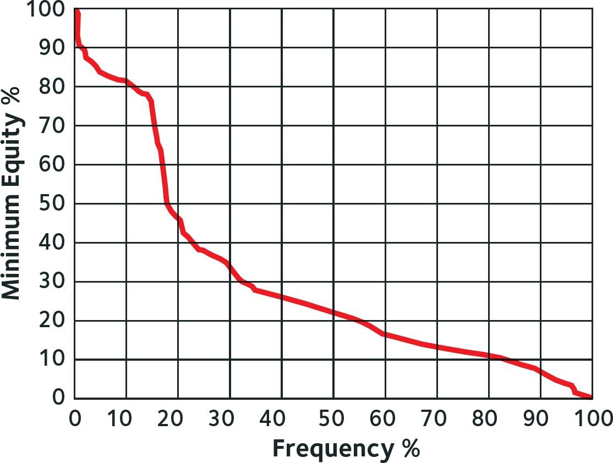
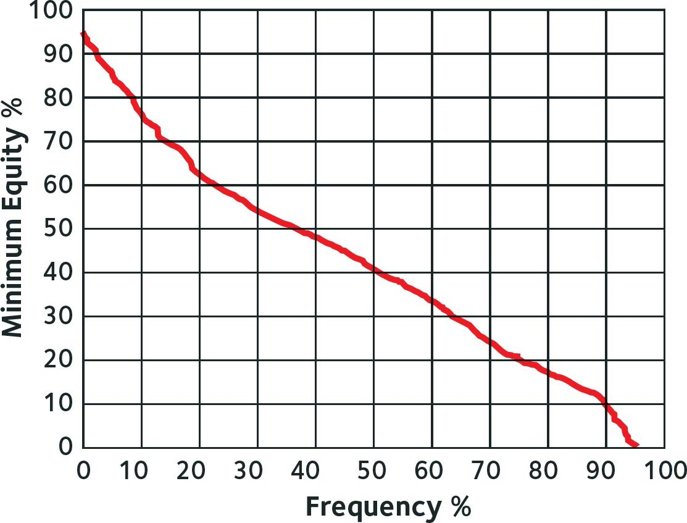
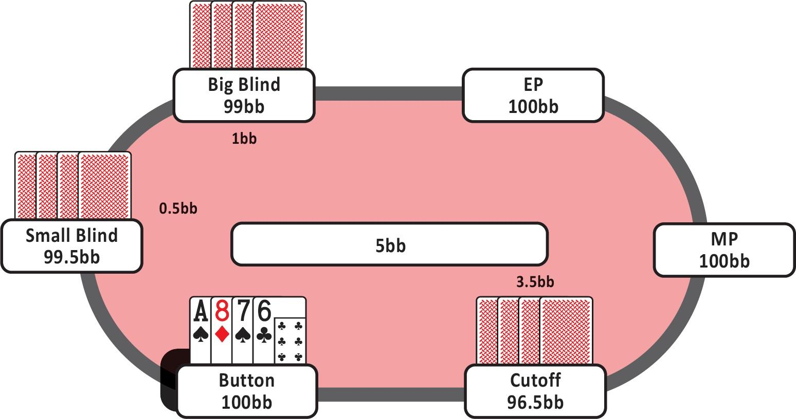
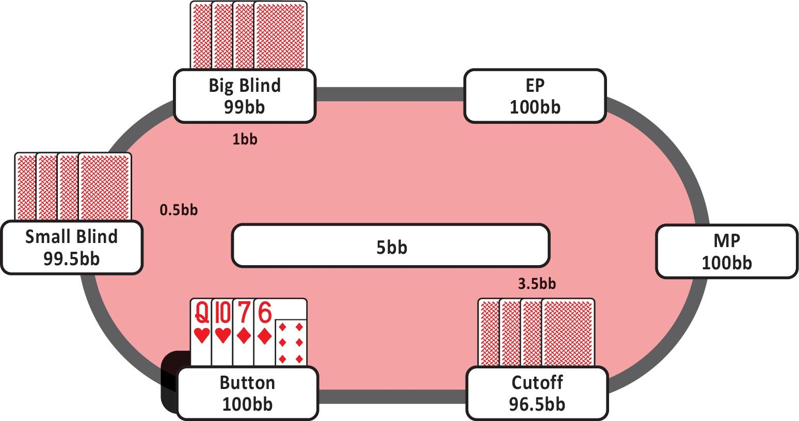
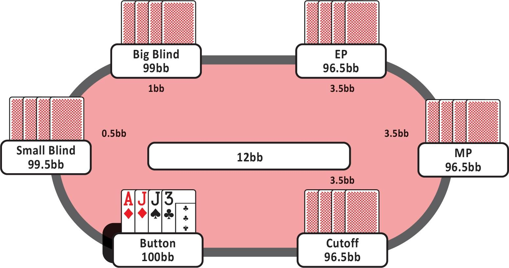
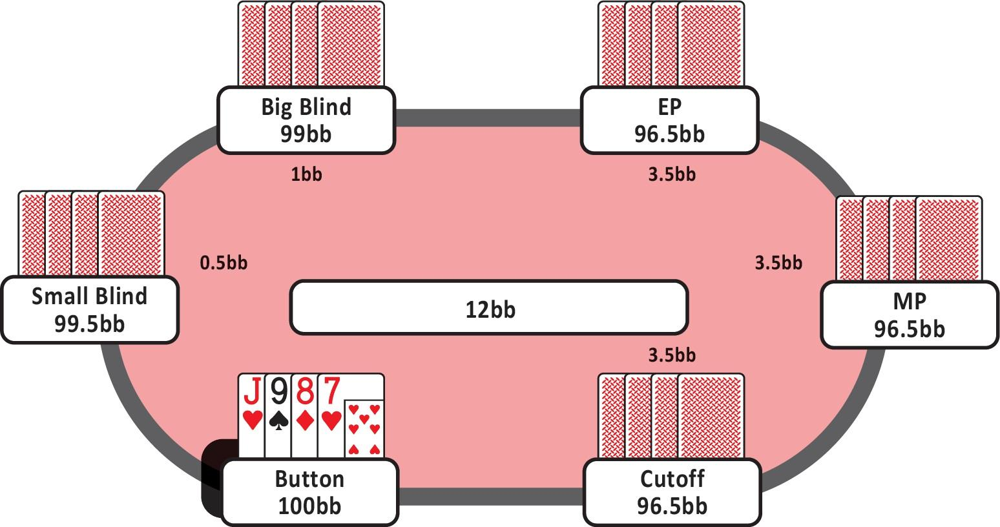

# 第二章：翻牌前策略

[返回目录](精通低级别底池限注奥马哈.md)

## 2.1 翻牌前策略简介

在本节中，我们将讨论不同的翻牌前类别，解释 PLO 和 NLHE 之间的区别，并涵盖最重要的翻牌前概念。本节的主要目标是让你对基础知识有深入的理解，以便在后续章节中逐步提高你的翻牌前游戏水平。

### 2.1.1 PLO 和 NLHE 中的翻牌前权益

大多数玩家很可能从 NLHE 背景转向 PLO，因此让我们从这两种游戏之间的几个关键区别开始。

最明显（也是最有趣的！）的区别是，在 PLO 中，你会发到四张牌。这并不意味着 PLO 中的起手牌组合是 NLHE 的两倍。实际上，PLO 中有 270,725 种起手牌组合，而 NLHE 中只有 1,326 种可能的组合。

好消息是，PLO 不像 NLHE 那样需要你记住所有的开牌范围。在 PLO 中，更多的是理解场景和原则，而不是记忆单个手牌组合。

在本书的翻牌前部分，我将不同的起手牌分为多个类别，以帮助你培养对哪些手牌应该在翻牌前开牌、哪些手牌应该弃牌的直觉。我还会分享一些新手常犯的错误，以便你可以避免这些错误，并立即获得对手的优势。阅读本书后，你将理解翻牌前的模式，并知道在决定是否开牌或弃牌时应该寻找什么。

让我们从如何评估和分类你的翻牌前手牌开始。在 PLO 中，翻牌前手牌之间的权益比 NLHE 更加平滑，这意味着翻牌前权益更加接近。如果你在 NLHE 中拿到 AA，你可能会对即将到来的手牌感到非常兴奋，因为你将拥有非常高的权益，因此你通常会赢。

例如，如果你有 AA，而你的对手持有 Q♠-J♠，你将拥有大约 81.5% 的权益。在 PLO 中，如果你有一个非常强的手牌，比如 A♣-A♠-K♣-K♠，而你的对手持有 J♠-9♥-7♠-6♥，你只有大约 63% 的权益。这种权益差异可能会让一些玩家感到沮丧。

一个常见的误解是，由于翻牌前权益更加接近，因此与 NLHE 相比，PLO 中的优势空间较小。实际上，情况往往相反，因为许多对手会以此为借口来证明他们玩得非常松。这是一个巨大的错误，也是你可以利用这些玩家赚钱的机会。

另一个玩家在 PLO 中倾向于玩太多手牌的原因是，对手在翻牌前跟注时需要考虑的最差赔率是 2 : 1。许多玩家认为，只要他们在翻牌前有 33% 的权益，他们就应该继续。正如我们稍后将看到的，事实并非如此。

顺便说一下，计算最大加注大小的一般规则是：

**将前一个下注乘以 3，然后将其加到已经存在的底池中。**

例如，你在一个 6 人桌的 \$5/\$10 游戏中处于 UTG 位置。要计算最大开牌加注，取前一个下注（在这种情况下是 \$10 的大盲注）。然后，将其乘以 3（\$10 x 3 = \$30）。最后，加上已经存在的底池，即 \$5 的小盲注。

因此，在这种情况下，你可以加注到 \$35（\$10 大盲注 x 3）+ \$5 小盲注。这意味着如果行动到 BB，他们将不得不在 \$50 的底池中跟注 \$25。

如果 CO 位置的玩家想要进行底池大小的 3-bet，他们将取前一个下注，即你的 \$35 开牌加注。将该加注乘以 3（\$35 x 3 = \$105）。最后，加上底池的其余部分，即小盲注（\$5）和大盲注（\$10）。因此，CO 可以使用的最大 3-bet 大小为 \$120（\$105 + \$5 + \$10 = \$120）。当行动回到你时，你将面临 \$85 的跟注，底池为 \$170，因此赔率再次为 2 : 1。

通常你不需要自己计算底池大小。如果你在网上玩，只需点击底池或最大按钮即可预览大小。如果你在现场玩，如果你要求，发牌员可以为你计算底池大小。重要的是要记住底池赔率以及其他玩家如何考虑它们。他们的策略中有多少是基于简单的底池赔率？

## 2.1.2 权益与期望值（EV）的区别

在 PLO 中，手牌的基本价值与其情境价值之间的差距通常比 NLHE 大得多。

基本价值基于手牌的权益。例如，如果你持有 Q♠-Q♥-J♠-10♦，而你的对手持有 9♣-8♣-7♠-6♠，你的手牌有 59.49% 的权益。你可以在 propokertools.com 等网站上计算出翻牌前的权益。

然而，这种权益计算并没有考虑权益实现。它们只是表示当手牌全押时，一手牌相对于另一手牌的胜率。当你考虑基本价值时，你不会考虑任何未来的下注。这并不是你手牌价值的现实表现，除非你全押并且确定你将通过摊牌实现你手牌的所有权益。

情境价值根据情境的上下文调整手牌的价值，这创造了一个更现实的画面，因为它考虑了权益实现：你是否会低估或高估你的权益。给手牌赋予情境价值可以根据特定情况调整翻牌前范围。

在 PLO 中，情境价值极其重要，甚至比 NLHE 更重要。在本书中，我将为你提供评估手牌情境价值所需的所有信息和工具。在后面的章节中，我们将更深入地讨论校准的概念，但现在你应该知道，它是根据你所处或即将进入的情况调整你的翻牌前范围，基于诸如位置、对手倾向和已经进入底池的玩家数量等因素。

## 2.2 权益分布

### 2.2.1 什么是（翻牌）权益分布？

许多玩家将翻牌前和翻牌后策略分开考虑，但实际上它们是相互依赖的。让我们稍微谈谈翻牌后策略的基础知识，以及它如何帮助我们确定哪些手牌在翻牌前是有利可图的，哪些不是。

翻牌权益分布是指在后续街上的特定手牌或范围的权益分布。简单来说，它解释了我们用特定手牌或范围在翻牌后相对于对手的手牌 / 范围在所有可能的剩余街上的权益。

你现在可能会问自己的第一个问题是：“我应该在什么时候考虑翻牌权益分布？” 你应该在每一个可能的翻牌前场景中考虑翻牌权益分布。

在牌局的任何时刻，你都必须确定是否值得将额外的资金投入底池。除非你全押或接近全押，否则这个问题的答案将取决于后续街的玩法。这个概念可能听起来非常技术性，所以让我们通过一个实际例子来深入理解（图 1）。

图 1
K-K-x-x 与 A-A-x-x 的翻牌权益分布

这张图代表了所有 K-K-x-x 手牌相对于所有 A-A-x-x 手牌的翻牌权益分布。换句话说，它展示了 KK 相对于 AA 在所有可能的翻牌上的权益。

考虑一下，一个紧手玩家在 100 bb 的筹码深度下进行了 4-bet，我们知道他只会用 AA 这样做。在这种情况下，我们应该如何应对他的 4-bet？在这种情况下，就像在任何翻牌前场景中一样，你的手牌相对于对手范围的翻牌权益分布应该是你决策的主要决定因素之一。

在图表的垂直轴上，你可以看到你相对于对手范围的权益。在水平轴上，你可以看到我们在翻牌上获得特定权益的频率百分比。

KK 相对于 AA 的权益分布被认为是 “粗糙” 的。也就是说，大约 15% 的时间，KK 会在翻牌上获得至少 75% 权益的强手牌，通常意味着三条或两对。然后我们看到权益急剧下降，当 KK 没有在翻牌上击败 AA 时，仍然落后于超对。大多数情况下， KK 相对于 AA 的翻牌权益将远低于 40%。回到例子。如果你持有 KK，并且你知道你的对手持有 AA，你应该跟注 4-bet 吗？根据图表，你怎么看？

答案是不，你不应该。如果你确定你的对手持有 AA，那么你不应该跟注。直觉上，这可能已经对你有意义了。我们不会经常在翻牌上击败 AA，并且为此付出的代价很高。

### 2.2.2 其他手牌的翻牌权益分布

现在考虑以下手牌：8♠-7♠-6♥-5♥。如果你知道你的对手持有 AA，你应该用这个双同花连牌跟注 4-bet 吗？这手牌相对于 AA 的翻牌权益分布如下（图 2）。

图 2  
8♠-7♠-6♥-5♥ 与 A-A-x-x 的翻牌权益分布

正如你所看到的，权益没有急剧下降。差异很明显，这种权益分布被称为 “平滑” 分布。再次，你可能已经直觉上理解你应该用这手牌跟注。但具体为什么呢？

- 8♠-7♠-6♥-5♥ 将在 20% 的时间里获得 60% 或更多的权益。
- 8♠-7♠-6♥-5♥ 将在 40% 的时间里获得 50% 或更多的权益。
- 8♠-7♠-6♥-5♥ 将在 60% 的时间里获得 35% 或更多的权益。

我们可以得出结论，有许多不同的牌面，8♠-7♠-6♥-5♥ 将在翻牌后获得足够的权益来继续对抗对手的 c-bet，这是决定你是否应该在翻牌前跟注或弃牌时的一个极其重要的因素。你将能够更频繁地实现你手牌的权益，尤其是在对抗超对时。

KK 的权益分布包括一个大的拐点，这是由于我们要么在翻牌上击中三条，要么没有。8-7-6-5 双同花的翻牌权益分布没有拐点，这使得图表更加 “平滑”。

具有非常粗糙权益分布的手牌通常不值得在翻牌前投入大量资金到底池中。你可以将其与 NLHE 中的暗三条挖矿（set-mining）进行比较，在那里你不想用像 5-5 这样的手牌投入大量筹码来跟注，因为如果你没有击中三条，它通常会表现不佳。当你在大底池中持有 5-5 而没有击中三条时，你通常不得不在对手的持续攻击下弃牌。

具有平滑权益分布的手牌将在高百分比的牌面上获得稳固的权益。我们不需要三条来对抗裸超对拥有大量权益。有许多组合是成对加听牌或组合听牌，具有高翻牌后权益。我们也有更好的可见性，这意味着我们比持有 KK 时更容易知道我们是否领先。我们将在后面的翻牌后章节中更多地讨论可见性。

这两手牌是 PLO 中翻牌分布的典型例子。虽然你必须学会思考你手牌或范围的权益分布，但你不应该仅仅考虑是平滑还是粗糙。许多手牌将介于这两个类别之间。如前所述，在决定是否玩一手牌时，还有其他原则需要考虑，我们将在接下来的章节中讨论。

_现在，只需知道翻牌前策略在很大程度上取决于你为自己设置的翻牌后场景。_

### 2.2.3 主要要点

- 你手牌或范围的翻牌权益分布可以是决定翻牌前采取什么行动的关键因素。
- 具有翻牌权益分布的手牌，其平均权益在所有牌面上缓慢下降，被称为平滑手牌。例如：8♠-7♠-6♥-5♥。
- 偶尔可以在翻牌上表现非常好，但更多时候只是中等或边缘手牌的手牌被称为粗糙手牌，例如 K♦-K♠-9♣-2♥。这些手牌在许多牌面上的平均权益会有急剧下降。
- 平滑手牌通常比粗糙手牌更适合在翻牌前投入额外的筹码到底池中。

## 2.3 筹码与底池比率（SPR）

### 2.3.1 什么是 SPR？

另一个需要理解的关键翻牌后概念是筹码与底池比率（SPR）。SPR 描述了你的筹码量与底池大小之间的关系。

扑克中的翻牌后决策在很大程度上受到权益、位置和 SPR 的影响。理解权益与 SPR 之间的关系是 PLO 全押情况的核心。SPR 越小，我们全押所需的权益就越少。

让我们通过一个简单的计算来详细说明这一点。

底池中有 \$100，你的筹码是 \$400，这意味着你的 SPR 为 4 : 1（\$400/\$100）。在扑克中，尽管它是一个比率，但 SPR 通常表示为一个数字，在这种情况下是 4。

如果 SPR 很低，例如 1 或 2，这意味着你正在玩非常浅的筹码，你将需要更少的权益来全押。如果 SPR 较高，例如 6，你将需要更多的权益来全押。在本书中，我们将经常使用 SPR 这个术语，你将开始理解在特定筹码深度下需要多少权益才能正确全押。

在处理 SPR 时，关键数字是 1、4 和 13。如果你处于SPR 1，需要一次完整的底池大小的下注才能将所有资金投入。对于 SPR 4，需要两次完整的底池下注。对于 SPR 13，需要三次完整的底池下注。

在单次加注的底池中，SPR 通常在 8 或 9 之间，用于单挑底池，或 6 到 7 用于多人底池。在 3-bet 底池中，SPR 通常在单挑底池中为 3.5 到 4，在多人底池中接近 2。这意味着在大多数情况下，你可以在河牌前将所有资金投入。

然而，我们并不总是下注完整的底池，重点不是将所有资金投入，而是做出最高 EV 的决策。如果你想在 PLO 中取得成功，你必须理解你手牌或范围相对于对手范围的权益，并将其与 SPR 计算结合起来。

### 2.3.2 SPR 与全押

下表（图 3）应为你提供关于在不同 SPR 下需要多少权益才能有利可图地全押的广泛指示。这假设你的加注没有弃牌权益。

| SPR | 全押所需权益 |
| --- | --- |
| 0.5 | 25% |
| 1 | 33.3% |
| 2 | 40% |
| 3 | 42.9% |
| 4 | 44.4% |
| 5 | 45.5% |
| 6 | 46.2% |
| 7 | 46.7% |
| 8 | 47.1% |
| 9 | 47.4% |
| 10 | 47.6% |
| 11 | 47.8% |
| 12 | 48% |
| 13 | 48.1% |

图 3

记住，在决定是否全押时，你不应该只将全押的 EV 与弃牌或盈亏平衡的情况进行比较。你还应该将其与跟注的 EV 进行比较。即使在中等偏低的 SPR 下，跟注也可能是最高 EV 的玩法，尤其是当你在位置上有优势时，因为它允许你在多条街上利用你的位置优势。有时你也会在接近 100% 权益的情况下跟注，例如在慢玩时。

从这张表中得出的结论是，一旦你达到 SPR 5 或更高，你就不应该经常在翻牌上轻率地全押。轻率的意思是，对抗一个将你压制住的范围。随着 SPR 的增加，你的对手更愿意用更强的手牌全押，而在 PLO 中，除非筹码非常浅，否则通常会是坚果或压制性的组合听牌。

在多人底池中，即使 SPR 相对较低，你也希望收紧你的全押门槛。这是因为你现在面对多个对手，遇到更强手牌的机会更大。也有可能遇到多个强手牌。

当对手在低 SPR 下在翻牌上下注底池，并且似乎承诺了这手牌时，你应该使用上表并计算全押的盈利性。如果你在高 SPR 下面对半池下注，你可能有一些翻牌弃牌权益，并且可以证明全押和用部分范围进行诈唬加注是合理的。在下表（图 4）中，你可以看到即使只有一点弃牌权益，也会显著降低全押所需的盈亏平衡权益。

|  SPR | + % 弃牌权益 | 全押所需权益 |
| --- | --- | --- |
| 2 | 20% | 35% |
| 2 | 30% | 32% |
| 2 | 40% | 27% |
| 2 | 50% | 20% |
| 3 | 30% | 37% |
| 3 | 40% | 34% |
| 3 | 50% | 29% |
| 3 | 60% | 22% |
| 3.5 | 30% | 39% |
| 3.5 | 40% | 36% |
| 3.5 | 50% | 32% |
| 3.5 | 60% | 25% |
| 4 | 50% | 34% |
| 4 | 60% | 28% |

图 4

我们将在未来的单次加注底池和 3-bet 底池章节中更深入地讨论 SPR。现在，重要的是你要知道 SPR 是什么，以便你能够理解它如何与坚果性和校准的概念结合起来影响你的翻牌前范围构建。

## 2.4 学习翻牌前策略

在 PLO 中，不可能记住每种情况下的所有手牌组合。我们可以做的是将手牌分为不同的类别。在这里，我们将手牌分为九个不同的类别。在我们这样做之前，让我们澄清一些术语。

- **彩虹** 意味着你持有四张不同花色的牌。例如，A♦-A♣-5♥-6♠ 或 Q♦-7♥-3♠-2♣。
- **单同花** 意味着你持有两张、三张或四张同花色的牌。例如，A♥-K♥-Q♠-J♣ 或 10♠-9♠-8♠-7♠。
- **双同花** 意味着你持有恰好各有两张同花色的牌在两个花色里。例如 Q♦-10♦-8♣-6♣ 或 A♦-K♦-K♣-J♣。

我们可以使用这九个翻牌前类别作为所有翻牌前组合的结构化分离。请记住，这些类别并不意味着强度差异；它们仅用于提供所有可能手牌组合的概述。

1. 没有对子单同花
2. 没有对子双同花
3. 没有对子彩虹
4. 一对单同花
5. 一对双同花
6. 一对彩虹
7. 两对单同花
8. 两对双同花
9. 两对彩虹

所有可能的起手牌都属于这些类别之一。正如你在下表（图 5）中所看到的，这九个类别在强度和发牌频率方面差异很大。

||没有对子|对子|两对|
|---|---|---|---|
|单同花|51.8%|22.8%|0.7%|
|双同花|9.5%|3.8%|0.2%|
|彩虹|6.3%|3.8%|0.2%|

图 5  
手牌类别的发牌频率

这张图表显示，你很可能拿到没有对子的单同花手牌，因为这种情况发生的概率为 51.8%。拿到两对手牌的概率非常低。在本章中，我将简要讨论不同的类别。这里的主要目标是让你熟悉这些术语，所以请不要试图记住所有确切的类别和频率。

### 2.4.1 没有对子单同花

让我们简要分解没有对子单同花类别。一个例子是 A♠-K♣-Q♦-J♠。这手牌属于基本价值最强的 6% 手牌。另一个例子是 6♦-5♣-3♣-2♣，这手牌属于 PLO 手牌中最弱的 11%。为什么这手牌排名如此低？它看起来不错，你可能会认为用这手牌很容易做成顺子。

许多低手牌实际上非常弱，因为这些手牌会给你很多弱成手牌（例如底两对）和听牌（例如低顺子），这些很容易被对手压制。在 PLO 中，玩正确的手牌以避免在翻牌后被压制是非常重要的。玩很多容易被压制的弱手牌是最容易也是最常见的烧钱方式之一。特别是，如前所述，如果你依赖底池赔率并错误计算你手牌在未来街上的盈利性和权益实现。

___在 PLO 中，高牌仍然是最好的___  
_在 PLO 中，就像在 NLHE 中一样，高牌通常获胜。玩家错误地高估了低花色和低顺子的手牌，因为这些手牌看起来不错。你希望根据手牌的组成部分和它们在特定情况下的价值来玩手牌。_

### 2.4.2 花色类型

持有两张、三张或四张同花色牌的手牌都属于 “单同花” 类别。然而，这些手牌的强度可能大不相同。持有四张同花色牌的手牌，例如 A♠-K♠-9♠-8♠，比持有两张同花色牌的同一手牌要差得多，例如 A♠-K♥-9♥-8♠。当你持有四张同花色牌时，你已经阻挡了两个潜在的同花补牌，因此更难做成同花。当我提到持有三张同花色牌的手牌时，我会称它们为 “三同花手牌”，而持有四张同花色牌的手牌将被称为 “单调手牌”。

因此，这个类别中有三种类型的单同花手牌。

- 单同花 A♠-K♦-Q♠-J♥
- 三同花 A♠-K♠-Q♠-J♦
- 单调 A♠-K♠-Q♠-J♠

另一个需要注意的是，高价值手牌拥有最高的花色，但不会阻挡第二高的花色。例如，A♠-K♥-Q♦-10♠ 非常好，因为当你做成同花时，你可以轻松地从 K-、Q- 或 J- 高同花那里获得支付。从权益角度来看，它可能与 A♠-K♠-Q♦-10♣ 类似，但它会有更好的情境价值。避免单调和三同花手牌，因为它们有更少的补牌来做成同花，并且遇到更弱同花的机会更小。

### 2.4.3 两对手牌

两对手牌的发牌概率约为 1%，它们的强度差异很大。两对手牌的主要优势是它们能够在翻牌上击中三条，这种情况发生的概率约为 21%。

J♣-J♦-10♣-10♠ 是一个两对单同花手牌的例子，它属于 PLO 中 最强的 4% 手牌。然而，4♠-4♥-3♦-3♣ 则属于最弱的 29% 手牌。同样，你的对子的高低和花色在很大程度上决定了手牌的强度。

### 2.4.4 主要要点

- 我们确定了两种评估 PLO 手牌强度的方法：基本价值和情境价值。
- 基本价值仅关注你手牌的权益。这在全押时很重要。
- 情境价值基于当前的战略因素。
- 你的花色和单张牌的高低非常重要。在大多数情况下，高牌仍然是最好的。拥有 A 高花色并且不阻挡 K 和 Q 高花色会增加你手牌的价值。
- 低牌和花色会降低你手牌的价值，并增加你被对手压制的可能性。

## 2.5 坚果性与校准

### 2.5.1 简介

在本节中，我们将讨论坚果性和校准的基础知识。这两个概念可以帮助你准确评估不同情况下起手牌的 EV。

### 2.5.2 坚果性

手牌的坚果性描述了你的起手牌在翻牌、转牌或河牌上成为坚果牌的可能性。被认为 “坚果性强” 的手牌在多人底池中表现尤其出色。

如果多个玩家进入底池，很可能有一两个玩家会在翻牌上击中某些牌。既然你已经知道这会发生，你希望确保你有 “坚果性强” 或坚果手牌，这些手牌有潜力压制你的对手。例如，你希望拥有 A 高同花，而你的对手持有 Q 高同花。让我们通过一个例子来说明这个概念。比较以下两手牌，你认为哪一手牌的 “坚果性” 更高？

手牌 1：A♠-8♦-7♠-6♣
手牌 2：J♥-10♥-7♦-6♦

手牌 1 是更具坚果性的手牌，因为它包含 A 高同花，并且有可能用这手牌做成坚果同花。这手牌也与 8-7-6 更好地连接，可以让你做成一些坚果顺子。

手牌 2 是非坚果性的。你无法用任何一种花色做成坚果同花。虽然你技术上可以做成同花顺，但这非常不可能。此外，这手牌更不连贯，有可能做成更多非坚果顺子。

重要的是要注意，你不应该通过思考哪一手牌 “更好” 来进行这种比较。你希望确定每手牌在不同情况下的优势，而不是哪一手牌最强。理解这两手牌具有不同的品质，使它们更适合不同的情况。

A♠-8♦-7♠-6♣ 具有更多的坚果性成分，因此在多人底池中表现更好，而 Q♥-10♥-7♦-6♦ 是一手非常平滑的手牌，这意味着它经常会在翻牌上击中某些牌，因此在单挑底池中表现更好。

### 2.5.3 上下文与校准

要确定哪一手牌 “更好”，你需要理解上下文。在不同的情况下，不同的手牌品质很重要。你需要理解你所处情况的上下文，以及哪些手牌最适合它。让我们通过几个不同上下文的例子以及每种情况下最适合的手牌类型。

**手牌示例 1**  
CO 加注到 3.5 bb。你在 BTN 位置持有 A♠-8♦-7♠-6♣（图 6）。你应该采取什么行动？

图 6

用这手牌，你应该跟注。为什么？因为这手牌的优势在于它能够做成坚果牌。你希望鼓励更多对手进入底池，他们可能持有连接性较弱和较弱黑桃的手牌，以便在你击中坚果同花或坚果顺子时压制他们。

**手牌示例 2**  
CO 加注到 3.5x。你在 BTN 位置持有 Q♥-10♥-7♦-6♦（图 7）。你应该采取什么行动？

图 7

你应该用这手牌进行 3-bet。鉴于这手牌的坚果性较低，你通过赶走你后面的玩家获得更多 EV，他们可能持有更高等级的牌和压制你的花色。这手牌在翻牌上非常平滑，这意味着它在 3-bet 底池甚至 4-bet 底池中表现良好。

现在，这并不意味着你应该从每个位置用每手双同花不连贯的手牌进行 3-bet。这就是翻牌前校准变得重要的地方。

### 2.5.4 校准

翻牌前校准是根据情况和在玩的其他范围优化构建你的翻牌前范围的过程。

我们根据以下因素校准大盲注的防守范围：

- 有多少玩家参与
- 这些玩家的翻牌前范围

继续前面的例子，让我们考虑另一个例子。

**手牌示例 3**  
EP 玩家加注并得到两个跟注者。你在 BTN 位置持有 A♦-J♦-J♠-3♠（图 8）。正确的玩法是什么？

图 8

跟注。已经有三个玩家进入底池，因此你在寻找坚果性。这手牌可以在翻牌上击中坚果同花（听牌）、强顶三条或坚果顺子（听牌）。如果这手牌只有 J 花色，而没有 A 花色，这手牌的价值会降低，在这里只是一个弃牌。如果是双同花，这手牌足够强，可以进行 3-bet，以便（希望）赶走一两个玩家，从而增强 J 高同花的强度，同时仍然能够用 A 高花色压制。

这是你在玩低级别或现场扑克时常见的情况。记住，你需要根据你玩的游戏来校准你的范围。如果你的游戏非常松，你需要考虑更多的多人底池，并将你的翻牌前范围校准为坚果性手牌。在这些游戏中，你赚取的大部分钱将来自压制对手的手牌和听牌。同样，你损失的大部分钱将来自被对手压制，因此要尽量避免这种情况！

**手牌示例 4**  
EP 玩家加注并得到两个跟注者。你在 BTN 位置持有 J♥-9♠-8♦-7♥（图 9）。你应该怎么做？

图 9

希望你能识别出你应该弃牌。你应该本能地想到，这种情况需要坚果性手牌，因为已经有三个玩家进入底池。或者，这手牌是非坚果性的，这意味着它不是适合在多人底池中跟注的手牌。

如果你仍然认为这手牌非常连贯，因此你有很好的机会做成坚果顺子，你部分正确。这手牌确实看起来不错并且连贯。但重要的是停下来真正思考你前面的玩家的冷跟注范围。

你的对手应该持有直接压制你的手牌，例如 K♦-Q♦-J♣-10♠ 或 A♥-J♠-10♥-9♦。如果你在翻牌上击中顺子或顺子听牌，对手很可能有更好的顺子或相同的顺子加上重听牌。用 J♥-9♠-8♦-7♥ 这样的手牌跟注通常会让你陷入困境，你被压制并可能损失大量资金。

实际上，你的手牌并不强。手牌顶部的缺口意味着你的 J-9 顺子听牌会很弱。你的对手很容易压制你的成手牌或听牌。在低抽水环境中，你可能能够在位置优势下对抗一个对手时用这手牌跟注或自己在后期位置开牌。然而，在大多数小级别游戏中，较高的抽水率（bb/100）会使玩这手牌变成略微 -EV 的玩法。

### 2.5.5 主要要点

- 手牌的坚果性描述了你的起手牌在翻牌、转牌或河牌上成为坚果牌的可能性。坚果性在多人底池中最重要，因为多个玩家会在翻牌上击中某些牌，你经常进入翻牌后压制的游戏。坚果性在低 SPR 单挑场景中不那么重要（但仍然重要）。
- 校准是根据具体情况和在玩的范围优化构建你的翻牌前范围的过程。如果你想最大化你的利润，你需要知道如何有效地校准你的范围。校准意味着你不应该问哪些手牌是最好的，而应该问哪些手牌最适合你所处的特定情况。

## 2.6 翻牌前下注大小

### 2.6.1 简介

大多数玩家不会批判性地思考他们使用的翻牌前下注大小，而是简单地采用他们玩的游戏中最常见的下注大小偏好。在本章中，我们将探讨你应该使用什么加注大小以及为什么它如此重要。

### 2.6.2 赢得盲注

在 PLO 中，翻牌前加注到最大是标准做法，因为它允许你更频繁地赢得盲注并玩一个未抽水的底池。

为什么赢得盲注如此重要？你可能会想 “1.5 个盲注是如此小的金额；我为什么要关心这个？”

这是一个好问题。许多扑克玩家有一个误解，认为赢得盲注和前注只在锦标赛中重要，一旦筹码变浅，赢得盲注可以显著增加你的总筹码。这不是真的。

_事实上，可以说任何现金游戏的主要目标是赢得盲注！_

让我们用一些简单的数学来说明这一点。赢得盲注等于赢得 1.5 bb，这等于每 100 手赢得 150 bb 的赢率。这是一个难以置信的高赢率！如果你能够持续偷取盲注，你将成为世界上最大的现金游戏赢家。实际上，最好的在线玩家每 100 手赢得约 5 - 10 bb，最好的现场玩家每 100 手赢得约 20 - 40 bb。你应该清楚为什么无争议地赢得盲注如此重要。

如果你的加注不够大，你的对手有更大的动机用更多的手牌防守他们的盲注，因为他们得到的价格是合理的。通过选择更大的下注大小，你使盲注防守的盈利性降低，并增加了你的赢率。

此外，只在翻牌前玩而不看翻牌的底池通常是不抽水的。这意味着如果你在翻牌前拿下底池，你不必与赌场或扑克网站分享你的利润。

你希望最大化你的翻牌前弃牌权益，以便尽可能多地赢得未抽水的底池，而做到这一点的方法是使用最大的翻牌前开牌加注大小。

### 2.6.3 最大化 EV

加注到满底池允许你有更高的机会赢得盲注，并且它也有助于在你持有强手牌时建立更大的底池。另一方面，当你加注到 3.5 个大盲注时，你也在冒险投入大量资金 - 事实上是 350 bb/100。这就是为什么你不想用极弱的手牌进入底池。

在许多现场游戏中，你会发现你的对手会用非常宽的范围进入底池，无论你开牌多大。如果你玩的游戏中出现这种情况，你仍然希望专注于玩坚果性手牌，并且你应该尽可能大地开牌加注。这种组合将允许你在持有压制对手的手牌时建立大底池，这是 PLO 成功的秘诀。

### 2.6.4 加注大小的常见错误

玩家在加注大小方面最常见的错误是：

- 开牌加注太小；如果你想开牌，你应该加注到满底池。
- 3-bet 太小。
- 开牌溜入。

只有少数例外情况下，这三种行动是合法的选择。在 PLO 锦标赛中，开牌加注较小或开牌溜入可能是有意义的。PLO 锦标赛中的筹码要浅得多，在许多后期游戏中，你希望通过最小化波动和底池大小来保护你的锦标赛生命。

此外，在 PLO 锦标赛中溜入可能是最优的，因为单个底池不抽水，这意味着在翻牌前拿下底池不像现金游戏中那样重要。但除非你正在玩锦标赛，否则你应该避免开牌溜入，并且你应该开牌加注和 3-bet 到满底池大小。

### 2.6.5 主要要点

- 任何扑克现金游戏的目标都是赢得盲注。赢得 1.5 个大盲注听起来不多，但它实际上是 150 bb/100 手的赢率。
- 你希望最大化赢得盲注的机会，以增加你的整体赢率，并避免由于抽水而损失部分底池。因此，你应该开牌加注和 3-bet 到最大（底池）大小。
- 在锦标赛中，你的加注大小可能会改变，尤其是在后期阶段。这是因为底池不抽水，筹码较浅，并且有锦标赛生命或 ICM 考虑。
