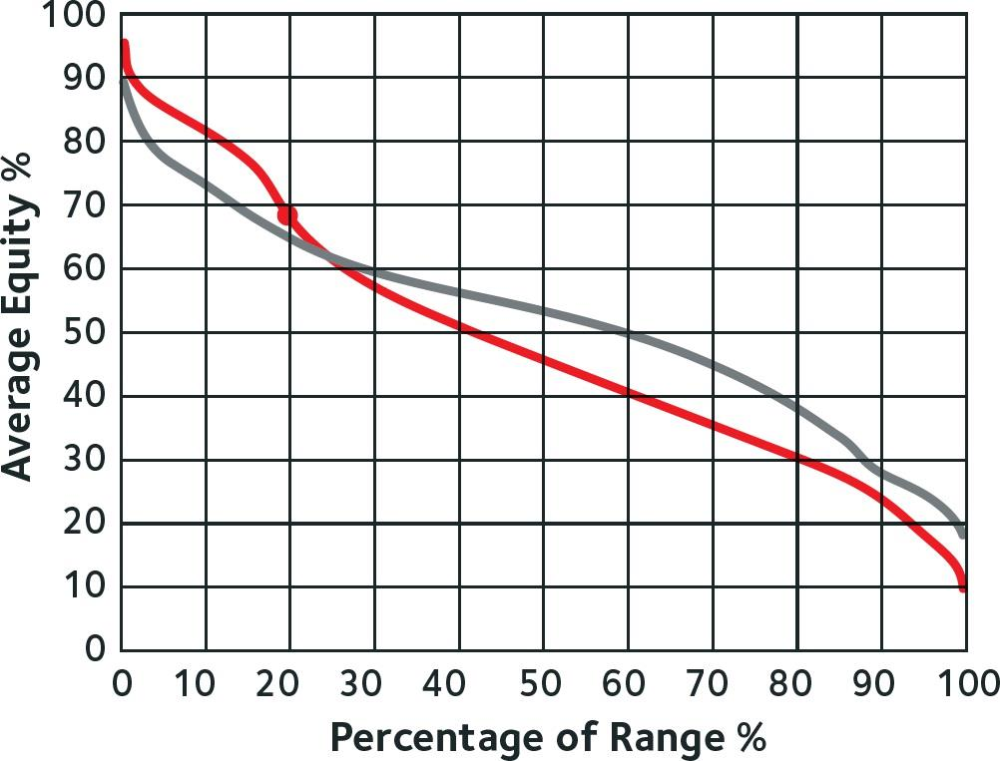
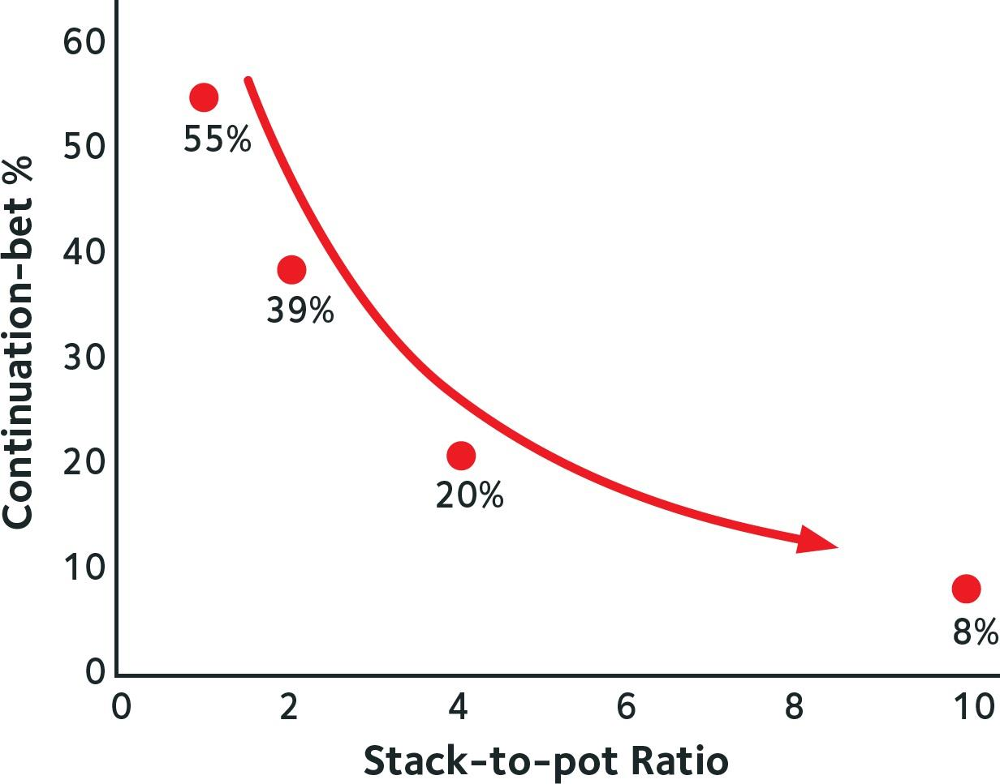

# 第五章：翻后分析的四大支柱

[返回目录](精通低级别底池限注奥马哈.md)

## 5.1 翻后策略介绍

恭喜你！你已经在这本书中取得了很大的进展，并在掌握小注额 PLO 方面取得了显著的进步。现在，你已经学习了翻前的内容，对翻前策略有了扎实的基础。

希望你已经内化了许多翻前范围，因为翻前策略对翻后策略有着巨大的影响。如果你在翻前玩错了范围，你往往会在翻后陷入非常困难的局面。即使你在翻后非常出色，这也很难让你成为一个盈利的玩家。

例如，如果你的 BTN 跟注范围太宽，你的翻后范围会变得脆弱，可能会在激进性上遇到困难。如果你 3-bet 过多，你可能会发现自己被压制，并在翻后频繁输掉整个筹码。但现在，你已经知道如何玩翻前，并且应该知道需要避免的陷阱。

现在是时候迈出下一步，进入本书的第二部分（也是更令人兴奋的部分）翻后策略。翻后是你能够对对手产生显著优势的地方。随着游戏树的规模增加，游戏变得更加复杂，掌握翻后玩法也更具挑战性，同时也为创造更大的优势留下了更多空间。

这些场景与无限注德州扑克类似，你不会发现许多玩家从 UTG 位置用 6-4 不同花加注开池。即使是大多数娱乐玩家也多少知道哪些手牌在翻前可以玩。然而，在翻后游戏中，这些娱乐玩家可能会反复犯下巨大的错误。这正是你可以产生最大优势的地方。那么，让我们开始吧！

## 5.2 翻后分析的四大支柱

作为一名扑克玩家，建立一套手牌分析流程至关重要。不同水平的玩家都在为如何正确分析手牌而困扰。大多数玩家在讨论手牌时缺乏结构性，无法为决策或整体提升提供建设性的路径。

我们将从我所称的 “翻后分析的四大支柱” 开始，帮助你建立一种清晰的方式来回顾自己的手牌，并与其他玩家讨论手牌。你还需要充分理解这些支柱，以便从本书的翻后部分中获得最大收益。

这四大支柱是你的工具，将帮助你更有效地分析局势。每当你讨论或分析一手牌时，请思考这四大支柱以及影响它们的关键因素。

四大支柱包括：

- **权益**：评估你在手牌某一时刻赢得底池的概率。我们还会考虑权益实现。
- **极化**：描述谁在分布的前 30% 中拥有权益优势。
- **位置**：定义哪位玩家先行动，哪位玩家后行动。
- **SPR**：描述底池中的金额与玩家剩余筹码的比例。

这四大支柱相互关联。每个支柱的重要性会不断变化，并取决于具体的局势。让我们更深入地探讨每个支柱及其相互关系。

## 5.3 支柱一：权益

权益是指如果手牌中没有后续下注，你在某一时刻赢得底池的概率。除非你全下，否则转牌和河牌还会有下注轮次。这意味着还存在权益剥夺和权益实现。

你并不总能实现你的全部权益，因为有时即使你拥有一些权益，你也会在面对下注时弃牌。如果一个玩家没有实现他的全部权益，这自动意味着另一个玩家正在超额实现他的权益。

权益是翻后策略的驱动力。一般来说，你拥有的权益越多，你就越应该下注。

*权益和权益实现因素是 PLO 中翻后激进性的最大驱动力。你的手牌越强，你的牌面发展越有利，你就越应该下注。*

在翻牌圈下注之前，我们应该考虑加强对手的继续范围和增加底池规模的影响。根据经验，我建议你不要下注那些在转牌 / 河牌大底池中表现不佳的手牌，或者相对于对手的跟注范围权益较低的手牌。将底池做大然后在后续街弃牌的成本太高，这并不属于盈利的 PLO 策略。

### 5.3.1 手牌示例

例如，假设你从 CO 对 BTN 的 3-bet 进行了 4-bet。他选择跟注，我们以 SPR 为 1 且处于不利位置进入翻牌圈。让我们看几个翻牌面的情况。

**Flop 1：** 7♣-3♥-2♠  
这是一个对你非常有利的牌面。你的 4-bet 范围在这手牌中拥有约 65% 的权益。你的范围中包含许多 AA，而对手在 3-bet 并跟注 4-bet 后，几乎不可能有两对或更好的牌。在这个牌面上，你拥有大量权益，但仍然可以轻松剥夺对手的 35% 权益。你在这手牌的策略是用 4-bet 范围内的每一手牌全下。这是一个你会超额实现权益的牌面，因为对手通常会放弃他的权益。

**Flop 2：** J♠-10♠-9♣  
这个翻牌面对 4-bet 者来说要糟糕得多。你的整个范围在这个牌面上只有约 40% 的权益。在这个翻牌面上，你应该只用 4-bet 范围中的 20% 进行全下，其余手牌选择过牌。

你可以看到，这两个翻牌面在权益和 c-bet 频率之间存在巨大差异。权益与持续下注频率直接相关。事实上，即使在这个简单的例子中，我们也在考虑 SPR，但请养成习惯，问自己在每个牌面上你的范围权益有多好。

### 5.3.2 主要要点

- 权益代表如果所有玩家在某一时刻全下，你赢得底池的概率。
- 你的范围权益对你的持续下注策略有重大影响。一般来说，你的权益越高，你就应该越频繁地下注。你的权益越低，你就应该越少下注。

## 5.4 支柱二：极化

极化描述的是谁在分布的前 10% - 30% 中拥有权益优势。

让我们假设你处于 SB，并对 BTN 的加注进行了 3-bet。BTN 选择跟注，翻牌发出 7♠-5♦-4♠。3-bet 者和跟注者的范围中都包含许多不同的手牌，这些范围的分布可以在下图中看到（图 18）。

图 18：BTN 加注 - 跟注（红色） vs SB 3-bet（灰色）  
翻牌权益分布：7♠-5♦-4♠

图中的红线代表 BTN 的范围分布，灰线代表 SB 的范围分布。图中的两条线由 “点” 组成，这些点代表玩家组成其翻前范围的每一手牌组合。这些点被绘制成线，代表两位玩家范围在这个牌面上的平均权益。

图中左上部分的组合是两位玩家翻前范围中可能持有的最强手牌，而右下部分则代表他们可能持有的最弱手牌。

图中的红点代表 BTN 的手牌 A♠-Q♠-5♣-3♦。BTN 加注并跟注了这手牌，现在击中了一个很好的翻牌，既有内听顺子，还有一对以及坚果同花听牌。这手牌对 SB 的 3-bet 范围拥有约 68% 的权益。这种情况可以表述为：“这手牌在对抗对手的翻前范围时表现非常好。”

这个特定的手牌或点在图中非常靠左，这意味着 BTN 范围中只有约 20% 的手牌拥有更高的平均权益。因此，这手牌位于 BTN 范围的前 20%。虽然还有一些更好的手牌，但大多数手牌在这个牌面上表现较差。理解这些权益分布将帮助你了解你在自己范围内的强度。如果你听到有人在 PLO 中说 “我处于我范围的顶端”，这就是他们所谈论的内容。

有两种方式可以思考权益。在这种情况下，BTN（红线）拥有 48% 的权益，而 SB（灰线）拥有 52% 的权益。通过观察每条线与水平轴 50% 值的交点，可以看到两个范围的平均权益。

另一种思考权益的方式是通过权益分布曲线。如果你观察图表的左上部分，可以看到红线位于灰线之上。这意味着在这个特定的翻牌面上，BTN 比 SB 更频繁地拥有非常强的手牌。BTN 范围中的强手牌比 SB 可能拥有的强手牌更强。

这是因为 BTN 可以拥有更多的三条、两对、组合听牌、组合成牌加听牌以及顺子。而 SB 的 3-bet 者在翻前范围中不会拥有这么多这类手牌。在 7♠-5♦-4♠ 的牌面上，3-bet 者通常会有更弱的手牌，例如：超对加同花听牌、超对加两对、超对加内听顺子和后门同花听牌，以及更少的翻牌顺子。这些通常是 3-bet 者最强的牌型，但它们并不如 BTN 可能拥有的手牌强。因此，在权益分布或极化方面，BTN 在这里具有优势。

在这个牌面结构上，SB 拥有权益优势（52% 对 48%）。然而，SB 很少会在翻牌圈下注，因为正如我们已经看到的，BTN 在权益分布中拥有更强的手牌。你不希望在一个更强的范围面前建立底池。仅仅考虑权益并在你拥有权益优势时下注是不够的。当分布对你不利时，就像这里的情况一样，你必须在下注时更加谨慎。BTN 拥有极化优势，而 SB 在 SPR 为 4 时应该主要选择过牌。

如果这是一个 4-bet 底池，且 SPR 为 1，那么极化的影响会减小，你只需在翻牌圈用大多数 AA 手牌下注，希望剥夺对手的权益，就像之前讨论的 7-3-2 彩虹翻牌面一样。

### 5.4.1 主要要点

- 极化描述了谁在分布的高端拥有权益优势。
- 如果你拥有极化优势，你的 c-bet 频率会增加。如果你的对手拥有极化优势，你的 c-bet 频率会降低。

## 5.5 支柱三：位置

### 5.5.1 介绍

如果你在翻后是最后一个行动的玩家，那么你处于有利位置。否则，你处于不利位置。如果你在一个多人底池中，还存在相对位置。你可能对一位玩家处于有利位置，但对另一位玩家处于不利位置。在多人底池中，面对下注时，身后还有玩家未行动与在你行动前看到其他玩家的行动之间存在很大差异。

### 5.5.2 控制

在有利位置时，你对底池有更多的控制权，因为你有权决定是否展示下一张牌，或者是否进行最后一次下注。例如，如果你的对手在翻牌圈对你下注，你可以选择跟注并强制发出转牌，或者选择弃牌，这样就不会发出转牌。你也可以选择加注并决定玩一个更大的底池。如果你的对手选择过牌，你可以看到一张免费的转牌，或者选择下注并重新开启下注轮次。

当你在有利位置时，你拥有的额外选择会为你带来更高的 EV。你的位置与你的 EV 之间存在直接的正相关关系。我们称之为位置优势（如果你处于不利位置，则称为位置劣势）。筹码越深，你的位置（劣势）优势就越大，因为当筹码非常深时，更难在翻牌圈或转牌圈将所有资金投入底池。因此，更多的下注轮次会被进行，这为有利位置的玩家提供了更多机会来最大化他们的位置优势。

### 5.5.3 有利位置

一般来说，有利位置的玩家从多街游戏中受益。许多 PLO 中的牌面对不利位置的玩家来说很难处理，因为从翻牌到转牌再到河牌，牌面结构可能会发生很大变化。这意味着坚果牌可能会频繁变化。

不利位置的玩家必须首先对这些变化做出反应，而不知道对手会做什么。对于有利位置的玩家来说，进行多街游戏会带来更显著的优势，因为他们将有更多机会从这种信息优势中获利，从而允许他们进行更薄的价值下注或更有效的诈唬。有利位置的玩家还倾向于通过阻止不利位置的玩家在河牌前结束手牌（通过将所有资金投入底池）来获益。

出于这些原因，有利位置的玩家通常比不利位置的玩家更喜欢较小的下注尺寸。下注较小意味着不利位置的玩家会更频繁地继续（用更弱的范围）并在更高的 SPR 下进行游戏。这使得有利位置的玩家能够在多街中利用他们的位置优势。

### 5.5.4 不利位置

不利位置的玩家没有强制获得免费牌的选择，因此他们的策略更加非极化。不利位置的玩家下注频率较低，通常选择较大的下注尺寸。

不利位置的玩家对进行三条街游戏的热情较低，尤其是在湿润的牌面上。由于他们处于显著劣势，他们更倾向于尽快结束手牌。请记住，在翻前部分中，面对 3-bet 时，不利位置的玩家通常比有利位置的玩家更频繁地进行 4-bet。

为了在翻后尽早结束底池，不利位置的玩家比有利位置的玩家更频繁地使用较大的下注尺寸。通过较大的下注，不利位置的玩家可以最大化弃牌权益，并为未来的下注街降低 SPR。由于使用了较大的下注尺寸，大多数中等强度的手牌在不利位置时不会下注，除非 SPR 较低，从而位置的影响较小。

在高 SPR 的情况下，不利位置时的下注频率应低于有利位置。这意味着在不利位置时，你会更多地选择过牌，因此需要通过包含更多中等强度和强手牌来保护你的过牌范围。你在不利位置时更多地选择过牌的原因是你经常处于劣势。这种劣势可能源于权益、极化、位置、SPR 或这些因素的组合。你需要知道的是，当你频繁过牌时，你必须保护这个范围。如果你不频繁过牌，平衡这部分范围就不那么重要。

不利位置的玩家还有一种特殊的武器，那就是过牌 - 加注。过牌 - 加注允许不利位置的玩家立即结束手牌或显著降低未来下注街的 SPR。在面对非极化的有利位置 c-bet 策略时，过牌 - 加注非常有效，因为你开始剥夺对手的底池权益。有利位置的玩家在构建 c-bet 策略时必须考虑过牌 - 加注的威胁。

### 5.5.5 主要要点

- 位置等于控制权。
- 有利位置的玩家从高 SPR 下的多街游戏中受益。
- 不利位置的玩家必须采用更极化的策略，因为他们处于位置劣势，因此在选择希望建立大底池的手牌时必须非常挑剔。
- 在不利位置时，你的下注频率低于有利位置，这意味着你必须更多地保护你的过牌范围。

## 5.6 第四支柱：筹码与底池比率（SPR）

### 5.6.1 引言

在本书的开头，我们讨论了 SPR 的概念。在本章中，我们将更详细地探讨如何利用 SPR 来做出更好的翻牌后决策。

首先，让我们回顾一些重要的数字。当 SPR 为 1 时，例如底池中有 \$100，你手中有 \$100 的筹码，而对手全下，此时你跟注的底池赔率是 2 : 1，你需要至少 33% 的权益来全下。如果 SPR 为 0.5，你的赔率将是 3 : 1，此时你需要 25% 的权益才能有利可图地全下。当 SPR 为 4 时，假设你没有弃牌权益，你需要 44% 的权益来全下。这些是通常在 3-bet 或 4-bet 底池中使用的基本权益和全下计算。

让我们更深入地探讨这一概念。当 SPR 降低时，极性和位置优势或劣势对你翻牌后策略的影响会减小。想象一下，SPR 为 0.1（一种极端情况），这意味着你有 \$10 的筹码，而底池有 \$100。在这种情况下，哪个玩家的范围中有更多的顶三条、顺子、同花或其他强牌并不重要。谁在有利位置或不利位置也不重要。重要的是玩家是否有足够的权益来根据底池赔率跟注。然而，如果你在一个 SPR 为 15 的单次加注底池中游戏，那么哪个玩家具有极性和位置优势就非常重要了。

如果你的范围比对手有更多的顶三条和强组合听牌，你将能够利用你的优势并获得更多的 EV。同样，当 SPR 较高时，处于有利位置的影响更大，因为你可以在多条街中利用你的信息和战略选择。

让我们考虑一个理论上的例子。

你从 EP 开池，CO 位置的玩家跟注，其他所有玩家弃牌。翻牌是 K♠-J♦-6♣。这是一个非常有趣的牌面，因为 CO 位置的跟注者在翻牌前的范围中会有很多 KK。大多数 KK 会跟注，而不会从 CO 位置对 EP 进行 3-bet。CO 位置的跟注范围也会足够紧，能够以多种方式与 K 和 J 产生强烈互动。

假设 SPR 大约为 10，这意味着你们在深筹码下游戏，而你的位置劣势相当大。因此，当处于不利位置时，你应该只在约 8% 的情况下进行 c-bet。如果我们考虑相同的加注和跟注范围，但 SPR 为 4，那么你应该在大约 20% 的情况下进行 c-bet。

20% 的数字可能看起来并不高，但它已经是 SPR 为 10 时的 2.5 倍。当 SPR 为 2 时，你应该在 39% 的情况下进行 c-bet，而当 SPR 为 1 时，你应该在 55% 的情况下进行 c-bet。请参见下图（图 19）。

图 19  
SPR 对 EP 玩家在 K♠-J♦-6♣ 牌面上对抗 CO 玩家 c-bet 频率的影响

这张图展示了 SPR 对你 c-bet 策略的重要性。这种变化是由于处于不利位置的玩家在位置和极性上的劣势随着 SPR 的降低而减小。在低 SPR 的情况下，权益成为策略的主要驱动力。

当你考虑翻牌后分析的四大支柱：权益、极性、位置和 SPR 时，你会发现 SPR 对其他三大支柱有着显著的影响。

*当 SPR 较低时，权益变得更加重要。当 SPR 较高时，极性和位置的重要性则更加凸显。*
