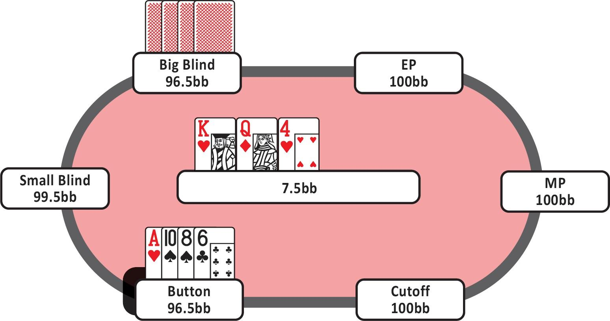
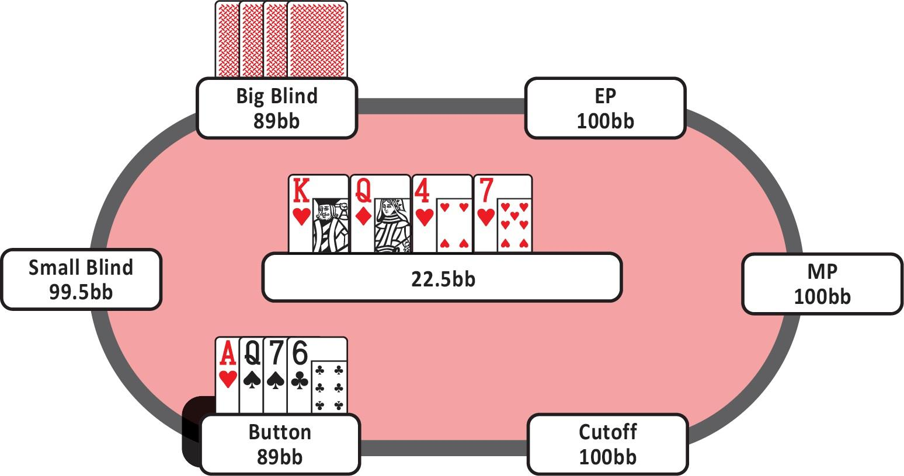

# 第六章：翻牌后概念

[返回目录](精通低级别底池限注奥马哈.md)

## 6.1 c-bet 基础

### 6.1.1 极化策略与混合策略

正如你的翻牌前策略和范围开始影响你在翻牌上的策略一样，你的翻牌策略也决定了你在后续街上的范围设置。在牌局早期犯下严重错误会对你后续街的策略产生重大影响。

让我们想象一下，你在 BTN 对抗 BB，在一个单次加注的底池中。翻牌是 A♦-Q♣-5♠，BB 过牌，你也选择过牌。转牌发出（A♦-Q♣-5♠）-6♥，对手向你下注一个底池。

BTN 在转牌的合适继续频率应该在 50% 到 60% 之间，这就是为什么你需要在翻牌上有一个平衡且构建良好的过牌策略。如果像大多数小额注玩家一样，你没有这样的策略，那么你在这里的弃牌频率可能会高达 70% - 80%。这使得 BB 很容易剥削利用你，因为你的过牌范围缺乏保护。然而，一旦进入转牌，你无法突然重新调整翻牌策略，错误已经发生。如果你在翻牌上选择了错误的手牌进行下注或过牌，你会在许多转牌和河牌上陷入困境，因为你没有正确地设置你的范围。

首先，你需要了解有哪些类型的 c-bet 策略以及如何使用它们。实际上有两种主要的 c-bet 策略：极化策略和混合策略。在阅读以下内容后，你将清楚地知道如何有效地结合这两种策略。

### 6.1.2 极化 c-bet 策略

想象一下，在翻牌上，你决定用所有强牌、中等牌力的手牌下注，而用弱牌过牌。现在停下来想一想，当你过牌时，这会向对手传递什么信号。

没错。这意味着如果你过牌，你的手牌很弱。对手会很容易通过施加压力来剥削利用你，因为你的过牌范围只包含弱牌。如果你采用这种策略并选择过牌，对手可以毫无风险地下注并赢取底池，因为你的过牌范围只包括弱牌。如果你的翻牌过牌范围很弱，这意味着你通常无法在面对转牌下注时继续游戏。这会给对手一个很好的机会，在你过牌时通过诈唬下注来获利。

为了保护你的过牌范围，你需要在过牌范围中加入一些能够面对转牌下注继续游戏的手牌。这里的平衡在于确定哪些手牌足够强可以过牌，同时不会因为放弃那些更适合下注的手牌而损失太多价值。通过采用极化 c-bet 策略，你可以实现这一目标。你用范围中最强的手牌下注，因为过牌会损失太多价值，而用中等牌力的手牌过牌以保护你的过牌范围。

极化 c-bet 范围围绕最高权益的成牌和听牌，以及具有最佳阻挡牌和未来阻挡牌的手牌构建。你下注那些非常强且有机会在转牌或河牌形成坚果牌的手牌。你也会下注那些权益很低但具有强大阻挡牌的手牌。这可以被描述为一种非常选择性的下注策略。你不是随机下注，而是非常有选择性地下注。

这意味着一旦你在翻牌上进行 c-bet，你可以在多种不同的转牌和河牌上继续开火。这使得对手更难对抗你，因为他们知道他们必须投入大量资金才能看到摊牌。

通过多次开火，你在诈唬时最大化了自己的弃牌权益，同时在你进行价值下注时尽可能提取了最大价值。这种策略让对手在持有抓诈牌和中等牌力手牌时陷入非常困难的境地。

通过使用极化 c-bet 策略，你保护了自己的过牌范围。你用大多数中等牌力的手牌过牌，这意味着你可以在许多不同的转牌上跟注。如果你不熟悉阻挡牌的概念，请不要担心，我们将在下一章中详细讨论这个概念。在所有可能的牌面上，极化策略的整体 c-bet 频率大约为有利位置 55%，不利位置 25%。

### 6.1.3 混合 c-bet 策略

混合 c-bet 策略意味着你会用更多的中等牌力手牌下注，而不是选择过牌。混合 c-bet 策略围绕权益和更多中等牌力的成牌及听牌构建。你更关注的是拥有合理的权益，而不是形成坚果牌。

你下注的手牌并不像使用极化策略时那样接近坚果牌，这也意味着你在诈唬和使用阻挡牌下注时不会那么激进。通过使用混合策略，你的过牌范围变得较弱且缺乏保护。所有不错的手牌都被纳入你的下注范围，因此当你选择过牌时，在转牌上持有合理手牌的难度更大，这使得你在转牌上容易被对手剥削利用。

你的翻牌 c-bet 范围中并不包含太多能够在多条街上持续开火的手牌。许多你在翻牌上下注的中等牌力手牌并没有足够的权益来在转牌或河牌继续下注。因此，在你的翻牌 c-bet 被跟注后，你通常会在转牌和河牌上选择过牌。这意味着你更难进行有效的诈唬或在河牌上进行薄价值下注。

用中等牌力手牌进行 c-bet 的另一个影响是，你会更容易受到过牌 - 加注的打击。许多中等牌力的手牌在面对对手的激进行动时无法继续游戏，也不愿意玩一个大底池。

### 6.1.4 结论

极化是一个用于描述范围设计的概念。有时采用更极化的策略更好，而有时则更适合采用更混合的策略。

当你在有利位置 且 SPR 较高时，你应该更倾向于采用极化策略。这将帮助你最大化位置优势，因为你可以在持有价值牌时提取更多筹码，同时进行更有效的诈唬，同时保护你的过牌范围。

当 SPR 较低时，采用更混合的 c-bet 策略更有意义。

在这些情况下，权益更为重要。在某些你拥有显著范围权益优势的情况下，你会希望用整个范围下注。在这些情况下使用混合 c-bet 策略是合理的，因为你希望推动那些具有权益优势的手牌，并尽可能减少这些手牌在多条街上的游戏，尤其是在你处于不利位置时。

### 6.1.5 主要要点

- 在大多数情况下，你希望使用极化的 c-bet 范围，以最大化诈唬时的弃牌权益，并在持有强牌时赢得尽可能多的筹码。
- 使用极化策略可以保护你的过牌范围。
- 混合 c-bet 策略更注重权益。中等牌力的手牌更频繁地下注，以推动你的权益优势。
- 在低 SPR 情况下，当权益驱动行动时，你通常希望使用更混合的 c-bet 策略。
- 你可以通过激进地攻击那些下注过多中等牌力手牌的玩家来大幅利用他们，尤其是在他们选择过牌时。

### 6.1.6 保护你的过牌范围

假设你发现自己处于一种情况，即你用 50% 的范围过牌，而用另外 50% 的范围下注。在这种情况下，你需要确保通过包含一些强牌来保护你的过牌范围。如果你不这样做，对手会知道每当你过牌时，你的手牌较弱，他们可以在这种情况下非常有利可图地对你进行诈唬。

每当你频繁进行 c-bet 时，意味着你过牌的频率非常低。这意味着你不需要太担心保护你的过牌范围。如果你以非常高的频率下注，比如 95%，那么你过牌的频率非常低，以至于你不太可能被对手剥削利用。即使你的玩法不平衡，可能会让你的过牌范围变得脆弱，但由于这种情况只发生在 5% 的情况下，从大局来看，这并不是非常重要。

当你的权益较低时，你应该减少 c-bet 的频率。因此，这时在你的过牌范围中包含一些强牌就显得尤为重要。在下注频率较低的情况下，你需要更加注意平衡你的过牌范围。

回想一下 J♠-10♠-9♣ 的翻牌面，在这种情况下，你在 CO 位置 4-bet 对抗 BTN 位置的 3-bet 后，应该只下注 20% 的时间。你会比 20% 更频繁地翻出一些相当不错的手牌，比如带同花听牌的高对、强组合听牌、坚果顺子或三条。

但你并不希望只用所有这些强牌下注，因为在这个牌面上，你也会有很多手牌应该选择过牌。你希望保护和平衡你的过牌范围。因此，你必须将一些强牌放入你的过牌范围中，因为你的整体范围是脆弱的。

- 在每种情况下，你都应该考虑你过牌的频率以及是否需要保护你的过牌范围。
- 如果你经常下注，你自然会减少过牌。如果你的过牌范围非常小，你不需要太注意平衡它。
- 如果你开始更多地过牌，你应该在你的过牌范围中加入一些强牌，以防止被对手剥削利用。

## 6.2 阻挡牌与诈唬

### 6.2.1 介绍

阻挡牌和牌张移除是 PLO 中的基本概念。然而，这些概念比许多人意识到的要微妙得多。在接下来的内容中，我们将讨论这些细微差别，以及你在翻牌后持有的每张牌对局势的影响。让我们从基础开始。

### 6.2.2 什么是阻挡牌？

阻挡牌是指 “阻挡” 对手可能持有的某些手牌的牌。PLO 中最著名的例子是持有坚果同花阻挡牌。例如，如果翻牌是 K♠-Q♠-6♠，而你持有 A♠-10♦-10♣-9♥，那么你持有坚果同花阻挡牌。你的对手不可能持有坚果牌，因为你阻挡了所有 A 高同花的组合。

第二种常见的阻挡牌被称为 “未来阻挡牌”。假设翻牌是 A♦-5♦-3♥，而你持有 K♦-K♠-6♠-6♣。在这种情况下，你持有 K♦ 作为未来的坚果同花阻挡牌。目前，这张牌并没有阻挡任何成牌，但如果转牌或河牌发出另一张非配对的方块，那么你将阻挡对手持有坚果牌。此外，如果发出 2、4 或 7，你的 6-6 将阻挡一些坚果顺子。正如我们稍后将看到的，并非所有阻挡牌的价值都相同。例如，顺子阻挡牌的价值较低，因为你在许多翻牌前范围中并不会经常持有 6-4 组合。

最后一种阻挡牌是 “反向阻挡牌”。反向阻挡牌描述的是那些使得对手更有可能持有某种特定手牌或击中特定牌面的牌张组合。例如，如果翻牌是 A♠-K♠-Q♦，而你的手牌中没有对子、没有 J 或 10，也没有同花牌，那么对手更有可能持有这些牌中的一张或多张，并且已经击中了牌面。

### 6.2.3 如何思考阻挡牌

正确理解阻挡牌这一概念的方法是假设你手中的每一张牌都很重要，它们要么是阻挡牌，要么是未来的阻挡牌，要么是反向阻挡牌，要么具有去除效果。挑战在于根据具体情况正确评估去除效果。

你所持有的阻挡牌在不同情况下的价值是不同的。因此，你应该问自己一些问题，比如 “在这种情况下，拥有一个顺子听牌阻挡牌有多重要？” 或者 “在这种情况下，拥有坚果同花阻挡牌有多重要？”

在许多情况下，玩家误解并过度简化了阻挡牌的概念和使用方法，导致他们在错误的情况下使用错误的阻挡牌进行诈唬。

### 6.2.4 诈唬

当你选择诈唬时，你应该遵循与其他决策相同的思考过程。你需要比较不同选项的 EV，并考虑诈唬是否是 EV 最高的选择。

例如，你在单挑底池中进入河牌圈，对手选择过牌。你手中的牌无法在摊牌时获胜，因此选择过牌的 EV 为零。而如果你决定诈唬，可能会让对手在一定比例的情况下弃牌，从而提高你的 EV。

在诈唬时，你会看到人们犯各种各样的错误。然而，最常见的错误是情绪化的错误。诈唬，就像所有扑克决策一样，本质上是一个数学概念。你冒着损失 X 金额的风险去赢取底池中的 Y 金额。为了使诈唬有利可图，你的诈唬必须在一定比例的情况下成功。仅此而已。

然而，问题在于人类大脑在理解低频事件时表现不佳。例如，下一个必须成功 25% 才能实现 +EV 的注，意味着你可能会在 75% 的情况下被更好的牌跟注，但仍然可以持平。当你在输的时候，总会觉得自己犯了错误，因为如果你选择过牌而不是诈唬，可能会输得更少。这种感觉很糟糕，很多时候你可能会认为自己打错了。重要的是要记住，事实并非一定如此。诈唬是必要的，而且你需要明白，即使诈唬输的次数比赢的次数多，它们仍然可能是有利可图的。

挑战在于以正确的频率进行诈唬。诈唬太少或太多都很容易。诈唬不足或诈唬过多的直接后果是你会变得不平衡，而一旦你不平衡，对手就可以剥削利用这一点。

你的对手不需要是高手才能剥削利用你。他们可能会自然而然地做到这一点。过去，我曾做出过一些巨大的弃牌，因为我意识到在我参与的游戏中，大多数玩家在河牌圈普遍诈唬不足。因此，我可以允许自己做出一些非常剥削性的调整，并弃掉一些非常大的牌。你的对手可能已经在河牌圈诈唬不足。如果你跟随大众趋势，也就是在河牌圈诈唬不够频繁，你实际上是在帮助这些对手剥削利用你。

他们自然而然地剥削利用你，因为他们的经验告诉他们，大多数玩家诈唬不足，所以他们应该更多地弃牌。如果他们不这样做，他们就会经常输。你可以通过更多地诈唬，或者至少以正确的频率诈唬来利用这一点，而这个频率仍然远高于大多数玩家的诈唬频率。

### 6.2.5 为什么玩家在河牌圈诈唬不足

许多玩家在河牌圈的诈唬频率不足，其原因可以从之前几条街的打法中找到，特别是翻牌圈。

*在翻牌圈，你需要确保你的 c-bet 范围中包含足够多的手牌，这些手牌在河牌圈很可能会变得非常弱，或者拥有足够好的阻挡者，从而使你能够以平衡的频率进行诈唬。*

你经常会看到玩家（错误地）在翻牌圈下注过多边缘牌或中等强度的牌，同时过于频繁地放弃非常弱的手牌。这直接导致了不平衡，而这种不平衡会贯穿整个牌局，从翻牌圈到转牌圈，再到河牌圈。结果，玩家在河牌圈时拥有一个非常偏向价值牌的范围，导致他们无法选择足够的诈唬手牌以达到正确的频率。为了避免陷入这种陷阱，采用更有系统性的方法非常重要。

在学习翻牌前的策略时，许多玩家确实采用了非常系统性的方法。他们使用图表和其他工具，并清楚地知道应该用哪些手牌跟注或 3-bet。然而，一旦进入翻牌圈之后的阶段，他们发现自己处于不太熟悉的领域，不再有清晰的结构来指导他们的打法。

此外，随着游戏复杂性的增加，他们往往开始情绪化地打牌，而不是有条不紊地打牌。他们未能理解适用于河牌圈的重要概念，而如果你从一开始就搞砸了翻牌圈的策略，就很难在河牌圈打好。

### 6.2.6 何时诈唬？

有三个主要因素可以决定你是否应该将手中的牌转为诈唬。它们分别是：

1. **你的牌没有摊牌价值**  
许多在摊牌时无法获胜的牌应该转为诈唬。不过，这一因素不能单独使用，因为仅仅没有摊牌价值并不足以决定一切。通常，当你手中的牌具有较高的摊牌价值时，你不会用它来诈唬，因为过牌的 EV 已经很高。而当你的牌没有摊牌价值时，诈唬的 EV 更有可能高于过牌的 EV。如果你的牌相比对手的范围没有摊牌价值或摊牌价值很低，停下来问问自己是否应该诈唬。
2. **你阻挡了对手的继续范围**  
在这种情况下，你应该更多地诈唬。对手的范围中会有一些天然的跟注牌或继续牌，而你的手牌阻挡了这些牌。当你阻挡了这些牌时，你的诈唬更有可能成功。一个简单的例子是拥有坚果同花或顺子的阻挡者。阻挡对手的跟注范围会使你的手牌成为更有效的诈唬。如果你没有阻挡者，你的诈唬效果会降低，因为对手更有可能持有那些天然的或容易跟注的牌。
3. **你没有阻挡对手的弃牌范围**  
这就是反向阻挡牌和去除效果发挥作用的地方。如果牌面上有未完成的同花或顺子听牌，你通常不希望用未完成的听牌来诈唬。原因是，对手在面对诈唬时可能会弃掉未完成的听牌，而如果你阻挡了这些组合，对手弃牌的可能性就会降低。你自己持有未完成的听牌会增加对手持有强成手牌的可能性，而这些强成手牌不会对你的诈唬弃牌。

**手牌示例 10**  
让我们通过几个例子来分析，并思考在决定是否诈唬时的正确思路。假设你从 BTN 加注，BB 跟注，起始筹码量为标准的 100 bb。翻牌圈的 SPR 约为 12。

**Flop：K♥-Q♦-4♥**，你手中的牌是 A♥-10♠-8♠-6♣（如图 20 所示）。

图 20

你在翻牌圈下注，因为你的手牌没有摊牌价值，但有一个坚果卡顺子听牌以及未来的坚果同花阻挡牌。这手牌不够强到可以过牌，而下注可以通过最大化你的弃牌权益以及阻挡牌的价值来获得更高的 EV。对手跟注，转牌是 7♥，牌面变为 （K♥-Q♦-4♥）-7♥。

现在，面对这张转牌，你该怎么做？让我们从一些重要问题开始：

- 你有摊牌价值吗？
- 在这个情况下，没有。
- 你阻挡了对手的继续范围吗？
- 是的，你确实阻挡了。你阻挡了坚果同花，而坚果同花在面对下注时当然会继续。

因此，当你在转牌圈没有任何摊牌价值却持有坚果同花阻挡牌时，你应该选择下注。当你在一个三同花牌面上用一张裸 A 下注时，你应该下注满池，因为你代表的是一个两极化的范围。关于这一点，我们稍后会详细讨论。

**手牌示例 11**  
让我们来看第二个例子。在这个例子中，转牌后的牌面是 K♥-Q♦-4♥-7♥，你手中的牌是 A♥-Q♠-7♠-6♣（如图 21 所示）。

图 21

你在翻牌圈击中了中等对子，但没有足够的权益或摊牌价值。和之前一样，你持有坚果同花听牌的阻挡牌，因此你在翻牌圈下注。转牌是 7♥，你应该继续下注吗？

让我们再次回答相同的问题：

- 你有摊牌价值吗？
- 现在答案是肯定的。你有两对，因此你能击败像 J-10-9 或 K-J-10 这样的手牌。
- 你阻挡了对手的继续范围吗？是否存在一些对手可能持有且具有高权益的手牌，可以通过下注让对手弃牌？
- 在这个例子中，这些手牌可能是 K-J-10、J-10-9 或 A-J-10。这些顺子听牌对你的手牌有很高的权益，但在这个牌面上，对手可能会弃掉许多顺子听牌，因为同花已经有可能形成。

因为你可以让许多具有高权益的手牌在这个牌面上弃牌，所以你应该下注。你可能会对此感到有些困惑。为什么要对这手牌下注？你是在诈唬吗？还是在价值下注？其实，“诈唬” 和 “价值下注” 是非常简化且老派的术语。

正确的思考方式如下：

*下注的 EV 是多少？过牌的 EV 又是多少？*

在这手牌中，下注的 EV 较高的原因有几个：

1. 你可以让许多具有高权益的手牌弃牌，比如顺子听牌或顶对。
2. 即使被更好的牌跟注，你的手牌仍然有改进的空间。
3. 你拥有一个独特的阻挡牌，可以通过在河牌圈增加底池大小来利用它。在几乎所有河牌上，A♥ 仍然是一个有价值的阻挡牌，可以用来诈唬。

尽管我们主要在诈唬的背景下讨论了阻挡牌的概念，但它们在抓诈唬或价值下注时也经常被使用。正如本章开头所提到的，阻挡牌涉及许多不同的概念，这些内容将在接下来的翻牌后章节中详细讨论。

### 6.2.7 主要要点

- 每一张牌都很重要，你必须学会如何优先考虑并理解这一概念。这是关于根据所有去除效果来判断你手牌的强度。
- 当你考虑下注时，应该始终比较过牌的 EV 与下注的 EV。影响 EV 的主要因素包括：
  - 你手牌的摊牌价值。
  - 你持有的阻挡牌。

### 6.2.8 最大的 c-bet 错误

在开始讨论这个重要话题之前，我想澄清一点：我们讨论的不是低 SPR 的情况。我们已经提到，这些底池主要由权益驱动。在这些情况下，关键指标是全下数学。我们稍后会讨论这个话题。

因此，这里我们专门讨论单次加注（中高 SPR）的底池。在这种情况下，玩家们经常会犯一个典型的 c-bet 错误。这不仅在小额注游戏中非常常见，在线上中额注和现场高额注游戏中也很普遍。

大多数玩家犯的最大的 c-bet 错误有两个方面，但它们在一定程度上是相互关联的：下注过多中等强度的牌，以及在翻牌圈诈唬不足。

诈唬必须从翻牌圈开始。如果你想在转牌圈和河牌圈拥有足够的诈唬手牌，你需要在翻牌圈的 c-bet 范围中加入一些好的诈唬手牌。如果你在翻牌圈没有充分利用你的阻挡牌（以及未来的阻挡牌），你在转牌圈或河牌圈的下注范围中将很少有诈唬手牌。

为什么这是一个如此严重的错误？因为如果你在翻牌圈没有足够的诈唬手牌，对手可以轻松地对你在后续街的激进下注选择弃牌。

为什么这个错误如此普遍？这是因为大多数玩家会用中等强度的牌进行 c-bet，可能是因为他们认为这些牌需要保护。或者，他们高估了自己的手牌，而没有考虑后续的街。由于玩家已经下注了过多中等强度的牌，他们往往会因为害怕变得过于激进而被对手剥削利用，从而减少诈唬手牌。

事实上，一个平衡的游戏本质上是激进的。它只是要求你用正确的手牌进行激进下注。大多数人的激进方式使他们容易被对手剥削利用。他们较高的 c-bet 频率（使用许多中等强度的牌）可能会被对手的过牌加注攻击。与此同时，他们的过牌范围变得极其弱，容易受到转牌圈和河牌圈的激进下注攻击。他们的 c-bet 连开多条街的范围通常太强，对手很容易选择弃牌。

他们的激进策略可能对非常被动且不知道如何攻击或调整的 PLO 玩家有效，但在任何能够发现这些巨大漏洞并知道如何利用它们的强手面前，这种策略将无法奏效。

如果你想成为一名强大的 PLO 玩家，你必须从翻牌圈开始诈唬。这需要你理解你的价值手牌会保护你的下注范围，并通过两个子范围（价值手牌和诈唬手牌）最大化你的 EV。你将在后续的街中选择性地继续激进下注。你会放弃一些诈唬手牌，但会根据发出的牌、你持有的阻挡牌以及对手的范围继续用其他手牌诈唬。

你不会激励对手通过轻量过牌加注来剥削利用你，因为你的下注范围是强手牌和诈唬手牌的组合。你在过牌后也不会容易受到转牌圈和河牌圈的激进下注攻击，因为你会有足够的中等强度手牌进行跟注，甚至还有一些强手牌可以进行加注。对手不会轻易对你的转牌圈和河牌圈下注做出英雄式弃牌，因为你的诈唬比例会更加平衡，而他们可能会过度弃牌。

这里真正的教训不仅仅是减少用中等强度手牌进行 c-bet，并增加诈唬下注。而是要理解通过这样做，你如何成为一名更强的玩家，以及如何利用对手并避免被对手剥削利用。如果你理解并实施这一概念，你将远远领先于大多数 PLO 玩家。

在小额注游戏中，许多玩家都会犯这种双重的 c-bet 错误。你需要判断谁在犯这种错误，以及他们犯错的严重程度。也许你的对手极度不平衡，用中等强度手牌 c-bet 下注，却过牌那些应该诈唬的手牌。你可以通过多种方式极大地剥削利用这种玩家。

假设他们用中等强度手牌进行 c-bet，但也在翻牌圈诈唬。在这种情况下，你可以极大地剥削利用他们的过牌范围，并略微扩大你的过牌加注范围。你也知道他们可能会在后续的街开始用中等强度手牌过牌。鉴于你的跟注范围相对较强，你可以通过薄价值下注和诈唬来攻击这些手牌。

无论他们的 PLO 水平如何，几乎所有玩家在 c-bet 时都会犯大错误。理解不同场景下 c-bet 背后的核心概念是任何成功的 PLO 策略的基础。回想一下你之前的 c-bet 策略。你的游戏中存在哪些漏洞？你该如何修复它们？你是否需要用更多中等强度手牌过牌，或者在翻牌圈更多地诈唬，还是两者都需要？

首先，你必须制定一个坚实的计划，并为转牌圈和河牌圈正确设置你的范围。一旦你理解了何时以及用哪些手牌进行 c-bet，识别对手 c-bet 策略中的漏洞就会变得容易得多。一旦你理解了对手的漏洞，你就可以调整你的策略，从而获得更高的盈利。

有几个注意事项。请记住，许多玩家，尤其是在小额注游戏中，目前正在犯这种 c-bet 错误。因此，你可以应用所讨论的剥削策略来提高你的 EV。然而，你必须小心。如果你的对手实际上在玩一种更平衡的游戏，即用中等强度手牌过牌并用两极化的范围进行 c-bet，这些剥削策略可能会让你付出代价。不要将低 SPR 游戏与高 SPR 游戏混淆。

如果你发现某人有效地使用阻挡牌并用中等强度手牌过牌，那么你需要调整你的策略。此外，如果你面对的是一个特别弱且被动的玩家，在有利位置用中等强度手牌下注的代价会更小。被动玩家不会像强手那样惩罚你。你的过牌范围会变弱，你的 c-bet 范围会变得更脆弱，但根据定义，被动玩家不会轻易进行轻量过牌加注或以其他方式调整。

在不利位置时，你通常仍然希望专注于玩一种两极化的 c-bet 策略，因为即使是被动或弱玩家也能通过位置和信息优势获得 EV。在不利位置用中等强度手牌过牌对抗被动玩家仍然效果很好。这是因为你可以在后续的街中对他们的弱过牌范围进行更薄的价值下注，而不必太担心被诈唬加注。

最后，非常重要的一点是，提醒一下，我们讨论的是平均值和基线游戏策略。这是你在中高 SPR 场景中应该对游戏的总体思考方式。在特定情况下，你会发现你在做决策时需要考虑更多因素。例如，你的具体翻牌前范围以及翻牌后分析的四大支柱。有时，你会拥有如此大的范围和极性优势，以至于你会用整个范围进行 c-bet。有时，你甚至不想用最强的手牌进行 c-bet，以保护你的过牌范围。正如我们现在要讨论的那样，这在很大程度上取决于牌面结构。

### 6.2.9 牌面结构

在翻牌后策略中，你必须理解的下一个重要概念是牌面结构。当你观察牌面时，你需要了解不同的牌面结构如何与翻牌前的范围互动，以及这如何影响你的下注尺度和 c-bet 频率。

有四种基本的牌面结构：

- 无对子牌面：牌面上没有顺子可能，也没有同花可能，且没有对子。例如 A♣-K♠-5♠。
- 对子牌面：牌面上有一对。例如 7♦-7♣-9♠。
- 顺子牌面：牌面上有顺子可能。例如 J♣-10♣-9♥。
- 单调牌面：牌面上有同花可能。例如 A♠-10♠-3♠。

这些不同的牌面类型有不同的下注尺度偏好。但这并不意味着这些尺度是固定不变的，你必须盲目遵循。在某些牌面上，使用不同的尺度可能完全没有问题，甚至根据对手的情况，可能比理论上最佳的尺度更好。然而，如果你没有充分的理由使用不同的尺度，你应该使用标准尺度。这将为你提供一个坚实的基础，并避免陷入麻烦。

PLO 是一个复杂的大型游戏。有许多不同的牌面结构，就像翻牌前的手牌分类一样，有许多场景需要分析特定翻牌前范围之间的翻牌后策略。当高级玩家研究 PLO 时，他们会将牌面结构分解为数十种不同类型，并使用子范围或 “强度桶” 来分解他们的策略。

然而，归根结底，良好且一致的打法在于识别策略模式。应用你所学到的知识，并使用最佳的逻辑来做出你能做出的最佳决策。这是通过比较决策并为当前手牌使用正确的范围组成来实现的。然后，在离开牌桌后，回顾你的手牌，并了解更多典型的策略模式。

在接下来的章节中，你将通过许多手牌示例开始内化对牌面结构及其与翻牌前范围互动的理解，而不是试图对每一种可能的牌面进行分类，这是完全不切实际的。我们将重点关注翻牌后分析的四大支柱，以便你能够开始掌握 PLO 的翻牌后策略。
