# 第七章：翻牌后理论：单次加注底池

[返回目录](精通低级别底池限注奥马哈.md)

## 7.1 翻牌圈 c-bet 策略（BTN 对抗 BB）

### 7.1.1 介绍

翻牌后部分将结合理论和手牌示例进行讲解。在章节的开头，我们将讨论驱动基线策略的概念。然后，我们将通过多个手牌示例来阐明这些概念。

在关于翻牌后玩法的第一章中，我们将探讨如何在单次加注底池中作为翻牌前的激进者在有利位置进行游戏。请注意，所有手牌示例都基于你在 BTN 而对手在 BB 的情况。

### 7.1.2 下注尺度

以下是在单次加注底池中，作为翻牌前的激进者在有利位置进行 c-bet 时应使用的标准尺度（如图 22 所示）。

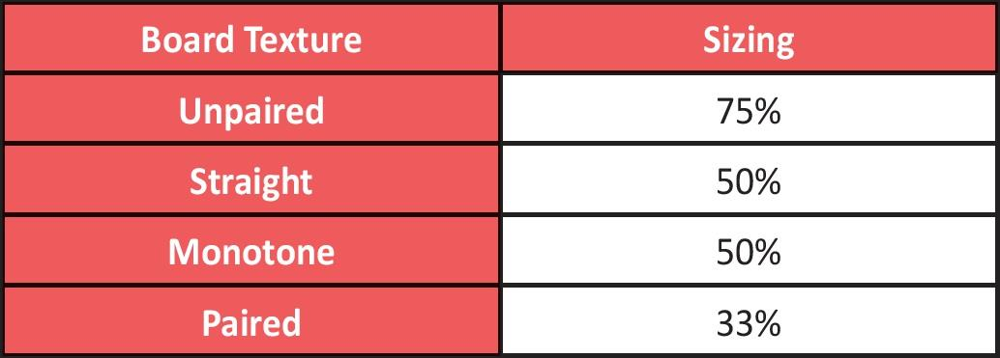

图 22  
单次加注底池的 c-bet 尺度

驱动这些不同下注尺度的主要因素是牌面的动态性。在非常静态的牌面上，你的范围需要较少的保护，因此你可以使用较小的下注尺度。“静态牌面” 指的是在后续街坚果牌不太可能发生大幅变化的情况。

在无对子牌面上，例如 Q♠-J♠-6♥，有许多转牌和河牌会完全改变牌面的动态性和坚果牌。而在对子牌面上，例如 9♥-9♣-3♣，能够改变动态性和坚果牌的转牌和河牌较少。因此，你不需要下注太大，因为你的范围需要较少的保护。

建议的尺度是基线尺度，如果你愿意，可以每次都使用它们。然而，有时使用不同的尺度也是有意义的。例如，如果你的对手或你的筹码深度明显更深或更浅。另一个调整尺度的原因是基于剥削性考虑，如果你认为使用不同的尺度会使你的手牌表现更好。因此，不要觉得必须盲目遵循这些尺度，但它们是一个很好的起点。

### 7.1.3 EV

当你决定是 c-bet 还是过牌时，你应该问自己一个主要问题：“哪个选项的 EV 更高，过牌还是下注？”

增加 c-bet EV 的两个主要因素是：

- **你的摊牌价值**。如果你的手牌具有高权益和坚果性，你可能应该 c-bet 以增加底池大小。
- **阻挡牌**。如果你的手牌有强阻挡牌或未来阻挡牌，你可能也想下注。这是因为你现在或未来的街上有更多的弃牌权益，这将帮助你在转牌圈和河牌圈生成诈唬机会。

在许多情况下，过牌的 EV 会高于下注。那么，哪些因素会降低 c-bet 的 EV 并增加过牌的 EV 呢？以下是一些重要因素：

- 持有对手继续范围的反向阻挡牌。这增加了对手继续的可能性，并降低了你的弃牌权益。
- 大多数中等强度手牌无法从下注中受益，因为它们难以防御过牌加注，并且需要保护你的过牌范围。
- 没有坚果性的手牌无法从扩大底池中受益，因为它们容易被压制并输掉大底池。
- 非常依赖转牌的手牌。这些手牌有一些非常好的转牌，也有一些非常糟糕的转牌。它们受益于免费看到转牌。

### 7.1.4 手牌示例：翻牌圈 J♠-10♦-6♦

**手牌示例 12**  
你在 BTN 持有 A♦-K♥-J♦-10♠（如图 23 所示）。

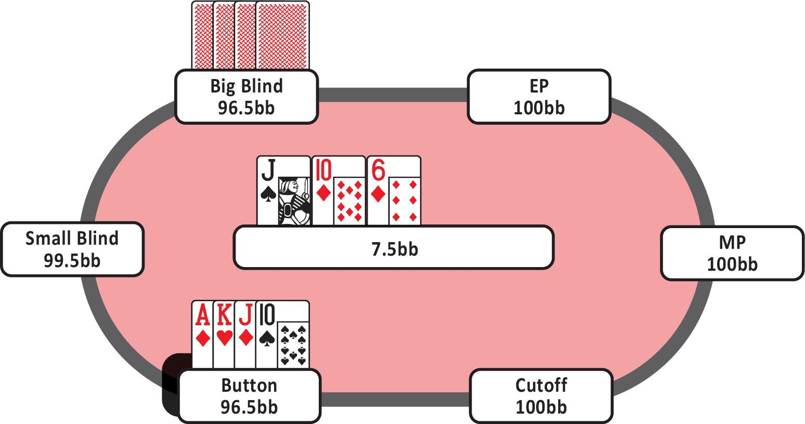

图 23

你持有顶两对、坚果同花听牌以及坚果内嵌顺子听牌。一手具有如此高权益和坚果性的牌几乎总是需要下注。

**手牌示例 13**  
你在 BTN 持有 J♦-9♦-6♥-5♥（如图 24 所示）。

图 24

你持有顶对和底对，没有高牌，且有一个中等同花听牌。这类手牌通常应该选择过牌，因为它们的坚果性较低。当在任何牌面发展中都很难形成坚果牌时，通常不建议通过下注来构建一个大底池。然而，你可以利用这些手牌来保护你的过牌范围，因为它们基本上可以跟注任何转牌。尽管你可以跟注翻牌圈的过牌加注，但在高 SPR 的情况下，实现你在转牌圈和河牌圈的权益会非常困难。这些手牌在后续的街上无法施加太多压力。因此，你并不希望在大多数转牌上构建底池，而通过过牌来保护你的过牌范围是一个更合理的选择。

**手牌示例 14**  
你在 BTN 持有 K♦-K♠-3♠-2♥（如图 25 所示）。

图 25

乍一看，这样的手牌像是一个裸的弱超对。然而，你还有一个后门同花听牌、一个相关的同花听牌阻挡牌以及顺子阻挡牌。这类手牌非常适合进行 c-bet，因为你可以在后续的街上利用关键牌进行连开多条街的诈唬。如果你被过牌加注，你可以轻松弃牌而不会损失太多权益。此外，这手牌通过过牌并不能获得太多价值，因为能够提升其摊牌价值的转牌并不多。因此，最大化 EV 的方式是在翻牌圈下注，希望对手弃牌，或者你在转牌圈击中阻挡牌或提升权益。

**手牌示例 15**  
你在 BTN 持有 A♠-K♦-K♠-5♣（如图 26 所示）。

图 26

这是一个类似的口袋 K 手牌，但你应该选择过牌。你持有中等权益，而这手牌的价值将更多地由转牌决定。你在转牌圈有一些坚果补牌，并且你不希望因为翻牌圈的过牌加注而被逼放弃这些权益。由于你有确定的坚果补牌、多种有利的牌面发展（依赖转牌），以及在面对过牌加注时会有较大的 EV 损失，你应该选择过牌，并计划在转牌圈出现有利牌时继续行动。

### 7.1.5 手牌示例：翻牌圈 A♠-K♦-10♠

**手牌示例 16**  
你在 BTN 持有 Q♠-Q♣-2♥-2♦（如图 27 所示）。

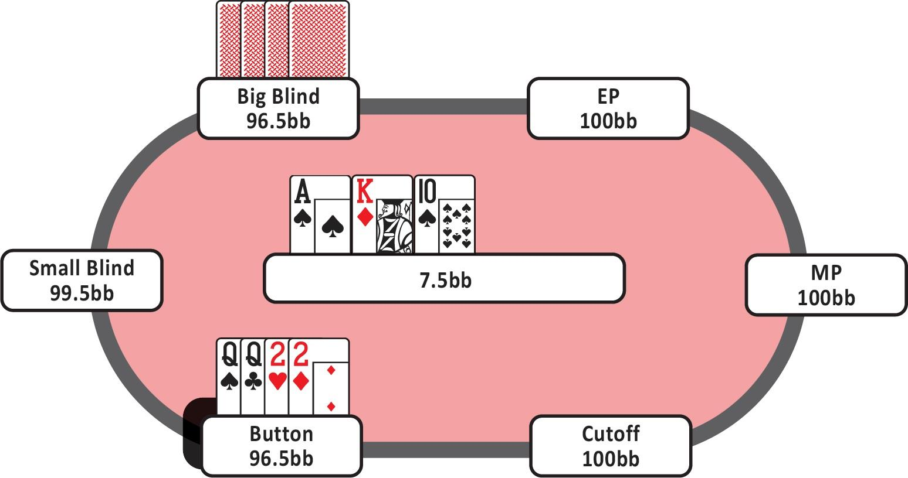

图 27

这手裸的 QQ 没有太多摊牌价值，也没有额外的听牌，因此权益非常低。然而，你确实有很好的同花听牌和顺子阻挡牌。你可以利用这手牌在空白牌上进行连开多条街下注，以代表 Q-J 顺子，或者在黑桃牌上下注，代表同花。因此，你应该用这手牌进行 c-bet。如果你被过牌加注，你可以轻松弃牌而不会损失太多权益。

**手牌示例 17**  
你在 BTN 持有 K♥-Q♥-7♠-6♠（如图 28 所示）。

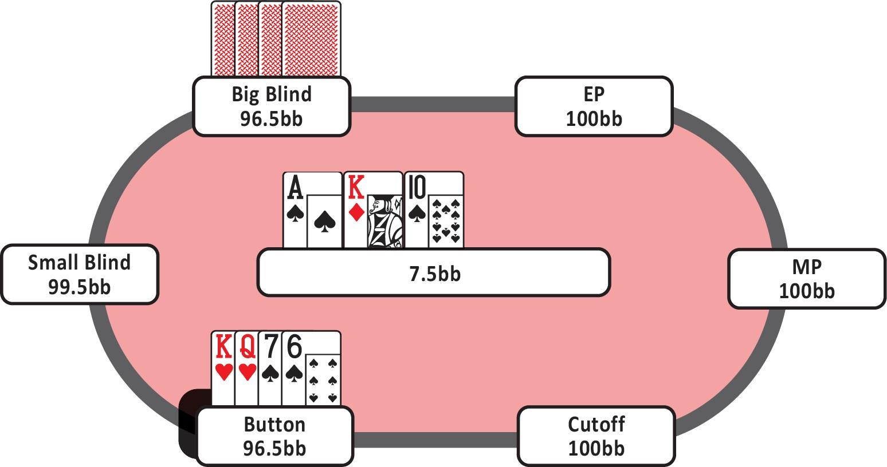

图 28

你持有一手中等对子、一个内嵌顺子听牌和一个弱的同花听牌，这是一个较为复杂的决策。你拥有中等权益但坚果性较低，因此通过扩大底池或被迫弃牌并不能为你带来太多好处。如果你下注，你无法让更好的牌（或具有显著权益的牌）弃牌。由于这手牌有一定的摊牌价值，你可以选择过牌。这也有助于略微保护你的过牌范围，因为你可以在转牌圈跟注对手的下注。

### 7.1.6 主要要点

- 牌面结构极大地影响你的下注频率和下注尺度。有四种主要的翻牌类型，当你在有利位置时，可以使用以下尺度作为基线下注策略：
  - 无对子牌面：75%
  - 顺子牌面：50%
  - 单调牌面：50%
  - 对子牌面：33%
- 这些不同下注尺度的主要驱动因素是坚果牌在后续街上变化的频率。在静态或干燥的翻牌上（如同花牌面或对子牌面），你的范围需要较少的保护，因此你可以下注较小。在动态或湿润的牌面上，坚果牌经常变化，因此你的范围需要更多保护，你应该下注更大。
- 请记住，这些尺度并非一成不变，它们只是指导原则。每种类型中的某些翻牌可能比其他翻牌更静态或更动态。例如，A♠-Q♥-7♣ 相比于 Q♣-J♣-7♥，或者 10♠-9♠-9♥ 相比于 9♠-9♥-2♣。如果你认为在某些情况下偏离标准尺度可以增加你的 EV，那么你应该这样做。
- 在决定是下注还是过牌时，问自己：“哪个行动的 EV 更高，过牌还是下注？”
  - 具有高坚果性和权益的手牌，或具有强（未来）阻挡牌的手牌，通常应该下注。
  - 中等强度的手牌、没有坚果性的手牌，或依赖转牌的手牌，通常应该过牌。
- 总体而言，当你使用极化的 c-bet 策略时，在有利位置的 c-bet 频率应约为 55%。你在某些牌面上会更多地 c-bet，但请记住，过牌一部分手牌是保护你的过牌范围并最大化许多中等强度手牌 EV 的重要部分。过牌并不等于放弃，而是为了管理底池大小以利于自己。

## 7.2 翻牌圈 c_bet 策略（不利位置，CO 对抗 BTN）

### 7.2.1 介绍

在本章中，我们将探讨在单次加注底池中，作为翻牌前的激进者在不利位置进行游戏。我们将通过分析一些相同的牌面，将不利位置的策略与前一章讨论的有利位置策略进行比较。这将帮助你理解位置优势（或劣势）如何影响你的打法。

在以下示例中，假设你从 CO 加注，BTN 跟注，且两个盲注位都弃牌。因此，你现在处于不利位置，且 SPR 较高。

### 7.2.2 下注尺度

在不利位置时，你应该使用的标准下注尺度与有利位置时相同。再次强调，下注尺度是指导原则，并不取决于你所处的位置，而主要取决于牌面的结构（如图 29 所示）。

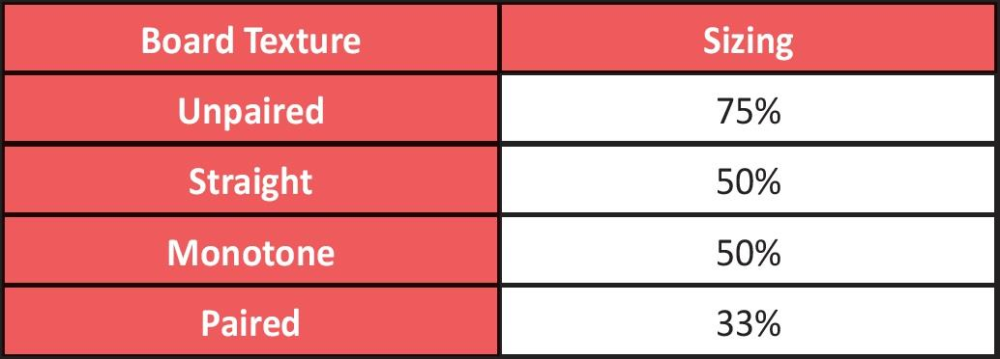

图 29  
单次加注底池的 c-bet尺度

### 7.2.3 c-bet 频率

让我们来看四种不同的牌面，分析在不利位置时，你应该在这些牌面上进行 c-bet 的频率：

- 在 K♠-6♦-5♠ 上，c-bet 频率为 7.5%。
- 在 10♠-8♦-8♣ 上，c-bet 频率为 11%。
- 在 8♠-7♦-6♣ 上，c-bet 频率为 15%。
- 在 9♠-8♠-2♠ 上，c-bet 频率为 12.5%。

你可能会首先注意到，不利位置的玩家进行 c-bet 的频率非常低。让我们回顾一下原因。在单次加注的单挑底池中，高 SPR 会放大不利位置玩家的劣势。通常情况下，你不会拥有显著的权益或极性优势，这意味着 CO 和 BTN 的翻牌前范围在大多数牌面上的权益和极性分布非常接近。

许多玩家高估了他们在 “未封顶的翻牌前范围” 中所拥有的权益优势。他们倾向于认为：“既然 BTN 没有 3-bet，我一定有权益优势。” 然而，在许多牌面上，权益分布接近 50/50，甚至极性分布也大致相当。

因此，由于当前和未来街的位置劣势，不利位置的玩家最终会选择大量过牌。只有当不利位置玩家的翻牌前范围明显强于跟注者的范围，并且牌面结构非常有利时，不利位置的玩家才会以相对较高的频率进行 c-bet。例如，当你在 EP 加注，BTN 跟注，且牌面是 A 高牌时，不利位置的玩家会拥有更大的极性优势，因为他们有更多的顶三条组合，而 BTN 几乎没有。

另一个你在不利位置选择过牌的原因是，你更倾向于用许多非常强的手牌进行过牌加注，而不是 c-bet。就像在许多翻牌前场景中一样，你希望降低 SPR，并在可能的情况下玩两条街的游戏，而不是三条街的游戏。

在考虑翻牌圈 c-bet 频率时，你可能会问：“我们能不能简化策略，直接过牌整个范围？” 虽然你应该过牌大部分手牌，但如果你过牌整个范围，你会错失很多价值。你仍然有一些具有关键阻挡牌的特定手牌应该进行 c-bet，因为与过牌相比，下注的 EV 要高得多。

再次强调，关键在于理解原则。在某些牌面上，下注频率非常低。例如，在 10♠-8♦-8♣ 上，你的 c-bet 频率仅为 11%。然而，在这个范围内，有一些手牌的 c-bet 频率非常高，你应该学习这些模式，以便识别何时应该进行 c-bet。

### 7.2.4 分析

在本节中，我们将讨论强度分组。强度分组是指将具有相似强度或阻挡牌的手牌分为不同的类别或组别。例如，顶三条是一个常见的分组，我们会对其进行研究。我们将手牌分组后，可以比较不同分组之间的差异，进而拆解和分析下注模式，并验证我们对游戏运作方式的假设。

让我们以第一个翻牌圈 K♠-6♦-5♠ 为例。如前所述，你在这个翻牌圈上的 c-bet 非常低。这意味着大多数强度分组的手牌会选择过牌，目的是根据它们的权益和后续街的可玩性，选择过牌 - 跟注或过牌 - 加注的路线。

### 7.2.5 在 K♠-6♦-5♠ 上的顶三条

当你持有三条 K 时，你有 10% 的概率会选择 c-bet，其余 90% 的情况下会选择过牌。当你选择过牌时，大约 40% 的情况下你会选择过牌 - 跟注，60% 的情况下会选择过牌 - 加注。考虑到你持有坚果牌，这个过牌 - 加注的频率相对较低。这是因为牌面仍然有很多听牌的可能性，这通常会增加处于不利位置玩家的劣势，因为牌面可能会出现更多的潜在变化。因此，有时选择过牌 - 跟注而不是过牌 - 加注对你来说会更有利。让我们看一些具体的例子：

**手牌示例 18**  
你处于 CO，持有 A♠-9♠-K♥-K♦（图 30）。

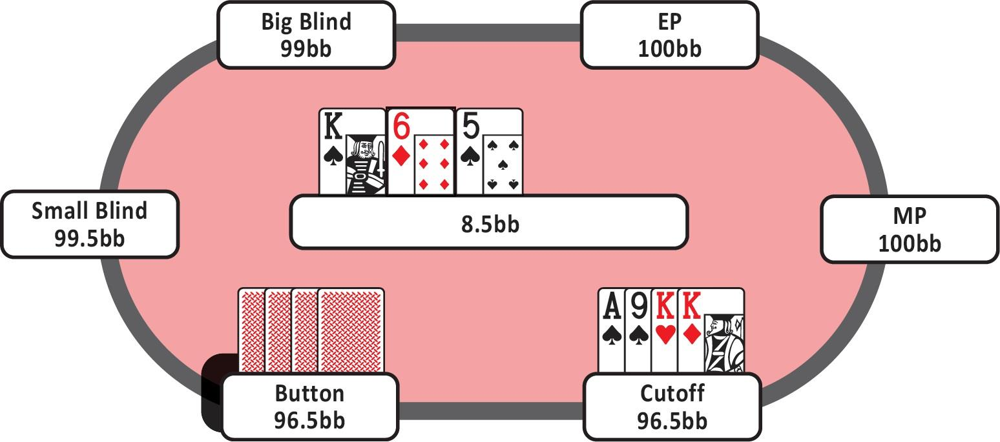

图 30

持有坚果同花听牌和一手强成牌，你有充分的理由去尽可能扩大底池。挑战在于如何找到最佳的行动路线来实现这一目标。理想情况下，你希望进行过牌 - 加注。然而，你必须考虑处于有利位置的对手有多大概率会下注，以及在你采取如此激进的行动后，他们有多大可能继续跟注。由于你阻挡了对手最强的成牌和听牌，你实际上减少了对手最可能进行 c-bet 和继续游戏的手牌范围。因此，在这种情况下，c-be 是更好的选择。

**手牌示例 19**  
你处于 CO，持有 K♥-K♣-J♠-10♠（图 31）。

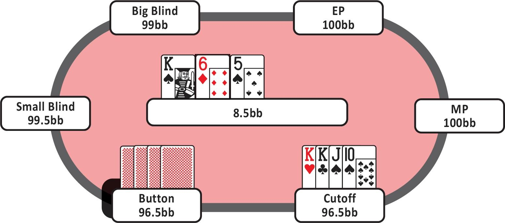

图 10

在这里，你并没有阻挡坚果同花听牌或任何顺子听牌，因此你的对手更有可能拿到像包牌听牌或坚果同花听牌这样的手牌，而这些手牌很可能会选择下注。当你持有这样一手牌时，你应该选择过牌 - 加注。

**手牌示例 20**  
你处于 CO，持有 K♦-K♣-10♦-9♥（图 32）。

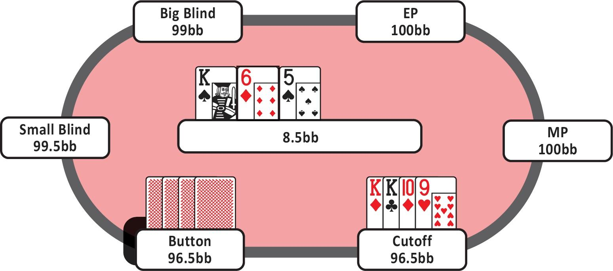

图 32

这手牌的可玩性较低，但你仍然有后门同花听牌和后门顺子的机会。此外，你也没有阻挡黑桃听牌，这些听牌可能会跟注你的下注。这手牌可以选择下注或过牌 - 加注来游戏。

**手牌示例 21**  
你处于 CO，持有 K♣-K♥-2♣-2♥（图 33）。

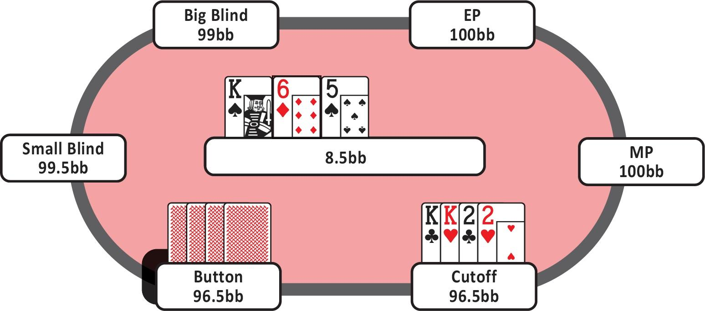

图 33

这手牌在面对翻牌圈跟注并在转牌和河牌圈以高 SPR 进行游戏时，表现会差很多。与之前的手牌不同，你没有任何同花听牌或顺子听牌的可能性。同时，你也没有阻挡对手可能在翻牌圈下注的听牌。因此，这手牌更适合以过牌 - 加注的方式游戏。你最好在翻牌圈将资金投入底池，或者大幅降低 SPR，或者迫使对手放弃他们的权益。

**手牌示例 22**  
你处于 CO，持有 A♥-K♣-K♦-6♠ （图 34）。

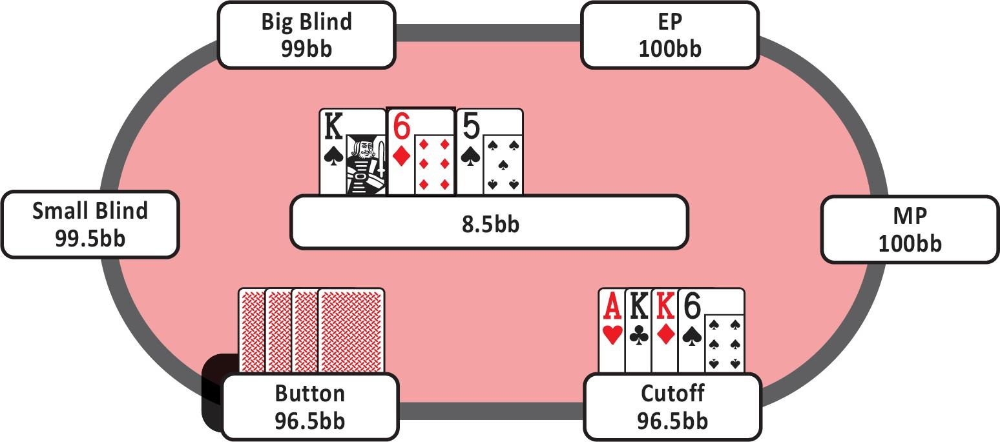

图 34

在这里，你虽然持有顶三条，但后备支持非常差。你没有后门同花听牌或后门顺子听牌，也没有未来的同花阻挡牌。此外，你还阻挡了自己形成葫芦的补牌。与其他手牌组合相比，这手牌在过牌 - 加注时的权益是最低的，同时它的可玩性也不高。因此，这手牌应该归入过牌 - 跟注的范围。

**手牌示例 23**  
你处于 CO，持有 K♦-K♣-4♦-3♣（图 35）。

图 35

在这里，你持有顶三条、一个两端顺子听牌和一个后门同花听牌。同时，你没有阻挡 7-8-9 的顺子听牌，也没有阻挡黑桃。鉴于这手牌在转牌圈有不错的可玩性，并且没有阻挡对手在翻牌圈的范围，这是一个非常适合过牌 - 加注的手牌。

当你持有像顶三条这样非常强的手牌时，你通常会倾向于过牌 - 加注。然而，你需要始终考虑对手的侵略性水平，以及他们实际在翻牌圈下注的频率。有些玩家在翻牌圈被过牌时，并不会像 GTO 建议的那样激进地下注，尤其是当他们并非翻牌前的加注者时。如果是这种情况，你可能需要将一些手牌转向 c-bet 策略，因为你不太可能成功实现过牌 - 加注。

不过，前面讨论的原则仍然非常重要。你需要考虑手牌的可玩性、阻挡牌，以及对手是否持有强牌并愿意下注，从而增加你成功过牌 - 加注的概率。

### 7.2.6  在 K♠-6♦-5♠ 上的顺子听牌与同花听牌

这个分组主要包括那些在翻牌圈没有任何摊牌价值的组合听牌。在这里，你最需要问自己的问题是：

- 我的手牌是否强到可以过牌 - 加注？
- 我在推动多少权益？
- 我的手牌有多少可玩性？

这个强度分组的 c-bet 整体频率同样非常低，大约为 15%。你大约 75% 的情况下会选择过牌 - 跟注，20% 的情况下会选择过牌 - 加注。

**手牌示例 24**  
你处于 CO，持有 A♥-J♠-4♥-3♠（图 36）。

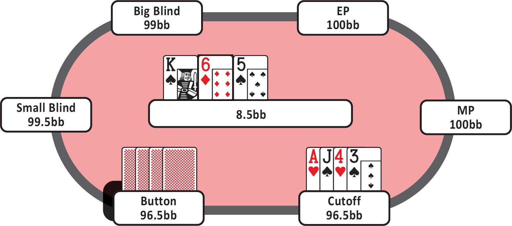

图 36

你持有底端的两端顺子听牌和一个 J 高同花听牌。这手牌可以被归类为中等强度的手牌，但不足以强到进行过牌 - 加注。你也不希望下注，因为这手牌的坚果性不强，且在翻牌圈面对加注时表现不佳。此时扩大底池并不是一个好的结果，因此你更倾向于过牌 - 跟注。

**手牌示例 25**  
你处于 CO，持有 7♦-5♦-4♠-3♠（图 37）。

图 37

在这个场景中，你有一个底对、一个非坚果包牌听牌、一个弱同花听牌和一个后门同花听牌。这种手牌在下注时通常会显得非常尴尬。这手牌没有太多坚果性的发展空间，而在高 SPR 的情况下，这会使你在河牌圈陷入许多困难的抓诈唬局面。话虽如此，你对大多数对手的手牌范围都有很高的权益。你可以选择过牌，并计划过牌 - 加注，以获得弃牌权益或降低 SPR，从而使你在转牌和河牌圈的决定更加轻松。此外，通过在过牌 - 加注后击中低牌，你还能增加覆盖范围。

**手牌示例 26**  
你处于 CO，持有 Q♠-J♦-8♠-7♦（图 38）。

图 38

这是一手非常有趣的手牌，因为你持有一个 Q 高同花听牌、一个两端顺子听牌和一个后门同花听牌。这手牌有很高的可玩性，但目前没有任何摊牌价值。由于可玩性很高，这手牌可以跟注翻牌圈的加注，但它不足以强到进行过牌 - 加注，因为当面对像顶三条或坚果同花听牌这样的手牌时，它的表现并不理想。这手牌足够强到可以进行 c-bet 并尝试直接赢下底池，但不足以强到过牌 - 加注并冒险撞上对手范围中的顶端牌力。

正如你所看到的，这些手牌虽然差异很大，但需要问的主要问题始终是：

- 你的手牌是否强到可以过牌 - 加注？
- 当你下注时，你的手牌有多少可玩性？
- 在转牌圈，你的手牌是否有很高的可玩性？

### 7.2.7 在 K♠-6♦-5♠ 上持有 A♠ 的 AA（坚果同花听牌阻挡牌）

这个类别的手牌既有坚果同花听牌阻挡牌，也有以口袋 AA 形式存在的摊牌价值。

在这种情况下，最相关的两个问题是：

- 你的手牌是否强到可以过牌 - 跟注？
- 你应该下注吗？
- 你持有多少阻挡牌？

在大多数情况下，你可以用这个强度分组的手牌选择过牌 - 跟注。你有摊牌价值，能够击败顺子听牌和一些顶对手牌。你还拥有一个强大的未来坚果同花阻挡牌，这将在黑桃发出时帮助你赢下底池，尤其是当你决定将手牌转为诈唬时。

**手牌示例 27**  
你处于 CO，持有 A♠-A♦-8♦-7♦（图 39）。

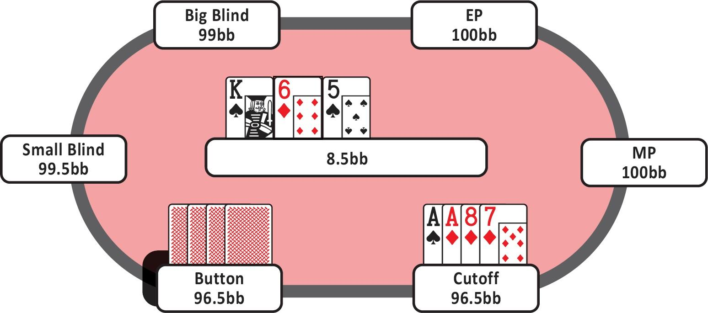

图 39

这手牌不足以强到在面对像顶三条这样的手牌时将所有资金投入底池。然而，你的对手会用许多你占优的手牌来跟注，比如顺子听牌、同花听牌以及 K-x（带 K 的手牌），这些手牌通常会被对手用来跟注，而你对这些手牌有很好的权益。你可以通过摊牌时持有更好的手牌，或者利用你的坚果同花听牌阻挡牌来击败这些手牌。这手牌不足以强到进行过牌 - 加注，因为你没有阻挡 K，这意味着如果你将所有资金投入底池，通常会面对顶三条，并在权益上处于明显劣势。然而，你的手牌在这里足够强，特别是因为有后门同花听牌，可以选择下注并扩大底池。

**手牌示例 28**  
你处于 CO，持有 A♠-A♦-Q♦-J♣（图 40）。

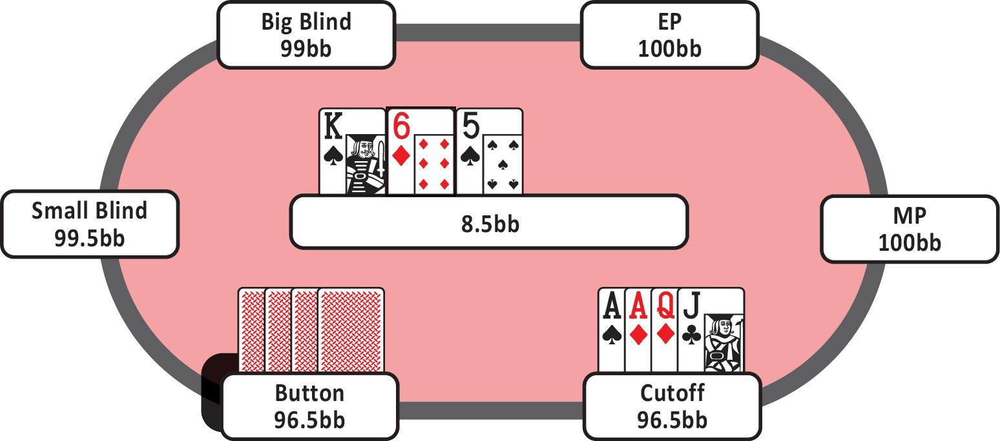

图 40

在这手牌中，你没有持有任何相关的阻挡牌，也没有一手强成牌，因此过牌 - 加注并不是一个好的选择。下注也不太有利，因为你不想被加注，从而失去你的后门同花听牌权益、组成三条的两张补牌，以及在黑桃发出时诈唬对手的机会。因此，你只需要选择过牌 - 跟注。

### 7.2.8 结论

再次强调，以下是你在四种不同牌面上处于不利位置时的 c-bet 频率概览（图 41）。

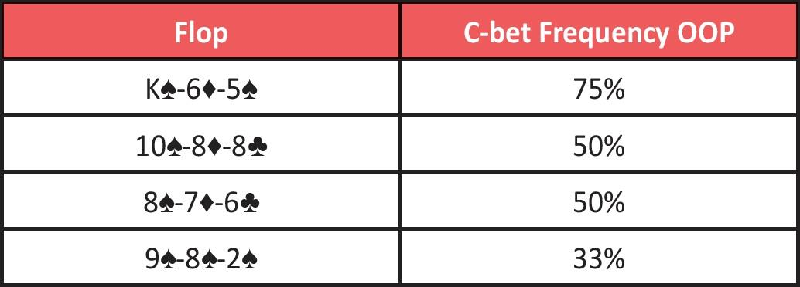

图 41

重要的是要认识到，正确的玩法在于提出正确的问题，而不一定是要记住如何玩所有单独的手牌组合。更重要的是理解某些类型的手牌，基于牌面结构和阻挡效应，最可能倾向于 c-bet、过牌 - 跟注还是过牌 - 加注。关键在于学习驱动这些行动的原则，因为这些原则是适用于许多不同牌面结构的通用标准。

### 7.2.9 主要要点

- 处于不利位置的玩家应该非常少下注，原因如下：
  - 位置劣势。
  - 高 SPR 促使你在不利位置更加谨慎。
  - 权益和极化性非常接近。
- 在不利位置游戏时，你使用与有利位置相同的标准下注尺寸。这些下注尺寸主要由牌面结构决定。牌面越湿润和动态，你使用的下注尺寸就越大。
- 在考虑采取什么行动时，思考以下问题：
  - 你有多大可能面对有利位置玩家的下注？
  - 你的手牌有多少可玩性？
  - 你持有哪些阻挡牌？

## 7.3 单次加注底池中有利位置的转牌策略

### 7.3.1 介绍

在本节中，我们将讨论在单次加注底池中，作为有利位置玩家在翻牌圈进行 c-bet 并被跟注后的转牌策略。这意味着我们将探讨何时应该进行两枪下注，以及何时应该选择过牌。

首先需要理解的原则是，你的翻牌前和翻牌圈的范围会极大地影响你的转牌范围。如果你的翻牌圈范围构建不理想，那么在转牌和河牌圈试图保持价值下注和诈唬的平衡时，你必然会遇到问题。因此，首先掌握翻牌前范围至关重要。接下来，你应该专注于翻牌圈范围的构建。确保你理解适用于翻牌圈的原则，并知道为什么将某些手牌纳入你的下注范围或过牌范围，因为最终这将极大地影响你的整体游戏计划。

在解决了翻牌前和翻牌圈策略后，我们现在可以讨论转牌策略了。在本章中，我们将首先讨论如何构建一个平衡的转牌策略的一些通用原则，然后分析不同的转牌过渡情况。这将帮助你培养一种直觉，了解哪些类型的手牌最适合哪种范围。

请注意，本节中的所有手牌都将考虑 BTN 对抗 BB 的情况。

### 7.3.2 转牌过渡

我们将讨论之前使用的 K♠-6♦-5♠ 翻牌圈，并考虑转牌可能的过渡情况。首先，我们需要定义四种不同类型的转牌过渡，因为不同的转牌在下注频率和下注尺寸方面需要不同的策略。

- **同花牌**：发出第三张同花色的牌，使得同花成为可能。
- **大牌空白牌**：指百老汇牌。
- **顺子完成牌**：在上述例子中（K-6-5），这可能是 2、3、4、7、8 或 9。
- **对子牌**：在这种情况下，可能是 K、6 或 5。

在 K♠-6♦-5♠ 翻牌圈后，所有可能的转牌的平均 c-bet 频率约为 44%。这可能会让许多人感到惊讶，因为许多玩家倾向于采用下注 - 下注策略。这意味着他们在翻牌圈进行 c-bet 后，会以非常高的频率进行两枪下注。这种策略的问题在于，当你在转牌圈选择过牌时，你最终会在河牌圈弃掉很多手牌，因为你的转牌过牌范围中没有太多手牌愿意在河牌圈抓诈唬。大多数玩家玩得过于保守，他们更倾向于在转牌圈进行两枪下注以获取薄价值，而不是在转牌圈过牌以便在河牌圈跟注。这种方法可能会导致一些明显的问题，主要问题是许多玩家在河牌圈时会陷入一个巨大的底池，手中却持有太多无法跟注河牌下注的弱牌。

### 7.3.3 下注尺寸

在翻牌圈下注并不总是意味着你的范围是极化的。下注可能暗示一个广泛的范围，包括一些诈唬牌、一些价值牌，甚至一些中等强度的牌。然而，在转牌圈，情况发生了变化主要是因为许多听牌现在权益减少，因为只剩下最后一张牌未发出。此外，你的对手已经表明他们持有一些有价值的手牌。同时，你的对手在翻牌圈没有加注，这意味着他们的价值牌范围是受限的。

如果你在转牌圈进行两枪下注，你代表的手牌可以击败这个受限的范围，这意味着你开始使用更大的下注尺寸，因此你通常会选择底池下注。底池下注或半池下注比下注 75% 底池更为可行。75% 底池的下注在转牌圈对你没有太大帮助。你可能会选择半池下注，因为牌面相对静态，但一般来说，许多转牌策略应该包括底池下注。

通过下注，你向对手传达的信息是：“你有一些牌，因为你跟注了翻牌圈，但我更强，而且我强到足以进行底池下注。” 这是针对受限范围的极化策略的核心。75% 底池的下注不会像全底池下注那样极化你的范围，因此应该很少使用。

需要注意的是，在以下示例中，我们假设翻牌圈进行了 75% 底池的下注（5.6 bb），并且被跟注。

### 7.3.4 在大牌空白牌上的转牌策略

假设转牌是 A♣，一张大牌空白牌。现在的牌面是（K♠-6♦-5♠）-A♣。

这张转牌对你作为有利位置玩家是有利的，因为当你翻牌圈持有强牌时（例如两对或三条），你通常仍然会持有最好的牌。你还可以转出一些对手在这个转牌上不太可能持有的强牌，例如坚果同花听牌、A-K 或 A-A。你的对手通常会在翻牌前对这些手牌进行 3-bet，或者在翻牌圈用其中一些组合进行过牌 - 加注，这使得这些手牌不太可能仍然在他们的转牌范围中。

现在我们将研究一些不那么直接的手牌强度分组。例如，在这个牌面上，三条是非常直接的，你应该总是下注。你可以调整下注尺寸，但下注频率并没有太多值得讨论的地方。然而，对于更复杂的手牌情况则不同。

**没有同花听牌的顶对**  
一个更复杂的强度分组是没有同花听牌的顶对。除了三条之外，这是你最频繁进行两枪下注的强度分组，即使你只持有一对。

当你考虑翻牌圈策略时，可以合理地假设你持有一个顶对，并且有一些额外的阻挡牌或权益。否则，你不会在翻牌圈下注。

**手牌示例 29**  
例如，持有 A♠-Q♦-8♦-7♥，你会在 K♠-6♦-5♠ 翻牌圈下注，因为你有两端顺子听牌、后门同花听牌，最重要的是 A♠（图 42）。

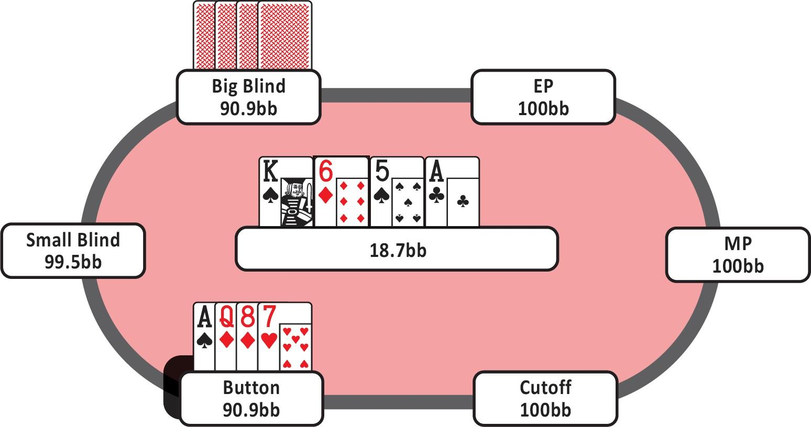

图 42

现在你将用这手牌在转牌圈进行两枪下注。这看起来可能有点反直觉，但你会使用一种混合策略。这是因为你有很好的阻挡牌，并且有额外的权益，这可能会让对手弃掉像黑桃组合这样的手牌，并鼓励他们用更弱且落后的组合跟注。当你持有这手特定牌时，你在转牌圈很少会被加注，因为你阻挡了 A-K 以及坚果同花听牌和顶对的组合。

**手牌示例 30**  
另一个例子是 A♥-7♥-7♦-2♦ （图 43）。

图 43

在这里你选择下注，因为当对手弃掉像弱同花听牌或带一些补牌的对子时，你会受益。同时，你也在保护自己不被对手在河牌圈诈唬。需要注意的是，A♥-7♥-7♦-2♦ 在转牌圈选择过牌后，面对河牌圈的下注时并没有一个很好的游戏计划。这手牌不适合在河牌圈抓诈唬，因此你更适合进行两枪下注。A-x-x-x 是你最好的两枪下注手牌之一，因为你阻挡了对手在转牌圈的过牌 - 加注范围。因此，A♥-7♥-7♦-2♦ 将被用作两枪下注，同时你也有潜力利用顺子阻挡牌进行三次下注诈唬。

**手牌示例 31**  
最后，A♦-Q♦-3♠-3♥ 也是一手你应该选择在翻牌圈下注的牌，因为它在翻牌圈过牌后的 EV 非常低（图 44）。

图 44

在转牌圈，你有一个相当好的阻挡牌，同时这手牌在转牌圈选择过牌后也没有一个很好的游戏计划，因为你无法在河牌圈进行太多抓诈唬。因此，你将选择两枪下注，试图让对手弃掉他们的权益，并避免他们可能在河牌圈成功的诈唬，因为你无法在河牌圈进行太多英雄式跟注。

### 7.3.5 带同花听牌的两对

在这个分组中，你持有许多强牌，但你并不希望对所有手牌都下注，原因有两个。首先，你可能会被过牌 - 加注，这会让你感到不舒服，因为通常在 “成牌价值” 方面你会远远落后，但你还有一个同花听牌。一般来说，如果你遇到像三条这样选择（延迟）转牌过牌 - 加注的手牌，或者像 A-K 这样的手牌，你的同花听牌并没有太多权益。其次，你持有的手牌也不太可能让对手弃牌，因为你已经阻挡了同花听牌，因此对手更可能持有一个好的抓诈唬牌。

**手牌示例 32**  
手牌 K♥-10♠-7♠-6♥ 在转牌圈有很高的弃牌权益，尤其是当你考虑到对手可能继续游戏的手牌范围时（图 45）。

图 45

此时，对手并没有太多比你更弱的手牌，而他会弃掉很多对子和同花听牌类型的手牌。因此，这是一个非常适合选择转牌圈随后过牌的候选手牌，以避免在你落后或面对过牌 - 加注时扩大底池。你可以轻松地用 K♥-10♠-7♠-6♥ 在河牌圈抓诈唬，因此你应该将这手牌归入你的 “转牌圈随后过牌，河牌圈跟注” 范围。当然，你不会在每一条河牌圈都跟注，但你会经常选择跟注。

### 7.3.6 带或不带同花听牌的顶对

如果你持有像底两对加同花听牌，或者在 K♠-6♦-5♠-A♣ 牌面上持有 K-5 加弱同花听牌的手牌，你应该直观地理解，许多手牌更适合选择转牌圈随后过牌，河牌圈跟注的路线，而不是进行底池下注。

让我们看一些例子：

**手牌示例 33**  
你处于 BTN，持有 A♠-8♣-8♠-4♠（图 46）。

图 46

这手牌在转牌圈进行两枪下注时，并不会推动太多权益。你阻挡了那些落后的听牌，因此你的对手通常会持有更好的成牌。有时你还可能面对来自 K-K 或 A-K 的转牌圈过牌 - 加注。然而，你持有的这手牌适合选择免费看牌，观察河牌圈的发展。

**手牌示例 34**  
你处于 BTN，持有 A♠-J♥-J♠-2♠（图 47）。

图 47

这手牌在翻牌圈选择下注，因为持有有三张黑桃，过牌的 EV 并不高，而且这手牌在抓诈唬方面的可实现性较低。在转牌圈，你不会选择两枪下注。你没有阻挡太多仍然领先于你的手牌，同时你可以非常高效地在河牌圈抓诈唬。

**手牌示例 35**  
你处于 BTN，持有 K♦-J♦-10♥-6♥（图 48）。

图 48

你持有一个裸两对，在翻牌圈有一定的潜力，同时还有一个后门同花听牌。然而，在转牌圈发出 A♣ 时，你应该选择随后过牌，并在某些河牌圈抓诈唬。

**剥削性建议**  
当你面对一个非常被动的玩家时，可以随意用这些手牌中的一部分进行两枪下注。你也可以选择一个不那么极化的游戏计划，并使用较小的下注尺寸。这会鼓励你的被动型、“跟注站” 类型的对手跟注一个小额下注，而不是你选择抓诈唬的路线。许多通过过牌这些手牌获得的价值，来自于对手在河牌圈的下注。并非所有对手都会在河牌圈激进地诈唬，如果是这种情况，有时你更适合用这些手牌中的一部分进行两枪下注。在面对被动对手时，简化你的策略，使用 66% 底池下注并采用更混合的范围可能是合理的。

### 7.3.7 没有摊牌价值的听牌

这个分组包括许多弱牌，例如没有摊牌价值的两端顺子听牌以及任何同花听牌。这些手牌中的大多数会选择过牌。但我们也会用其中一些手牌下注，并且我们需要考虑未来的阻挡牌。我们需要思考转牌的价值，或者我们是否能够跟注一个过牌 - 加注。

对于没有摊牌价值的同花听牌，情况也是如此。通常，当你有不错的权益以及坚果补牌时，如果你无法跟注过牌 - 加注，你就不希望下注。否则，你肯定会损失潜在的权益。最后，我们还有内听顺子和空气牌。在这里，你可以对某些手牌采取更激进的策略，因为在被过牌 - 加注后弃牌时，你并不会损失太多权益，因为你并没有放弃太多权益。

**手牌示例 36**  
一个可以用来进行两枪下注的手牌例子是 9♦-8♣-7♦-6♣（图 49）。

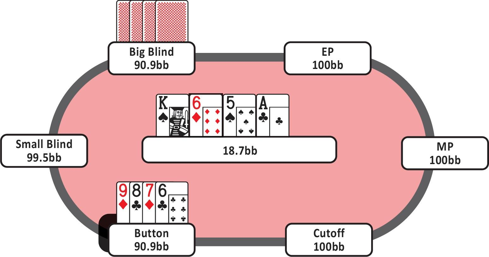

图 49

这是一个典型的例子，因为你有一个对子阻挡牌，这将减少你在转牌圈被跟注或过牌 - 加注的次数，例如被 6-6 加注。你还有坚果补牌，甚至有一手可以潜在跟注过牌 - 加注的牌，因为你仍然有一个包牌听牌。同时，你的摊牌价值非常低。如果你能让像 K-x-x-x 这样的手牌在转牌圈甚至河牌圈弃牌，那么你将受益匪浅。

**手牌示例 37**  
另一个例子是 5♥-4♠-3♠-2♥（图 50）。

图 50

这手牌的摊牌价值非常低，但它可以在转牌圈跟注一个过牌 - 加注。因此，在这里，你不会让对手轻易地迫使你放弃大量权益，即使他们选择过牌 - 加注。通常，对于这些类型的组合听牌，拥有一个对子阻挡牌非常重要。拥有这样的阻挡牌会降低对手持有两对或三条的概率，从而增加你的弃牌权益，并减少被加注的机会。

**手牌示例 38**  
最后，让我们考虑手牌 Q♦-10♣-7♣-6♦（图 51）。

图 51

你有一个对子阻挡牌、一个内听顺子，同时也是一个相当合理的手牌，可以在我们错过河牌时进行诈唬。这是因为我们完全没有黑桃，这意味着对手可能很容易持有一个同花听牌，而我们可以让他们弃牌。另一方面，可能会有一些有价值的河牌圈，你可以选择过牌，击中三条、两对或顺子。在这种情况下，除非河牌是黑桃，否则你会选择下注。这也是一个适合进行两枪下注的候选手牌。

### 7.3.8 在 K♠-6♦-5♠-9♣ 上的转牌策略

**介绍**  
现在我们将考虑另一个转牌，9♣。这张牌引入了可能的顺子 7-8。虽然顺子现在成为可能，但仍然有许多顺子听牌存在，并且新的顺子听牌（Q-10、J-10、Q-J）也被引入。许多组合听牌仍然对当前的坚果牌有一定的权益。

当牌面上有顺子时，你应该尝试从对手可能持有的听牌中获取最大价值。因此，你应该下注，最好使用底池下注。如果你持有三条，你会更有选择性地下注。你试图通过持有顺子阻挡牌或额外的同花听牌或顺子听牌来减少被过牌 - 加注的概率，因为当你被加注时，这些额外的听牌可以使你的跟注更有利可图。如果你持有一个没有任何后备支持的裸三条，你通常会选择过牌。这是为了控制底池，因为你没有太多适合价值下注的河牌，当然，你也不希望被过牌 - 加注。

在这里，两对将作为抓诈唬牌，你会选择过牌，试图进入摊牌。对于你的顶对和超对也是如此。你唯一会下注这些手牌的情况是，当你持有额外的顺子听牌或同花听牌时，拥有显著的额外权益。当你持有没有摊牌价值的同花听牌时，你会尝试下注那些不需要下注 - 弃牌的手牌。因此，你会考虑加入一些顺子听牌，以便在被过牌 - 加注时能够跟注。当你只有一个同花听牌时，你有一些补牌，但不足以跟注过牌 - 加注，因此你通常更适合选择免费看牌。

当你持有一个没有同花听牌或显著对子的裸顺子听牌时，你会选择性地下注。你应该多考虑即时阻挡牌和未来阻挡牌，以便在转牌圈进行有利可图的两枪下注，并能够在河牌圈继续下注。

最后，让我们考虑持有裸顺子阻挡牌的手牌，例如 7-7 和 8-8 。如果没有摊牌价值或额外的听牌，这些手牌几乎会以 100% 的频率下注，使用底池下注尺寸来最大化弃牌权益。在建立了这个概述后，我们现在将讨论第一个感兴趣的强度分组，即三条。

**三条**  
在这个完成顺子的转牌上，三条并不会以 100% 的频率进行两枪下注。你应该有大约 35% 的情况下选择过牌，30% 的情况下使用 66% 底池下注，35% 的情况下使用底池下注。我们现在将考虑一些不会进行两枪下注而是选择过牌的三条示例。

**手牌示例 39**  
你处于 BTN，持有 K♥-K♣-9♥-3♦（图 52）。

图 52

这手牌并没有阻挡可能的顺子，因为你没有 7 或 8，而且你持有 9，这实际上阻挡了你自己的补牌，降低了你在河牌圈提升牌力的机会。你也没有任何黑桃，因此你并没有太多可以在河牌圈进行价值下注的好机会。因此，你最好保持底池较小，并在许多河牌圈将你的手牌用作抓诈唬的工具。

**手牌示例 40**  
你在 BTN 持有 6♠-6♥-4♣-4♥（图 53）。

图 53

这里，你持有一个低三条，没有额外的权益或相关的（顺子）阻挡牌。因此，你最好选择过牌。你偶尔也可能会遇到一个 K-K-x-x 的手牌，对方可能选择延迟转牌圈的过牌加注。如果你在转牌圈下注并遭遇过牌加注，通常你会处于一个非常糟糕的局面，面对顶三条、顺子，或者最好的情况下，你面对的是强组合听牌。

**手牌示例 41**  
你在 BTN 持有 A♥-5♥-5♦-2♦（图 54）。

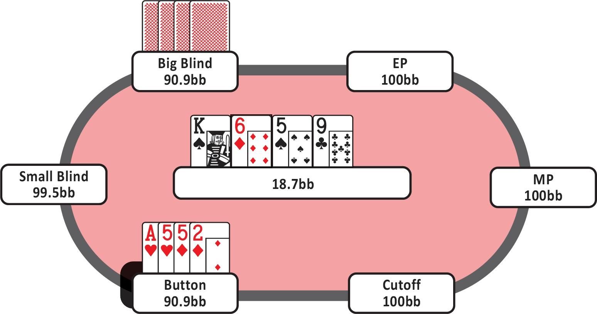

图 54

你持有一个底三条，并且在转牌圈没有提升牌力。实际上，你的权益反而下降了。你没有额外的顺子听牌、同花听牌，也没有任何阻挡牌。因此，你应该选择过牌并控制底池大小。

**两对 / 顶对或超对**  
这些手牌需要非常有选择性地下注，通常只有在它们有额外权益并且能够应对过牌加注时才会下注。以下是一些示例：

**手牌示例 42**  
你在 BTN 持有 K♦-Q♦-J♠-6♠（图 55）。

图 55

你持有两对、一个卡顺听牌和一个同花听牌。这是一手非常强的手牌，自然可以继续作为两枪下注来扩大底池。

**手牌示例 43**  
你在 BTN 持有 9♦-7♠-6♠-5♦（图 56）。

图 56

你持有两对、一个卡顺听牌、一个同花听牌以及一个顺子阻挡牌。这手牌可以在面对加注时继续行动，并且由于牌张排除效应，这手牌本身也减少了被加注的可能性。

**手牌示例 44**  
你在 BTN 持有 K♦-10♦-9♥-6♥（图 57）。

在这里，你在转牌圈组成了两对，并且还持有一张 6，这为你提供了更多的葫芦补牌。你的手牌中没有黑桃，这使得你更有可能下注以向同花听牌收取价值。在这三手牌中，这是唯一一手不能在转牌圈面对过牌加注时跟注，但仍然愿意下注的手牌。

**没有摊牌价值的同花听牌和纯顺子听牌**  
在这里，你需要再次非常谨慎地选择。你能在面对过牌加注时跟注吗？你是否有某些有利的河牌？或者你是否会因为冒险面对过牌加注而被迫放弃，从而牺牲权益？

**手牌示例 45**  
你在 BTN 持有 Q♦-J♦-10♠-9♠（图 58）。

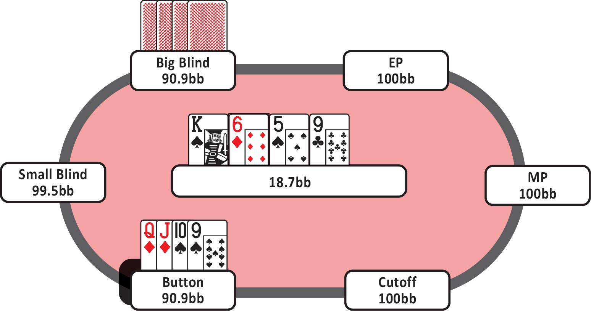

图 58

这手牌可以进行两枪下注，因为你很容易在面对过牌加注时跟注。你有一个内听顺子听牌和一个同花听牌。虽然目前你没有太多摊牌价值，但你完全可以通过下注来扩大底池，以便在击中牌时获得支付。通过下注，你还可以让一些边缘的两对牌弃牌，甚至让一些更弱的手牌继续跟注，比如坚果同花听牌。

**手牌示例 46**  
你在 BTN 持有 A♠-4♥-3♥-2♠（图 59）。

图 59

这手牌没有摊牌价值，但你可以进行两枪下注，因为你有一些在河牌圈可能成为坚果牌的补牌。这是一个不愿意在面对过牌加注时跟注的组合，但在面对跟注范围时，仍然有许多坚果补牌。

**手牌示例 47**  
你在 BTN 持有 10♠-10♥-7♥-6♣（图 60）。

图 60

用这手牌，你在翻牌圈下注，因为你有一些未来的阻挡牌，并且通过持有 6♣ 和 10♠，你也阻挡了翻牌圈的一些强牌。在转牌圈，你有一个卡顺听牌、一个顺子阻挡牌，但摊牌价值很低。然而，你也有一些河牌圈的阻挡牌，可以用于后续的三枪下注。因此，这手牌在转牌圈也会进行双枪下注。它不能在面对过牌加注时跟注，但你仍然会选择进行两枪下注。

## 7.4 回顾训练环节

我们现在将再次回顾 K♠-6♦-5♠ 的翻牌圈，总结你应该如何处理一些特定的手牌，然后我们可以看看如何成功地将翻牌圈和转牌圈的策略结合起来。

### 7.4.1 K♠-6♦-5♠ 翻牌圈的决策

**手牌示例 48**  
你在 BTN 持有 K♥-Q♠-J♥-9♠（图 61）。

图 61

你持有第二坚果同花听牌、顶对以及一个顺子阻挡牌。你会在有位置的情况下选择下注 75% 底池进行 c-bet，还是选择过牌？

这手牌应该进行 c-bet。因为你可以从更弱的手牌那里获得很多价值，比如更弱的同花听牌、顺子听牌以及更弱的对子。你愿意在击中两对、三条或同花时扩大底池。

**手牌示例 49**  
你在 BTN 持有 A♠-J♦-10♥-2♥（图 62）。

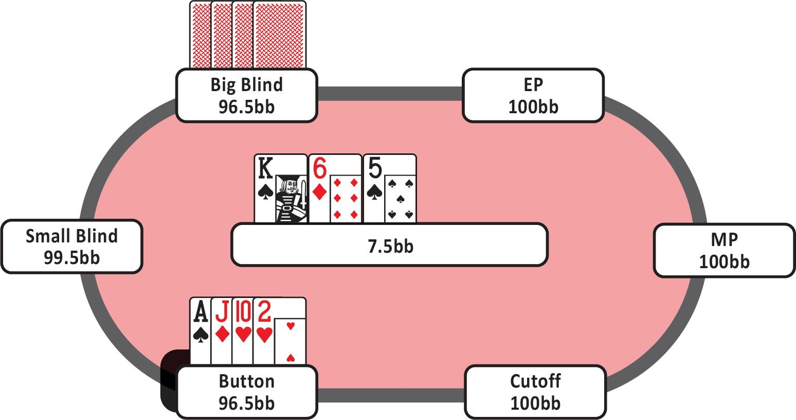

图 62

这里你没有摊牌价值或听牌，但你持有 A♠。你会怎么做？

用这手牌，你也会选择 c-bet。如果你被过牌加注，弃牌并不会损失任何权益。你愿意在击中黑桃时扩大底池，以便施加压力并平衡你的两枪和三枪下注策略。

**手牌示例 50**  
你在 BTN 持有 10♥-10♣-5♥-5♣（图 63）。

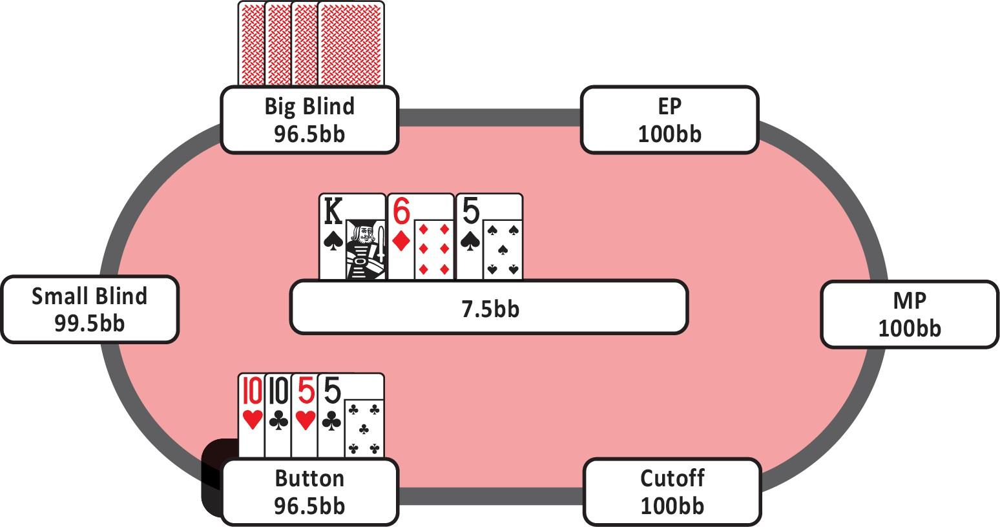

图 63

底三条。这是选择 c-bet 还是过牌？

这里最好选择过牌，因为这手牌属于中等强度。完全没有补牌的底三条是少数你应该选择过牌的三条之一。通常，当你持有更高的三条或任何重要的补牌时，你会选择 c-bet 以扩大底池。

**手牌示例 51**  
你在 BTN 持有 A♣-A♥-K♣-K♦（图 64）。

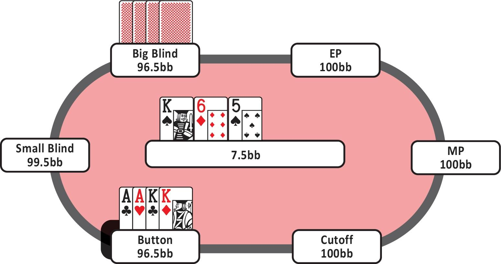

图 64

你持有顶三条，但没有顺子听牌。这是选择 c-bet 还是过牌？

我们肯定会选择用这手牌下注。顶三条是一手非常强的手牌；它可以清空中三条、底三条或两对。因此，我们在有位置的情况下几乎总是会用顶三条下注。

### 7.4.2 转牌圈决策（K♠-6♦-5♠）-2♣

转牌是 2♣，使牌面变为（K♠-6♦-5♠）-2♣，这可以被视为一张轻微的空白牌。它引入了一个顺子的可能性，但由于翻牌前的范围以及 BB 玩家 “不应该” 防守太多 4-3 组合，顺子的可能性仍然很低。我们现在将看看之前讨论的一些手牌在这个转牌圈的表现。

**手牌示例 52**  
你在 BTN 持有 K♥-Q♠-J♥-9♠（图 65）。

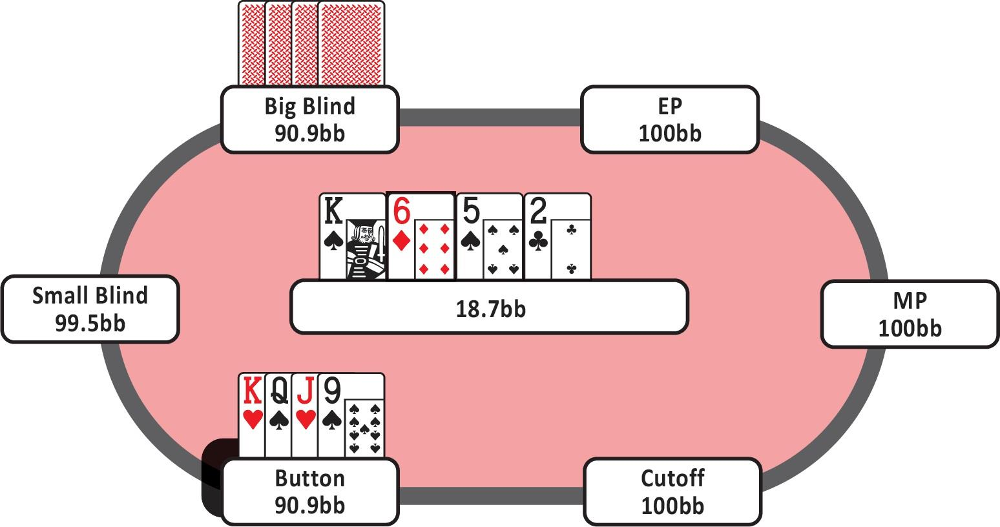

图 65

你会选择进行两枪下注，还是选择免费看河牌？

这手牌会选择过牌。你没有阻挡顺子，也没有持有强价值手牌，因此你应该乐意免费看河牌。

**手牌示例 53**  
你在 BTN 持有 A♠-J♦-10♥-2♥（图 66）。在翻牌圈下注后，现在击中了 2♥，你应该在转牌圈怎么做？

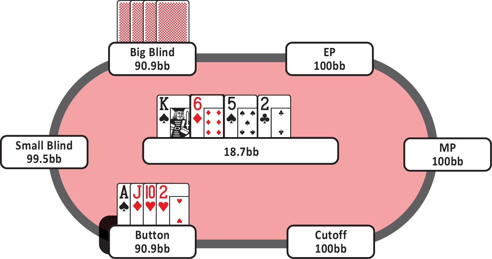

图 66

在这里，你没有什么可损失的，应该选择一个满池下注，以对对手施加最大压力。你有未来的阻挡牌，并且击中了 2，但更重要的是，你可以让许多更强的牌弃牌。最后，如果你被过牌加注，你也不会损失太多权益。

**手牌示例 54**  
你在 BTN 持有 A♣-A♥-K♣-K♦（图 67）。

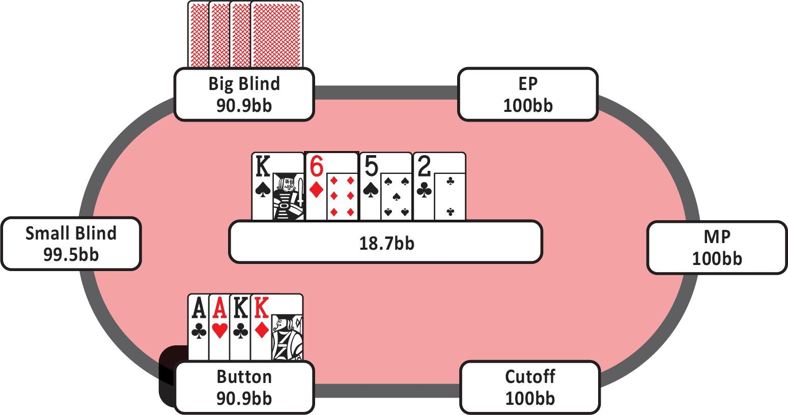

图 67

你没有同花听牌，也没有顺子听牌。你应该在转牌圈用顶三条下注吗？

是的，你应该用这手牌进行满池下注。原因是你的对手不太可能击中这张转牌。你没有黑桃，也没有 7 或 8，这意味着所有的顺子听牌和同花听牌都没有被阻挡，因此很可能在对手的手牌中。因此，你希望在这里进行大额价值下注，选择满池下注。

### 7.4.3 转牌圈决策（K♠-6♦-5♠）-10♦

我们将讨论的第二张转牌是 10♦，使牌面变为（K♠-6♦-5♠）-10♦。这是一张重要的空白牌，同时引入了许多听牌：后门同花听牌和许多顺子听牌。

**手牌示例 55**  
你在 BTN 持有 K♥-Q♠-J♥-9♠（图 68）。

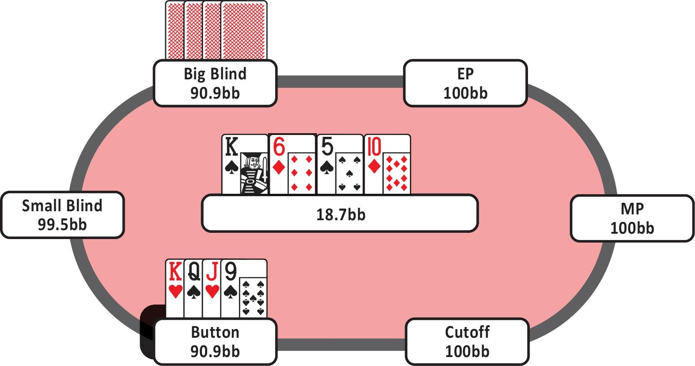

图 68

你会选择两枪下注，还是过牌？在这里，你应该问自己，被更弱的手牌跟注的可能性有多大？

在这种情况下，你完全有可能被更弱的手牌跟注，因此你希望下注。你有一个包裹听牌、许多坚果补牌、Q 高的同花听牌以及顶对。此时有许多组合听牌明显落后，比如后门方片听牌、更弱的黑桃听牌、更弱的顺子听牌，你可以从它们那里获得很多价值。

**手牌示例 56**  
你在 BTN 持有 A♠-J♦-10♥-2♥（图 69）。

图 69

你击中了第二对和一个卡顺听牌。你会选择过牌还是下注？

在这里，你应该选择满池下注。由于你手中有 J♦，你既有良好的未来阻挡牌，也有即时的阻挡牌。过牌并不会给你带来太多好处，因为你没有太多有利的河牌补牌。此时，你试图施加压力，迫使对手弃牌。由于你已经击中了 10，对手持有 10-10 或 K-10 的可能性降低了。

**手牌示例 57**  
你在 BTN 持有 A♠-A♣-3♠-2♠（图 70）。

图 70

你持有超对和同花听牌，你会在转牌圈进行两枪下注吗？

不，你应该选择过牌。你的手牌没有提升，而转牌为对手引入了许多可能的额外权益。他们可能持有更好的成手牌，比如 K-10。由于你的手牌没有提升，你应该选择过牌并免费看河牌。

**手牌示例 58**  
你在 BTN 持有 K♥-8♣-7♣-6♥（图 71）。

图 71

你在翻牌圈击中了两对和一个两端顺子听牌。你会在转牌圈怎么做？

你应该选择过牌以控制底池。这张转牌意味着对手可能有许多更好的成手牌，同时也为对手提供了许多权益。因此，你会选择过牌并等待一个安全的河牌来抓诈唬，而不是扩大底池。你的手牌非常难以处理，面对转牌圈的过牌加注，你通常不得不弃牌，因为有许多不利的河牌，而且你在面对三条或 K-10 时明显落后。

### 7.4.4 主要要点

- 你的翻牌前和翻牌圈范围会极大地影响你的转牌圈范围。
- 在转牌圈，你通常会采用两极化的策略，并使用两种下注尺度：满池和半池。
- 在翻牌圈下注后，你需要确保不会在两枪下注范围中加入太多手牌。你还应该在转牌圈用一些强牌过牌，以保护自己不在转牌圈过牌后在河牌圈被对手利用。

## 7.5 单次加注底池中处于不利位置的转牌策略

### 7.5.1 介绍

在本节中，我们将讨论当你在翻牌圈过牌并跟注一个 50% 底池大小的下注（4.25 bb）后处于不利位置时的转牌策略。你处于 CO，对手在 BTN。我们将使用的牌面是 10♠-8♦-8♣。

在 10♠-8♦-8♣ 翻牌圈过牌并跟注后，你很少会主动下注。唯一一个你会显著使用持续下注范围的转牌是 A♠。在这张牌上，你大约有 55% 的时间会选择主动下注。在几乎所有其他可能的转牌上，你会有 90% 以上的时间选择过牌。因此，除了 A♠ 之外，在其他所有转牌上选择全范围过牌是合理的。你的过牌加注范围也非常低，平均只有约 5%。

如果你的对手在这个牌面上进行两枪下注，他们代表的是一个非常两极化的范围。因此，你没有动力去过牌加注，因为他们的范围要么是坚果牌，要么是空气牌。如果他们持有坚果牌，你不想把所有资金投入底池；如果他们是在诈唬，你希望跟注以让他们继续诈唬。

然而，仍然有一些手牌你应该选择过牌加注。更重要的是，你必须意识到你应该以较高的频率弃牌。你应该弃掉的手牌通常是那些理论上可以用来抓诈唬的手牌，因为你通常有一些摊牌价值（因为你已经在翻牌圈过牌并跟注）。但你必须选择一些低 EV 的过牌跟注手牌并弃掉它们。如果你不这样做，你会变得非常容易被对手剥削利用。如果你的对手知道你在这个牌面上总是会用超对过牌并跟注两次，甚至三次，那么你会变得非常容易被对手剥削利用。对手可以采取一种非常剥削性的不平衡策略，大量进行价值下注或激进地进行三枪下注，因为他们知道你通常会弃掉那些在转牌圈跟注的抓诈唬手牌。

### 7.5.2 转牌 2♠ 的过渡分析

我们将分析的第一个转牌是 2♠。现在的牌面是（10♠-8♦-8♣）-2♠。这张转牌引入了同花听牌，但除此之外，这张牌可以被视为一张轻微的空白牌。

你可以通过以下特征来识别那些在面对第二枪下注时应该弃牌的手牌：

- 低摊牌价值。
- 你需要从整个转牌范围的角度来看待这一点。你在翻牌圈跟注，因此你会带着许多强超对进入转牌圈。你应该弃掉那些具有最低对子价值或完全没有对子的手牌，并继续用其余的手牌行动。
- 对手价值范围内的低权益。
- 对手的价值范围主要由 8-x 组合和一些葫芦组成。面对 8-x，你可能仍然有一定的权益，比如同花听牌或顺子听牌。
- 阻挡 / 移除对手的自然诈唬牌。当你审视自己的手牌时，你应该问自己：“我的手牌是否增加了对手持有诈唬牌或价值手牌的可能性？我是否通过持有顺子听牌和同花听牌的阻挡牌阻挡了对手的诈唬，或者我是否阻挡了对手的成手牌？” 对于增加对手诈唬或半诈唬可能性的手牌，你应该更积极地继续行动。而对于阻挡对手诈唬牌的手牌，你应该选择弃牌，因为你更有可能遇到对手的强价值手牌。

**高频弃牌手牌**  
像裸顺子听牌、裸同花听牌、裸 J-J、裸 10 对以及完全没有价值的手牌，几乎应该以 100% 的频率弃牌。许多这些组合几乎没有摊牌价值，并且在面对对手的价值范围时表现不佳。同时，它们通常还阻挡了对手的诈唬牌。例如，持有 A-9-7-6 这样的手牌会阻挡对手可能用来诈唬的顺子听牌。它没有对子，因此应该弃牌。即使你持有裸 10，你也几乎总是应该弃牌，因为带有 10 的组合是对手最可能用来诈唬的手牌之一。你自己持有这张牌，会大大降低对手诈唬的可能性。

对于裸 QQ，你有一个超对但没有顺子听牌或同花听牌。这手牌很容易在河牌圈被同花、顺子或高牌击败。因此，你通常也会用这些手牌弃牌。

接下来，考虑带有顺子听牌但没有同花听牌的 10-x 手牌。这些手牌也应该弃牌，因为你再次阻挡了对手的自然诈唬牌。

最后，带有顺子听牌但没有同花听牌的 JJ 手牌与没有顺子听牌或同花听牌的 10-x 组合情况类似。你阻挡了对手的自然诈唬牌，而对手的摊牌价值相对较低。

因此，以下是（简化后的）在决定是否在面对第二枪下注时弃牌时需要考虑的特征：

- 低摊牌价值。
- 对手价值范围内的低权益。
- 阻挡 / 移除对手的自然诈唬牌。

那么，在实际情况下，哪些手牌应该弃牌呢？让我们看一些例子。在这里，你处于 CO，面对一个 75% 底池大小的转牌下注（12.75 bb）。

**手牌示例 59**  
你在 CO 持有 Q♣-Q♥-5♥-4♦（图 72）。

图 72

这是一手裸超对 QQ。面对对手的价值范围（8-x），你的权益并不大。此外，对手的诈唬牌有很大机会在后续牌面反超你。如果对手有顺子或同花听牌，他们在河牌圈完成听牌的概率很高。即使对手只是持有 AA 或 KK，他们已经领先于你。而且，河牌圈可能会出现很多让你不愿意跟注的危险牌。因此，在面对对手的第二轮下注时，你应该在转牌圈选择弃掉这手牌。

**牌例 60**  
你在 CO 位置持有 A♣-9♣-7♥-6♠（图 73）。

图 73

你会在翻牌圈用这手牌跟注，但到了转牌圈，你应该选择放弃，因为你的手牌阻碍了对手的自然诈唬机会。此外，这手牌的摊牌价值也很低。

**在（10♠-8♦-8♣）-2♠ 的转牌圈跟注范围**  
为了在转牌圈继续对抗对手的第二轮下注，你应该寻找具备以下特点的牌：

- 较高的摊牌价值。
- 面对对手的价值范围有不错的权益。
- 能够阻挡或减少对手的价值牌。

以下是一些可以在（10♠-8♦-8♣）-2♠ 的转牌圈跟注第二轮下注的牌例。

**牌例 61**  
你在 CO 位置持有 Q♣-Q♦-10♣-9♥（图 74）。

图 74

你已经有了一些对抗 8 的权益，你可以击中 10、Q 或顺子补牌。同时，你的手牌并没有阻挡同花听牌，这增加了对手诈唬的可能性。因此，这手牌应该继续对抗对手的第二轮下注。

**牌例62**  
你在 CO 位置持有 K♦-K♥-7♦-6♦（图 75）。

图 75

这手牌并没有阻挡顺子听牌组合，比如 Q-9、Q-J，也没有阻挡任何同花听牌，同时它具有一定的摊牌价值。因此，你应该选择跟注。此外，你还有 7-6 作为对抗 8 的小补牌。通常情况下，没有补牌的裸 KK 会选择弃牌，但在这里你可以选择跟注。

**牌例 63**  
你在 CO 位置持有 Q♠-J♠-J♣-10♥（图 76）。

图 76

尽管这手牌阻挡了对手一些潜在的诈唬牌，但由于它本身具有高对和同花听牌的较高权益，因此你应该选择跟注。

**在转牌圈加注的牌**  
在（10♠-8♦-8♣）-2♠ 的转牌圈，如果你希望为了价值而加注，你需要确保没有阻挡 8-x 组合。如果你手中持有一张 8，通常你会选择跟注，因为你仍然落后于 10-8 和 10-10。当你持有一张 8 时，对手诈唬的可能性也会更高。通过加注，你可以迫使对手的诈唬牌弃牌，同时不给他们机会进行第三轮诈唬。当你持有 10-10 时，你应该经常加注，因为你希望从 8-x 手中赢得所有筹码，而对手很可能会持有 8-x，因为你没有阻挡这些组合。此外，当你持有 10-10 时，你也会更多地加注，因为你阻挡了对手很大一部分诈唬范围。

如果你想在转牌圈进行诈唬加注，你需要有出色的阻挡牌和保护。转牌圈的加注范围非常小。大多数希望过牌 - 加注的 10-x-x-x 组合已经在翻牌圈进行了过牌 - 加注。

因此，基本上，你的过牌 - 加注范围集中在 10-x 上。尤其是当你持有一手容易受到对手诈唬 / 半诈唬范围威胁的牌时。例如 K♣-K♥-10♥-2♥（图 77）。

图 77

这手牌在面对对手可能进行的第二轮下注时，容易受到同花和顺子听牌的威胁，这些听牌在河牌圈仍然有可能轻松反超你。同时，这手牌也无法承受对手的第三轮下注，因为河牌圈的坚果牌可能会频繁变化，而这种变化对你并不利。不过，你手中持有一张 10 和一张 2，因此你对抗 8 时有更多的葫芦补牌，同时也在一定程度上阻挡了对手的葫芦组合。通常，当你持有这些葫芦阻挡牌时，尽管你并没有特别有效地阻挡对手的葫芦或价值牌，但它仍然是一个很好的随机化工具，可以为你的范围增加一些诈唬牌，而且这种随机化工具并不难识别。

**牌例64**  
另一个例子是 A♦-10♦-7♠-6♣（图 78）。

图 78

这手牌需要很强的保护来对抗对手的诈唬。你并没有阻挡带黑桃的 QQ 或 JJ，也没有阻挡任何顺子或同花听牌。因此，偶尔你可以将这手牌转化为诈唬。

**牌例 65**  
最后，考虑 Q♠-Q♦-J♥-10♥（图 79）。

图 79

这手牌也可以用作诈唬加注。有时，当你持有一手非常脆弱的牌时，你可以将你的 10-x 牌转化为诈唬，从而让对手的决策更加困难。太多玩家在翻牌圈过牌 - 跟注后，在转牌圈没有任何（诈唬）加注范围，这使得对手可以轻松地用任何有权益的牌进行第二轮下注。这也为对手创造了进行第三轮诈唬的机会，同时他们还可以在没有被过牌 - 加注风险的情况下提升自己的牌力。为了防止这种情况，你需要在转牌圈混合一些加注，并且需要找到一些随机化工具，例如：两对，或者没有同花听牌的 10-x 牌，然后将它们转化为诈唬。

### 7.5.3 主要要点

- 你需要保持平衡，因此不要将所有在翻牌圈继续游戏的牌都在转牌圈跟注。你需要放弃其中一部分，以避免被对手利用。你应该弃掉：
  - 摊牌价值最低的牌。
  - 权益较低的牌。
  - 阻挡了对手自然诈唬机会的牌。
- 为了继续游戏，你需要：
  - 具有较高摊牌价值的牌。
  - 面对对手价值牌时有一定权益的牌。
  - 阻挡或减少对手价值牌的牌。
- 为了加注，请考虑以下因素：
  - 如果你是为了价值而加注，你希望不阻挡对手范围内你可以清空其筹码的部分。如果你持有坚果牌，你希望在加注时不阻挡第二坚果牌，以增加让对手陷入不利局面的概率。
  - 如果你是在诈唬，你希望持有阻挡对手继续游戏范围的牌。

## 7.6 单次加注底池中处于有利位置的河牌策略

### 7.6.1 介绍

在本节中，我们将讨论在有利位置进行河牌策略的方法。我们将特别关注下注 / 下注 / 下注的线路，即你在翻牌圈和转牌圈都进行了 c-bet，现在我们需要分析在河牌圈应采取的行动。

牌面为 K♠-6♦-5♠-10♦。你在翻牌圈和转牌圈都进行了 c-bet，现在进入河牌圈，剩余 SPR 为 1.3。

### 7.6.2 河牌圈原则

- 河牌圈的 c-bet 范围是两极化的（要么是诈唬，要么是非常强的牌）。在河牌圈，没有听牌或半诈唬的可能性。
- 你的下注尺度通常应该是底池大小。有时，当你进行薄价值下注，或者你的手牌阻挡了对手很大一部分跟注范围时，你可以选择下注更小的额度。稍后会详细讨论这一点。
- 你的摊牌价值越高，你的诈唬频率就越低。有时，你会在河牌圈持有像三条或两对这样的牌。即使你可能阻挡了坚果牌，你仍然会选择过牌，因为你的摊牌价值很高，因此过牌的 EV 非常高。
- 你阻挡坚果牌的能力越强，你的诈唬频率就越高。这一点尤其适用于当你的摊牌价值较低时。因此，在决定是否在河牌圈诈唬时，你的摊牌价值至关重要。

**牌例 66**  
我们将分析的第一个河牌转变是 A♠ 完成了前门同花听牌。现在的牌面为（K♠-6♦-5♠-10♦）-A♠（图 80）。

图 80

**同花**  
坚果同花、第二坚果同花和第三坚果同花在有利位置时都会以 100% 的频率进行价值下注，最好下注满池。你的牌越强，你就越应该使用满池下注的尺度。原因是你不需要担心遇到更强的同花。

此外，需要注意的是，处于不利位置的玩家会以大约 50% 的频率用他们的同花向你主动下注。你仍然会用所有同花进行价值下注，只有在持有低同花时才会选择 20% 的频率过牌。因此，在这种河牌圈，你几乎总是应该用同花进行价值下注。

**摊牌价值**  
每当你持有一手有摊牌价值但并非同花的牌时，你几乎不应该下注。唯一可以经常下注的牌是带有同花阻挡牌的顺子。如果没有同花阻挡牌，下注顺子或比顺子更弱的牌（如三条或两对）是没有意义的。再次强调，如果你的摊牌价值很高，过牌的 EV 会非常高，因此没有必要用这些牌进行下注。

你应该采用高效的策略，这意味着当你诈唬时，你应该用那些在摊牌时几乎没有机会获胜的牌进行诈唬。

**诈唬**  
坚果同花阻挡牌的摊牌价值较低，因此比两对 6 和 5 更弱的牌会以 100% 的频率进行诈唬。第二和第三坚果同花阻挡牌也几乎以 100% 的频率下注。如果你持有 A-K 并拥有坚果同花阻挡牌，你的诈唬频率仍然很高，但由于你持有更多的摊牌价值，频率会稍微降低。

这里最关键的因素是你的摊牌价值有多低，而是否持有完美的阻挡牌并不是那么重要。当你进入河牌圈时，始终要思考：“如果我过牌，这手牌有机会获胜吗？”如果答案是否定的，你应该始终考虑将其纳入你的诈唬范围。

**牌例 67**  
在 8♥ 河牌圈，（K♠-6♦-5♠-10♦）-8♥，一些顺子完成了，但更重要的是，两个同花听牌都未能完成（图 81）。

图 81

在这种河牌圈的策略原则仍然相同，但由于其重要性，我们将简要回顾一下：

- 河牌圈的 c-bet 范围是两极化的（你要么是诈唬，要么是强价值牌）。
- 你的下注尺度通常应该是满池。
- 你的摊牌价值越高，你的诈唬频率就越低。
- 你阻挡坚果牌的能力越强，你的诈唬频率就越高。

牌面为 K♠-6♦-5♠-10♦-8♥。在这种牌面下，顺子应该始终进行价值下注。在这个河牌圈，三条也会以较高的频率下注。如果你的三条能击败其他三条，或者你的三条阻挡了顺子，那么你肯定应该进行价值下注。

两对、顶对和超对永远不会进行价值下注。这些牌仍然能击败未完成的同花听牌，因此它们确实有一定的摊牌价值，但它们的强度不足以进行价值下注。最后，你可能会持有一些带有顺子阻挡牌的空气牌。在这种情况下，“空气牌” 指的是比 K 更弱的牌，因为这些牌在摊牌时很少能获胜。没有顺子阻挡牌的空气牌很少用于诈唬。

### 7.6 3 主要要点

- 始终考虑你的摊牌价值有多少，以及你的阻挡牌有多重要。
- 河牌圈的 c-bet 范围是两极化的（你要么是诈唬，要么是强价值牌）。
- 你的下注尺度通常应该是满池。
- 你的摊牌价值越高，你的诈唬频率就越低。
- 你阻挡坚果牌的能力越强，你的诈唬频率就越高。

## 7.7 综合运用

我们已经讨论了在翻牌圈、转牌圈和河牌圈处于有利位置时的基本策略。下一步是将这些基本原则结合起来，制定一个扎实的三条街（三阶段）游戏计划。因此，我们现在将深入分析一些三条街的牌例。

### 7.7.1 牌例 1

**牌例 68**  
你在 BTN 持有 A♠-5♦-2♦-2♠，翻牌是 K♠-6♦-5♠（图 82）。

图 82

在这个牌面上，你持有坚果同花听牌、一对 5 和一个后门同花听牌。这手牌应该在翻牌圈进行 c-bet，因为你缺乏摊牌价值，并且可以跟注对手的过牌 - 加注。你还阻挡了对手可能在翻牌圈继续游戏的一些价值牌，例如坚果同花听牌或包含 5 的三条和两对。因此，你应该在翻牌圈下注，并在必要时跟注对手的过牌 - 加注。但假设你进行了 c-bet，而对手选择了跟注。

**牌例 69**  
转牌是（K♠-6♦-5♠）-10♦（图 83）。

图 83

你现在持有两个同花听牌，但几乎没有摊牌价值，因此你应该进行第二轮下注。你进行第二轮下注的原因是，面对对手的过牌 - 加注范围，你有更多的补牌可以击中，同时你手中的坚果性较低。你可以跟注对手的过牌 - 加注，因为面对像三条和两对这样的牌，你有更多的权益，因此在这里进行第二轮下注不会妨碍你实现自己的权益。在这种情况下，你应该使用满池下注的尺度。如果对手选择过牌 - 加注，你将选择跟注。

**牌例70**  
河牌是（K♠-6♦-5♠-10♦）-Q♦（图 84）。

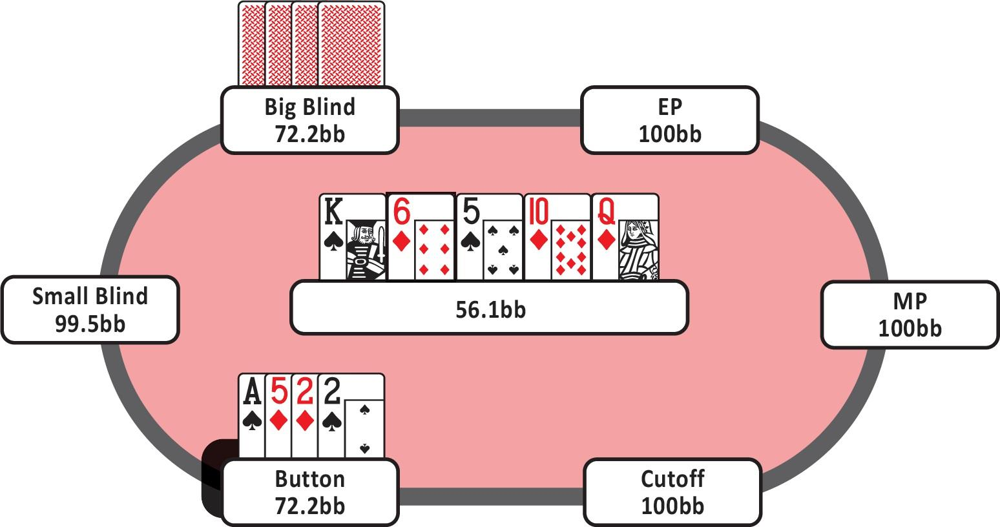

图 84

你在河牌圈击中了同花！但这是一个非常弱的同花。在翻牌圈和转牌圈都进行了下注后，非常弱的同花通常会在河牌圈选择过牌。在这个牌面上，大多数同花你会选择进行价值下注。但在这里，你持有的是可能的最弱同花之一，因此选择过牌更为合适。

### 7.7.2 牌例 2

**牌例 71**  
你在 BTN 持有 K♠-K♣-10♦-9♠，翻牌是 10♠-8♦-8♣（图 85）。

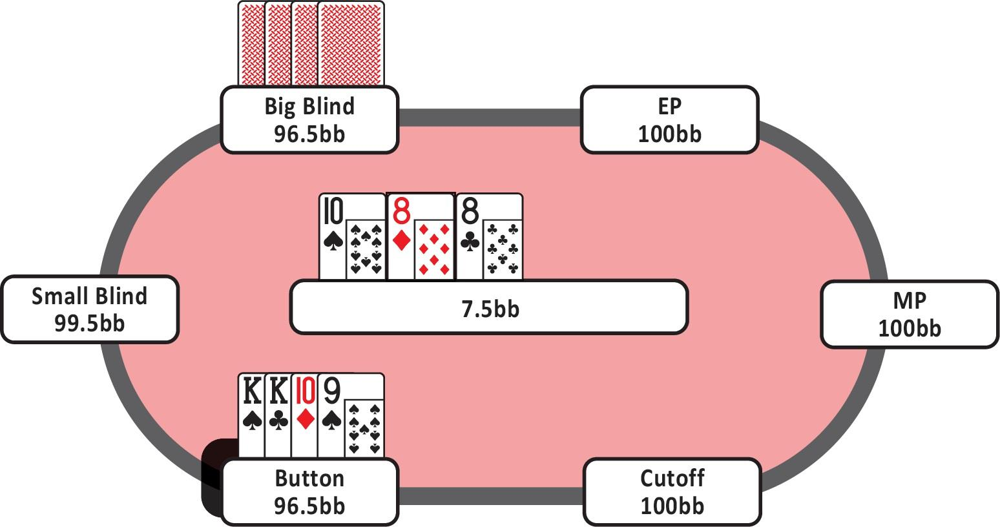

图 85

在配对牌面上，最重要的概念是：

- 在翻牌圈，你应该使用 33% 的 c-bet 尺度。
- 在 10♠-8♦-8♣ 的牌面上，你应该用大约 48% 的范围进行 c-bet。
- 在 10♠-8♦-8♣ 的牌面上进行 c-bet 时，你应该选择下注包含 10 的超对，因为这些牌阻挡了 10-10 和 10-8。
- 如果你的超对没有 10 或顺子听牌作为补牌，那么你应该选择下注那些通过持有 J、9 或 7 来阻挡一些顺子听牌的牌。

你持有 K♠-K♣-10♦-9♠，这是一个强超对，同时有 10 的阻挡牌、后门同花听牌和后门顺子听牌。这手牌在翻牌圈显然应该进行 c-bet。如果你持有同样的牌但没有后门同花听牌，你更倾向于过牌，因为能够进行第二轮下注的转牌较少，且能在河牌圈摊牌获胜的机会也较少。由于牌面是配对的，你下注 33% 的底池，而对手选择跟注。对手的跟注范围会非常宽，可能包括较弱的超对、顺子听牌、10-x 等牌。

**牌例 72**  
转牌是（10♠-8♦-8♣）-3♠（图 86）。

图 86

在转牌圈，你的牌力得到了提升，增加了一个同花听牌。在翻牌圈下注后，对手没有进行过牌 - 加注，因此你可以假设自己在转牌圈仍然持有最好的牌。同时，你面对对手可能继续游戏的一些牌表现良好，例如带有黑桃的 Q-Q、带有黑桃的 J-J，以及像 J-10-9 或 Q-J-10 这样的顺子听牌。在转牌圈，你通常使用 50% 底池的下注尺度，但更小的下注尺度也是合理的。你选择用 50% 的尺度进行价值下注，而对手再次选择跟注。

**牌例 73**  
河牌是（10♠-8♦-8♣-3♠）-2♥（图 87）。

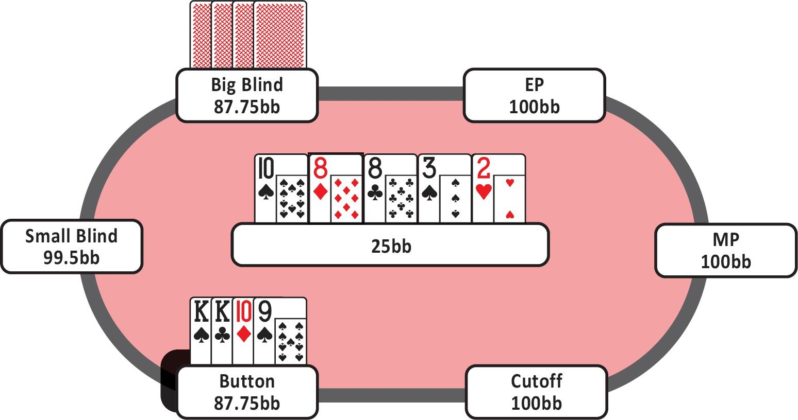

图 87

你未能击中同花听牌，但仍然持有可观的摊牌价值。在进行了两轮下注后，你现在选择在河牌圈过牌。根据对手的情况，你也可以选择进行第三轮价值下注。例如，如果你认为对手在翻牌圈或转牌圈会用手牌中有 8 或 10-10 的牌进行加注，那么你很可能仍然领先。在 BTN 对抗 BB 的特定情况下，如果 BB 几乎对所有 AA 进行 3-bet，你可以相当频繁地进行第三轮下注。当你选择进行第三轮下注时，使用较小的下注尺度可能是最佳选择，因为这更有可能让被你击败的牌选择跟注。此外，如果你持有黑桃，这会让你的牌更适合进行第三轮下注，因为对手不太可能持有黑桃，并且由于黑桃未完成，对手更可能选择抓诈唬。

## 7.7.3 牌例3

**牌例 74**  
你在 BTN 持有 A♠-7♦-6♠-2♦，翻牌是 10♠-8♦-8♣（图 88）。

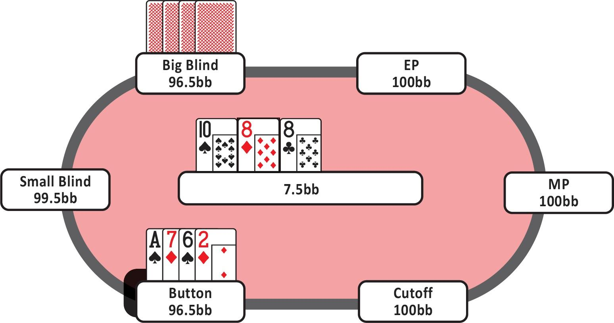

图 88

这手牌应该在翻牌圈进行 c-bet。一个需要考虑的重要问题是，如果你选择过牌，在某些转牌上如何继续行动。在这种情况下，你没有坚果转牌，但你有一些可以继续下注的转牌，例如顺子听牌和一些同花听牌。由于 A♠-7♦-6♠-2♦ 的摊牌价值较低，且过牌的 EV 较低，因为这手牌缺乏可以击中的好转牌，因此你应该按照配对牌面的标准策略下注 33% 的底池。对手选择跟注。

**牌例 75**  
转牌是（10♠-8♦-8♣）-3♠（图 89）。

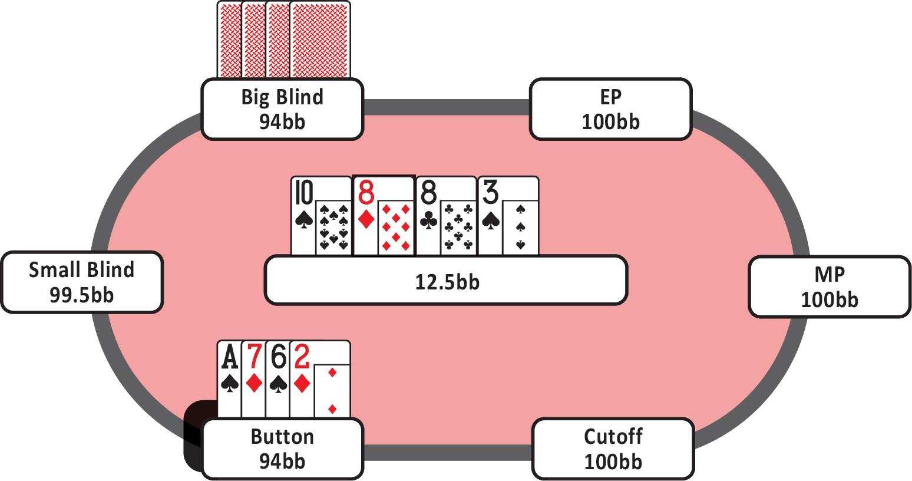

图 89

这张转牌为你的手牌增加了一个同花听牌，从而提高了面对对手跟注范围的权益。你希望使用更大的下注尺度，因为你希望在这张转牌上更加极化。如果你有一手牌能够通过让对手弃掉中等强度的牌而受益（就像你当前的手牌一样），你应该选择较大的下注尺度并下注满池。如果你没有黑桃听牌，你仍然应该考虑下注这手牌，因为过牌的 EV 非常低。然而，摊牌价值低并不是你选择在转牌圈下注的唯一原因。你还希望确保在河牌圈时，你的范围内有一些诈唬牌，而像 A♥-7♦-6♥-2♦ 这样的手牌由于缺乏摊牌价值，将成为非常高效的河牌圈诈唬牌。此外，有时你希望用没有黑桃的牌在河牌圈诈唬，这样对手更有可能在河牌圈持有黑桃并以更高的频率弃牌。

**牌例 76**  
河牌是（10♠-8♦-8♣-3♠）-2♥（图 90）。

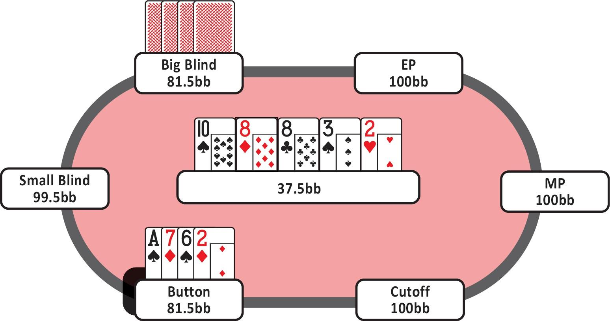

图 90

在这个河牌圈，你应该选择过牌，原因有两个：

- 你持有黑桃，这使得对手不太可能持有同花听牌，而更可能持有一手成牌。这意味着你在这个河牌圈的诈唬成功率会较低。
- 如果对手持有组合听牌，你现在甚至可能已经获胜，因为你已经组成了一对。尽管你的摊牌价值非常有限，但这仍然是你需要考虑的因素。

## 7.8 单次加注底池中处于不利位置的河牌策略

### 7.8.1 介绍

在本节中，我们将讨论多阶段玩法，即在翻牌圈和转牌圈过牌 - 跟注后，面对对手的第三轮下注时，如何在河牌圈处于不利位置进行有效抓诈唬。

正如你现在所了解的，处于不利位置时，你需要采取比有利位置更被动的策略，而在有利位置时你会进行更多的下注。处于不利位置时，你需要更加反应性地游戏，通常会选择过牌，然后根据对手的行动来决定如何应对。

在河牌圈抓诈唬时，处于有利位置和不利位置并没有太大区别。最重要的是阻挡牌。对手会下注一个两极化的范围，而你的跟注范围应该集中在阻挡对手的最强价值牌，同时不阻挡对手的诈唬范围。

需要记住的一点是，如果河牌改变了坚果牌，你应该选择用一些价值牌主动下注，以最大化你的价值范围。然而，你不能用所有价值牌主动下注，否则你会过于频繁地过牌 - 弃牌。

### 7.8.2 分析

与大多数牌面一样，当你在不利位置时，在 10♠-8♦-8♣ 的牌面上不会使用很高的 c-bet 频率。你应该只下注 10.8% 的范围，并使用半池的下注尺度。让我们分析两个不同的牌面来讨论抓诈唬。

**牌例 77**  
你在 CO 位置，翻牌是 10♠-8♦-8♣（图 91）。

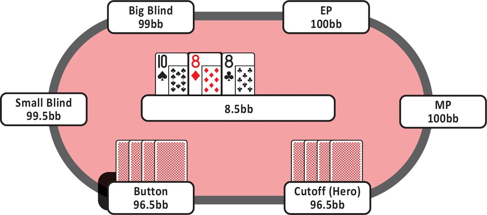

图 91

你在翻牌圈选择过牌，而对手下注半池。你如何在这个牌面上游戏你的范围？

如果在 10♠-8♦-8♣ 的牌面上面对半池的下注，K-K-10-x 组合会以 28% 的频率进行过牌 - 加注。原因是你的裸超对需要很多保护。你选择过牌 - 加注那些没有顺子阻挡牌的牌，因为这些牌允许你在更多转牌上跟注。如果你总是在翻牌圈用 K-K-10 组合跟注，你就是在允许对手在转牌或河牌完成顺子时进行非常有效的第二轮或第三轮下注。了解这一点后，你有时会尝试通过用 K-K-10 在翻牌圈过牌 - 加注来让对手立即弃牌。

A-A-10 组合只以 14% 的频率进行过牌 - 加注，频率是 K-K-10 的一半。原因是 AA 需要较少的保护。将这些手牌中的一部分加入你的过牌 - 加注范围非常重要，尤其是那些需要一定保护且具有摊牌价值的手牌。例如，J-J-10会以 45% 的频率进行过牌 - 加注，而 Q-Q-10 会以 38% 的频率进行过牌 - 加注。因此，你确实希望将这些手牌中的一部分加入你的过牌 - 加注范围。如果你不这样做，对手会很容易在翻牌圈进行大量下注，实现他们的权益，并发挥他们的诈唬潜力。

现在假设你在翻牌圈选择过牌-跟注。

**牌例 78**  
转牌是（10♠-8♦-8♣）-7♣（图 92）。

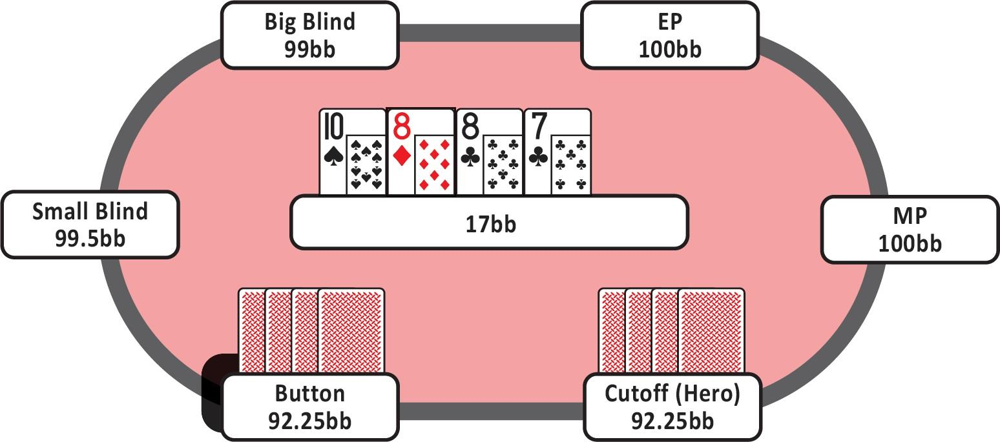

图 92

在 7♣ 转牌圈，你应该选择过牌你的整个范围，因为 7♣ 对你来说并不是一张好牌。通过在翻牌圈下注，对手展示了一个更加两极化的范围。你没有选择过牌 - 加注，因此你的范围内没有很多 8-x、10-10 或 10-8 的组合，这将使你的范围主要由超对组成。因此，你会选择过牌，让对手决定是否要通过第二轮下注进一步极化他们的范围。

如果对手选择进行第二轮下注，你主要会选择跟注或弃牌。在这张对你的范围相对不利的转牌上，你希望继续游戏那些有不错权益的牌。大多数 AA 此时会选择弃牌（58%）。注意，一些 AA 在翻牌圈会选择过牌 - 加注。如果不是这种情况，那么你在转牌圈用 AA 弃牌的频率会更高。

在转牌圈，如果你持有带梅花的 AA，你有一手不可弃牌的牌，必须继续游戏。你面对顺子、三条甚至葫芦都有权益，同时也有机会组成非常强的牌。同样的情况也适用于所有带梅花的超对。这些牌的权益太高，无法弃牌。

同样，带有 10 的超对，如 A-A-10、Q-Q-10 等，也可以以较低的频率在转牌圈进行过牌 - 加注。其背后的逻辑是，在转牌圈，这些牌的跟注价值会降低，因为你在面对对手的诈唬范围时表现不佳。因此，即使对手在诈唬，你也会在很多河牌上面临问题。你要么必须弃牌，要么对手可能会击中牌并选择过牌，仍然获胜。

你在转牌圈面对对手的下注范围时，实现权益和权益本身都不太理想，这意味着你应该将其中一些组合转化为诈唬。这种情况尤其适用于 KK，因为 KK 更容易受到威胁。超过 30% 的情况下，你应该将 K-K-10 这手牌在转牌圈转化为诈唬并进行过牌 - 加注。

玩家很少进行这种类型的诈唬。许多玩家看到像 K-K-10-4 这样的牌时，最终会选择弃牌或再次跟注。然而，你很少看到他们选择过牌 - 加注。

这使得过牌 - 加注成为一种非常强大的玩法，因为人们会给你很多信任。此外，许多处于有利位置的玩家会用宽范围在转牌圈积极进行第二轮下注，而他们并不期望你会过牌 - 加注。这意味着大多数时候你会面对各种听牌。通过过牌 - 加注，你可以让他们放弃这些听牌，并偷走他们的权益。

在转牌圈过牌 - 跟注后，你将看到河牌。在考虑河牌之前，要意识到此时你的范围主要由带有同花听牌的超对、带有顺子听牌的超对以及偶尔的慢玩牌组成。

**牌例 79**  
河牌是（10♠-8♦-8♣-7♣）-3♦（图 93）。

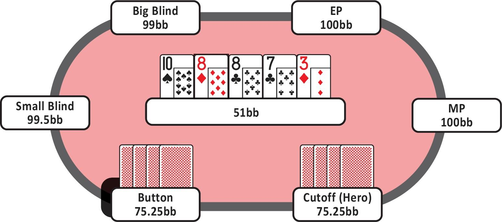

图 93

在 3♦ 河牌圈，你应该选择过牌你的整个范围。到目前为止，对手通过第二轮下注展示了一个非常两极化的范围。你只是选择跟注，现在处于抓诈唬的场景中。要意识到，当你进入河牌圈而对手再次下注时，你必须放弃一些手牌，否则你会变得容易被利用。如果对手知道你会用所有超对在空白河牌上抓诈唬，他们可以通过结合过牌和无情地进行价值下注来利用你。

因此，你必须选择性地进行一些跟注，并仔细考虑哪些牌应该弃掉。如果对手进行第三轮下注，那么他们通常会用非常两极化的范围在河牌圈游戏，并使用较大的下注尺度。在这种情况下，满池下注是处于有利位置玩家的唯一正确选择，而处于不利位置的玩家应该以 51% 的频率弃牌。

大多数情况下，你必须选择性地挑选那些具有良好阻挡牌组合和高摊牌价值的超对。你必须放弃大量超对，尤其是那些带有梅花的牌。特别是 A♣，在河牌圈跟注时并不是一张好牌，因为你阻挡了对手可能持有的未完成的同花听牌。在这种情况下，你应该弃掉几乎所有带有梅花的裸 AA。

如果你没有持有任何梅花，有一些 AA 组合会选择在河牌圈跟注。这些跟注的牌通常具有良好的阻挡牌，能够阻挡对手的价值范围，同时不阻挡对手的诈唬范围。在这种情况下，你希望持有的牌是对子阻挡牌和顺子阻挡牌。例如，A♥-A♦-10♦-J♠ 这手牌阻挡了一些顺子、两对和葫芦组合，同时不阻挡对手可能持有的诈唬牌。因此，这将是一个很好的抓诈唬牌。

_在河牌圈，最重要的因素是你持有的阻挡牌，而不是你的成牌价值，因为你无论如何都只能击败对手价值范围中的很少一部分。你只能击败诈唬牌，因此你希望用那些让对手更可能诈唬的牌进行跟注。_

**牌例 80**  
你在 CO 位置，翻牌是 8♠-7♦-6♣（图 94）。

图 94

这是一个彩虹牌面且具有顺子潜力的牌面。在这个翻牌圈，处于不利位置的玩家会以 15% 的频率进行半池的 c-bet，并过牌其他所有手牌。诈唬范围由那些无法过牌 - 跟注的牌组成，例如 A-J-10 和 A-J-9。

在这个翻牌圈，你会经常选择过牌 - 跟注，而较少选择过牌 - 加注。在这个牌面上的过牌 - 加注范围与 c-bet 范围类似。它包括那些无法过牌 - 跟注但具有一定权益的牌，因此是很好的诈唬候选牌。在这个牌面上，一些最适合过牌 - 加注的牌是阻挡顺子的弱超对，例如 J♦-10♦-10♠-2♠。这手牌阻挡了那些在这个牌面上非常强的顺子听牌，例如 J-10-9 和 10-9-8。

在过牌 - 跟注方面，你应该用大多数强成牌进行跟注，例如三条、两对、第二坚果顺子和第三坚果顺子等。这些牌通常会在翻牌后采取被动的路线。

**牌例 81**  
转牌是（8♠-7♦-6♣）-4♦（图 95）。

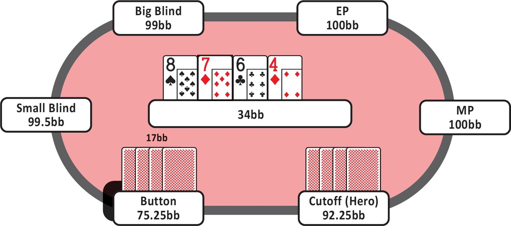

图 95

这张转牌没有改变牌面结构，因此你没有主动下注的范围。你仍然落后于对手在翻牌圈的价值范围。这张转牌对处于有利位置的玩家非常安全，因此他们应该开始通过下注满池或过牌来极化自己的范围。在这种情况下，对手决定进行第二轮下注并在转牌圈下注满池。

面对对手的第二轮下注，你应该继续游戏那些具有良好权益的牌。这些牌包括带有补牌的两对、同花听牌、带有同花听牌的双头顺子听牌、三条以及低顺子。那些在翻牌圈选择缠打希望转牌能改善的牌现在应该选择弃牌。

如果后门同花听牌和顺子阻挡牌在转牌圈没有改善为同花听牌或顺子，它们的价值现在会显著下降。内听顺子听牌以及许多 AA 牌，例如 A♥-A♦-6♠-2♠，在翻牌圈足以选择缠打以期待好转牌，但现在应该选择弃牌。

面对满池的第二轮下注，你应该放弃许多这样的牌，并在持有成牌时选择被动游戏，除了 10-9，这手牌会以非常高的频率进行加注。底池中已经有大量资金，10-9 非常强，而且在双方片的牌面上你需要一些保护。因此，你会用 10-9 组合进行加注。

除了 10-9 之外，还有哪些牌会在转牌圈进行加注？事实上，只有 2% 的非 10-9 牌应该进行加注，而这个范围主要由组合听牌、带有听牌的两对以及那些可能在河牌圈难以游戏但具有很高权益的组合组成。例如 10♦-8♦-6♠-4♠。这手牌有三对、一个内听顺子听牌和一个同花听牌。它具有很高的权益，但会遇到许多困难的河牌，尤其是处于不利位置时。除了 10-9 之外，很少有牌会进行加注，你甚至可以简化为对所有非 10-9 的牌选择过牌 - 跟注或过牌 - 弃牌。

你决定在转牌圈选择跟注。

**牌例 82**  
河牌是（8♠-7♦-6♣-4♦）-2♥（图 96）。

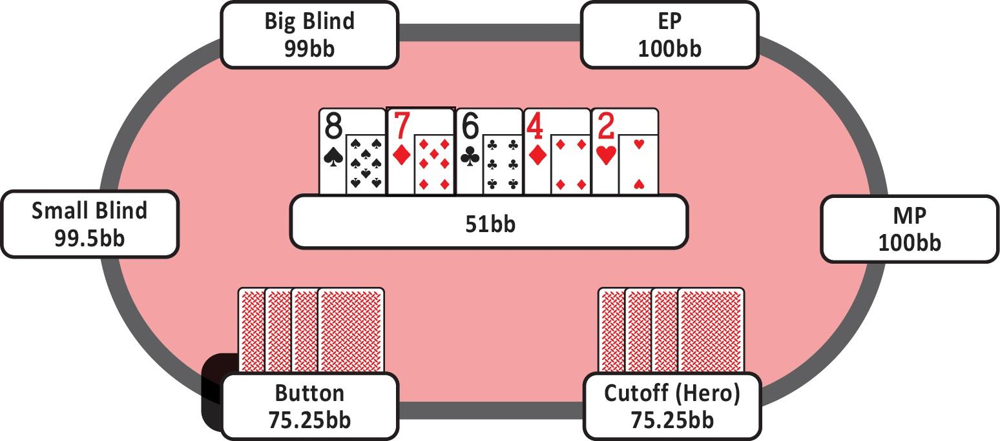

图 96

在转牌圈跟注后，你进入河牌圈时的 SPR 约为 0.8。牌面结构没有变化，因此处于不利位置的玩家会过牌整个范围，而处于有利位置的玩家应该用满池的下注尺度和非常两极化的范围进行第三轮下注。即使是许多 8 高顺子也不再强到足以让有利位置玩家进行第三轮下注，所有这些组合都应该选择过牌。有利位置玩家的价值范围包括所有 9 高顺子或更强的牌。

如果有利位置玩家选择全下，不利位置玩家应该用大约 55% 的范围进行抓诈唬。有利位置玩家冒着 80% 底池的下注风险去赢取底池，这意味着诈唬必须至少成功 45% 才能盈利。如果不利位置玩家的弃牌频率超过 55%，有利位置玩家可以将每手牌都转化为诈唬并获利。

对于不利位置玩家来说，关键因素是阻挡效果和阻挡牌。在转牌圈，跟注范围基于权益和阻挡牌的混合，而在河牌圈则完全取决于阻挡牌。9-5 是一个总是会选择跟注的组合。这手牌可能会平分底池，同时也阻挡了 10-9。

在这个牌面上，有太多不同的顺子，因此你不能盲目地用所有持有的顺子进行跟注。如果你这样做，最终会跟注过多。唯一可以跟注的低于 9 高顺子的牌是带有 10 的顺子、三条或两对，因为这意味着你阻挡了对手价值范围中的相当一部分。

### 7.8.3 主要要点

- 对手在河牌圈的下注范围将是两极化的，因此你的跟注范围应集中在阻挡对手的最强价值牌，同时不阻挡对手的诈唬范围。
- 如果河牌改变了坚果牌，你应该用一些价值牌主动下注，以最大化你的价值范围。然而，你不能用所有价值牌主动下注，否则你会过于频繁地过牌 - 弃牌。
- 在河牌圈跟注的最重要因素是阻挡效果和你持有的阻挡牌，这些牌能够阻挡对手的价值范围。
