# 第八章：翻牌后理论：3-bet 底池

[返回目录](精通低级别底池限注奥马哈.md)

## 8.1 介绍

在讨论了单次加注底池的稳健策略之后，现在该深入探讨 3-bet 底池了。这是 PLO 策略中极其重要的一部分。在这种底池中，SPR 降低，筹码四处飞溅，底池也变得非常巨大。

因此，你需要通过使用正确的范围来做好准备。3-bet 底池的 SPR 比单次加注底池低得多，这极大地影响了你的策略。3-bet 底池与单次加注底池之间的主要区别在于：

- 翻牌前范围更加明确。
- 牌面会更加偏向于某一方。
- 翻牌后的下注尺度会更频繁地包括全押和过牌加注，尤其是在 3-bet 底池中。
- 随着 SPR 变浅，c-bet 范围的极化变得不那么重要，尤其是对于处于不利位置的玩家来说，他们希望尽快结束局面。

## 8.1.1 全押

在深入探讨 c-bet 策略的基础之前，快速了解如何使用全押图表来回顾和学习大底池中的翻牌后错误会非常有帮助。

在讨论 c-bet 策略之前分析这一点是有原因的，因为并非所有在牌桌上犯的错误都同样代价高昂。某些错误比其他错误代价更大，尤其是在涉及数百个大盲注的大底池中。

在 PLO 中，全押的情况很常见，因为 3-bet 和 4-bet 底池进入翻牌的情况并不像在 NLHE 中那样罕见。为了学习如何在这些大底池中回顾和改进，你需要正确理解如何使用全押图表。以下是一个例子：

你在 BTN 用 7♦-6♦-5♠-4♠ 加注。SB 有 100 bb，决定 3-bet，你跟注。

翻牌是 K♦-J♦-4♣，此时的 SPR 为 3.5。你有一个底对和一个弱同花听牌。SB 下注满池，显然已经决定投入底池，这意味着你在全押时没有任何弃牌权益。你需要判断是否将资金全部投入是盈利的。如何解决这种情况？你可以使用以下四步流程：

1. 计算 SPR。
2. 根据 SPR 计算出你需要多少权益才能盈利地全押。
3. 计算你的手牌相对于对手范围的权益。
4. 做出决定。

现在让我们应用这四个步骤来解决这个情况。

1. 在这种情况下，SPR 为 3.5。SB 3-bet 到 12 bb，你跟注，这意味着底池大约有 25 bb，而你们双方剩余的筹码为 88 bb。
2. 在全押图表（见[第二章 2.3.2 小节](精通低级别底池限注奥马哈02.md#232-spr-与全押)）中查找 SPR 为 3.5 时所需的权益。你会发现，全押所需的权益大约为 43.5%。
3. 为了计算你相对于对手范围的权益，你可以使用多种工具。一个免费且知名的工具是 ProPokerTools.com。在这个网站上，你可以模拟 PLO 的权益。你可以为对手设定一个范围，然后将这个范围与你在特定翻牌上的手牌进行对比。记住，虽然不可能精确地确定对手的范围，但在大多数情况下，你应该能够做出一个合理的估计。根据我在 ProPokerTools.com 上的计算，你的手牌相对于对手的全押范围大约有 34% 的权益。
4. 现在是时候利用这些计算来做出正确的决定了。全押所需的权益是 43.5%，但你只有大约 34% 的权益。因此，你不应该全押。但你可以跟注吗？虽然如果这是一个全押下注，你得到了合适的赔率，但由于转牌上还有一些剩余的筹码，并且你在高的转牌上不太可能实现所有的权益，这实际上削弱了你的底池赔率。因此，你应该弃牌。

### 8.1.2 主要要点

- 当 SPR 增加时，你需要更多的权益。当 SPR 减少时，你需要的权益也减少，以便盈利地全押。
- 当 SPR 减少时，极化和位置优势对策略的影响变小。如果 SPR 增加，这些因素会变得更加重要。
- 在低 SPR 的情况下，权益是决策的主要驱动力。
- 理解全押图表对于研究全押情况至关重要。

## 8.2 3-bet 底池中的不利位置翻牌策略

### 8.2.1 介绍

本章将讨论整个游戏中最重要的情况之一，即反偷盲（re-steal）的情况。如果你想提高自己的赢率，掌握如何在 3-bet 底池中正确地在不利位置打牌是最关键的元素之一。原因很简单：

当你在盲注位（尤其是 SB）面对一个后位开池加注时，你经常会选择 3-bet，因此这种情况非常常见。此外，这些底池比单次加注底池大得多。因此，这些情况不仅频繁发生，而且会导致大底池。这使得理解如何正确应对这些情况成为你 PLO 技能中至关重要的一部分。

本章的理论将从 SB 的不利位置 3-bet 和 BTN 的有利位置跟注者之间的对局情境展开讨论。

在 3-bet 底池中处于不利位置时，你通常会倾向于在有利的牌面上频繁使用大额下注。通过使用大额下注，你表明自己愿意投入底池并尽快结束对局。这在干燥牌面（如 7♥-4♣-2♦）上尤其有益，因为像 A-A-x-x 这样的手牌虽然有很多权益，但通常只有边缘的可玩性。

### 8.2.2 牌面结构

理解牌面结构之所以如此重要，是因为双方的范围非常不对称。你的范围与牌面的互动在每种情况下都会有所不同。了解哪些牌面结构对你的范围有利，哪些不利，将帮助你做出更准确的策略决策。

不同的翻牌组合数量超过 1,700 种，我们显然无法逐一讨论。因此，最好的方法是将它们分类，然后为不同类型的牌面制定不同的策略。在这里，我们将讨论七种不同的牌面结构。

### 8.2.3 1- A 高牌面

第一种需要考虑的翻牌类型是 A 高牌面。这类牌面包含一张 A，且没有同花或顺子的可能，也没有对子。A 高牌面的例子包括 A♠-K♠-9♦ 和 A♣-6♦-3♥。在这些牌面上，作为 3-bet 者，你拥有巨大的极化优势，因为你比对手持有更多的顶暗三条。出于同样的原因，你还拥有巨大的权益优势。因此，你可以在 A 高牌面上几乎用整个范围进行 c-bet。

**下注尺度**  
你应该使用的下注尺度取决于 A 高牌面的类型。如果牌面干燥（例如 A♥-6♠-2♦），你可以使用较小的 50% 底池下注尺度。如果牌面湿润且动态（例如 A♥-J♣-3♣），则使用半池到满池的下注尺度。半池下注通常用于极化范围，而满池下注则用于混合范围。混合范围需要更多的保护，并且通过最大化弃牌权益获益更多。此外，混合范围在低 SPR 的情况下在转牌上表现更好。例如，在 A♥-J♣-9♥ 的牌面上，一手裸顶三条（如 A-A-x-x）是一个适合满池下注的例子。而像 A♣-K♥-Q♣-J♥ 这样的手牌则适合半池下注。因此，当牌面干燥时，下注半池。当牌面湿润时，下注半池到满池。

**手牌示例 83**  
你在 BB 持有 K♥-J♣-10♣-8♥。BTN 开池，你决定 3-bet。翻牌发出 A♣-7♦-3♦（图 97）。

图 97

在这种牌面上，BB 拥有极化优势，并且可能持有一些非常强的手牌，例如顶三条和坚果同花听牌。然而，在这种情况下，你几乎什么都没有。你有一个后门同花听牌和一个后门顺子听牌，因此你可以选择在翻牌上下注。这手牌非常弱，但请记住，在 A 高牌面上，你几乎可以用任何手牌下注，因为你拥有巨大的极化和权益优势。在这手牌中，使用半池下注，因为你不想冒太大的风险。无论如何，你不太可能让拥有大量权益的手牌弃牌，因此没有必要下注过大。

**手牌示例 84**  
你在 SB 持有 A♣-A♠-Q♥-2♥。BTN（一位常客玩家）开池，你决定 3-bet。BTN 跟注，翻牌发出 A♥-7♣-6♦（图 98）。

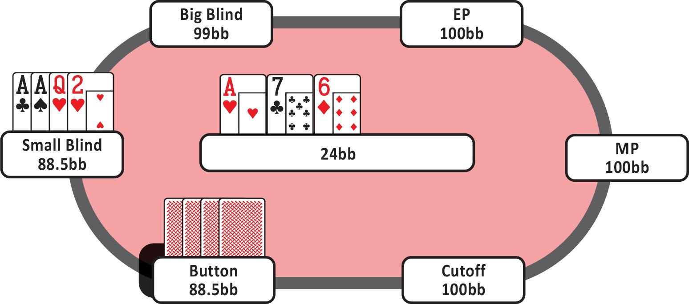

图 98

你击中了顶三条和一个后门同花听牌。在这种情况下，你应该下注以最大化你的价值。在这种情况下，半池和满池下注都可以。半池下注的好处是，你更有可能让对手继续玩一些会在后面的街给他们带来麻烦的手牌。你希望对手继续玩一些顺子听牌和带后门同花听牌的对子，这些手牌可能会在转牌上形成两对或三条。对于这样的手牌，他们很难弃牌。如果你通过满池下注让这些手牌在翻牌圈弃牌，你会错过很多价值。对于那些没有任何后备的弱顶三条，你可以选择满池下注，因为如果你选择较小的下注，可能会在后面的街遇到一些权益实现问题。但如果你有任何类型的后备，较小的下注是更好的选择。

**手牌示例 85**  
你坐在 SB，手牌是 Q♥-10♠-7♠-6♥，BTN 开池。这手牌在多路底池中表现不佳，翻牌后也很平滑，所以你决定 3-bet。翻牌发出 A♦-10♥-2♦（图 99）。

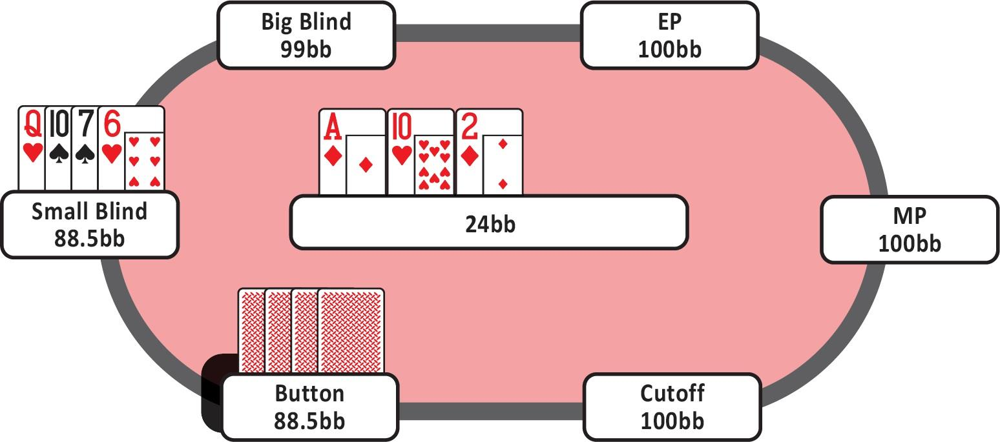

图 99

你持有中间对子的阻挡牌、一个后门同花听牌和一个后门顺子听牌。

在这种情况下，你可以用你的中间对子手牌进行诈唬。你经常有坚果牌，并且阻挡了一些可能与 10♥ 组成对子或三条的牌。此外，你的手牌不够强，无法选择过牌 - 跟注。你应该在这里下注半个底池，并在面对加注时选择弃牌。

### 8.2.4 2- 百老汇牌面

第二种需要考虑的牌面是百老汇牌面。这些翻牌总是包含两张百老汇牌，不会立即形成顺子，且牌面未成对且不是同花。例如 Q♦-J♦-7♣ 和 K♠-J♣-2♦。在这些牌面上，你仍然拥有显著的优势，导致在 SB 对 BTN 的 3-bet 后，你有超过 70% 的时间进行 c-bet。

当牌面湿润时，你的边牌非常重要，你的 c-bet 频率通常会略微降低。当牌面非常干燥时，我们会更频繁地下注。

**下注尺度**  
特别是对于湿润的牌面，你应该同时使用小注和大注。这意味着你使用两种不同的下注尺度。你用中等强度的范围部分下大注，换句话说，使用混合策略。通过这样做，你可以降低 SPR，并尽可能剥夺对手的权益。你还用极化的范围下注小于底池的金额（通常是半个底池）。这为你的诈唬提供了良好的价格，并限制了你最弱手牌的损失。你还希望诱导对手行动，并在你持有最强手牌时让对手继续。

**注意**  
我们特别讨论的是在 SB 对 BTN 的翻牌圈 c-bet。记住，BTN 在翻牌前有一个宽的范围，即使在跟注 3-bet 后也是如此。面对来自 EP、 MP 和 CO 的更紧的开局范围，你应该降低你的 c-bet 频率。面对这些更紧的范围，你主要在翻牌前用 AA 进行 3-bet，而对手的范围将主要是百老汇牌并且很紧，这意味着你必须更加谨慎。

**手牌示例 86**  
你在 SB 持有 A♦-A♣-K♣-9♦。BTN 开池加注，你选择 3-bet。BTN 跟注，翻牌是 K♠-J♦-8♦（图 100）。

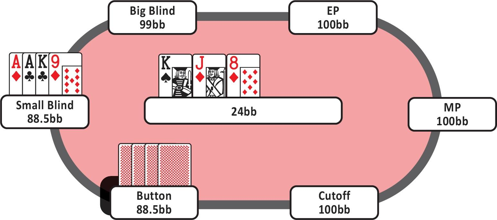

图 100

在这个湿润的百老汇牌面上，你确实有一个下注的范围。记住，在这些牌面上，当你使用极化的策略时，你会下小注。而当你使用混合策略时，你会下大注。在这种情况下，你持有一个超对、顶对的阻挡牌以及坚果同花听牌。你在这个位置非常强，因此这手牌适合使用极化的策略，并应该下注半个底池。

你在这个牌面上选择满池下注的手牌是那些愿意在翻牌圈全押，但在后续街（转牌和河牌）的可玩性非常差的手牌，例如 K♥-K♣-5♣-3♠。这手牌目前对几乎任何范围都有很高的权益，但在后续街的可玩性不足，因此通过全押来尝试尽快结束牌局是有利的。

**手牌示例 87**  
你在 SB 持有 A♦-K♠-10♦-9♠。BTN 开池加注，你选择 3-bet，BTN 跟注。翻牌发出 Q♣-10♣-4♠（图 101）。

图 101

在这种双色牌面上，你的 c-bet 频率不会太高，因为相关的同花非常重要。你的手牌非常依赖转牌的发展。如果你的对手在翻牌圈全押，你可能不得不弃牌。这可能会让你损失很多潜在的权益，因为你有一个卡顺听牌、一个强力的后门同花听牌，以及许多可能对抗对手范围中部分牌的两对补牌。因此，这是少数在这种牌面上更适合选择过牌 - 跟注的手牌之一。

**手牌示例 88**  
你坐在 SB，持有 K♣-K♠-7♦-6♠。BTN 开池加注，你选择 3-bet，对手跟注。翻牌发出 Q♠-10♥-3♥（图 102）。

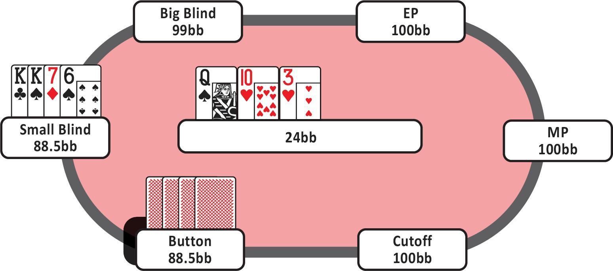

图 102

在这种情况下，你持有一个后门顺子听牌和一个后门同花听牌。选择过牌 - 跟注的决策较为边缘，因为如果对手表现出强势，你可能更倾向于过牌 - 弃牌。因此，你应该在翻牌圈下注半个底池，并在对手加注时选择弃牌。在像 9♠ 和 J♠ 这样的牌面，你可以选择进行两枪下注，因为你持有良好的阻挡牌以及不错的权益。

### 8.2.5 3- 中 / 低湿润牌面

这些牌面较为湿润，通常会有两种花色。它们不会形成顺子，但在这种牌面结构下，存在许多同花听牌的可能性，而这些听牌通常不在你的范围内。

在这些牌面上，你并没有很多强牌，且有许多棘手的后续发牌。因此，你必须更加谨慎，只在 40-60% 的情况下进行 c-bet。例如，10♥-8♠-5♥ 和 8♠-7♦-3♦ 就是这样的翻牌。

**下注尺度**  
在湿润牌面上，你通常会混合使用半个底池和满池的下注尺度。你会用那些缺乏可玩性但具有足够权益和弃牌率的手牌进行满池下注，以确保投资能够实现。你选择下注半个底池是因为你有一些弱牌，无法全下，但可以从对手的弃牌或便宜的转牌中获益。你需要用那些希望对手跟注的强牌来平衡这些下注。

**手牌示例 89**  
你在 SB 持有 K♣-10♣-9♥-8♥，面对 BTN 的开池加注。你进行了 3-bet，BTN 跟注，翻牌发出 9♣-8♣-2♥（图 103）。

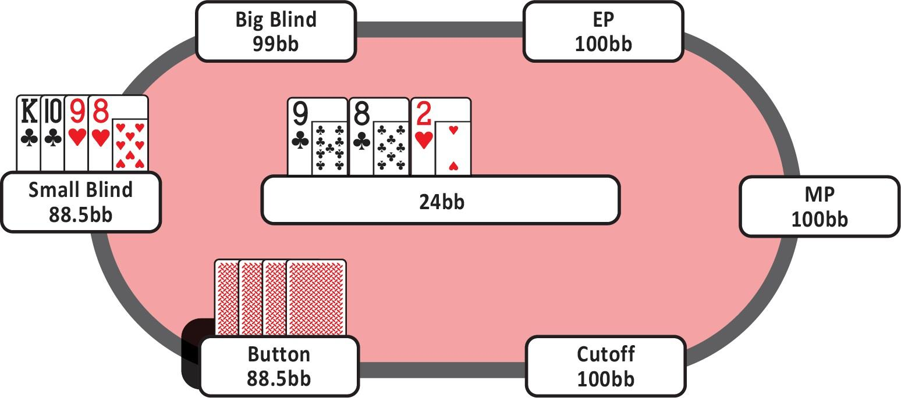

图 103

你在翻牌圈击中了顶两对、K 高同花听牌以及一个后门同花听牌，牌力非常强。

在这个牌面上，你应该意识到自己在转牌和河牌的过渡上并不占优。有许多边缘牌对你的翻牌前范围并不利，比如 J、10、7 或 6。在这些转牌上，你通常不会有太多强牌，因为你的范围主要是超对。你在这些牌面上最好的手牌是带有同花听牌的超对。偶尔你会持有一些顺子听牌，比如你实际持有的这手牌。

你的范围在这个牌面上并没有太多权益，因此你会经常选择过牌，并且需要考虑保护你的过牌范围。如果你阻挡了大部分相关的跟注牌，那么你应该考虑慢打这手牌，以保护你的过牌范围并诱使对手诈唬。K♣-10♣-9♥-8♥ 这手牌具有极强的可玩性和阻挡牌作用，因此你应该将这手牌放入慢打范围，并选择过牌 - 跟注。

**手牌示例 90**  
你在 SB 持有 K♣-Q♥-J♥-J♦，面对 BTN 的开池加注。你进行了 3-bet，BTN 跟注，翻牌发出 J♠-4♣-3♣（图 104）。

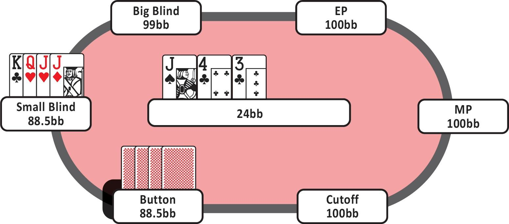

图 104

尽管这个牌面是双花色的，但边牌非常小，任何玩家都很难击中 3 或 4。因此，这个牌面实际上比较 “干燥”。当你确定这个牌面较为干燥时，你应该考虑慢打一些顶三条的组合，因为对手很难持有像顺子听牌、两对或其他可能进行诈唬的牌，尤其是当你持有 K♣ 时。你目前持有的这手牌有很多阻挡牌，能够大幅减少对手的继续游戏范围。因此，选择过牌来保护你的过牌范围是一个不错的策略。

**手牌示例 91**  
你在 SB 持有 K♥-K♦-7♦-5♠，面对 BTN 的开池加注。你进行了 3-bet，BTN 跟注，翻牌发出 J♥-6♠-3♥（图 105）。

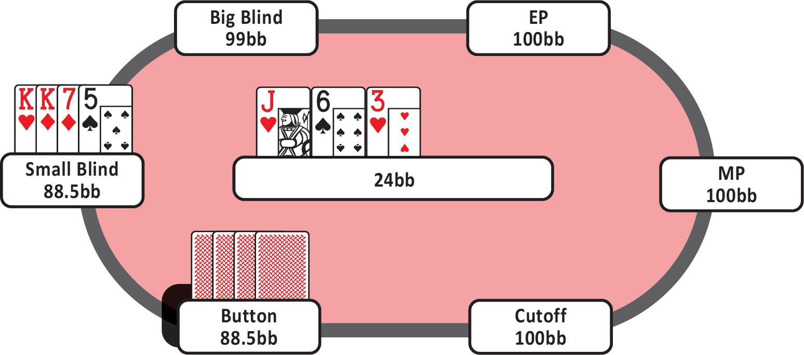

图 105

你有一个超对、一个内听顺子以及未来的 K 高同花阻挡牌。此时，无论是满池下注还是过牌都是可行的。对手很难持有更强的成手牌，因为在这个牌面上不太可能出现太多的三条或两对。

如果你选择满池下注并且所有资金都投入底池，你通常面对的是一个组合听牌，你的处境还算不错。但在这里选择满池下注的主要原因是，你拥有大量的弃牌率，而且即使你遇到三条或两对，你仍然有出路。此外，你的手牌在转牌上没有太多有利的牌，因此在后续街上的可玩性存在一些问题。这也是你希望满池下注并最大化弃牌权益的另一个原因。

### 8.2.6 4- 中 / 低干燥牌面

尽管这些牌面看起来与中 / 低湿润牌面非常相似，但它们的玩法却大不相同，许多玩家会在这里犯错。例如 J♣-7♦-3♥ 和 8♠-3♥-2♣ 就是这样的翻牌。这些牌面对作为 3-bet 者的你非常有利，因为对手很难持有许多强牌，比如三条或两对。你的 AA 牌非常强，因此在这样的牌面上，你有 70% 的概率会进行 c-bet。

**下注尺度**  
在这些中 / 低干燥牌面上，你需要选择满池下注！你可以对对手施加巨大的压力，尤其是当他们是用 A-K-J 或 K-K 组合这类手牌来跟注 3-bet 的玩家时。记住，使用满池下注策略也意味着你需要在完全没有牌力的情况下下注，并在面对加注时选择弃牌。当双方的范围都与牌面没有强烈互动时，3-bet 者具有优势。

**手牌示例 92**  
你在 SB 持有 K♥-Q♥-J♦-8♦，BTN 开池。你进行了 3-bet，BTN 跟注。翻牌发出 Q♣-8♥-3♠（图 106）。

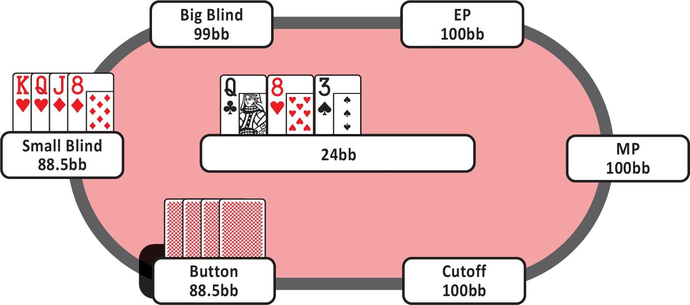

图 106

这个牌面对你的翻牌前范围并不构成太大威胁。你不需要太关注你手牌的花色，因为这里没有可能的同花听牌。AA 牌也可能伴随着 Q 阻挡牌、8 阻挡牌、内听顺子，或者像带有后门顺子听牌和后门同花听牌的手牌。

与双花色牌面相比，这些手牌在彩虹牌面上要强得多，因为你在双花色牌面上没有同花听牌。由于你的 AA 牌在这个牌面上表现非常出色，你可以对对手施加很大的压力。你通常会选择下注，因此没有理由为了保护过牌范围而选择慢打。你希望开始建立底池，因为在许多转牌上，你都会拥有很高的权益，尤其是与双花色牌面相比。

**手牌示例 93**  
你在 SB 持有 A♥-A♠-9♥-3♦，面对 BTN 的开池加注。你进行了 3-bet，BTN 跟注，翻牌发出 10♠-8♥-2♣（图 107）。

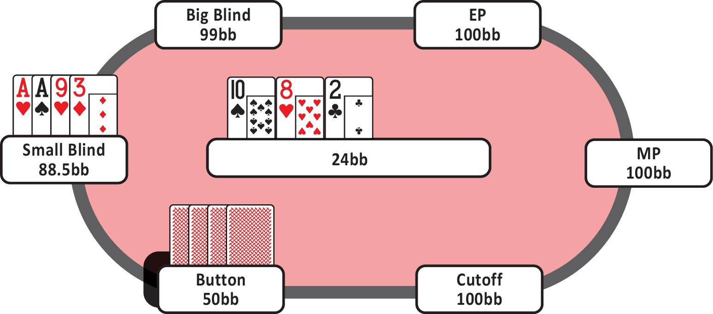

图 107

你的对手筹码较短，因此现在的 SPR 只有大约 2。你的大多数超对都倾向于在这个翻牌上进行满池下注。如果它们有任何阻挡牌或后备支持，它们都愿意全下。在彩虹牌面上，你很难被对手反超，而且当所有资金投入底池时，你通常会拥有很高的权益。在这种情况下，你通过 9♥ 阻挡了一些顺子听牌。你还持有后门同花听牌以及通过 A-3 组成的后门顺子听牌。因此，除了一个相对较强的成手牌外，这个组合还拥有足够的阻挡牌和后门权益，适合在这里进行满池下注，以最大化弃牌率或将所有资金投入底池。

**手牌示例 94**  
你在 SB 持有 7♥-6♣-5♥-4♣，这是一手完美的双同花连牌。BTN 开池后，你进行了 3-bet，对手跟注，翻牌发出 10♥-7♠-5♣（图 108）。

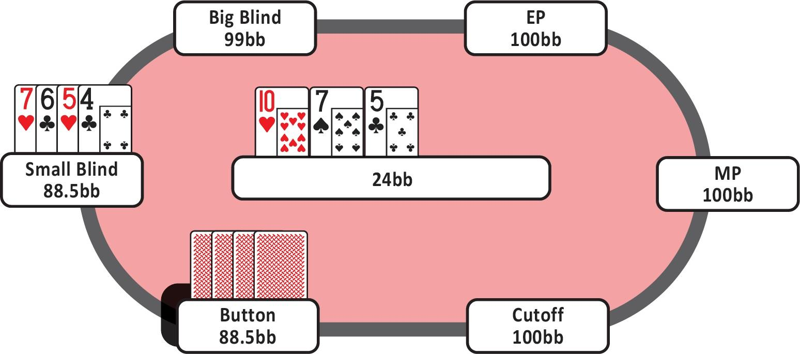

图 108

这个牌面比前两个例子稍微更具连接性，但你仍然希望频繁进行满池下注。原因是你的范围主要由百老汇对子组成，这些手牌在这个牌面上有不错的权益，但缺乏可玩性。

你也会用当前持有的这手牌进行满池下注。主要原因是，有许多较弱的手牌可能会跟注，例如 8-9 组合或任何带有顺子听牌的 10。这些手牌中的许多在权益上落后，但仍然会跟注。如果你选择过牌，这些手牌可能会选择过牌，从而让你错失一些价值。这手牌并不适合慢打，因为有许多转牌会非常棘手，例如 9、J、10、Q 或 K。

在这些转牌上，你可能会被对手的三条、更好的两对或更高的顺子击败。通过降低 SPR，你在这些转牌上的决策会变得更加简单，因为你不需要考虑河牌的过渡。在许多河牌上，你会很难有信心打完全部筹码，因此对手可能会在河牌上轻易地将你诈唬出局。通过满池下注，你剥夺了对手在后续街上诈唬的机会，并在翻牌圈投入大量资金，而此时你可能仍然拥有权益优势。

### 8.2.7 5- 对子牌面

这些牌面很容易分类，因为牌面上有一对。当然，牌面结构仍然可能有所不同。例如，6♠-6♥-5♠ 比 Q♣-2♠-2♥ 更具连接性。6♠-6♥-5♠ 牌面对对手更有利，因为后续发牌的可能性以及他们在翻牌前范围中会持有更多的 6。Q♣-2♠-2♥ 则非常干燥，对你的范围更有利，因为你的范围中包含许多在这个牌面上非常强的超对。

总体而言，你在这些牌面上的 c-bet 频率为 70-90%。连接性较强的中牌面下注频率较低，因为你需要更多的后备权益和阻挡牌来证明下注的合理性。而在连接性较弱的对子牌面上，你具有显著的两极化和权益优势，这解释了较高的 c-bet 频率。

**下注尺度**  
在这些牌面上，你使用较小的 33% 底池下注尺度。对子牌面的目标并不是将所有资金投入底池，因为这需要你持有三条或更强的牌。目标是通过你的超对获取薄价值，从而利用你的权益优势。

**手牌示例 95**  
你在 SB 持有 10♦-10♥-8♦-7♥，并对 BTN 的开池进行了 3-bet。BTN 跟注，翻牌发出 9♦-8♠-8♣（图 109）。

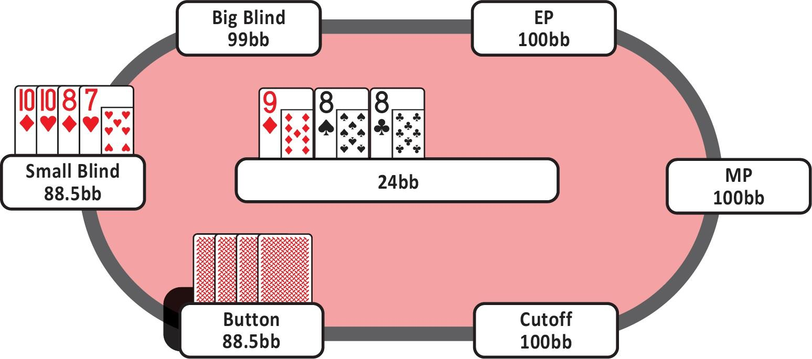

图 109

这是一个连接性很强的对子牌面，所以你不应该频繁进行 c-bet，对吗？一般来说，这是正确的。然而，在这个牌面上，你的 c-bet 频率会非常高。

原因是，你的 3-bet 范围主要包括百老汇对子或 J 高牌双同花连牌，而这些连牌在这个牌面上表现非常强势。如果你没有顺子或顺子听牌的阻挡牌，或者后门同花听牌，那么在这个牌面上选择过牌是有道理的。但当你持有 10♦-10♥-8♦-7♥ 时，你并没有阻挡对手的继续游戏范围（例如 KK、QQ、JJ），同时你通过持有两张 10 和一张 7 阻挡了对手的部分诈唬范围。因此，你应该在这个牌面上以 33% 底池的尺度进行下注。

**手牌示例 96**  
你在 SB 持有 A♠-8♣-7♠-6♣。BTN 开池后，你进行了 3-bet，BTN 跟注。翻牌发出 4♥-2♥-2♣（图 110）。

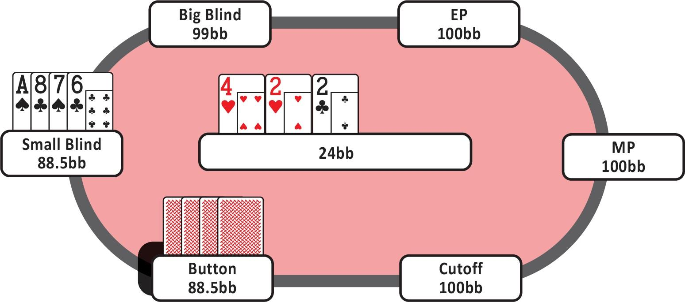

图 110

当对手在对子牌面上不太可能持有三条时，你具有巨大的两极化优势。你可以通过以 33% 底池的尺度下注你的整个范围来利用这一点。在这种情况下，对手几乎不可能持有 2，因此你可以用整个范围以 33% 底池的尺度下注。

如果翻牌是 5♥-5♠-4♥，情况会更为危险，因为对手比你更可能持有 5-x，并且在这个牌面上，对手还可能持有更多的强组合听牌。

因此，在后一种牌面上，你需要更加谨慎，并考虑手牌的可玩性以及是否愿意建立底池。如果你完全没有牌力，例如 A♠-J♥-10♦-6♦，你通常会选择放弃。仅持有后门同花听牌和同花听牌阻挡牌并不足以支持下注，选择过牌 - 弃牌即可。

### 8.2.8 6- 顺子牌面

这些牌面可能出现顺子。例如 7♣-6♠-4♠、A♥-5♦-3♣ 或 K♣-Q♠-J♦。需要注意的是，牌面的高低仍然很重要。牌面越高，你下注的频率就越高。在所有可能形成顺子的牌面上，你的平均 c-bet 频率应该在 30-40% 左右。

在中低牌面上，你比在高牌面（如 K-Q-J）上更倾向于过牌。事实上，在许多中低顺子牌面上，你应该选择过牌整个范围，因为对手具有权益优势，而你需要更多的保护。过牌整个范围是一种简化的策略，可以根据对手的情况进行调整。

**下注尺度**  
最佳的下注尺度是半个底池。大多数顺子牌面相对干燥，因为通常没有太多手牌组合能够对抗坚果顺子。这意味着你需要的保护较少，因为需要处理的牌面变化较少。记住，在低牌面上，你应该选择过牌整个范围。

**手牌示例 97**  
你在 SB 持有 A♠-J♣-10♠-8♣。BTN 开池后，你进行了 3-bet，BTN 跟注，翻牌发出 5♠-4♠-2♣（图 111）。

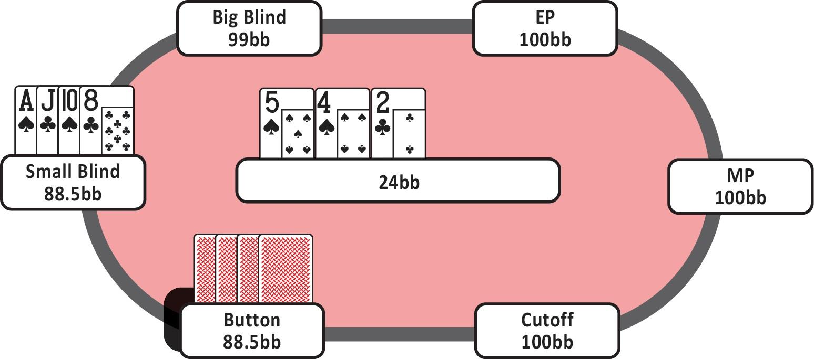

图 111

这是一个由三张小牌组成的牌面，且存在同花听牌的可能性。在这种牌面上，你应该非常谨慎地进行 c-bet，甚至可以像之前讨论的那样选择过牌整个范围。

原因是，对手在这个牌面上可能持有更多的顺子听牌或成顺牌。你持有的 A♠-J♣-10♠-8♣ 并没有成手牌价值，但你有坚果同花听牌和一个后门同花听牌。考虑到对手可能会用来诈唬的手牌，他们可能持有 3、4、5、6，甚至完全没有牌力，因为这个牌面并不太适合你的范围。

因此，你选择过牌，而对手决定下注半个底池。在这种情况下，你对手的范围有一定的权益，但手牌的可玩性较弱，因为有许多转牌对你的范围和实际手牌都不利。由于对手可能有很多诈唬牌，你在这里可能有很高的弃牌权益。因此，选择过牌 - 加注是最好的选择，以最大化弃牌权益并减少在不利位置下处理棘手转牌的可能性。

**手牌示例 98**  
你在 BB 持有 K♠-K♦-10♣-9♠。BTN 开池后，你选择了明显的 3-bet。BTN 跟注，翻牌发出 6♠-5♠-3♥（图 112）。

图 112

这是另一个你 c-bet 频率非常低的牌面示例。

那些希望在这个翻牌上下注的手牌通常是一些具有高权益的手牌，如果选择慢打会牺牲太多 EV，例如 A♠-A♦-7♠-8♥。然而，你实际持有的这手牌并不足够强到下注。如果你下注并被跟注，后续会有许多转牌让你难以处理。因此，你应该选择过牌。当对手下注半个底池时，你可以选择过牌 - 加注，因为虽然你的手牌在后续发牌上没有太多有利的出路，但你拥有可观的底池权益和弃牌权益。

**手牌示例 99**  
你在 SB 持有 K♥-K♣-9♥-8♠。BTN 开池后，你进行了 3-bet，BTN 跟注。翻牌发出 7♥-5♦-4♣（图 113）。

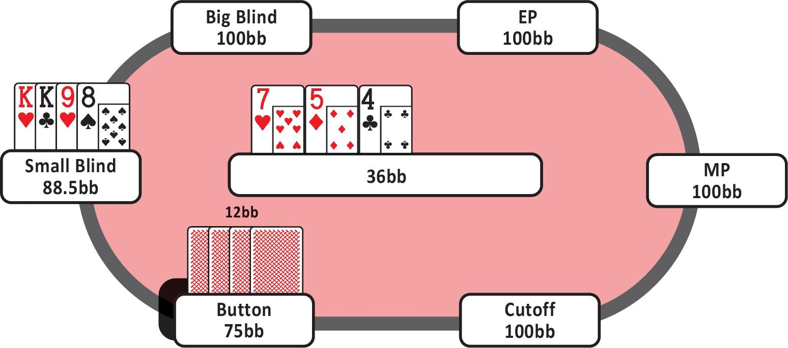

图 113

由于这是一个彩虹牌面，且你没有任何手牌在这个牌面上强到足以下注，因此你应该选择过牌整个范围。于是你选择过牌，而对手决定在一个 24 bb 的底池中下注 12 bb。对手仅剩下 75 bb，而你有足够的出路来证明全下是合理的，以最大化弃牌权益。即使你遇到一对加顺子听牌或两对，你的处境也不错。在这个牌面上，大多数在有利位置的玩家会频繁进行诈唬下注，因此你可以假设自己拥有很高的弃牌权益。

### 8.2.9 7- 单同花牌面

单同花牌面难以处理，但对你的整体盈利影响不大，因为它们只在大约 5% 的情况下出现。在这些牌面上，同花已经可能形成。例如 5♦-4♦-2♦ 和 A♣-Q♣-5♣。

总体而言，你在这些牌面上的下注频率仅为 30-50%。许多玩家过于关注同花的可能性，而忽略了牌面结构。牌面上是否存在顺子可能、是否有对子、有多少百老汇牌等因素都会产生巨大影响。必须认识到，尽管牌面有三张同花色牌，但它仍然具有特定的结构。百老汇牌对 3-bet 者仍然比低牌更有利，而 A 高牌面仍然比百老汇牌面更好。

这些牌面中有相当一部分是非常静态的，通常你会倾向于被动地进入摊牌阶段，这意味着你希望以尽可能低的成本进入摊牌。你持有大超对，通常也有更好的两对，因此进入摊牌是理想的选择。

**下注尺度**  
你使用较小的 33% 底池下注尺度。选择如此小的下注尺度的原因是，坚果牌很少发生变化（只有在牌面出现对子时才会变化），因此你不需要太多的保护。如果你已经形成同花，你不需要太多保护，并且仍然可以在三条街上利用你的筹码深度。

**手牌示例 100**  
你在 SB 持有 K♥-K♣-6♣-4♥。BTN 开池后，你进行了 3-bet，BTN 跟注，翻牌发出 A♣-J♣-5♣（图 114）。

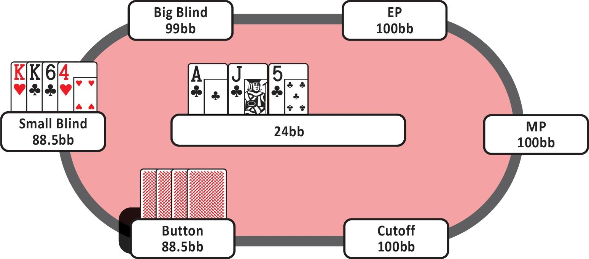

图 114

你击中了坚果牌，但请记住，你仍然需要注意牌面结构。这是一个 A 高的单同花牌面，这意味着它对你的范围比对对手的范围更有利。即使在单同花牌面上，牌面的高低也会影响你的下注频率，牌面越高，你的下注频率越高。接下来需要考虑的是你阻挡和未阻挡的牌。在这种情况下，你并没有阻挡 A、J 或 5，这使得你的手牌更适合下注，因为你可以从更多手牌中获取价值。因此，你应该选择以 33% 底池的尺度下注。

**手牌示例 101**  
你在 SB 持有 A♦-10♣-9♦-7♠。你对 BTN 的开池加注进行了 3-bet，对手跟注，翻牌发出 6♥-5♥-2♥（图 115）。

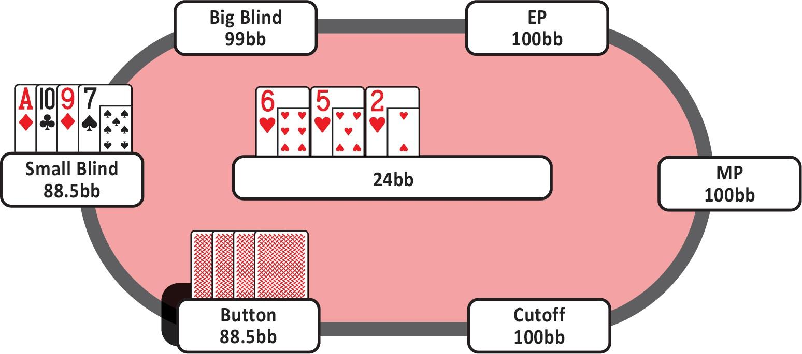

图 115

由于牌面的等级，这个牌面并不适合进行 c-bet。在这个牌面上，你的过牌范围需要大量保护，因为你很少能在这个牌面上击中两对、三条或顺子。因此，在下注时需要更加谨慎。你持有的这手牌适合争取免费牌，因为如果转牌发出 8，你可以击中内听顺子。你也没有阻挡对手的跟注范围，并且你的手牌无法在多条街上进行有利可图的下注，因为你没有阻挡任何高红桃。鉴于你手中的阻挡牌并没有减少对手弃牌的可能性，你应该选择过牌 - 弃牌。

**手牌示例 102**  
你在 BB 持有 K♠-10♠-10♥-7♥。BTN 开池后，你进行了 3-bet，对手跟注，翻牌发出 8♥-5♥-3♥（图 116）。

图 116

这是另一个你的范围需要大量保护的牌面，因为你在这个翻牌上没有太多强牌，也没有太多有利的后续发牌。因此，你希望频繁过牌。你的手牌无法在三条街上进行价值下注，因此它是保护过牌范围的理想选择。在这个牌面上，你的较低同花会比高同花更多地选择慢打。当你持有非常强的手牌时，未能让对手全下会损失更多价值，而当你持有弱或中等同花时则不会。此外，你并不希望用所有同花下注，因为那样你的过牌范围将变得空虚且非常脆弱。因此，在这种情况下，你应该将这手牌加入你的过牌 - 跟注范围。

### 8.2.10 猜猜频率

在本章的最后，我们将通过一些练习来训练你的直觉。首先，识别牌面类型，然后决定在 SB 对 BTN 进行 3-bet 后，你认为自己需要在翻牌后下注的频率。

K♠-J♣-6♦  
这是一个彩虹百老汇牌面，在这种牌面上，你有 95% 的概率需要下注。记住，当百老汇牌面非常湿润时，你需要减少下注频率，因为你需要更谨慎地选择你的边牌。如果牌面不是双色，你可以更频繁地下注，因为你具有较大的极化和权益优势。此外，你不需要担心对手可能持有的同花听牌。

9♣-3♣-2♠  
这是一个中低干燥牌面，尽管你可能会疑惑为什么它被认为是干燥的。这个牌面是双色的，并且有一定的连接性，但连接性是基于 2 和 3 的。这并不算 “湿润”，因为对手很少会与这些牌连接，且他们的翻牌前范围中不会有太多 4-5-6 的组合。如果牌面是 7♣-8♣-2♠，情况就完全不同了。然而，9♣-3♣-2♠ 对 3-bet 者非常有利，因为对手很少有三条、两对或大顺子听牌，因此你的超对在这个牌面上有很高的权益。因此，你可以约 80% 的频率进行 c-bet，并使用一个底池大小的下注。

10♦-9♥-8♠  
这是一个顺子牌面，对你的范围非常不利，因此你只有 10% 的概率下注。对手在这个翻牌上经常会持有两对或更好的牌。如果牌面更高，例如 K-Q-J，你会更频繁地下注。如果牌面更低，你会选择全范围过牌。

7♦-3♣-3♦  
这个对子牌面对你非常有利，因为对手的翻牌前范围不太可能击中 3。因此，你的 c-bet 频率为 95%，并使用 33% 底池大小的下注。

### 8.2.11 主要要点

- 注意牌面结构！学习并识别七种不同的牌面结构。
- 如果牌面是静态的，你需要的保护较少，这意味着你应该使用较小的下注尺寸。如果牌面非常湿润，你的范围需要更多保护，你应该使用较大的下注尺寸。
- 在以下情况下，你应该频繁进行 c-bet：
  - 牌面对你的范围有利，例如 A 高牌、百老汇牌面、非常低且不连接的牌面。
  - 双方都没有击中牌面。
  - 在单调和顺子牌面上，记住牌点的等级。不要只关注顺子和同花的可能性。

## 8.3 3-bet 底池中在不利位置的转牌 / 河牌打法

### 8.3.1 介绍

当你在 3-bet 底池中处于不利位置时，只有三种主要路径可以进入转牌：

1. 你在翻牌圈下注并被跟注。此时 SPR 已经非常小，通常在 1.5 左右。你应该主要通过满池下注来最大化价值手牌的价值和保护。这在动态牌面上尤其重要，因为此时尚未可能形成同花或葫芦。由于对手在翻牌圈跟注，他们在你下注转牌时很可能会用更弱的手牌全下。
2. 你在翻牌圈选择过牌 - 跟注。在这种情况下，对手通过在翻牌圈下注表现出了强牌。除非转牌大幅改变了牌面结构并对你有利，否则你应该几乎总是选择在转牌圈过牌。
3. 双方都在翻牌圈过牌。此时对手的范围主要是受限的。在这种情况下，开始进行更薄的价值下注是有意义的。例如，像 A-A-x-x 这样的手牌如果在翻牌圈没有下注，现在可以选择以半个底池的尺度下注，以获取一些价值并保护自己的范围。诈唬或半诈唬也很有意义，因为对手在翻牌圈选择过牌表明他们对底池的兴趣不大。

接下来，我们将通过多个手牌示例来探讨这三种不同的情况。

### 8.3.2 翻牌圈 c-bet 后的转牌过渡

**手牌示例 103**  
你在 SB 持有 A♣-9♣-9♠-8♠。BTN 进行了最小加注，你进行了 3-bet，BTN 跟注，翻牌发出 K♦-10♣-8♣（图 117）。

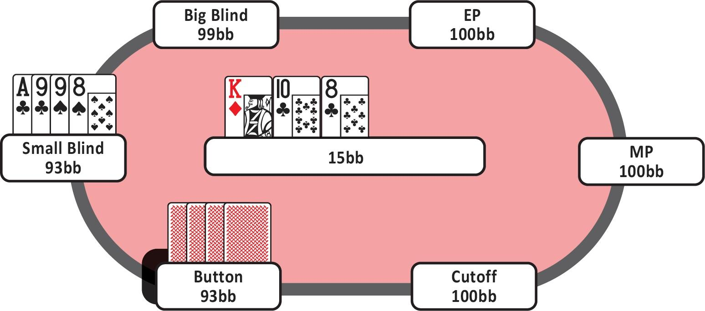

图 117

通常在 3-bet 底池中，SPR 大约为 3.5-4，但由于 BTN 进行了最小加注，SPR 约为 6，这使得处于不利位置的玩家处于更大的劣势。

在较高的 SPR 下，你不太倾向于使用满池下注，因为你将需要处理更多的过渡。你需要在不利位置下玩更多的转牌和河牌，因此在牌面结果尚不确定时，你更倾向于保持底池较小。

因此，当 SPR 大于 4 时，你应该使用较小的下注尺度。倾向于使用 66% 或 75% 底池的下注尺度，而不是满池下注（这是在这种牌面上的基准下注策略）。你选择的下注尺度取决于牌面结构。牌面越湿润，你越应该使用 75% 的下注尺度。在 K♦-10♣-8♣ 这个非常湿润的牌面上，75% 的下注尺度是合适的。

*当 SPR 为 6 时，你应该更加关注手牌的可玩性。阻挡牌变得更加重要，而那些在转牌和河牌上没有太多良好过渡的手牌价值会降低。这是因为你无法通过在翻牌圈将所有资金投入底池来推动你的权益。*

你持有的这手牌没有后门同花听牌，也没有顺子听牌。因此，转牌可能会变得难以处理。当 SPR 仅为 3.5 时，这不是一个大问题，因为你可以使用满池 c-bet，这样你在转牌上的决策会更容易。然而，这种情况不同。转牌上的 SPR 会更高，因此你需要更加关注（后门）可玩性。

如果你持有 A♣-9♣-9♦-8♦，你会更倾向于下注而不是过牌，因为你有更多的未来可玩性。但就你当前的手牌而言，由于没有后门同花听牌，过牌和下注之间的 EV 差异非常小。如果你的对手在 BTN 玩得很宽，或者在 3-bet 底池中经常弃牌，那么你更倾向于下注。否则，选择过牌 - 跟注。在这种情况下，你决定下注，对手跟注。

转牌发出（K♦-10♣-8♣）-Q♠。此时，有几个关键点需要考虑。首先，SPR 约为 2，这意味着你仍然有一定的弃牌权益。对手可能在翻牌圈持有弱两对，并希望发出空白牌。然而，Q 对这些弱成手牌并不友好。与此同时，你仍然对任何手牌有一定的权益，因为你持有内听顺子和坚果同花听牌。你还通过两张 9 和一张 A 持有阻挡牌。这是一个施加更多压力的好时机，选择满池转牌下注是最好的选择。

**手牌示例 104**  
你在 SB 持有 A♥-A♠-7♣-3♣。BTN（一位娱乐玩家）开池加注，你假设他的范围非常宽且激进。你进行了 3-bet，对手跟注，翻牌发出 A♣-K♥-2♦（图 118）。

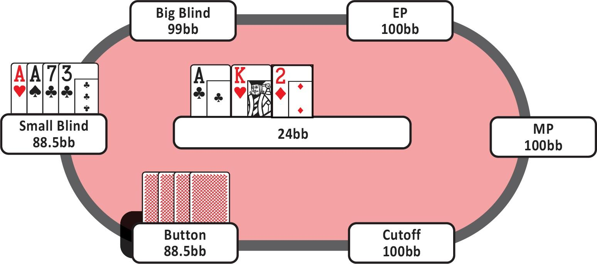

图 118

你当前的 SPR 约为 3.5。

正如你现在所知，在 A 高牌面且 SPR 为 3.5-4 的情况下，你会使用半个底池或满池的下注尺度。然而，不要认为你必须局限于使用标准的下注尺度。如果你认为在特定情况下，另一种下注尺度更有利可图，那就大胆尝试！

如果你认为对手在面对小额下注时会非常宽松地继续游戏，那么你可能会倾向于使用较小的下注尺度来获取价值。就这手牌而言，没有必要使用较小的下注尺度，因为你没有或阻挡任何顺子听牌。因此，对手很可能会继续跟注。但请记住，你可以自由调整下注尺度。

另一方面，假设你正在对抗一个非常紧的范围，例如 20% 的 EP 范围。那么你可能会希望使用更大的下注尺度，因为这种紧范围会包含许多 K-K 组合，而你希望确保能够让对手的中三条全下。通过小额下注，你可能会让对手在危险的后续发牌中逃脱。记住对抗宽范围和紧范围的区别。对抗宽范围时，尽量让对手缠打，尤其是当你还有补牌时。对抗紧范围时，尽量让对手的中三条全下并冷跟。

在这种情况下，你没有最好的补牌，而对手也非常激进，可能有点 “浪”，因此他们可能会过于宽松地继续游戏。你选择下注半个底池，对手跟注。

转牌发出 3♥。牌面现在是 A♣-K♥-2♦-3♥，引入了后门同花听牌。此时我们需要决定是否尝试设陷阱。当你想要设陷阱时，应该考虑对手下注的可能性有多大、你需要多少保护，以及如果对手在转牌圈选择过牌会对你造成多大影响。假设你持有 A♣-A♥-Q♥-J♣ 这样的手牌，那么对手继续游戏的可能性非常低，而你完全不需要保护。因此，选择过牌可能非常有意义，尤其是对抗过渡激进的玩家。

而对于 A♥-A♠-7♣-3♣ 这手牌，选择过牌的意义不大，因为你持有坚果同花听牌的阻挡牌，这使得对手不太可能用混合范围的手牌（例如顶对加坚果同花听牌）进行诈唬。同时，如果对手持有 K、内听顺子和同花听牌，而你在转牌圈选择满池下注，他们会处于非常不舒服的位置，因为你可能持有坚果同花听牌，这样他们的同花听牌将不再有效。

因此，这里有一个很好的理由通过在转牌圈进行两枪下注来获取一些保护，同时你也希望确保如果对手持有 K-K 或 A-K 这样的手牌时能够全下。这是我实际打过的一手牌，我在转牌圈下注了 50% 底池。事后看来，我认为在转牌圈选择满池下注会更好，以确保能够让 K-K 和 A-K 全下，同时也能从组合听牌中获取最大价值（如果他们选择继续），或者最大化对某些较弱听牌的弃牌率。在这种情况下，我的对手对我的 50% 底池下注选择了全下。我选择跟注，并赢下了一个 \$1,000 的底池，对手在转牌圈击中了两对，手牌是 A♦-J♠-9♦-3♠。

**手牌示例 105**  
你在 SB 持有 A♦-Q♠-9♦-9♠。BTN 是一位非常宽且 “浪” 的玩家，他使用底池尺度开池加注，你进行了 3-bet，对手跟注。翻牌发出 6♦-4♦-4♥（图 119），这是一个你应该更加谨慎选择下注频率的牌面，因为对手更可能持有三条，并且通常有更好的后续发牌。

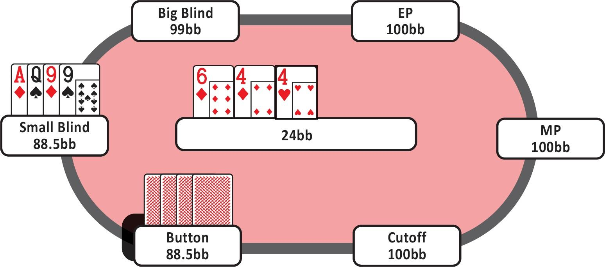

图 119

因此，你必须谨慎地建立底池。一般来说，对于那些在多种转牌和河牌上难以处理的手牌，最好保持谨慎。对于 A♦-Q♠-9♦-9♠ 这手牌，你不需要过于谨慎，因为如果你下注并被加注，你可以选择跟注甚至再加注。你的手牌几乎对任何手牌都有权益，但后续发牌并不太有利。你可能会让对手弃掉一些有摊牌价值的手牌，这将非常有利可图。因此，选择下注 33% 底池。如果你持有同样的手牌但没有同花听牌，你需要更加谨慎，因为你不想被加注，也不希望在翻牌圈将所有资金投入底池，因为你几乎对 4 没有权益。

转牌发出 8♠，牌面变为（4♥-4♦-6♦）-8♠。现在你需要决定是否要进行两枪下注或选择过牌。你在翻牌圈没有被加注，因此对手很可能没有 4 或更强的牌。通过两枪下注，你可以让许多比你手牌更强的手牌弃牌，例如 10-10、J-J、Q-Q，甚至可能是 K-K。面对两枪下注，许多玩家会弃掉这些超对。因此，这可能是一个适合在转牌圈进行两枪下注的手牌，以让更高的对子弃牌，而如果你被跟注，你仍然有权益。在实际对局中，我选择了过牌 - 跟注。事后看来，我并不喜欢这个决定。

河牌发出 K♥，牌面变为（4♥-4♦-6♦-8♠）-K♥。在双方都选择过牌后，对手亮出了 8♣-10♣-10♦-J♠。这手牌可能会在面对转牌圈的满池下注时选择弃牌。

### 8.3.3 翻牌圈过牌 - 跟注后的转牌过渡

**手牌示例 106**  
你坐在 SB，持有 A♣-J♦-10♠-9♣，BTN 是一位很强的常客玩家，他开池加注。你进行了 3-bet，BTN 跟注，翻牌发出 9♠-8♥-8♦（图 120）。

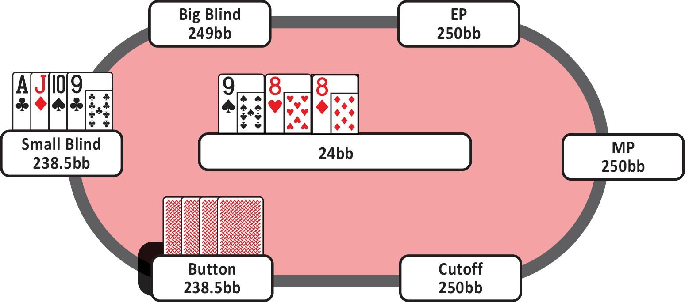

图 120

这手牌的深度为 250 bb，因此翻牌圈的 SPR 约为 10。在这个牌面上，你击中了顶对和一个两端顺子听牌。你阻挡了对手在这个翻牌圈的大部分加注范围，因为你持有顶对的阻挡牌，并且阻挡了许多对手可能用来加注或跟注的顺子听牌。因此，用这手牌下注时，你最小化了对手跟注甚至加注的可能性。在这种情况下，你拥有很高的弃牌权益。同时，如果你被加注，你可以选择跟注，因为你还有顺子听牌作为后备。你当前的摊牌价值并不高，因此如果对手弃掉任何有摊牌价值的手牌，你将受益匪浅。基于这些原因，你选择在翻牌圈下注 33% 底池，对手跟注。

转牌发出 2♦，牌面变为（9♠-8♥-8♦）-2♦。你决定过牌，因为你的权益没有提升，而对手此时很可能持有一手不错的牌。对手现在选择在转牌圈满池下注。你需要考虑的主要是你的权益。面对所有包含 8 的手牌，你的权益非常低。你还通过持有顺子听牌和顶对阻挡了对手的诈唬范围。基于这些原因，你应该在面对这个转牌圈满池下注时选择弃牌。

**手牌示例 107**  
你在 BB 持有 A♠-A♥-J♦-9♠。BTN 玩家开池下注，你进行了 3-bet，对方跟注，翻牌发出 9♦-6♠-4♦（图 121）。

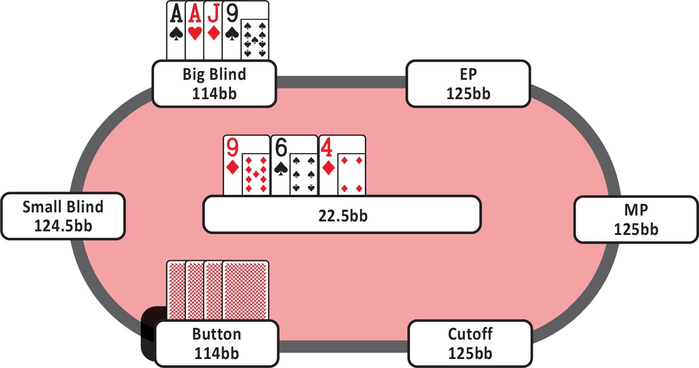

图 121

你的筹码略多于 100 bb，因此 SPR 约为 5。在这个翻牌面，你的 c-bet 频率不会很高，因为牌面由三张中小点数的牌组成，而你的手牌并没有很好地击中这个牌面。此外，后续的转牌和河牌也不太可能对你的翻牌前范围非常有利。你需要保护你的过牌范围，并利用一些带有额外补牌的超对（如带同花听牌、带后门同花听牌的顺子听牌）来进行翻牌圈的过牌加注。如果你的手牌有较高的原始权益，但在后续牌面缺乏可玩性，那么你更应该在翻牌圈进行过牌加注。如果你的手牌可玩性较高，那么你更倾向于下注以扩大底池。还有一些手牌虽然有不错的阻挡牌效果，但由于缺乏可玩性和原始权益，无法进行过牌跟注，这些手牌通常会选择下注后弃牌。

手牌 A♠-A♥-J♦-9♠ 的决策很大程度上取决于转牌。你有一个后门同花听牌、两对补牌，或者可能会击中三条。与此同时，你的牌力不足以在翻牌圈全押，尤其是在当前 SPR 的情况下。如果 SPR 是 3.5，考虑到你的阻挡牌，你可以在翻牌圈进行底池下注。但这里的 SPR 更高，因此过牌是更好的选择。如果你下注后被加注，你很容易在后续街被对手诈唬出局。

因此你选择过牌，对手下注半个底池。你的手牌有太多权益不能弃牌，但 SPR 太高，不适合考虑过牌加注并全押。所以你选择过牌跟注。

在考虑转牌之前，我们需要意识到有一些转牌是你应该主动下注的。主要原因是牌面会变得非常湿润（听牌很多），对手有很大概率会选择过牌。与此同时，当你在转牌圈选择底池下注时，河牌的 SPR 会变得很低。在转牌发出 A、J 或 2♠ 时，你应该进行底池下注，因为你无论如何都不会弃掉这手牌，而如果对手落后，他们通常会选择过牌并免费看一张牌。然而，如果他们领先，他们会下注。因此，过牌并不能为你带来太多好处，你只是在给对手免费看牌的机会。如果你能显著提高权益和弃牌权益，翻牌圈过牌跟注后再在转牌下注有时是一个可行的选择。

**手牌示例 108**  
转牌是 8♦，牌面变为（9♦-6♠-4♦）-8♦（图 122）。

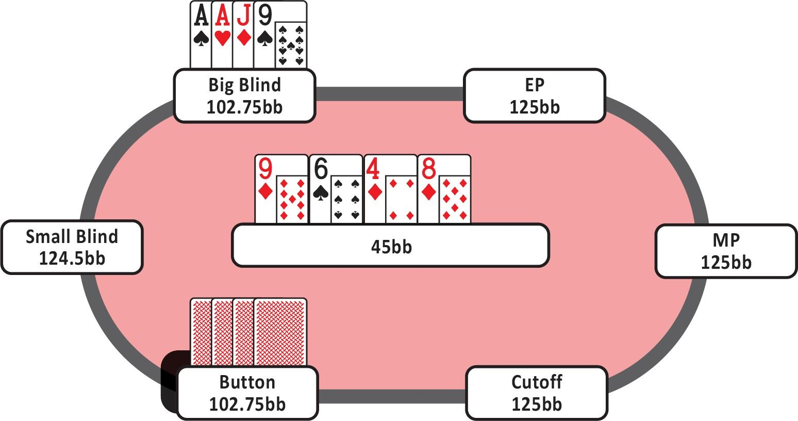

图 122

几乎所有的听牌都完成了，但你仍然持有一些微弱的摊牌价值。在这个转牌圈，你的手牌和范围都没有得到提升，因此你应该选择过牌并在对手下注时弃牌。然而，行动是双方都选择过牌。

河牌是 A♣，牌面现在为 9♦-6♠-4♦-8♦-A♣。你击中了顶三条，但牌面上有许多手牌可能已经击败了你。你选择过牌，对手下注 33% 的底池。在这种情况下，你应该弃掉你的手牌，因为几乎所有的听牌都完成了。8♦ 使得许多顺子和同花成为可能，而对手在这种牌面下不太可能将许多成手牌转为诈唬。对手的行动表明他们持有一手非坚果牌，比如顺子或同花听牌，但仍然有很高的权益和补牌，他们在转牌圈选择了控池打法。这个故事与河牌的下注尺度是一致的。结合对手在这个位置缺乏天然的诈唬范围，你应该倾向于弃掉这手牌。

**手牌示例 109**  
你在 SB 持有 K♣-K♦-Q♦-3♠，BTN 玩家开池。你进行了 3-bet，BTN 玩家跟注，翻牌发出 J♣-9♦-7♠（图 123）。

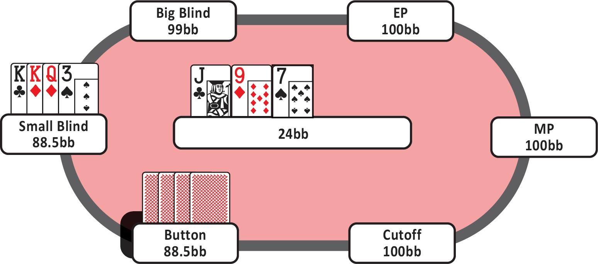

图 123

如前所述，这种 J 高牌的翻牌面对你的翻牌前范围来说并不算太差，你应该在这个翻牌面上有一个相对较高的 c-bet 范围。对于 K♣-K♦-Q♦-3♠ 这手牌，考虑到你的权益以及你并不一定阻挡对手的加注范围（例如带两端顺子听牌或卡顺听牌的两对或三条），你也可以选择过牌跟注。除非对手非常被动，否则你可以在这里进行 c-bet，因为你的手牌需要一定的保护，并且你可以从许多更弱的手牌中获得价值。

手牌示例 110  
转牌是 Q♣，牌面变为（J♣-9♦-7♠）-Q♣（图 124）。

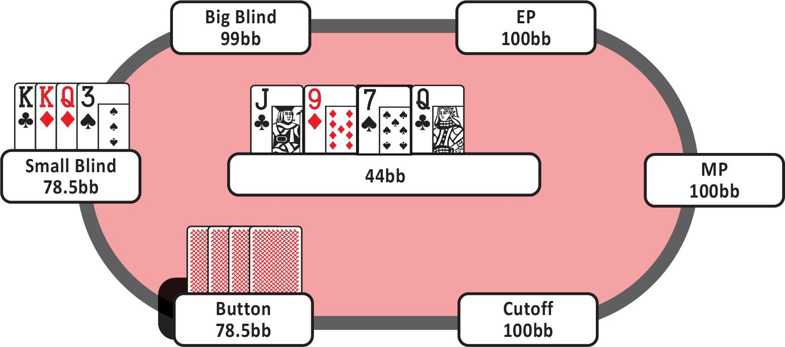

图 124

此时，你阻挡了坚果顺子（K-10）以及未来的同花听牌 K♣。在转牌圈，SPR 小于 2，这限制了你在这里成功诈唬的能力。然而，更重要的是，你的手牌中没有 10。10 是对手非常有价值的一张牌，因为当他们持有 10 时，他们会严重阻挡我们的价值下注范围。因此，他们更有可能进行英雄跟注。

你持有两张 K，但在这个场景中，K 的重要性远不如 10。你没有太多的弃牌率，而且你经常会遇到像 J-10-9 这样的手牌跟注到底，甚至对手可能会用这样的手牌在转牌圈全押。在这种情况下，过牌弃牌是最好的选择。

### 8.3.4 翻牌圈过牌后的转牌过渡

当位置优势玩家在翻牌圈选择过牌时，通常意味着他们的范围是受限的，因为他们的大部分强牌会希望构建一个更大的底池。而位置劣势玩家的范围并不受限，因为他们的过牌范围中包含许多强牌，这些强牌原本计划进行过牌加注或设陷阱。这意味着，当进入转牌圈时，不利位置玩家的范围通常不受限且具有范围优势。因此，他们可以更薄地价值下注，并更激进地进行诈唬。

**手牌示例 111**  
你在 SB 持有 A♦-A♠-K♥-7♦。BTN 玩家开池，你进行了 3-bet，BTN 玩家跟注，翻牌发出 6♦-5♥-3♠（图 125）。

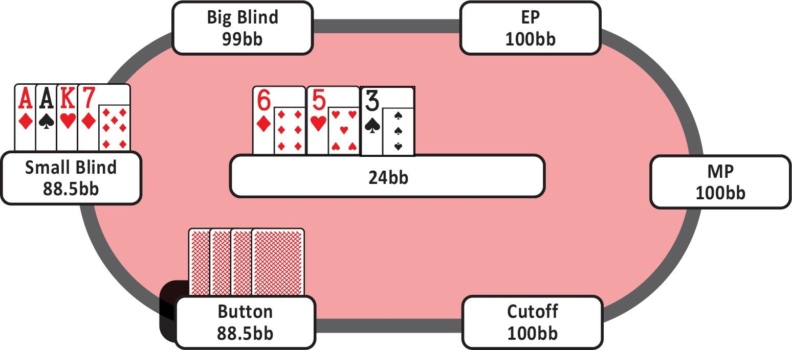

图 125

这是一个非常轻的牌面，不太可能特别击中任何一方的范围。然而，你的对手在这个牌面上会比你多一些强牌。在这个翻牌圈，你应该过牌几乎所有的牌，因为你不会有太多强牌。你手中的 7 和后门同花听牌是一手应该过牌跟注的牌，因为你具有权益、重要的阻挡牌，并且对手的翻牌前范围与这个牌面的互动性并不强。你选择过牌，对手也选择过牌。

**手牌示例 112**  
转牌是 J♦，牌面变为（6♦-5♥-3♠）-J♦（图 126）。

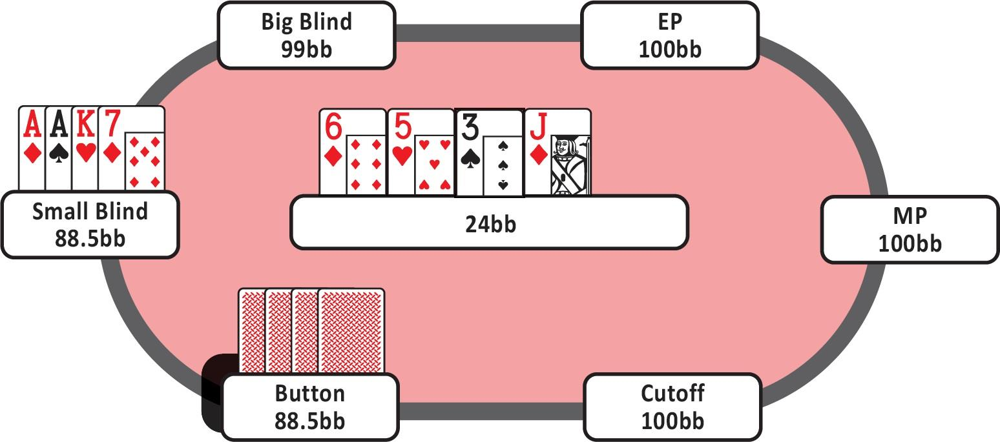

图 126

此时，你仍然阻挡了顺子，但更重要的是，对手在翻牌圈选择过牌后极大地限制了他们的范围。因此，你可以在转牌圈进行价值下注。在这个转牌圈，没有必要下注太大，因为你希望被更弱的同花听牌、更弱的超对以及可能持有 J 的牌跟注。因此，下注半个底池是合适的选择。

**手牌示例 113**  
你在 SB 持有 K♣-Q♣-9♦-7♦。BTN 玩家开池，你进行了 3-bet。这手牌在 3-bet 时无疑处于边缘范围，因为方片同花较低且连接性较弱，但它仍然是可以接受的。你也可以选择跟注，甚至如果面对一个非常紧的 BTN 开池范围时可以选择弃牌。

在这个例子中，你决定进行 3-bet，BTN 玩家跟注，翻牌发出 J♥-9♣-7♠（图 127）。

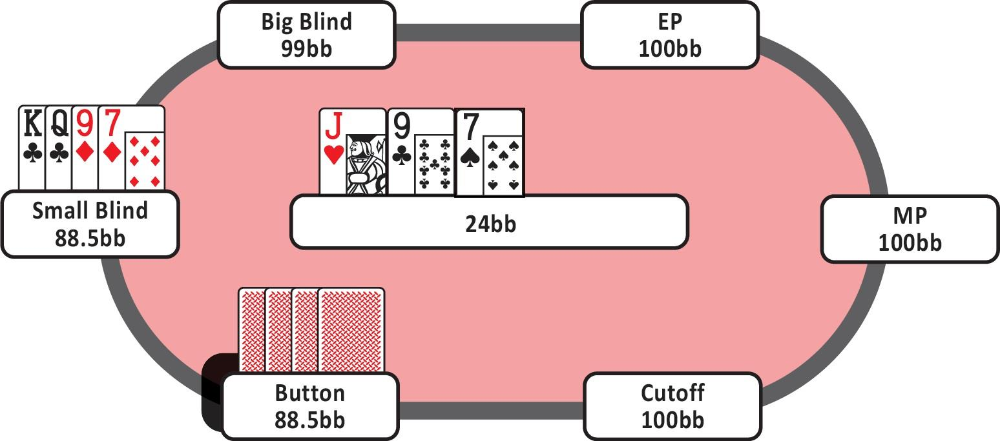

图 127

如你所知，这个牌面对翻牌前的激进者非常有利，因为你在 3-bet 范围内有很多双同花的 Q 高、J 高和 10 高的连牌。

你当前的这手牌具有很高的价值，因为你阻挡了许多强牌。你持有两对，这意味着你阻挡了许多三条的组合，并且还拥有一些额外的权益，比如内听顺子和后门同花听牌。这是一个适合下注的组合，但你决定过牌，对手也选择过牌。

**手牌示例 114**  
转牌是 4♦，牌面变为（J♥-9♣-7♠）-4♦（图 128）。

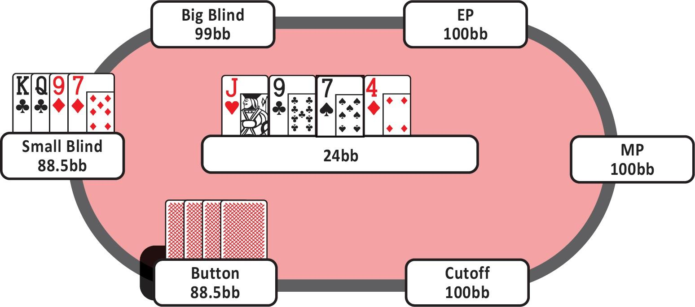

图 128

由于对手在翻牌圈选择过牌，你可以排除他们的许多强牌，因为他们可能会在翻牌圈下注这些强牌。因此，你可以在转牌圈进行一个较薄的价值下注。

对于位置劣势玩家来说，使用底池大小的下注并不理想。在错过了翻牌圈的过牌加注机会后，你仍然可以在转牌圈延迟下注许多混合范围的手牌。在这个转牌圈，你的许多中等强度手牌并不适合使用底池大小的下注，因为这样你会用一个不够强的牌力构建一个大的底池。选择 50% 底池大小的下注来保护你的手牌，并从弱顺子听牌（例如 5-6）等手牌中获取价值是更合适的选择。因此，你决定下注半个底池，对手选择跟注。

河牌是 K♠，牌面变为（J♥-9♣-7♠-4♦）-K♠。此时，你持有两对，牌力较强，但你的手牌主要是一个抓诈唬的牌。你选择过牌，对手在 \$480 的底池中下注 \$220。虽然你在这里得到了一个不错的赔率，但我认为你应该弃牌。主要原因是你的手牌没有阻挡顺子。对手有可能慢玩了 10-8，但也可能持有 K-K、K-J 或 Q-10 等手牌。

要让你的手牌成为一个有利可图的跟注，对手需要将 5-6 组合转为诈唬。然而，很少有玩家会在河牌圈激进地游戏他们的 5-6 组合。你确实阻挡了对手主要代表的手牌 Q-10。然而，我认为大多数玩家在这种情况下诈唬的频率并不够高。如果你知道对手有能力在河牌圈高频诈唬，那么跟注会是更好的选择。

**手牌示例 115**  
你在 BB 持有 A♦-A♥-8♣-3♦。BTN 玩家是一个相对较紧的玩家，开池下注满池。面对一个紧的范围，AA 表现得非常好，因为你经常会遇到被你碾压的高百老汇对子。因此，你进行了 3-bet，BTN 玩家跟注，翻牌发出 9♣-7♠-4♣（图 129）。

图 129

在这个牌面上，你应该选择过牌并准备弃牌。你进行 c-bet 的最低要求是持有相同手牌但带有 A♠，即后门坚果同花阻挡牌。或者，持有相同手牌但带有 A♣，这样可以阻挡坚果同花听牌。始终要意识到，在这种湿润的中等牌面上，你需要保护你的过牌范围。因此，如果你持有像裸两对或超对加同花听牌这样的手牌，你可能需要考虑过牌加注。许多没有很强可玩性但具有高原始权益的手牌是过牌加注的良好候选，因为这有助于保护你的过牌范围，并避免在高 SPR 下玩转牌。然而，对于这手特定的牌，过牌弃牌是最好的选择。因此，你选择过牌，对手也选择过牌。

**手牌示例 116**  
转牌是 2♠，牌面变为（9♣-7♠-4♣）-2♠（图 130）。

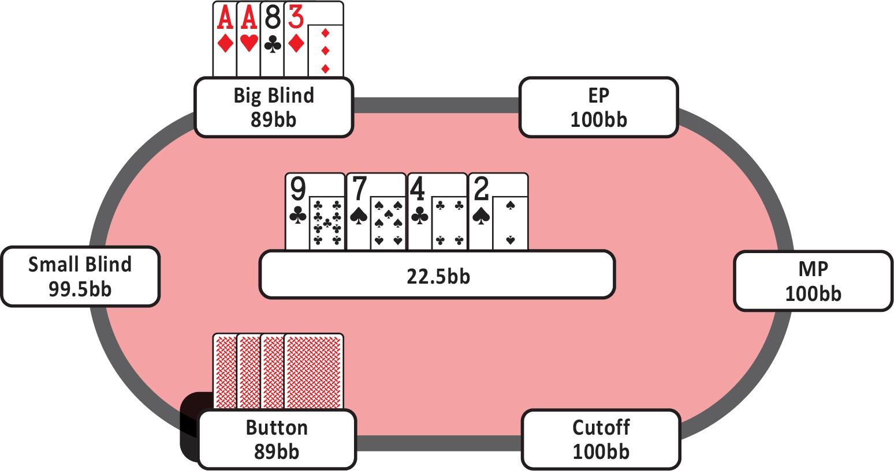

图 130

在这个转牌圈，你可以选择进行混合范围的下注，因为对手在翻牌圈选择过牌后已经限制了他们的范围。此外，2♠ 应该不会对局面产生太大影响，因为这张牌通常不在他们的范围内。你有一个内听顺子，这提高了你的权益，尽管你没有同花听牌，但你持有 8♣，这增加了一些弃牌率。此时，你应该下注，并且希望通过使用底池大小的下注来最大化你的弃牌权益，因为你在河牌圈的可玩性较差。你选择下注满池，对手跟注。

河牌是 J♦，牌面变为（9♣-7♠-4♣-2♠）-J♦。你有一些摊牌价值，并且可以击败一些手牌，例如带有黑桃或梅花听牌的超对。但你的摊牌价值不足以支持你下注。你选择过牌，对手也选择过牌。不幸的是，对手持有 4♦-3♥-7♦-8♥ 的两对。

### 8.3.5 主要要点

- 始终考虑双方玩家的翻牌前范围如何影响翻牌后的范围和行动。
- 当你想设陷阱时，你应该思考对手有多大可能会主动下注，你需要多少保护，以及如果对手在转牌圈选择过牌会有多糟糕。
- 当你用翻牌范围进入转牌圈时，你必须根据转牌、对手的范围以及河牌可能发生的情况，思考你将用哪部分范围继续游戏。你的河牌范围受益于一些关键的诈唬，而你的转牌策略应包括继续游戏其中一些诈唬，同时放弃其他部分。
- 记住，在河牌圈做决策时，你需要考虑你持有的所有牌，并考虑阻挡牌和移除效应。这将使你能够有效地诈唬和抓诈唬。

## 8.4 3-bet 底池有利位置的打法

### 8.4.1 介绍

在讨论我们在 3-bet 底池中处于不利位置的策略时，涉及了很多理论。而在讨论我们在 3-bet 底池中处于有利位置的策略时，我们将采取稍有不同的方式。我们将尽量减少理论的讨论，主要集中讨论一些手牌实例。我们也不会单独讨论翻牌、转牌和河牌的策略理论。原因在于，我们已经在不利位置部分详细解释了 3-bet 底池的理论，许多概念在有利位置时同样适用。现在，你已经理解了单次加注底池和 3-bet 底池的基本玩法，因此我将主要通过大量手牌实例来进行分析。

不过，我们仍需要从一些理论开始。在 3-bet 底池中，有利位置和不利位置的主要区别在于：

- 有利位置玩家的 c-bet 策略更加极化，因为他们有机会获得免费牌。
- 有利位置玩家在 3-bet 底池中通常使用较小的下注尺寸，例如半池，因为在多条街的游戏中，使用极化的下注范围并不是问题。
- 有利位置玩家需要在过牌范围中加入一些陷阱，否则过牌范围会显得过于弱势。

### 8.4.2 手牌实例

**手牌实例 117**  
你在 BTN 持有 A♠-K♥-10♣-3♠。CO 以底池大小开池加注。如果你记得正确，这手牌在翻牌前应该选择跟注，因为它具有坚果牌的潜力。然而，这种情况比较特殊，因为 CO 的开池范围非常宽。通常，当某人的加注范围非常宽时，他们在翻牌后往往会犯很多错误，因为他们的范围不平衡，且可能缺乏扎实的游戏基础。

你决定进行 3-bet，以隔离对手，创造一个单挑底池并增加 EV。如果加注者的范围较紧，那么最好选择跟注。如果 BB 有一个较弱的玩家，跟注也是可行的。在这个例子中，你选择了 3-bet，CO 跟注。翻牌是 10♥-5♠-4♦（图 131）。

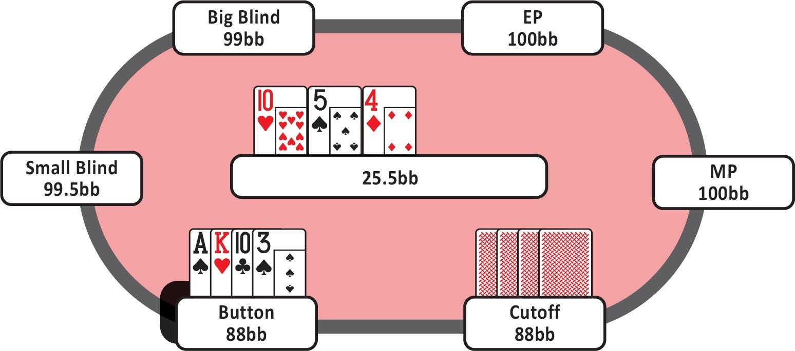

图 131

这是一个中低干燥牌面。在这个牌面上，你持有更强的超对，能够击败对手的超对和一对牌型。此外，对手的范围内很少有牌能击败你的超对。因此，在这个牌面上，你具有极化和权益优势，但你的许多超对在后续的牌面发展中可能不具备很好的可玩性。为了利用这些优势，你在这个牌面上选择了底池大小的下注。

根据这个特定玩家的形象，他们在翻牌前不会对任何宽范围的对子进行加注 - 弃牌，这意味着这是一个适合下注底池大小的时机。他们会在面对许多超对时感到困难，因为这些超对在面对你范围内的 AA 时表现非常糟糕。对手选择过牌，你下注底池大小，对手弃牌。

**手牌实例 118**  
你在 BTN 持有 A♠-A♦-6♠-4♥。CO 是一位松凶型常客玩家，他进行了加注。你选择了 3-bet，对手跟注，翻牌发出 8♦-7♦-6♣（图 132）。

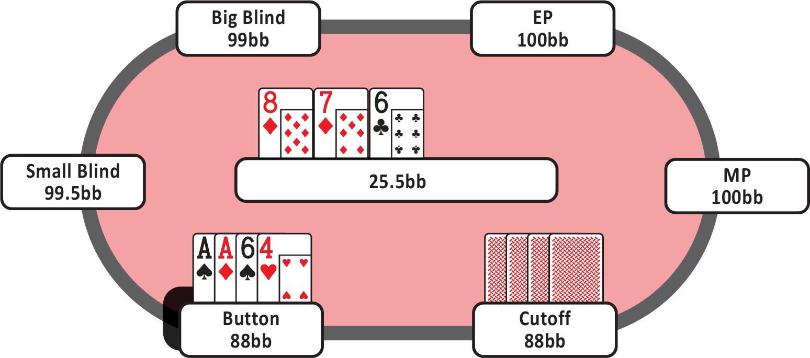

图 132

这个翻牌对你的翻牌前范围并不友好。你会有一些双同花的连牌能够很好地击中这个牌面，但你 3-bet 范围中的大部分（超对）在这个牌面上表现不佳。现在的问题是，你是否应该下注？你手中的 6♠ 和 A♦ 是否提供了足够的阻断牌来支持你下注？

在这个牌面上，处于不利位置的玩家（这里是 CO）应该在大约 40% 的情况下主动下注。然而，大多数玩家在这里并没有 40% 的主动下注范围，因为他们很难识别出哪些中等强度的牌应该在这个牌面上进行主动下注并随后弃牌。

一个例子是像 K♦-K♣-5♣-2♣ 这样的手牌。这手牌不能选择过牌 - 跟注，它有一些相关的阻断牌（K♦ 和 5♣），并且还有后门同花听牌。结合这些因素，这手牌适合进行主动下注并随后弃牌。然而，用这手牌主动下注感觉非常反直觉。在对手的 GTO 主动下注范围中，有许多类似这样的手牌。然而，大多数人会选择过牌，这意味着作为有利位置玩家，你在 c-bet 下注时会获得较少的弃牌权益，因为许多应该主动下注的中等强度手牌会选择过牌 - 跟注或过牌 - 加注。

在 8♦-7♦-6♣ 的牌面上，A♠-A♦-6♠-4♥ 对对手的一些手牌（如大多数 KK、QQ 和 JJ）有不错的权益。如果你选择过牌，而转牌是一张方块，你仍然可以代表坚果同花，因为你的许多坚果同花听牌会在翻牌圈选择过牌。

然而，这手牌虽然有一些阻断牌，但它的可玩性并不高，并且在许多转牌上你无法继续跟注对手的下注。你可以选择在这里下注半池（并在被加注时弃牌）或选择过牌。这手牌的强度不足以支持在这个牌面上进行底池大小的 c-bet 并全押。

总的来说，你可以选择下注，因为你有一个低端的顺子听牌（4-6），并且缺乏在后续街的可玩性。如果你被加注，你很可能远远落后，可以轻松弃牌。对手可以在许多转牌上轻松地从你手中夺走底池，因为你能跟注的转牌非常少。因此，半池下注是最好的选择。

相比之下，像 A♦-A♠-9♥-6♠ 这样的手牌更适合选择过牌，因为它有更强的坚果分布，并且有更多理由去看转牌。这手牌不想在翻牌圈下注，因为它在面对加注时难以应对，并且有更多理由去看转牌。

**手牌实例 119**  
你在 BTN 持有 9♠-8♠-8♥-6♥。CO 到目前为止一直打得很直接，他进行了开池加注。你的手牌在翻牌后表现较为平滑，但没有坚果牌的潜力，因此你决定进行 3-bet，以尽量减少进入多人底池的风险。对手跟注，翻牌发出 K♦-5♠-2♣（图 133）。

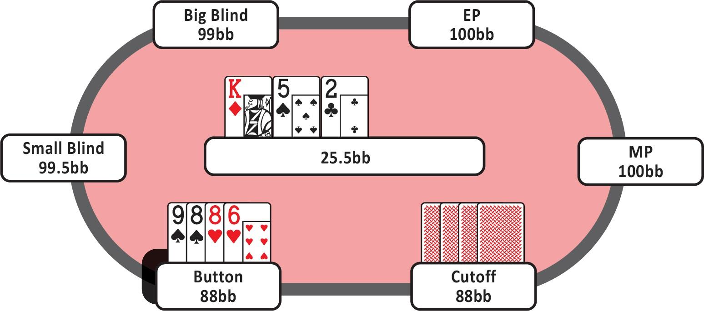

图 133

在这手牌中，你可以做出一个非常具有剥削性的调整。

这个牌面非常静态，对手不会有太多强牌。这位玩家打得很直接，因此如果你下注，他们会用任何带 K 的手牌继续，但会弃掉几乎所有不包含 K 的手牌，无论你使用多大的下注尺寸。因此，你选择下注 33% 的底池，对手弃牌。

通常，理解标准的下注尺寸策略非常重要。但请记住，你始终要保持开放的心态，创造性地使用其他下注尺寸，尤其是在这些尺寸可能更有利可图的情况下。

**手牌实例 120**  
你在 BTN 持有 Q♠-10♠-9♥-6♥。CO 开池加注，你选择 3-bet，对手跟注，翻牌发出 J♣-6♠-3♥（图 134）。

图 134

这手牌的起始筹码较深，目前的 SPR 约为 4.5。这是一个低干燥牌面，双方玩家都没有太多强牌。

这个牌面上没有太多听牌的可能，而你手中有一张 6，这意味着你阻断了许多可能的两对组合和三条。你在这里有很高的弃牌权益，因此半池下注是合理的。你在这个牌面上还具有权益优势，因为你持有更强的超对。基于这些原因，半池下注应该能迫使对手频繁弃牌。在这个牌面上，你不太可能遭遇过牌 - 加注，因为几乎没有听牌存在。对手最可能用过牌 - 加注的手牌是 J-J，而你对这种手牌的权益非常差。因此，在这里选择半池下注，并计划在面对过牌 - 加注时弃牌，是一个不错的选择。

**手牌实例 121**  
你在 BTN 持有 A♦-Q♦-Q♣-4♣。CO 开池加注，你选择 3-bet，对手跟注，翻牌发出 K♠-10♦-7♥（图 135）。

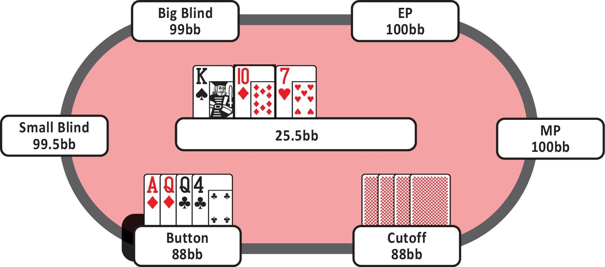

图 135

在这个牌面上，处于不利位置的玩家经常会持有一些强牌，例如顶两对、顶对、顺子听牌或三条。你需要在这里小心行事。

你有一些摊牌价值，并且从看转牌中受益，因为你有一些未来的阻断牌和坚果补牌。如果你下注并被加注，你将不得不弃掉一手相当强的牌。因此，这手牌应该选择过牌。

**手牌实例 122**  
转牌发出 3♦，牌面变为（K♠-10♦-7♥）-3♦（图 136）。

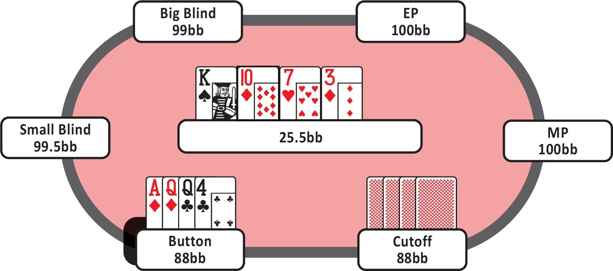

图 136

这张牌对对手来说是一个很好的机会来进行延迟的转牌过牌 - 加注，因为他们的一些成手牌更愿意在转牌上全押，而不是在 SPR 为 1-2 的情况下在河牌处于不利位置进行游戏。如果你面对过牌 - 加注，同时持有坚果同花听牌和卡顺听牌，你将处于一个非常困难的境地。通常你不得不弃牌，而在这种情况下，你将放弃大量的权益。但在这个例子中，没有理由下注。你已经有一定的摊牌价值，你无法让许多更好的牌弃牌，而且如果你被过牌 - 加注，你将陷入麻烦。通过选择过牌，这些问题可以轻松避免。转牌圈双方都选择过牌。

河牌发出 10♣，牌面变为 10♦-7♥-K♠-3♦-10♣。对手下注 25% 底池，你有一手合理的牌可以选择弃牌。如果你持有 AA 或 K，你当然可以跟注，但在这里，QQ 应该选择弃牌。当你在翻牌和转牌都过牌后面对这种下注尺寸时，对手很可能是价值下注。你的翻牌前范围中可能包含 10-x、K-x，并且经常会包含 AA。在翻牌后，你会以同样的方式玩这些牌，因此对手在这里必须小心他们的诈唬。

在这种情况下，你可能持有 10 和顺子听牌、K 和顺子听牌（没有后门同花听牌），或者口袋 AA。所有这些牌都比 A♦-Q♦-Q♣-4♣ 更适合作为抓诈唬的牌。因此，你可以在这里选择弃牌，而不会被对手剥削。

**手牌实例 123**  
你在 BTN 持有 10♥-10♦-8♦-7♥，CO 开池加注。这是一手非常适合 3-bet 的牌，因为它在多人底池中表现不佳，但可以跟注 4-bet。因此，你选择了 3-bet，CO 家跟注，翻牌发出 K♥-8♥-2♥，对手选择过牌（图 137）。

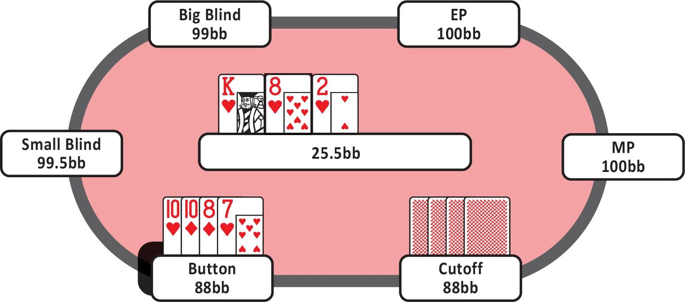

图 137

你击中了同花，但并非高牌同花。这使得你很难通过三条街的价值下注来获利，因为如果对手连续跟注三次，你通常会被击败。此外，你手中的 8 阻断了一些两对和三条的组合，这使得对手在跟注时更可能持有更高的同花。因此，选择过牌是更合适的。

**手牌实例 124**  
转牌发出 7♠，牌面变为（K♥-8♥-2♥）-7♠（图 138）。

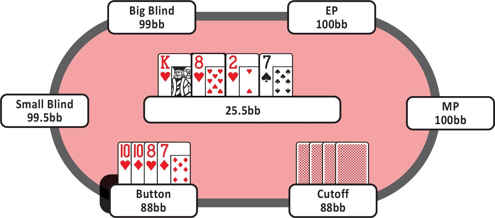

图 138

对手下注约 75% 底池。这是一个棘手的局面，因为我认为大多数玩家在这里的诈唬频率不足，尤其是使用这种下注尺寸时。从 GTO 的角度来看，对手需要用一些随机红桃牌进行诈唬，而不仅仅是持有 A♥ 或 Q♥ 的手牌，才能使你的跟注有利可图。然而，很少有人会以足够的侵略性玩这类牌。

你不可能在这里弃牌，因为你阻断了一些同花组合，并且如果你面对更高的同花，你还有葫芦的补牌。因此，跟注是正确的。尽管弃掉这手牌会非常容易被剥削，但你必须在每次跟注时保持谨慎。虽然从 GTO 的角度来看，始终跟注可能是正确的选择，但由于对手在这里的诈唬频率不足，你可以做出剥削性调整。

河牌发出 8♣，牌面变为（2♥-K♥-8♥-7♠）-8♣。你击中了葫芦！对手在一个 \$315 的底池中下注 \$5，这可以被视为一次过牌。你应该用你的葫芦加注，使用约 75% 底池的下注尺寸，以从对手的同花中获取最大价值。对手迅速用 K♣-Q♥-J♥-3♣ 跟注。

**手牌实例 125**  
你在 BTN 持有 8♥-7♥-6♦-5♦。CO 加注，你选择 3-bet，对手跟注，翻牌发出 Q♦-10♥-7♦（图 139）。

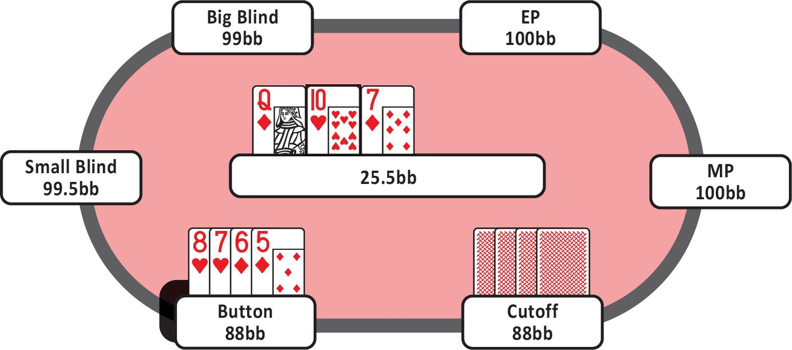

图 139

你击中了底对和一个较弱的同花听牌。你有一手中等强度的牌，但可玩性相对较弱，因为低端同花听牌的潜力有限，两对补牌的效果也不好，甚至顺子补牌也并非坚果。尽管你有一个同花听牌，但这手牌非常适合选择过牌。

如果你选择过牌，而转牌是一张方块，对手在面对下注时将很难弃牌，因为在低 SPR 的情况下，大多数同花听牌都会在翻牌圈下注。此外，当你选择过牌时，你不会有太多优秀的抓诈唬牌，因为许多强牌（尤其是在 SPR 约为 3.5 时）更愿意在翻牌圈将资金投入底池。这手牌适合过牌，因为你不通过建立底池或全押来牺牲太多价值，同时这也有助于在某些牌面发展下保护你的过牌范围。

**手牌实例 126**  
你在 BTN 持有 A♥-A♣-10♥-5♥。CO 开池加注，你选择 3-bet，对手跟注，翻牌发出 7♠-6♥-4♥（图 140）。

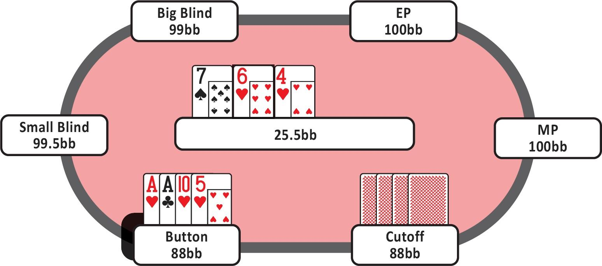

图 140

在这个顺子潜力牌面上，翻牌前的跟注者应该有约 44% 的主动下注范围，但大多数玩家的主动下注频率要低得多。这意味着他们的过牌范围通常会更强。他们通常在过牌后更频繁地继续游戏，因为他们不会用太多强牌（如三条或组合听牌）主动下注。他们更倾向于用这类牌进行过牌 - 加注或过牌 - 跟注，这会影响你的 c-bet 频率。

你的手牌 A♥-A♣-10♥-5♥ 阻断了顺子，你持有坚果同花听牌，并且有三张红桃。一般来说，如果在该牌面上底池下注是策略的一部分，那么那些具有一些好的阻断牌并且对全押范围有权益的手牌通常会以高频率下注。

在这种情况下，许多转牌都难以应对。你在这个顺子潜力牌面上没有顺子听牌，并且你通过持有三张红桃阻断了对手的一部分诈唬范围。通过在翻牌圈下注满池，你可以最大化弃牌权益，并通过降低 SPR 为转牌决策创造更简单的局面。你在翻牌圈下注满池，对手弃牌。

**手牌实例 127**  
你在 BTN 持有 A♣-A♦-4♣-3♣。CO 开池加注，你选择 3-bet，BTN 玩家跟注，翻牌发出 9♦-5♣-3♦（图 141）。

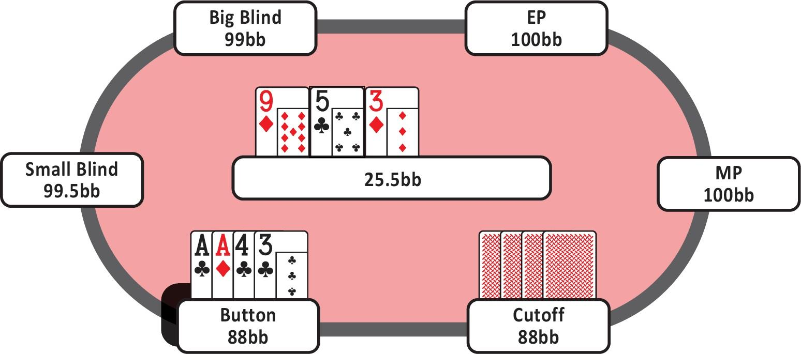

图 141

在这里，你拥有许多阻断牌并结合了一定的权益，但你在可玩性和相关的未来阻断牌方面有所欠缺。尽管你持有坚果同花的阻断牌 A♦，但在 3-bet 底池中，当转牌的 SPR 在 2 左右时，很难让任何同花弃牌。因此，持有 A♦ 在这里并不十分关键。最好的选择是在翻牌圈下注满池，以最大化弃牌权益，同时在你被对手全押时仍持有不错的权益。

### 8.4.3 主要要点

- 始终考虑可玩性。
- 思考你更倾向于用哪些手牌执行三条街的游戏计划，而不是一条街或两条街的游戏计划。
- 不要高估未来的阻挡牌。在转牌和河牌时，SPR 会非常低，即使你持有强阻挡牌，也很难让对手放弃一手好牌。
- 在有利位置时，使用更极化的策略，因为你对牌局有更多的控制权，并且希望最大化你的位置优势。
- 在有利位置时，下注更小且频率更低。
