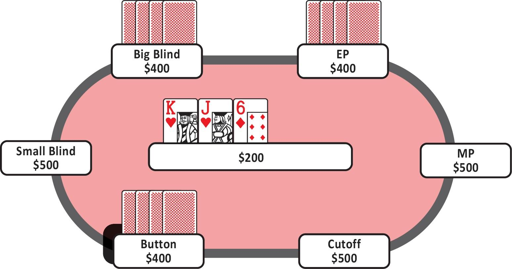
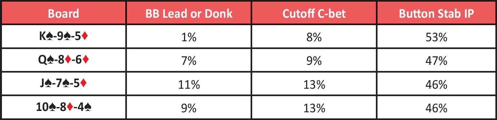
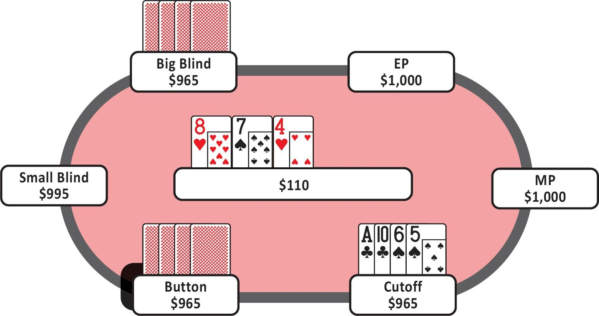
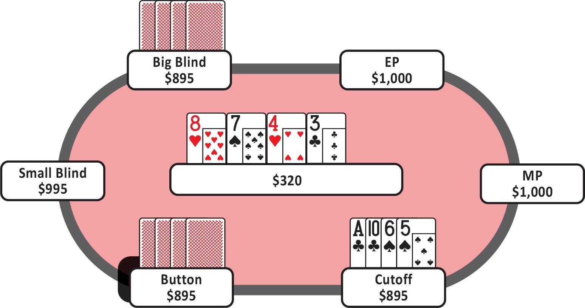

# 第九章：翻牌后理论：多人底池

[返回目录](精通低级别底池限注奥马哈.md)

## 9.1 介绍

在讨论多人底池时，之前提到的原则同样适用，但需要做一些调整。那么，有哪些不同之处呢？

首先，其他人击中翻牌的可能性更高。这意味着你的弃牌权益减少，并且相比单挑底池，你会更频繁地遇到对手的抵抗。

SPR 更低。在单挑的单次加注底池中，SPR 通常为 11-13，而在多人底池中，3 人底池的 SPR 约为 8-9，4 人底池的 SPR 约为 6-7。这些较低的 SPR 为处于不利位置的玩家提供了更多机会进行过牌 - 加注，以避免在位置劣势下进行游戏。

总体而言，在多人单次加注底池中，你仍然有两条或三条街的游戏空间。因此，在这些 SPR 下处于不利位置时，你需要更频繁地选择过牌。许多强牌也会被纳入你的过牌范围，以保护你的范围，并且你通常更倾向于用过牌 - 加注来代替过牌 - 跟注。

关于 3-bet 底池，单挑 3-bet 底池的 SPR 通常为 3.5-4，而在 3 人 3-bet 底池中，SPR 约为 2。在 SPR 为 2 的情况下，你需要采取一种平衡策略，既要确保实现你的权益，又要尽量避免陷入被一个或多个对手严重压制的局面。

另一个重要的点是 “夹心效应”。在多人底池中进行翻牌后游戏时，任何玩家都可能发现自己被 “夹在” 一个下注者和一个尚未行动的玩家之间，后者有可能加注或过牌 - 加注。当你在 3 人底池中下注时，下一个行动的玩家会被夹在你和其他玩家之间，因此他们继续游戏的阈值会比面对单一对手时高得多。

## 9.2 多人 3-bet 底池

首先，我们来讨论多人 3-bet 底池，因为我们已经多次讨论过低 SPR 场景下的重要性。3 人 3-bet 底池的 SPR 通常约为 2，在本章中，我们将重点讨论 BB 在挤压 CO 开池者和 BTN 跟注者后的 c-bet 策略。这是游戏中最常见的 3 人 3-bet 底池。之后，我们将从多个玩家的角度深入分析一手牌。

### 9.2.1 3 人 3-bet 底池中的 c-bet：BB 挤压 CO 开池及 BTN 跟注

需要记住的是，3-bet 范围中的手牌通常比单次加注底池中的手牌更明确。BB 在这里挤压的范围约为 8%，而 CO 最初的开池范围约为 32%，并在面对 3-bet 时继续游戏约一半的手牌，即 16%。BTN 最初对 CO 的跟注范围约为 15%，并在关闭翻牌前行动时以接近 90% 的这些手牌跟注。

因此，典型的范围分别为：BB（8%）、CO（16%）和 BTN（13%）。重要的是，CO 和 BTN 不太可能持有 AA，但 BB 经常持有 AA。这种范围不对称性在单挑 3-bet 底池中也很常见，并且其含义相同。挤压者可以更自由地在 A 高牌和低干燥牌面上下注，因为他们在翻牌前具有范围优势。在大多数其他牌面上，挤压者的 c-bet 频率会低得多。

让我们看一些例子。在 3 人 3-bet 底池中，BB 可以在 A♥-K♠-5♦ 这样的牌面上 100% 进行 c-bet，因为这个牌面非常符合他们的范围。从这个意义上说，这是 BB “最强” 的翻牌之一。在类似的干燥 A 高牌面上，你应该以半池的下注尺寸频繁进行 c-bet，无需更多。

在大多数非 A 高牌面上，你的 c-bet 频率较低，并且使用满池的下注尺寸。BB “最弱” 的翻牌可能是像 9♦-8♠-2♠ 或 J♦-10♦-6♥ 这样的中高湿润牌面，因为这些牌面很容易被对手击中。在这些牌面上，你的 c-bet 频率仅为约 30%，并且当你下注时，使用满池尺寸。

特别值得一提的是像 7♠-3♥-2♦ 这样的牌面，这种牌面难以被击中，因此在 SPR 为 2 的 3 人底池中，你的 AA 会获得显著的权益提升。在这种牌面上，你希望以较大的下注尺寸频繁下注，以剥夺对手的权益并实现自己的权益。

### 9.2.2 主要要点

- 在翻牌圈，BB 会根据牌面纹理选择使用半池或满池的 c-bet。
- c-bet 频率比单挑底池低。
- 全押阈值比单挑底池更严格。
- 过牌范围越宽，你需要包含的陷阱越多。

### 9.2.3 3 人 3-bet 底池手牌分析

让我们拆解一手我最近在 \$500 PLO 线上游戏中玩的手牌，以讨论 GTO 玩法与剥削性玩法。

**手牌实例 128**  
在这手牌中， EP 玩家开池加注，BTN 跟注，BB 选择挤压。EP 和 BTN 玩家都选择跟注。SPR 为 2，翻牌为 K♥-J♥-6♦（图 142）。

图 142

这个翻牌不是 A 高牌，并且由于 K-J 的连通性和同花听牌的存在，牌面较为湿润。这也是一个 “重” 牌面，意味着 EP 和 BTN玩家很容易持有三条、两对或组合听牌。基于这些因素，BB 的挤压者不应频繁进行 c-bet。即使在 SPR 为 2 的情况下，BB 也不能简单地用大部分 AA 手牌全押。当他们遇到对手的强牌时，会付出太大的代价。

根据 GTO 策略，在 K♥-J♥-6♦ 这样的牌面上，BB 的挤压者大约有 40% 的时间进行 c-bet。这应该同时使用半池和满池的下注尺寸，且频率相近。一个 GTO 的 BB 玩家在这里有 60% 的时间选择过牌，其过牌范围中包括像 A♥-2♥-A♣-5♣ 和 A♠-2♠-Q♣-10♣ 这样的手牌。

事实上，GTO 的 BB 玩家应该混合使用他们的 AA 和坚果同花听牌，35% 的时间选择过牌，41% 的时间下注半池，24% 的时间下注满池。BB 经常选择过牌强牌，因为如果他们不这样做，他们的过牌范围会显得过于弱势。考虑到翻牌前的范围，他们在这种牌面纹理上必须频繁过牌。BB 在中三条时也有近 40% 的时间选择过牌。

当 BB 过牌时，GTO 的 EP 玩家有 80% 的时间选择过牌，或使用两种下注尺寸（各占 10%）进行下注。在两次过牌后，GTO 的 BTN 玩家只有 63% 的时间选择过牌，32% 的时间下注半池，5% 的时间下注满池。

当 BTN 面对两次过牌并在 K♥-J♥-6♦ 翻牌上下注半池时，BB 有约 20% 的时间选择过牌 - 加注，而 BTN 有 30% 的时间弃牌。这意味着 BTN 在翻牌圈有 30% 的范围是下注 - 弃牌（当他们原本有 32% 的时间下注时），因为他们意识到自己被 BB 设下了陷阱。

然而，这并不是小额注 PLO 的实际玩法。通常，BB 的挤压者会在翻牌圈用 100% 的 AA 和坚果同花听牌全押，以保护自己的手牌并争取全押。几乎没有任何小额注玩家有纪律性在这里过牌并设下陷阱。但这是一个大错误吗？

GTO 的 BB 挤压者选择过牌强牌的原因是，BTN 在两次过牌后可能会频繁进行偷池。但小额注的 BTN 玩家会如何行动呢？如果他们在 3-bet 的 3 人底池中打得很直接，偷池频率较低且更倾向于过牌，那么作为 BB，你不需要冒险在翻牌圈过牌。

如果是这种情况，也许用大部分 AA 和坚果同花听牌进行 c-bet 是正确的。如果你后面的玩家不会用混合范围进行诈唬或下注，而你可以通过过牌 - 加注来惩罚他们，那么 BB 直接下注可能会获得更多价值。

作为 BTN，在小额注游戏中，当 BB 挤压者选择过牌且 EP 也过牌时，你应该怎么做？我们已经确定，两位玩家很可能只是在用 AA、坚果同花听牌或其他强牌全押。在小额注游戏中，两次过牌通常意味着他们准备过牌 - 弃牌或过牌 - 跟注。作为 BTN，在看到两次过牌后，你应该更频繁地进行剥削性下注。

在这些 SPR 较低的大型多人 3-bet 底池中，大多数小额注玩家并不会考虑 GTO。翻牌圈有大量资金，每个人都希望保护自己的手牌并将所有资金投入底池。其他玩家可能会避免偷池或下注 - 弃牌。你需要识别这些玩家并调整你的策略，以适应他们在这种局面下的打法。

如果你的有利位置对手在你过牌时会偷池，那么你需要通过过牌一些强牌来保护自己，以便进行过牌 - 加注。如果他们打得更直接，那么你通过自己下注强牌可能会获得更多价值，尤其是当他们倾向于在多人低 SPR 场景中高估自己的底池权益时。

## 9.3 多人单次加注底池

本节讨论的原则适用于大多数多人单次加注底池。然而，为了策略参考，我们将在 CO 开池、BTN 跟注和 BB 跟注的背景下进行讨论：这是一个 3 人底池，SPR 约为 8.5 的场景。

还记得我们讨论单挑单次加注底池时的内容吗？在中高 SPR 的翻牌圈，作为处于不利位置的玩家，有多少手牌实际上足够强到可以下注？那些能够应对加注和多条街行动的手牌？并不多。在多人单次加注底池中，这样的手牌更少，因为有两个对手，且 SPR 仍然较高。显然，面对两个对手时，能够下注的手牌比面对一个对手时更少。

正如你所记得的，当你处于不利位置并经常过牌时，你需要在过牌范围中包含更多强牌，以防止有利位置玩家剥削你的范围。当你下注时，你应该倾向于用极化的范围进行大额下注。

在多人单次加注底池中，一个相关的游戏方面是 BB 的主动下注范围。BB 可以在低湿润牌面上主动下注，因为根据游戏中的范围，这能够相对于对手不成比例地增加 EV。

以下是一个对比表格，用于可视化这种效果（图 143）：

图 143：面对 CO 开池和 BTN 跟注时的跟注与 SPR 为 2 的场景

随着牌面变得更低且更连通，BB 应该主动向翻牌前的激进者下注，以施加 “夹心效应”。CO 处于一个困难的境地，因为他们不知道 BTN 在后面会如何反应。当被过牌时，CO 在这些牌面上的 c-bet 频率较低。当 BTN 被过牌时，他们应该用混合范围进行下注，因为他们面对的是至少部分被限制的范围。有利位置玩家有动力进行小额下注，以便在转牌和河牌上以更高的 SPR 进行游戏，从而增加他们的位置优势。这有助于在 BTN 被过牌 - 加注时，或者迫使不利位置的弱势范围继续游戏。BTN 的半池下注也足以将 BB 置于一个尴尬的夹心局面。

GTO 策略仍然意味着 BB 和 CO 会用许多强牌选择过牌。同样，许多小额注玩家不会这样玩，他们会希望用强牌保护自己的手牌并更快地建立底池。此外，他们正确地假设有利位置玩家不会频繁下注。

因此，每当你处于多人底池时，考虑 BB 是否真的有主动下注范围，或者他们是否会用大多数强牌选择过牌或下注？CO 是否会在翻牌圈用一些强牌选择过牌，还是仅仅进行 c-bet？无论答案是什么，都会影响你的策略。如果他们用强牌下注，在面对下注时要小心，并在他们过牌时更频繁地进行偷池。记住，多人底池中的偷池频率可以很高，但你通常只需下注半池。这迫使不利位置玩家放弃底池、弱势继续或通过过牌 - 加注宣布他们的手牌很强。注意并调整你的策略以适应对手。

### 9.3.1 多人单次加注底池：顺子牌面实例

最后，让我们考虑一个多人单次加注底池，并更深入地讨论如何思考这些局面。

**手牌实例 129**  
这是一场 \$5/\$10的线上 6 人桌游戏。你在 CO 用 A♣-10♣-6♠-5♠ 加注到 \$35，BTN 和 BB 都选择跟注。你们三人进入翻牌圈，SPR 约为 9，翻牌为 8♥-7♠-4♥（图 144）。

图 144

你在一个坚果牌可能变化的牌面上击中了顺子。你首先需要考虑的是处于不利位置玩家的主动下注范围。正如我们在上面的表格中看到的，BB 有时会在牌面有低牌时主动下注。

虽然这是事实，但在这个特定的牌面上并不太适用。如果你仔细观察，顶部的两张牌是连通的（7-8），这意味着有许多可能的高顺子听牌。CO 和 BTN 的翻牌前范围中有许多 10-9 组合，甚至还有一些顺子听牌（如 J-10-9）或卡顺和同花听牌组合。

BB 如果选择主动下注，是为了建立底池，以便在不利位置对抗有利位置对手时进行多条街的游戏，同时知道坚果牌经常会变化。构建一个愿意以这种方式游戏的手牌范围并不容易。当坚果牌像这个翻牌一样频繁变化时，不利位置玩家倾向于选择过牌，并更倾向于用过牌 - 加注的策略。

BB 会用 20% 的 6-5 顺子进行主动下注，并且只有那些有不错补牌的手牌才会这样做。这意味着那些带有同花听牌、更高的顺子听牌、后门同花听牌或这些组合的手牌。BB 其他 80% 的翻牌顺子，包括一些带有弱同花听牌的手牌，会选择过牌以便进行过牌 - 加注或过牌 - 跟注，以保护这些范围。BB 还可能会用哪些手牌主动下注呢？

一个想到的例子是两对加坚果同花听牌。这些手牌有助于平衡顺子主动下注的范围，因为它们可以从转牌和河牌成对或完成同花中受益。

在实际手牌中，BB 确实主动下注了 66% 底池，而你面对一个看似非常强的范围，同时持有一个脆弱的顺子。在这种 3 人底池中，考虑到对手的主动下注，你的权益可能已经落后。这里需要理解的重要概念是，在这种情况下，你应该选择跟注并等待转牌以便全押。作为有利位置玩家，除非你对坚果牌有很强的权益优势，否则你应该选择跟注。你选择跟注，BTN 也选择跟注。BTN 获得了不错的价格，因此可能也持有坚果同花听牌、顺子听牌或三条。同样，如果 BTN 持有一个裸的 6-5 顺子，他们在有利位置应该选择在翻牌圈跟注。

**手牌实例 130**  
在转牌发出 3♣ 后，SPR 仍然接近 3。牌面现在是（8♥-7♠-4♥）-3♣（图 145）。

图 145

作为 BB，如果你持有 A♠-Q♠-8♣-4♦，你现在会怎么做？每当你发现自己处于这种情况时，你必须仔细思考你的手牌。你阻断了一些三条和两对，以及坚果同花听牌。你的对手会用哪些牌跟注？你希望针对这两手牌建立底池吗？

用这手牌下注并被加注并不理想，因为你的权益已经不如翻牌圈时那么好。此时，BB 最好选择过牌，并尝试看到河牌。

### 9.3.2 主要要点

- 多人底池中的 c-bet 频率比单挑底池低。记住，在单挑 3-bet 底池中，你的范围更窄。与单挑情况类似，某些牌面对 3-bet 者来说绝对是好的或坏的。
- 在单次加注底池中，范围不那么窄且强度更均衡。在单次加注底池中，更多取决于你持有的具体四张牌。
- 在 3-bet 底池中，更多是关于你的窄范围如何与牌面纹理互动。例如，在 3-bet 底池中，你通常可以用大部分范围在 A 高牌面上进行 c-bet。而在单次加注底池中，这完全不成立，它取决于你的位置和你持有的具体四张牌。
