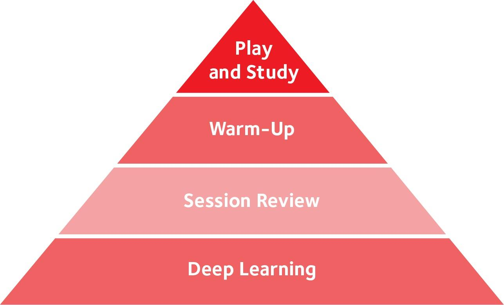

# 第十一章：牌桌之外

[返回目录](精通低级别底池限注奥马哈.md)

## 11.1 资金管理

### 11.1.1 概述

资金管理是你在整个扑克旅程中最重要的考虑因素之一。资金管理是指为自己制定财务规则，规定你将用特定资金玩多大的注码。

如果你没有很好地管理资金，你可能会失去所有资金，这意味着你无法继续玩下去。无论你有多优秀，无论你过去付出了多少努力，无论你在牌桌外投入了多少时间。当你失去所有扑克资金时，你也失去了实现优势和通过扑克赚钱的能力。资金管理不善可能会让你陷入灾难性的局面。

### 11.1.2 波动性介绍

扑克中心理游戏问题和情绪失控的最大原因之一是资金不足。为了增强你的心态并避免情绪失控，你必须理解波动性、它的影响以及如何应对它。

波动性是结果与预期之间差异的体现。

假设你将要玩一个你预计每小时能赢 \$50 的游戏。你计划玩四个小时，因此你预计能盈利 \$200。然而，在结束时，你发现自己亏损了 \$200。这种情况经常发生，可能会让人感到沮丧。

不可否认，波动性是游戏的重要组成部分。然而，好消息是，波动性为游戏带来了行动。它掩盖了真相，意味着那些连续赢了几次的输家可能会否认自己的真实水平。它也会影响那些运气爆棚的赢家，使他们高估自己的优势。波动性还可能对正在经历下风期的赢家的信心产生负面影响。

在大多数情况下，你的优势会受到你运气的影响。世界上很少有玩家不受波动性影响，并且在大下风期和大上风期时表现同样出色。很多时候，输钱的玩家开始表现得更差，因此他们可能会失去优势，成为他们通常能赢的游戏的输家。

你应该停止将自己视为赢家或输家。你应该问自己：“在这个游戏中，此时此刻，与这些玩家一起，以这种专注和信心水平，我是否是一个赢家？”

如果你平均是一个 3 bb/100 的赢家，这并不意味着昨晚当你太累时你也是一个 3 bb/100 的赢家。你可能在那场游戏中是一个输家。重要的是要理解，你的赢率是波动的，并且取决于许多不同的因素。

始终问自己：“此时此刻，我在这场游戏中是一个赢家吗？” 如果答案是否定的，那么花点时间反思一下你为什么在玩。

### 11.1.3 下风期

玩家经常问我两个与下风期相关的问题：

- 我最糟糕的PLO下风期是什么样的？
- 如果处于下风期，他们应该怎么做？

在回答之前，让我先澄清什么是下风期。下风期是指你在较长且意外的时间内或多次游戏中持续亏损。下风期这个词主要适用于那些本应是赢家的玩家，即拥有正赢率的玩家。

对于在线扑克，我最糟糕的下风期大约有 50 个买入，自 2011 年以来，我每隔一两年就会经历一次。在我最糟糕的在线游戏中，我一度亏损了近 20 个买入，但现在这种情况很少发生，因为我通常在亏损 10 个买入后就会停止游戏。对于现场扑克，我主要在赛事期间零星参与，因此我还没有经历过长期的下风期，但我曾在单场游戏中赢过或输过 20 个买入。

我假设有些赢家在获得正向收益或退出之前，亏损超过了 50 个买入。一个赢率为 8 bb/100 的 6 人桌 PLO 玩家，在 10 万手牌后亏损的概率约为 3%（假设平均标准差）。想象一下，在 10 万手牌后亏损会如何摧毁一个人的信心和动力。感觉自己本应碾压游戏，却仍在亏损。这真的会影响你的心理状态和你在牌桌上的表现能力。

当你陷入下风期时，很容易想要降低注码或完全退出游戏，因为你感觉自己是一个输家。更糟糕的是，你可能会觉得没有任何办法可以改变这种情况。你可能其实正在碾压游戏，唯一需要做的就是继续玩更多手牌并持续改进。

你需要接受一个事实：为了获得足够大的样本量来准确了解你的赢率，你必须玩很多手牌，而你的游戏水平也会随着时间的推移而变化。游戏动态也会发生积极或消极的变化。你只能获得真实赢率的平均值，因为它会随时间变化，所以不要过于担心。专注于在每一手牌的每个时刻做出最佳决策。学习策略并执行它。这就是你所能做的，也是你必须做的。

重要的是，你要意识到波动性的影响，并明白任何人都可能遭遇糟糕的运气。判断你是处于下风期还是因为策略不佳而亏损的最佳方法，是识别波动性、识别对手的错误以及你扎实的思考过程。

### 11.1.4 全押期望值（All-in EV）

全押期望值（All-in EV）是指全押时的 EV。这是扑克追踪软件中常用的统计数据，它计算你在全押时相对于对手手牌的 EV。仅此而已。

你可以看到你在一段时间内的盈利情况，以及根据全押 EV 调整后的盈利应该是多少。也许你运气好，在全押情况下赢得的比预期多；也许你运气差，赢得的比预期少。关键是，许多玩家认为这个数字是判断你是否经历了好或坏波动性的准确方法。

实际上，全押 EV 只是你在玩 PLO 或扑克时经历的波动性的一小部分。你是如何进入全押的？你拿到的牌、对手的牌、牌面？所有这些都必须恰好对齐才能形成全押局面。在全押发生之前，就已经存在大量波动性。

那些没有进入全押的手牌呢？大多数手牌都不会进入全押。你看到了多少翻牌圈？你的手牌在翻牌圈有多强？你拿到的翻牌对你的翻牌前范围是好还是坏？转牌和河牌呢？每个对手犯了哪些错误，这些错误的代价有多大，你是否从中获利？我可以一直说下去，扑克中的波动性有多大。

唯一不受波动性影响的因素是我们所做的决策。我们在牌桌外做了多少准备，在牌桌上如何执行。我们买入多少，选择玩哪些手牌，如何应对手牌中的变化，以及如何处理我们获得的信息。一旦你接受了这一点，你就能更轻松地应对不可避免的下风期，并在其中保持信心。

### 11.1.5 资金管理指南

每个人的扑克目标和动机都不同。我不会提供一成不变的规则，告诉你 “需要” 多少买入才能玩某个特定的注码。事实上，每个人的情况都不同，每种情况都需要不同的最佳资金管理策略。

如果你是业余玩家，很多因素取决于你的收入。也许你不需要严格的资金管理规则，因为在合理范围内，你可以补充你的资金。根据自己的能力玩游戏，并在你看到其他玩家犯大错误的桌子上玩。只用你能承受损失的钱玩，并尽力赢钱，以便考虑升级注码。关于尝试更高注码的内容稍后会详细讨论。

如果你是职业玩家且无法补充资金，你需要保护自己免受破产风险。我建议职业玩家使用 100 到 150 个买入的标准规则。这听起来相当保守，但它会防止你因为资金不足而产生心理问题。当你有足够的资金时，你在亏损几个买入后情绪失控的可能性会大大降低。

假设你正在玩在线 PLO \$500，资金为 \$50,000（100 个买入）。一旦你只剩下 100 个买入用于下一个较低注码（在这种情况下是 PLO \$200 的 100 个买入，即 \$20,000），你就应该降级。

你的赢率越高，波动性就越低。这意味着如果你有很高的赢率，比如在现场 PLO 游戏中，你可以不那么严格，甚至可以低至 50 个买入。如果你的赢率较低，你应该更严格，因为你会经历更大的下风期。

你可能更自信地认为自己在常规游戏中是一个赢家。这可能是因为你可以评估玩家通常做出的（糟糕的）决策质量。在这种情况下，你可以不那么严格，可以用 50 个买入的资金操作。但请记住，你必须高度关注波动性，并在需要时降级。

你必须在为时已晚之前降级，否则可能会导致你的整个资金处于危险之中。

### 11.1.6 升级和降级注码

那么，你应该玩哪个注码？这是我在 Twitch.tv 直播中经常被问到的问题。

如果你是初学者，我建议先尝试微注码或小注码游戏。在任何地方玩你的前几千手牌，并在轻松的对手面前逐渐适应游戏。开始更好地做出翻牌前的正确调整，并使用翻牌后分析的四大支柱。没有必要跳入一个亏损几手牌就会让你感到痛苦的游戏。

一旦你对你的游戏更有信心，你可以继续在那里玩，或者尝试更高的注码。你不必正式成为 \$2/\$5的常客才能玩你的第一场 \$2/\$5 游戏。如果你感觉准备好了，并且可以承受亏损几个买入，你可以尝试一下。要知道，你仍然处于一个会犯错的阶段。如果你负担不起，或者在你尝试时没有优势，那就没有充分的理由这样做。继续积累你的扑克资金，直到你准备好。

最终，当你考虑玩哪个注码时，只需要关注两件事：

- 在扣除抽水后，基于我的技能、对手的水平和我的心理状态，我是否在这个游戏中有优势？
- 我的资金是否允许我玩这个注码？

如果你对这两个问题的回答都是肯定的，那么你应该玩这个游戏。永远不要根据你赢了多少或亏了多少，或者 “你运气如何” 来决定你应该玩什么游戏。只玩那些你认为可以赚取最多利润的游戏，同时保持在你的资金允许的范围内。

升级注码比降级注码更复杂。许多玩家在运气好并赢了很多钱时，认为他们应该升级。这种思维方式的问题是，这些玩家没有考虑他们在更高注码中的优势。

他们只关注财务结果，而这些结果通常受到波动性的高度影响。过去的结果并不能很好地预测他们在更高注码中的优势。然而，有些玩家则走向另一个极端。他们在当前注码中碾压游戏，但还没有 100 个买入用于下一个注码，因此他们一直在等待，直到他们的资金允许他们升级。

等待太久才升级也可能是一个错误。如果你确定自己在常规游戏中碾压对手（考虑到波动性），那么在尝试更高注码时更激进可能是合理的。

尽量不要把自己视为一个只玩特定注码的玩家。你通常可以玩至少几个不同的注码，并且应该始终寻找在你注码范围内最具 EV 的游戏。某一天可能是较低的注码，第二天可能是较高的注码。这取决于谁在玩以及你的心理状态如何。

### 11.1.7 尝试升级注码

尝试升级注码是一种高风险、高回报的情景。为了证明其合理性，你应该寻找那些你有明显优势的情况。当你尝试升级时，你希望成功率尽可能高。

你永远不应该随意尝试升级，而是要抓住一个好的机会。

为了抓住一个好的机会，你必须考虑许多不同的因素。新注码的常客玩家什么时候在玩？娱乐型玩家什么时候在玩？我在什么时间处于最佳心理状态来抓住这个机会？我需要做些什么来让自己进入这种状态？

假设你想尝试在线 PLO \$200的游戏。你为此预留了 \$800 或 \$1,000。然后，你需要考虑什么时候是最佳时机。例如，周日晚上是大多数娱乐型玩家在线的时间。但常客玩家也会在周日上线，以利用这些娱乐型玩家。

大多数常客玩家可能会在周日玩很长时间。如果你在深夜加入游戏，许多常客玩家可能已经非常疲惫，因为他们已经玩了一整天。这意味着常客玩家并没有发挥出最佳水平。因此，你可能找到了一个时间段，此时许多娱乐型玩家在线，而常客玩家并没有发挥出最佳状态。

下一步是确保你处于良好的心理状态。你希望在游戏开始时休息充足并保持敏锐。如果你能让这些因素结合起来，这确实是一个值得尝试的机会，这也是你最大化成功机会并最终升级到更高注码的方式。

在尝试升级之前，你需要问自己：“如果我输掉了为这次尝试预留的所有资金，我会后悔吗？” 如果答案是肯定的，那么你可能没有抓住一个足够好的机会。如果答案是否定的，那么你已经做好了最佳准备，可以尝试升级了。

现在，你只需要专注于尽可能发挥出最佳水平。如果你输掉了为尝试预留的资金，那就降级，重新积累资金，然后再试一次。最终，这次尝试会成功，你会在游戏条件良好时发现自己正在玩更高的注码。

在尝试升级时，你需要确保如果尝试失败，你不必降两级注码。例如，你正在玩 PLO \$200，每小时赚 \$100。你自信自己在这个游戏中碾压对手，并且有 100 个买入的资金（\$20,000）。你想开始尝试 PLO \$500。重要的是，你必须确保即使尝试失败，你仍然可以继续玩 PLO \$200！你不想冒险损失大部分资金。如果你在 PLO \$500中尝试升级并亏损 20 个买入，你将只剩下 \$10,000的资金。这意味着你将不得不降级到 PLO \$100，在那里你可能每小时只能赚 \$60左右。预留一个合理的金额，比如 5 个买入，然后尝试一下。你可以在 PLO \$200 中赢回 \$2,500，而这不会影响你在主要注码中游戏的能力。

记住，你不应该等到你有 100 个买入用于下一个注码时才每天玩更高的注码。你应该提前决定是否要尝试升级，然后找到一个合适的时机。适应新的注码需要一些时间，因为你将面对新的玩家，并且需要适应玩更大的金额。通过保持这种 “尝试升级” 的心态，你将在新注码中获得经验，并有机会升级，同时限制你的风险。

### 11.1.8 主要要点

- 如果你的资金耗尽，游戏就结束了。不要冒险。适当的资金管理至关重要，是应对正常扑克波动性的必要条件。
- 小心升级太快或太慢。这可能会严重阻碍你的扑克旅程。你应该玩那些在你资金范围内且能带来最佳每小时盈利的游戏。
- 保持 “尝试升级” 的心态，同时维持适当的资金管理。当你尝试升级时，确保你有优势并限制了潜在的负面影响。

## 11.2 心理游戏

当我决定在 2011 年转型玩 PLO 时，我同时开始与心理游戏教练合作。这是我最好的投资之一，我认为如果没有他们的帮助，我不可能达到今天的水平。我向你推荐这些领域的专家，并主要从一名 PLO 玩家的角度谈谈我的心理游戏经验。

我与许多具有不同能力、天赋和抱负的扑克玩家交谈过，尤其是在一对一的私人教练中。大多数扑克玩家将自己描述为 “懒惰、低效，当然也不够有条理或自律。”

拿破仑·希尔曾写道：“自律始于对思想的掌控。如果你无法控制自己的想法，你就无法控制自己的行为。简单的自律能让你先思考，再行动。”

你与自己对话的方式，或者说你内心的自我对话，可能是你作为玩家发展的巨大问题和限制因素。如果你想做某事，你必须首先认同自己是一个会做那件事的人。例如，如果你想过一种更有纪律的生活，那么你必须首先认同自己是一个可以更有纪律的人。

你必须始终与自己的思想保持一致。从内心深处来说，这是人类的一种自然偏见。如果你认为自己懒惰，那么你就会变得懒惰。因此，你必须在思想的基本层面上修复你的自我对话。你必须以积极的方式与自己对话，而这始终始于清晰的思维过程。如果你想成为一名更好的 PLO 玩家，你必须认同自己是一个可以学习更多游戏知识的人。

我们每天有成千上万的想法，如果你缺乏清晰度，就很难产生高效的想法。重要的是在一天中找到时间来组织你的思维。这是你可以学习和训练的东西。如果你对自己的目标和身份有清晰的认识，就更容易采取行动。

先思考，再行动。这与扑克密切相关，尤其是在游戏中。错误通常发生在玩家在清晰思考之前就采取行动时。这被称为情绪失控（tilt）。如果你能在行动之前先思考，你将执行更成功的策略。

如果你专注于自我意识，了解自己在想什么，然后再行动，你将更频繁地发挥出自己的最佳水平（A-game）。如果你想提升自己的游戏水平，有三个不同的高效能领域是最重要的关注点。

### 11.2 1 游戏前例行程序

**游戏计划**  

- 你打算玩多久？
- 你会休息多少次，频率如何？
- 你每周会玩多少次游戏？
- 你有止损点吗？
- 你想专注于玩特定的筹码量吗？
- 你是否随身携带战略提醒，以帮助你保持在正确的轨道上？

**环境优化**  

- 你如何改善你的工作空间，以便完全集中注意力？
- 你是否消除了所有潜在的干扰？
- 你如何确保在游戏时保持水分充足？
- 你在听什么类型的音乐（如果有的话）？
- 你在游戏前做了什么，以确保自己完全准备好玩扑克？

### 11.2.2 游戏中例行程序

- 情绪控制：如何坚持使用逻辑，而不是过于关注情绪？
- 意识：你是否完全理解自己在游戏时的感受？你是否知道自己是否有优势？你是否出于正确的原因在玩？
- 动力：你如何坚持你的游戏前计划？也许你赢了很多，感觉想退出。那么你如何保持纪律？
- 休息：你如何优化休息时间，并在休息期间做什么？

### 11.2.3 游戏后例行程序

- 睡眠、饮食、锻炼、冥想：你是否做了你知道应该做的事情？
- 处理亏损游戏和下风期：你是否关注波动性，无论是赢还是输？关键不是关注波动性，而是接受它，然后专注于你的决策。你能回顾并找出自己表现不佳的原因以及如何改进吗？如果你不能，你可以加入我们的在线社区寻求帮助。通过阅读书籍或听播客来提升你的心理游戏。
- 调节压力：找一些有趣或你喜欢的事情做。对生活中的美好事物心存感激，比如能够玩扑克。接受波动性。
- 提升你的游戏水平：你的学习与游戏时间比例应该是多少？你如何提升自己的游戏水平？让我们更深入地探讨这一点。

## 11.3 学习与游戏时间的比例

我的学生经常问我一个问题：“我应该如何平衡扑克的学习时间和游戏时间？”

我希望到现在你已经明白，在这本书中，我并不是试图为你提供普遍适用的答案。我认为这种方法不会给你带来最佳的结果。这本书的主要目标是帮助你成为一个自我学习者，能够在扑克中找到自己的道路。

首先，让我们区分不同类型的学习环节。也许你已经通过观看 PLO 视频或复盘手牌等方式在牌桌外提升你的 PLO 游戏水平。或者，你可能对 “学习扑克” 这个概念完全陌生。又或者，你可能不知道哪种类型的学习环节对你当前的情况最有益。

广义上说，有四种不同类型的学习环节：

1. 游戏前热身
2. 游戏与学习结合
3. 游戏后复盘
4. 深度工作

### 11.3.1 游戏前热身

游戏前热身发生在你开始游戏之前。在这个环节中，你会阅读你之前学习环节中做的笔记，主要是关于该做什么和不该做什么的战略提醒。也许你发现了自己常犯的错误。也许你正在使用工具练习特定情况，获取反馈并热身你的扑克认知能力。或者你可能在做冥想，训练你的意识，为游戏做好准备。

这种类型的学习环节并不是为了提高你对游戏的战略理解，而是为了让你能够更好地执行你已经学到的内容。在这种环节中，你不会获得重大的战略收获。然而，它们非常重要，你应该在每次游戏前都进行这种热身。

事实上，你已经有了一个游戏前热身环节。它可能并不完美，但无论你在游戏前 30 分钟做什么，那就是你的热身环节。既然你已经有了一个，你可以轻松地将其改为你喜欢的任何热身方法。这将使你在游戏时的表现质量更加一致。

我建议热身环节不要涉及过于复杂或全新的内容。因此，观看视频，尤其是理论视频，并不是一个好主意，因为它会引发新的问题，而你不希望在游戏前思考新的问题。你只是想重新确认你已经知道的内容。回顾你常犯的错误并知道如何修正它们，然后进入游戏。

这里的目标是复习你现有的战略理解，而不是尝试整合新的理解或见解。因此，确保在游戏前不要做任何复杂的工作。

### 11.3.2 游戏与学习结合

这是一种被忽视的学习形式，因为它需要积极的自我意识。这种学习环节的好处并不一定是确认你对游戏玩法的战略理解，而是更多地理解你的执行过程。你如何改进你的思维过程？首先出现了哪些问题？你计划如何复盘手牌？你的注意力持续时间有多长？在什么情况下你需要休息？

对于在线玩家来说，练习这一点的方法是减少同时玩的桌子数量。玩一两张桌子意味着你有更多的时间做决策并思考调整。这为你在游戏时腾出了一些时间，让你可以训练注意力持续时间，并能够观察自己的情绪。你可以练习更加自我意识，这有助于提高你的表现模式。现场玩家可以随时决定这样做。

观察你的行为，以便获得更多知识并更好地理解你的表现。你更多地是在研究你的执行过程，而不是对游戏的战略理解。这有很多价值，但你不需要每周多次这样做。你可以每月做一两次，仍然能生成有用的信息。

完全不这样做和每月做一两次之间的差异可能是显著的。因此，请确保偶尔将这些游戏与学习结合环节安排到你的日程中。

### 11.3.3 游戏后复盘

这是许多玩家使用的第三种学习环节。尤其是对于在线玩家来说，他们可以轻松地复盘在游戏期间标记和标注的手牌。他们可以自己复盘，将手牌发布到网上，或与其他玩家合作进行复盘。做这些事情有很多价值。

然而，最重要的不是你复盘的次数或你复盘的手牌数量，而是质量。你在问什么样的问题？你在分析一手牌时的思维过程是什么？

游戏后复盘的目标是尽可能准确地表达你的思维过程，以便其他人可以给你反馈。你希望在游戏时标记手牌，并在游戏后复盘这些手牌。你希望专注于找到问题的答案，例如：“这里真正的问题是什么？为什么我在这手牌上感到困难？哪个决策点对我来说最难找到答案？为什么它很难？”

当你复盘特定场景中的手牌时，比如 3-bet 底池中的手牌，你首先要做的是回顾你当前对这种情况的理解。如果你没有足够的信息，尝试从其他地方找到它。比如在这本书中、软件中或任何扑克社区中。

你本质上使用的是一种非常基于请求的方法。你拿一手牌，请求信息，找到信息，然后你就有问题的答案了。这种形式非常有价值，但远不及下一种学习环节。

### 11.3.4 深度工作

深度工作应该是你在牌桌外学习时花费最多时间的部分。顾名思义，这是你专注于一个特定主题并深入研究的时刻。专注于一个主题，然后深入研究该主题内的不同策略、强度分类和场景变化。例如，在 A 高牌面上 c-bet，在单调牌面上 c-bet 等。

你应该研究一手牌可能采取的不同路径。这将使你能够深入探讨这个主题，并获得更全面和透彻的理解。这可能是通过查看求解器输出，或者你可能基于他人的研究来审查统计数据和手牌。

在深度工作中复盘手牌时，不同之处在于你会非常深入地研究一个主题。你选择一个有帮助的主题，提出假设，然后在你的数据库中寻找合适的解决方案和手牌进行测试。

游戏后复盘的重点是独立于主题地复盘你最近玩过的手牌，然后找到答案。这是一个不同的过程。一般来说，基于特定主题花费大量时间比随机复盘最近的手牌更有价值。原因是这样的工作会更加集中。游戏中有某些情况比其他情况更重要，需要优先解决。

通过专注于对你的赢率影响很大的主题，你能够真正修复这些漏洞，并更好地理解这个特定主题，这对你的最终结果非常重要。然而，如果你专注于个别手牌，问题在于你的学习会变得相当随机。因此，决定你要复习和学习哪些主题。有时，这些主题对你的最终结果可能并不重要。通过大量的游戏后复盘，你可能会 “浪费” 大量时间在不重要的场景上。这就是为什么你应该把大部分时间花在深度工作上。

冥想和可视化也可以被视为深度工作，因为你正在以自己为主题经历同样的过程。

### 11.3.5 学习类型层次结构

图 145

图 145展示了学习的层次结构。深度学习位于底部，构建你对游戏最深刻和最基本的理解。然后是游戏后复盘、游戏前热身，而最顶层是游戏与学习结合环节。

所有的学习环节都很重要，但重要程度不同。当我们谈论学习与游戏时间的比例时，你应该意识到，大部分牌桌外的时间应该用于深度工作。

很多人谈论你在牌桌外投入的时间，但仅仅观看一些视频和查看你最大的底池是不够的。当你反复遵循某个过程时，你会变得更快速、更聪明。

例如，一个过程可能是观看培训视频、做笔记，然后完成三到五个测验。接着在你的数据库中寻找手牌，并制定出好的问题，向扑克社区提问或在问答环节中提交以获得反馈。这就是一个过程。

如果你反复实施这些循环，你会变得更聪明、更高效。而这正是我们的目标。在牌桌外进行深入且有深度的学习，同时不会占用你大量的时间。实现这一点的方法是，不要进行随机的牌桌外学习，而是要专注于一个你不断整合的特定过程。

这个过程的具体形式取决于你的偏好、学习类型、现有技能集以及对某些概念的理解。因人而异。关键在于，你必须找到一个最适合你当前情况的改进循环，并且它应该主要基于深度工作。如果你在复盘最近游戏中的大量随机手牌，那么本质上你是在浪费时间。

### 11.3.6 学习与游戏时间比例示例

你学习或游戏的时间取决于你当前的情况和目标。

**示例 1：完全初学者**  
当前情况：完全初学者对 PLO 经验很少，初始资金为 \$1,000。这使他们能够以 100 个买入玩 PLO \$10。目标：成为一名在线 PLO \$50 的赢家，赢率超过 5 bb/100，资金达到 \$5,000。这名玩家试图实现一个较大的跨越，他们的目标可能与你的目标相似。他们希望升级到一个能够对现实生活产生显著影响的注码，并在合理的时间内跨越多个注码。

现在我将为你展示几种不同的路径。你可以思考并尝试找出哪种路径对你最有意义。

**路径 1：“量”**  

- 学习时间：每周 5 小时
- 游戏时间：每周 20 小时
- 学习与游戏比例：1:4

这是大多数人默认选择的路径。

**路径 2：“平衡”**  

- 学习时间：每周 10 小时
- 游戏时间：每周 10 小时
- 学习与游戏比例：1:1

**路径 3：“学习者”**  

- 学习时间：每周 15 小时
- 游戏时间：每周 5 小时
- 学习与游戏比例：3:1

**一个月后**  

- “量” 路径玩家：
  - 学习时间：20 小时
  - 游戏时间：80 小时
  - 假设赢率为 1 bb/100，每小时 400 手牌，玩了 32,000 手牌，盈利 \$32。
  - 赢率较低，因为到目前为止他们只学习了 20 小时。
- “平衡” 路径玩家：
  - 学习时间：40 小时
  - 游戏时间：40 小时
  - 假设赢率为 2 bb/100，每小时 400 手牌，玩了 16,000 手牌，盈利 \$32。
  - 赢率更高，因为他们学习的时间是 “量” 路径玩家的两倍。虽然他们只玩了 “量” 路径玩家一半的手牌，但赢率翻倍，盈利相同。
- “学习者” 路径玩家：
  - 学习时间：60 小时
  - 游戏时间：20 小时
  - 假设赢率为 3 bb/100，每小时 400 手牌，玩了 8,000 手牌，盈利 \$24。

**三个月后**  

- “量” 路径玩家：
  - 总学习时间：60 小时
  - 总游戏时间：240 小时
  - 假设赢率为 4 bb/100，每小时 400 手牌，玩了 96,000 手牌，盈利 \$384。
- “平衡” 路径玩家：
  - 总学习时间：120 小时
  - 总游戏时间：120 小时
  - 假设赢率为 5 bb/100，每小时 400 手牌，玩了 48,000 手牌，盈利 \$240。
  - 赢率更高，因为他们学习更多且不易疲劳。

- “学习者” 路径玩家：
  - 总学习时间：180 小时
  - 总游戏时间：60 小时
  - 假设赢率为 6 bb/100，每小时 400 手牌，玩了 24,000 手牌，盈利 \$144。
  - 赢率最高，因为他们能够进行更多的深度工作。

**你更愿意成为谁？**  

- “量” 路径玩家：
  - 资金：\$1,384
  - 学习时间：120 小时
  - 赢率：4 bb/100
- “平衡” 路径玩家：
  - 资金：\$1,240
  - 学习时间：240 小时
  - 赢率：5 bb/100
- “学习者” 路径玩家：
  - 资金：\$1,144
  - 学习时间：360 小时
  - 赢率：6 bb/100

谁更接近击败 PLO \$50 的目标？

不幸的是，没有人真的更接近目标。到目前为止，这些玩家没有尝试升级，也没有从扑克以外的来源增加资金。通过这种保守的方法，他们可能需要很长时间才能升级注码。即使 “学习者” 在接下来的三个月里再玩 100,000 手牌，并以 6 bb/100 的赢率盈利，他们在 PLO \$10 中也只能多赚 \$600。

对于我们大多数人来说，通过主要收入来源为资金注入一些额外资金，比在拥有足够资金升级之前玩数十万手牌要好得多。

要意识到，当你在低注码游戏时，你完全不应该关注手牌数量，而应该关注知识和技能。

考虑到波动性，很难说他们的资金会达到什么水平。可以肯定的是，“学习者” 最有潜力成为长期赢家，因为他们的学习习惯和对游戏的理解比其他两位玩家更深入。

他们最有可能成功尝试 PLO \$25。升级最快的玩家是那些在尝试升级后能够坚持在新注码中游戏，直到准备好再次尝试升级的玩家。这就是玩家在合理时间内升级注码的方式。

许多玩家非常喜欢玩扑克，我完全理解这一点。因为如果我不喜欢玩扑克，我也不会成为职业扑克玩家超过 10 年。但与此同时，你必须对自己的目标保持现实，并理解你希望通过扑克获得什么。

如果你的答案是你不仅想在玩扑克时获得乐趣，还想通过扑克赚取更多钱，那么你需要彻底审视你为实现目标所采取的方法。

这三种选择都是可行的，但你必须问自己哪一种最符合你的目标。即使你现在玩的注码比 PLO \$10高得多，你的目标不是 PLO \$50，而是 PLO \$2,000，你仍然应该问自己同样的问题。

最好的方法是投入大量手牌而不尝试变得更好吗？什么会让你自信能够真正击败更高的注码并尝试升级？

如果你正在玩更高的注码，例如 PLO \$200，并且你想玩 PLO \$1,000，这是一个 5 倍的跳跃。在 PLO \$200中，已经有很多职业扑克玩家在玩。问题是，他们在扑克中赚的钱几乎是他们的全部收入。他们用赢来的钱维持生活，这使他们无法升级注码，因为他们无法积累资金。

在这一点上，你必须问自己：“好吧，与其多花点时间每月多赚 \$500，为什么不尝试多学习一点并稍微改变一下我的生活方式呢？”或者你可以尝试在扑克之外赚一些钱，以增加你的资金，使你在投入大量牌桌外学习时间后能够尝试下一个注码。

无论你的目标是什么，选择对你最有意义的路径，不要仅仅依赖于投入大量手牌。我希望这本书能帮助你在小注码中碾压对手。如果你喜欢玩 PLO，寻找更多资源，继续提升你的游戏水平并升级。

祝你好运！
